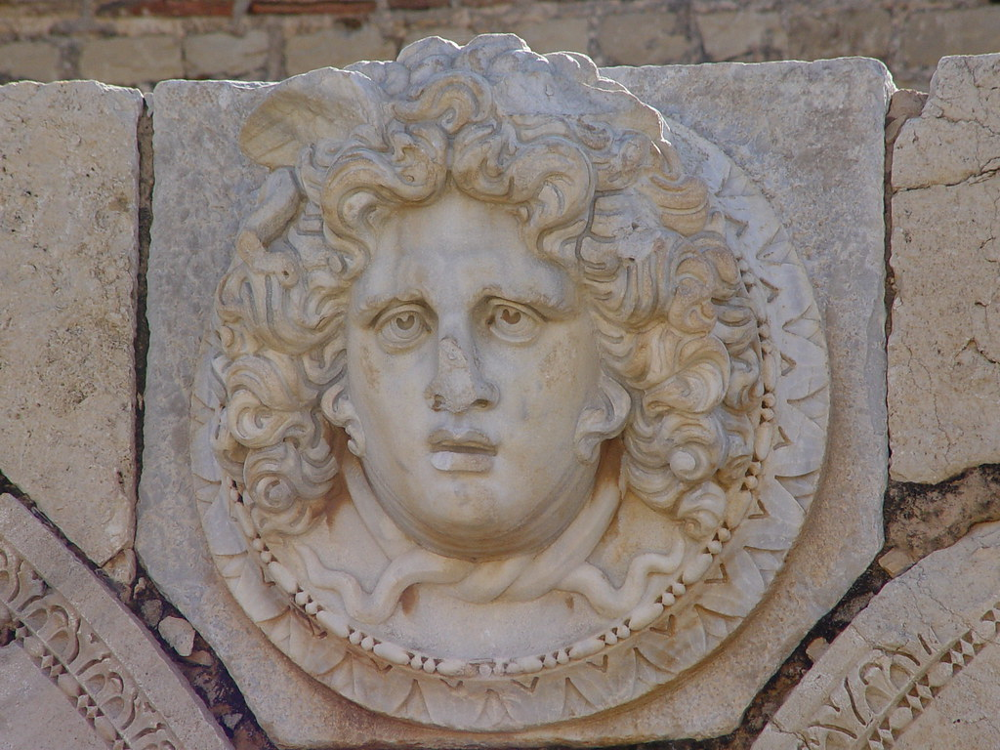

I've not updated for a while, but I've just returned from Libya after a whirlwind 5 day visit via Voyages Jules Verne. This encompassed trips to Tripoli, Sabratha and Leptis Magna. The latter 2 magnificent examples of Roman town planning. However Leptis is by far and away the more impressive and reminded me of my youth and summer time in Caesarea, Israel.

We stayed at Hotel Yousser in Tripoli and I sure did miss my Gin and Tonic seeing as it is a dry country; however their non alcoholic beer isn't that bad!

However, I almost didn't make it there due to a high speed crash on my mountain
bike. All I can say is the pavement is bloody hard when you hit face
first...
