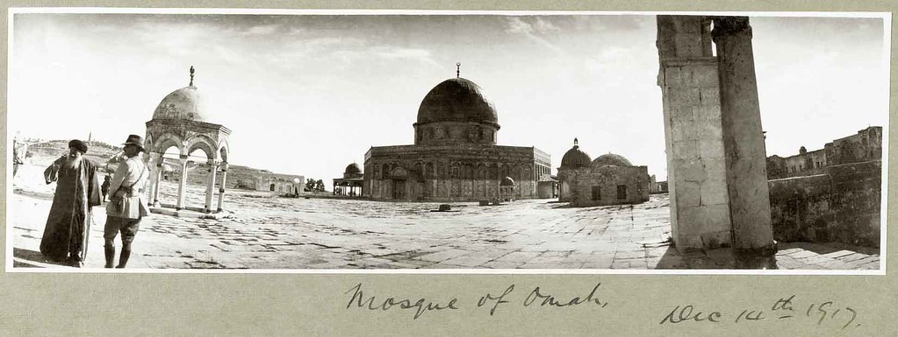
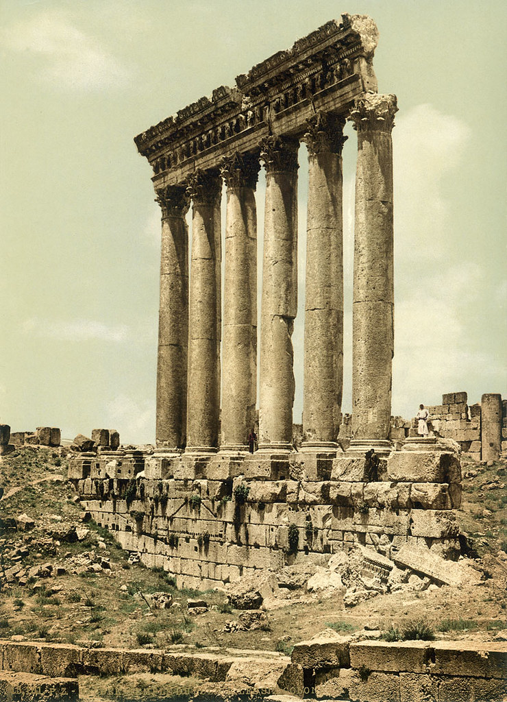

Over the last few days, I have been adding a selection of the [Palestine Exploration Fund](http://www.pef.org.uk "The Palestine Exploration Fund")'s extensive image collection to a Flickr profile. The aim of this, was to try and make more people aware of some of the gems that the Fund has within the collection in Hinde Mews. This small slice of the photographic collection contains some amazing images of places and landscapes around Palestine. If you like them, please do consider joining the Fund to help with our charitable activities.

You can see more of these amazing images on [flickr](http://www.flickr.com/photos/palestineexplorationfund/ "Flickr stream for the Fund").
