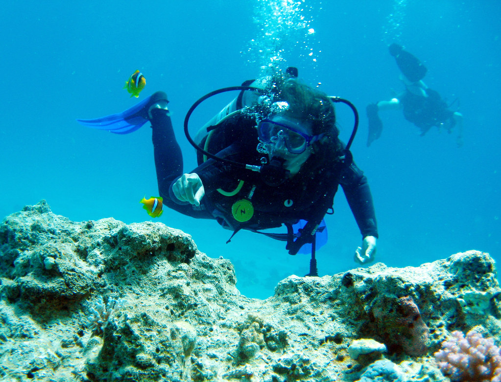

We've just returned from a week in Sharm el Sheikh, Egypt where we spent a week diving in the company of Kate's sister and brother-in-law. Our base, at the Hilton Fayrouz, was perfect for the town's nightlife and using the facilities of Ocean College dive school which is based next door. We usually dive with Emperor Divers, but as they had moved from the Rosetta, we were too lazy to go and find their new offices, and Ocean College had an excellent value deal of 4 days diving for £89! Unfortunately, we had to do a scuba review as we've been a bit slack diving recently and Ahmed Aladin was our instructor and dive guide for our 5 days of diving. He's an excellent teacher, very good on safety perhaps at the expense of pointing out sea life, but he's one of the better instructors I've been diving with.

April diving in the Red Sea, is far colder than any diving I have done since 1996 and the excavations at Caesarea, Israel and it was the first time I've worn neoprene since then. Sea temperature is around 21° C and air temperature around 28°C, but the wind can freeze you rapidly once out of the water. Remember a jumper at this time of year! Dive sites visited included the normal Tiran sites and Ras Mohammed perennial favourites and we didn't see a huge amount of larger pelagic sea life, a few turtles, tuna and one octopus. The Yolanda wreck seems to have detoriated slightly with some displacement of the bath furniture since our last visit, but it is still a pretty good site to visit.

Sharm has developed since our last visit there, with the huge Savoy complex and the soulless Soho Square adjacent to their property (includes ice rink and bowling alley and you can swap your Egyptian pounds for Akuna money!). The Savoy hotel is pretty impressive, colonial style bar with Zebra printed bar furniture (apparently a dress code, but I got in) and reasonable Stella Lager price, multiple levels and a huge swimming pool. However, it is far out from the interesting part of town. The Hilton Fayrouz, which is on the main promenade is pretty good value and has a private beach. Street hawkers still try and sell you banjo (weed) and the Camel Bar has had a significant make over, but it is still a good place for people watching, sheeshah smoking and drinking on the roof. The airport has improved substantially, but still has typical Egyptian toilets (only place I was asked for Baksheesh all week.)

### Money matters

Taxi from Na'ama Bay to Soho Square &#8211; 35 LE  
Taxi from Na'ama Bay to airport &#8211; 50 LE (set price is normally 60 LE)  
Taxi from airport to Na'ama Bay &#8211; they try it on, starting at 300 LE, you can get this down to a reasonable fee if you haggle hard. Yalla!  
Diving at Ocean College &#8211; Scuba review £79 inc equipment, 4 day dive pack £89 (normally £220), £25 per day equipment hire, 5o LE per day drinks and food bill on boat, 5 euros per day for RasMo entry (hasn't changed for ages I think!)  
Flight on Easyjet around £220 pp  
Sandwiches cheaper on Easyjet than buying at SES airport, don't buy beer to drink on the plane at the airport, you get told off.

### Good places to eat/ drink

Fairuz Lebanese and Sidi Wadie Moroccan restaurant &#8211; 2nd floor of the Na'ama Centre  
Tam Tams (cheap Egyptian fare &#8211; hasn't changed)  
Pirates at the Hilton Fayrouz (but you'll see a lot of football on big screens)  
Camel Bar

### Free wifi

Ghazala beach bar &#8211; and also happy hour drinks 2 for 1
