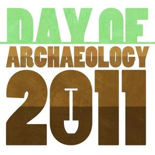

One of the projects that I'm working on, alongside some other digital archaeologists (Lorna Richardson, Matthew Law,
Jess Ogden, Stu Eve, Andrew Dufton and Tom Goskar) is the &#8220;The Day of Archaeology 2011&#8221;, a social media
based project that will allow archaeologists working all over the world to document what they do on one day, July
29th 2011. I'm providing server space via the Portable Antiquities Scheme's underused backup box and also
configured the wordpress install and open source twapperkeeper for storing the social buzz.

This date coincides with the
&#8220;[Festival of British Archaeology](http://festival.britarch.ac.uk/ "CBA festival website")&#8220;, which runs from
16th &#8211; 31st July 2011 and is one of the hundreds of events being held to celebrate
archaeology in the UK and beyond.

So how does it work? Well, archaeologists taking part in the project will document their day through photography, video,
facebook activity, twitter commentary and written blog posts. These will then be collated in realtime on the project's
dedicated website [The day of archaeology website](http://dayofarchaeology.com), which
will then provide a glimpse into a day in the life of people working in archaeology, from archaeological excavations to
laboratories, universities, community archaeology groups, education services, museums and offices. This project is open
to everyone working or volunteering in any aspect of archaeology from anywhere in the world &#8211; and even those who
have defected! Currently, over 150 people and organisations have signed up. You could be next, so give archaeology a
voice!

This innovative idea, follows on from the very successful &#8220;Day of Digital Humanities&#8221; and was dreamt up by
Matthew Law and Lorna Richardson and was then built upon following a twitter conversation and subs

The project is supported by:

* The Portable Antiquities Scheme (providing server space for free)
* Council for British Archaeolog
* L-P Archaeology
* Wessex Archaeology
* UCL's Centre for Digital Humanities
* The Institute of Archaeology
* CASPAR

The hashtag for this project is [#dayofarch](http://search.twitter.com/search?q=%23dayofarch) and can be used
on tweets, blog posts and flickr photos to aggregate externally. Please consider using this tag if you refer to this
project.
