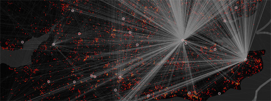

Today sees the launch of [Lost Change](http://tracemedia.co.uk/lostchange, an innovative and experimental application that 
allows coins found within England and Wales and recorded through the British Museum’s [Portable Antiquities Scheme](http://finds.org.uk/)(PAS), 
to be visualised on an interactive, dual-mapping interface. This tool enables people to interrogate a huge dataset (over 300,000 
coin records can be manipulated) and discover links between coins’ place of origin (the issuing mint or a more vague 
attribution if this location is uncertain) and where they were discovered and then subsequently reported to the PAS 
[Finds Liaison Officers](http://finds.org.uk/contacts).

While much of the data is made available for re-use on the PAS website under [a Creative Commons licence](http://creativecommons.org/licenses/by-sa/3.0/), 
some details are closely guarded to prevent illicit activity (for example night-hawking or detecting without landowner 
permission) and so this application has been developed with these restrictions in mind. An object’s coordinates are only 
mapped to an Ordnance Survey four-figure National Grid Reference (which equates to a point within a 1km square), and only 
if the landowner or finder has not requested these to be hidden from the public.

The distribution of coins is biased by a number of factors (a project funded by the Leverhulme Trust
is looking at this in greater depth) which could include:

  * Whether metal detecting is permitted by the landowner, or the topography makes detecting difficult
  * Soil type and land use
  * Whether there is an active community of metal detectorists within the vicinity

The tool is straightforward to use. The left hand pane holds details for the place of discovery; the right hand side holds 
details for the place of issue, the mint. These panes work in tandem, with data dynamically updating in each, depending on 
the user’s choice. A simple example to get going is this:

  * Click on “Iron Age” within the list of periods
  * Within the right hand pane, click on one of the three circular representations and this will highlight where the coins from this mint were found in the left hand pane. The larger the circular representation, the more coins from that mint have been recorded.
  * If one clicks on any of the dots within the left hand pane, these are selected and an overlay in the right hand pane allows dynamic searching of the PAS database.

The PAS intends to build on this project at a later stage and will be seeking further funding to enable this to happen, 
with many more facets of discovery available to query the dataset.

Lost Change was funded through a £5,000 grant from the [CreativeWorks London](http://www.creativeworkslondon.org.uk/entrepreneur_scheme/gavin-baily-and-british-museum/)
‘Entrepreneur-in-Residence’ programme.  The PAS is grateful to Gavin Baily and Sarah Bagshaw from 
[Tracemedia](http://tracemedia.co.uk/) who developed the application, and everyone who has contributed to the PAS database.

This originally appeared on the [British Museum blog](https://web.archive.org/web/20140219200037/http://blog.britishmuseum.org/2014/02/19/lost-change-mapping-coins-from-the-portable-antiquities-scheme/) but has since been deleted, so I have linked to the wayback machine record of this page.