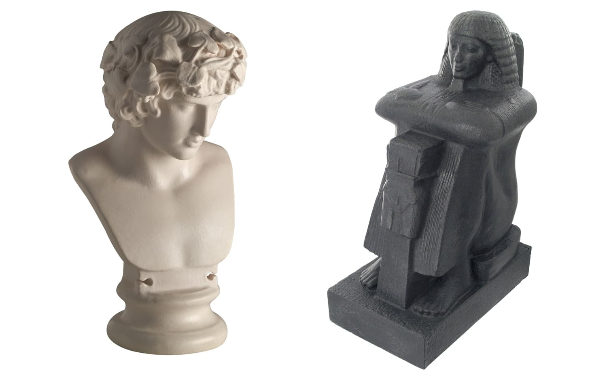

**This was originally published on the British Museum blog as [A new dimension in home shopping](http://blog.britishmuseum.org/a-new-dimension-in-home-shopping/)**

Over the last four years, the British Museum has been producing 3D models that can be viewed by anyone online. 

The roots of this work can be traced back to the [Arts and Humanities Research Council](http://www.ahrc.ac.uk/)'s 
funding of the [MicroPasts](http://micropasts.org) crowd-sourcing project with University College London, 
which produced 3D objects for academic research. 

The Museum continued its 3D output by using native mobile phone applications to publish a selection of
[objects](http://www.wired.co.uk/article/reprinting-history) on the [Sketchfab](https://sketchfab.com/britishmuseum) platform, with many available to download under a [Creative Commons Non-Commercial licence](https://creativecommons.org/licenses/by-nc-sa/4.0/).

  <iframe title="A 3D model" src="https://sketchfab.com/playlists/embed?collection=646555f94b6d45a8ad2791e4d0ddc1f6"  allow="autoplay; fullscreen; vr" mozallowfullscreen="true" webkitallowfullscreen="true"></iframe>

All of this work was based around the principles of [Open Science](https://en.wikipedia.org/wiki/Open_science) and the premise of being cheap, quick and easy to replicate for anyone. We used a technique called [photogrammetry](https://en.wikipedia.org/wiki/Photogrammetry) (multiple photographs taken in a strategic pattern around the object) and the resulting output was rendered in 3D software. Ideally anyone, an individual or institution, should be able to replicate our methods to create 3D representations of archaeology or artworks.

Many have questioned the worth of these 3D models – what value do they add? My answer is that they are a natural extension of museum object documentation. There is a clear progression from line drawing to photography, and now to 3D representations which can be audio described, annotated, reused and embedded. There is also the potential for them to be monetised, which could potentially create a valuable income stream to fund some of the Museum’s work.

We have identified and tested several paths, including [Virtual Reality (VR)](https://www.facebook.com/britishmuseum/videos/10155239710649723/) experiences, working with the gaming and other creative industries. However, one of the most exciting ones was working in partnership with the British Museum Company – the Museum's commercial arm.

Together we discussed the concept and process of creating facsimiles for sale in the British Museum shops, both online and on site. We had previously worked with Oxfordshire-based 3D company [ThinkSee3D](https://www.thinksee3d.com/), who had provided replicas for our successful Asahi Shimbun Displays [Creating an ancestor: the Jericho Skull](http://blog.britishmuseum.org/facing-the-past-the-jericho-skull), [Containing the divine: a sculpture of the Pacific god A’a](http://www.britishmuseum.org/whats_on/exhibitions/containing_the_divine.aspx) and [Moving stories: three journeys](http://blog.britishmuseum.org/alis-boat-a-story-of-migration). 
We worked in partnership with ThinkSee3D using a series of new techniques to produce high quality items for sale in the Museum's Grenville Shop. They were produced directly from models created in-house and drawn from the collection of models on Sketchfab.

It quickly became apparent that printing models in plastics would not be very environmentally friendly and that gypsum prints would be too costly, so we decided to use a method of casting directly from a mould derived from a 3D model.

ThinkSee3D have now developed a range of products for sale, starting with the [Statue of Roy, Priest of Amun](http://www.britishmuseum.org/research/collection_online/collection_object_details.aspx?partId=1&objectId=177496) (shown above as a 3D capture from which the mould was created). It has been cast from reusable moulds in [Jesmonite](https://en.wikipedia.org/wiki/Jesmonite) (a water-based resin commonly used in museums), with the potential to produce in the material of your choice – bronze, clear resins, or even chocolate! You can now buy [a resin replica of the statue of Roy](http://www.britishmuseumshoponline.org/invt/cmcR60560) from the Museum's Grenville Shop or online for £300.

[Follow the British Museum on Sketchfab](https://sketchfab.com/britishmuseum) today, and look out for more models on sale soon!
