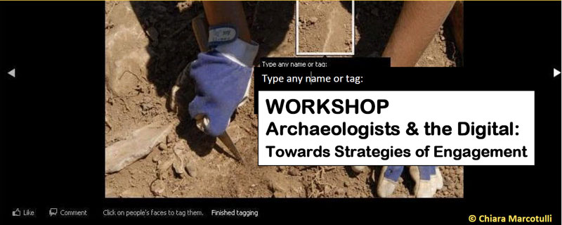
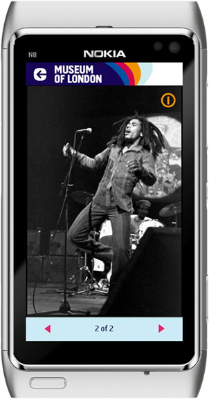
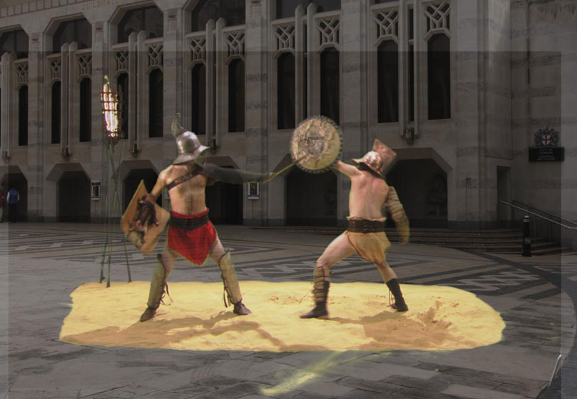
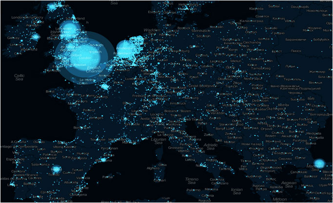
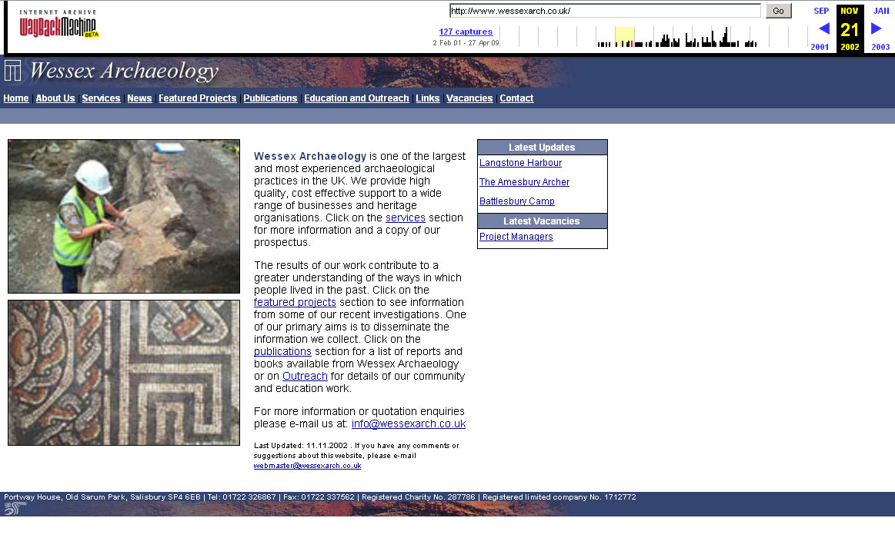
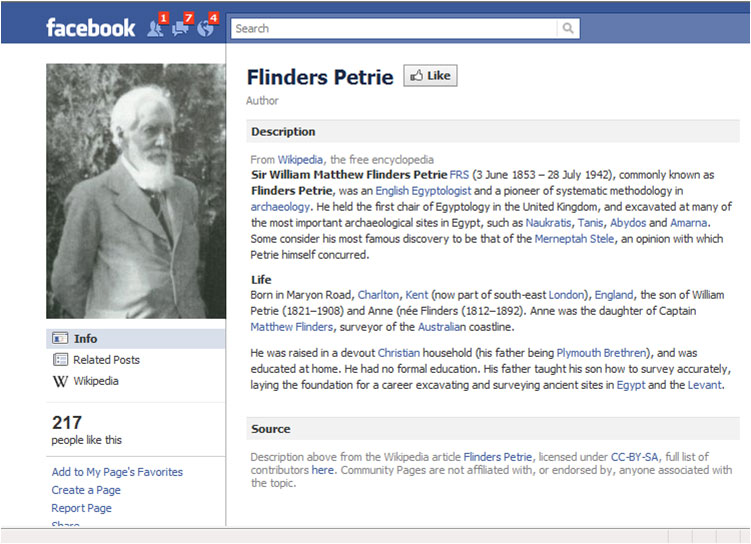
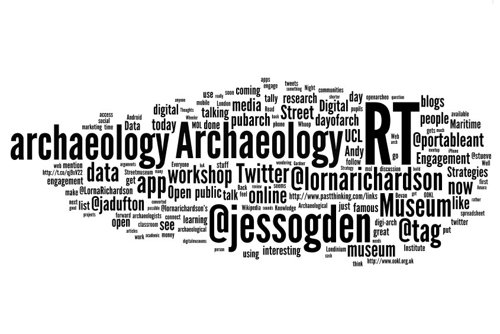

## Workshop on Archaeologists &#038; The Digital: Towards Strategies of Engagement

Yesterday UCL's Institute of Archaeology (which incidentally is top ranked archaeological institution in 
the UK) hosted a workshop of papers centred around archaeological engagement using digital 
technologies and the development and implementation of strategy to achieve this. 

The conference/workshop was badged under the Centre for Audio Visual Study and Practice in 
Archaeology and the Archaeology and Communication Research Network and was organised by Chiara 
Bonacchi (with some help from me, but she did the majority of the work!).  

We managed to assemble a varied audience (full house) via eventbrite and a wide range of 
speakers and the below (sorry this will be long and maybe dull and I didn't make notes so most 
of this is from memory!) will recap on the presentations that were given and in the next month 
or so, they will be available in video podcast format. There was some back-channel discussion 
by various Twitter users (myself included) and I'll also show some analysis of what they were saying. 

Another bonus from this workshop, was the networking opportunities that it produced. I met lots of people that I knew 
digitally, but not in real life, so it was excellent to make their acquaintance!

**If anything is wrong please do correct me!**

## Morning session one ~ chaired by Don Henson

### Smartphones and site interpretation: The Street Museum application ~ Meriel Jeater (Museum of London)

Meriel spoke about the Museum of London's recent launches of a dual platform smartphone application entitled Street Museum. This used location based technology via the GPS chip of the user's phone to pinpoint their position and deliver content from the Museum's archive of pictures that related to their present location. The application was created by Brother and Sisters agency, originally on just the iPhone during a 5-month cycle (concept created in January 2010, specified in February and delivered in May 2010)  at a discounted (!) cost of £20,000 (they were told the actual cost would be £40-50k, but I think that this could be built in house or at a hackday using appropriate technology &#8211; jQuery mobile, HTML 5 etc.). The Android application that was delivered subsequently to this cost a further £28,000.

Other applications are now being developed by the Museum, specifically a partnership with Nokia is producing an application entitled &#8220;[Soundtrack to London](http://www.museumoflondon.org.uk/Explore-online/Apps/SoundtracktoLondon.htm "Soundtrack to London")&#8221; and this was shown with an example of the great Robert Marley and a Romanised version of Street Museum (a name they have trademarked) called Streetmuseum Londinium.  The Londinium app uses green screen generated Roman re-enactors and layer them over current images. I am unclear if this uses their API (a hack was produced at history hack day using this for mobile devices). If you want to find out more about their applications, you can view more on their [dedicated page](http://www.museumoflondon.org.uk/Explore-online/Apps/ "Museum of London apps") . This does raise the issue of social exclusion for those without access to premium handsets, but that comment was raised via twitter&#8230;. Other issues that came up with these apps, included questions relating to why the application wasn't just a new layer with the current Street Museum application.

### Social media as marketing  tools at the British Museum ~ Lena Zimmer (British Museum)

Unfortunately, [Lena](http://www.twitter.com/lena214) couldn't attend the workshop, so I was persuaded to give her paper and I probably didn't do it justice! This talk centred around the use of Social media platforms for the dissemination of propaganda about the British Museum and to facilitate dialogue between the institution and fans/followers etc. This talk was pretty straight forward and there's a lot of statistical information that can be used to benchmark with archaeological and museums.  The BM started to explore the concept of Social Media when refreshing the web presence back in 2006, but the full on uptake of these facilities only began in January 2009 (Twitter) and April (Facebook). A relaunched YouTube channel came online in August 2010 and a blog came online in April 2010. (These are all after the Portable Antiquities Scheme using these facilities and other departments have a presence as well.)

Two points Lena wanted to be iterated, that I probably didn't push heavily enough:  &#8220;A recent study by the Arts Council England, MLA and Arts & Business [Digital audiences: engagement with arts and culture online](http://www.artscouncil.org.uk/media/uploads/doc/Digital_audiences_final.pdf "ACE audience study") (November 2010) has shown that 53% of the online population have used the internet to engage with arts and culture in the past 12 months&#8230;. The report also states that in particular Facebook ‘has become a major tool for discovering as well as sharing information about arts and culture, second only to organic search through Google and other search engines.'&#8221;

The Museum's use of social media is closely allied to the Museum's  strategy,  specifically &#8220;to enhance access to the collection (engagement)&#8221; and &#8220;to increase self-generated income through growth&#8221; and therefore Lena's use of social media allows for:

  * Increase engagement and discussion around exhibitions and the collection with a world-wide audience
  * Drive income streams for exhibition tickets sales, events, Membership, donations, BMco, and Do&Co
  * And also to grow audiences across our online platforms by March 2012  (targets given by Lena are Facebook 200,000 fans and  Twitter 100,000 followers)

Of interest to many would be the methodology for supporting analysis of social media and the fact that the Facebook audience shows a 60% figure of female fans! The analysis of social media uses several measures:

  1. Popularity matrix TweetLevel for influence, popularity, engagement and trust and Klout for other influence measures (measures that Lorna Richardson will use in future for her research).
  2. Audience advocacy (re-tweets, likes, shares) on average we get 11 re-tweets per tweet (measured between Oct 10 – Jan 11) and Facebook likes average 158 per post and 12.2 comments (measured Aug 2010 – April 2011)
  3. Observation and close monitoring of social media sites à What type of comments are being made, how are people responding to our content using Tweetdeck etc.

### Mobile learning: connecting pupils, curriculum, and informal learning environments ~ Theano Moussouri (UCL)

Theano presented about a collaboration between the National Maritime Museum (NMM) and UCL which investigated mobile phone based learning and its outcomes centred around the trans-Atlantic Slave trade of Black Africans. This used the [ookl](http://ookl.org.uk) platform to deliver content and had a structured visitor study to work how well the project had engaged with the target audience (remember this workshop is all about engagement and digital!) The study was based around social-constructivismprinciples and followed a three step model of qualitative research i.e. before, during and after the visit to the NMM and involved staff of the school, the children and the museum staff themselves.  Key elements in this process included the people, the content, the technology and the context in which all of these interacted. Theano stated the relevancy of content was imperative, that there were issues with the choices of technology involved and that the people involved would also limit the experimental nature of this work.

I lost track of the outcome of this talk as I was fixing our work website via SSH, so I am unsure if this project was deemed a success of not. If you can help finish the notes on this, do comment!

## Morning session two ~ Chiara Bonacchi (UCL)

The nature of archaeological communities and spatial data online ~ Andy Bevan (UCL)

 

Andy Bevan, GIS wunderkind, presented the seminar that he gave during the CASPAR series. It included references to Asterix, Mortimer Wheeler and agency and models. I enjoy these sort of theoretical talks! Andy covered the following concepts and also referred to the Long Tail idea of digital engagement:

  1. Free and Open Source software vs  vendor lock in
  2. The concept of authoritative content/authorship
  3. Monetisation of content
  4. game based theory or gamification of applications and websites
  5. agency (online and offline) &#8211; this is where Asterix featured heavily with pictures for the individual, the household, institutions and artefacts (a menhir, I must have another menhir!)
  6. Relational models &#8211; covering lots of theory from Alan Fiske's work from 1991 and 2005
  7. Online community building within social networks (including geocacher for example).
  8. Open data and Open archaeological initiatives (specific mention was made to iosa.it, Ordnance Survey opendata, the ADS and the Open Knowledge Foundation
  9. Geo and neo-geo concepts
 10. Augmented reality experiences

### Twitter and archaeology online  ~ Lorna Richardson (UCL)

Lorna Richardson, current PhD student at the Centre for Digital  Humanities UCL, presented on her research into the use of twitter and archaeological engagement online (you can read far more on her research aims at her [website](http://digipubarch.org/my-research/ "Lorna's research aims")). Lorna's been working with me since her Masters, so I'm quite familiar with her work, and so I hope I have captured the essence of her presentation below. As we should quite rightly assume, not every one uses or is au fait with the concept of Twitter (very small percentage of the world's population use it &#8211; newspapers get over the fixation please) and so she gave an introduction as to what the social media platform is and how it works, specifically:

  1. explaining its genesis (140 characters dictated by concept originally being for mobile phone sms)
  2. How the @ syntax worked
  3. How hashtags came about to facilitate sharing
  4. How retweets work
  5. User figures of use &#8211; peer index [sent a good stat out on twitter](https://twitter.com/PeerIndex/status/64327979148382209 "Twitter update from peerindex") &#8211; &#8220;Twitter Confirms It Has Passed 200 Million Accounts, 70% of Traffic Now International&#8221; which I passed on a few weeks ago
  6. Where the peak usage seems to be in Europe taken from a recent visualisation posted by a company called &#8220;[eeve](http://blog.geteeve.com/post/5038599050/twitter-usage-in-europe-this-is-why-we-are-in "Eeve image")&#8221;  (shown in this post) with some interesting spikes on capital cities, with London being the most dominant centre.

Lorna then went on to talk about her twitter and archaeologists survey, how long it ran for and what sort of feedback she managed to get from the survey monkey questionnaire she created. She showed some graphics showing how people accessed Twitter, top words used in some tweet analysis and 2 wordle graphics for some basic text based analysis of responses &#8211; for example news and field work updates were the things that people wanted to see shared and research and networking the main uses of Twitter. She then also talked about the academic problems that she will now face due to Twitter's change in terms of use for their api and that to get access to full data hose of tweets, she'll now need to find £2000 (or $ can't remember!) to get access from a company called [gnip](http://gnip.com/ "The Gnip website"). Questions were raised from the floor regarding use of RSS for monitoring twitter, but this feature is being [phased out](http://www.zeldman.com/2011/05/09/twitter-and-facebook-kill-rss/) from their interface, twapperkeeper has had to pull the export functions etc. and Lorna needs some quite detailed information.

Lorna finished by making a call to arms, asking everyone there to consider using Twitter to facilitate archaeological engagement and her research. Welcome, Elizabeth Warry and Chiara today!!

### Wessex Archaeology on the web ~ Tom Goskar (Wessex Archaeology)

The man of Kernow, Tom Goskar then presented on his fantastic work for Wessex Archaeology, managing their open source-tastic web presence. Tom operates in a very similar manner to me, using the best open souce tools and software to complete the task in hand. His talk resonated deeply with what I normally lecture on for Tim Schadla-Hall's course.  Tom's organisation is at the forefront of commercial archaeological work, employing nearly 200 people from 4 locations around Britain. It has a relatively high turnover of £7million pounds and generates reams of web content and &#8216;grey' literature (a pigeonhole term that Tom wants to eliminate) and his skills turn this work into a cohesive web presence that is visited by on average 12,000 people per month. Their website was orginally produced to cope with the interest around the Amesbury Archer, which was discovered in 2002 and this served to highlight the benefit of pushing their fascinating work-out digitally.

Tom has moved on substantially since 2002, away from static HTML to sophisticated content management and blogging tools (currently have 14) and he uses the best software for the job:

  * Drupal for the main site
  * WordPress for blogs
  * Omeka for the forthcoming collections and publications data

Tom has fully embraced social media, creating podcasts (first in 2005) and has used flickr to disseminate images (like us) and they have received over 600,000 views since they started to use the platform and been remixed into interesting work due to the use of the Creative Commons licence. In his current stewardship, Tom now has to manage over 4000 pages, has hundreds and hundreds of downloads (on Scribd etc.), manages social media presences and has managed to get them a high profile on sites such as Time Team on channel 4. His work is definitely an exemplar in the field of Public Archaeology.

Tom's last slide summed up today's workshop completely for me &#8211; **It’s all about the public** &#8211; spot on young man.

### Afternoon session ~ Chair Tim Schadla-Hall (UCL)

### Blogs and wikipedia: New frontiers for archaeological research? ~ Amara Thornton (UCL)

Amara Thornton has recently completed her PhD at UCL (award pending) on social networks around famous Palestine linked archaeologists (Garstang, Kitchener etc.) and at the conference, she presented on blogging and wikipedia use in the archaeological research sphere. Amara ran through the concept and history of Wikipedia and gave some statistical analysis of the most popular pages for their articles &#8211; from her research, the most popular archaeological linked article was for the Acropolis, and she also showed how many views archaeological topic pages received and how you could access the editing logs!

There were a couple more wordle graphics, one showing non-archaeological thoughts on  archaeology (am I right here?), which has Indiana Jones and pith helmets to the fore. She then went on to talk about the convergence of wikipedia and facebook &#8211; or wikipedia meets facebook, and she showed how people had befriended John Garstang (6 likes)  and Flinders Petrie (over 200 likes). Sean Graham's Electric archaeologist blog and his research on blogging was then mentioned, with the [network graphic](http://electricarchaeologist.wordpress.com/2011/04/01/the-archaeological-blogosphere/ "gephi produced graphic") being shown to the audience which demonstrated that Coleen Morgan's blog appears in the middle with links from all over the place. (If you're interested in how he produced this, check out Gephi.) Amara also suggested that a concentrated effort to increase reliability and scope of archaeological wiki articles could be co-ordinated &#8211; something that has also been mooted on Twitter by various people.

### Open access and open data ~Brian Hole (UCL)

I was starting to flag a little at this point, so maybe my memory is a little hazy here. Brian currently is completing a PhD at UCL and also works at the British Library and Ubiquity Press. What stood out for me at the start of Brian's presentation was my hatred of the Prezi format &#8211; nausea inducing as it goes backwards and forwards around his Indian figurine of Shiva. Brian was talking about the attempts being made to make access to data more accessible via the implementation of open licences and adoption of DOIs for cataloguing or archiving and providing an endpoint resolver for journals and data. Many in the audience felt that the process was simplified too much for the data aspect, but that can probably be overcome.  Brian also presented his concept of a new archaeological journal that would interact with the Archaeological Data Service and have DOIs built in.

If anyone has better recollection of this paper, please do comment!

### Strategy games and engagement strategies ~ Andrew Gardner (UCL)

Andrew presented the strategy game seminar that had been part of the CASPAR seminar series and this centred around the use of strategy games as a means for archaeological engagement. Andrew ran through the development of games covering Age of Empires, Civilisation and the use of historians to try and ensure historical integrity and accuracy; he also covered how much money the games industry turned over annually, some concepts of strategy development and how personas and people's own minds can shape the virtual worlds that they create online or offline (if the game isn't internet based.) The archaeological type games that I tend to play are the more swashbuckling type &#8211; Indiana Jones or Lara Croft &#8211; and I have tended to stay away from the turn based game concept. Andrew stated that if they had been around when he was doing his PhD, he would never have finished it!

### Archaeological TV channels online: an assessment of potential ~ Chiara Bonacchi (UCL), Charles Furneaux (Kaboom Film and Television), Dan Pett (The British Museum)

The final paper of the day was presented as a combination paper between myself, the conference organiser (Chiara) and Charles Furneaux, and it was centred around the potential engagement provided by the use of archaeological television &#8211; TV and web TV. Charles presented at the CASPAR series, but I unfortunately missed out on that! Rounding up this talk is easier than for the others, as I have the presentation!

Charles in his section covered  traditional archaeological programming from 2003 to the present by presenting some statistics:

  1. 45 hours of archaeological TV in the UK in 2010
  2. 25 hours in 2009
  3. 2 types of archaeological TV &#8211; presenter led and Time Team type shows
  4. in 2003, terrestrial TV showed 185 hours of archaeology and ancient history and 90 hours of heritage
  5. Traditional TV has suffered due to the massive take-up of multichannel TV in homes
  6. Since 1983, ITV's market share has declined from 48% to 17%!
  7. Charles sees the take-up of web TV as a chance for the takeup of narrowcasting rather than broadcasting and this presents a great opportunity for archaeologists to engage!

Chiara then presented her section on archaeological web TV, specifically in regard to two Italian channels &#8211; Archeologia Viva TV and Sperimentarea TV and the Archaeology Channel . Chiara covered the uptake of their websites and presented some interesting statistical analysis:

  1. Archeologia Viva TV has a bounce rate of 0.5% (amazing figure! Scheme website is 30%)
  2. They have 177  videos available online in three categories &#8211; news and events, documentaries and conversational pieces
  3. They page view level and number of visitors is low in comparison to many sites, but the users have high quality engagement! They stay for an average of 8 minutes &#8211; does this show a maximum length of video?
  4. Visitors from 82 countries, but dominated by Italy

I then presented badly on institutional web TV channels, something that is being explored in many national and local institutions as the technological and cost barriers come down when making video footage. Things I identified were:

  1. low cost platforms &#8211; youtube, vimeo, amazon streaming etc
  2. high costs for training and sustainability
  3. The UK produces some very high quality footage online &#8211; eg Wessex Archaeology, 360 Productions
  4. There's a wide variety of institutions with successful channels &#8211; V&A, ArtBabble at Indianapolis Museum, Thames Discovery Project
  5. the most successful videos are shorter, with high production levels, punchy  & dynamic story telling
  6. people need training in editing, in filming, and you need to get engaging presenters
  7. videos aren't necessarily viewed a lot
  8. strong brands can help you get the most views

Overall, our paper tried to show that archaeological TV can survive and thrive on the web platform!

### Discussion and next steps ~ Chair: Dan Pett (The British Museum)

For some reason, I was assigned the task of running the discussion at the end of the event, and hopefully I managed to help facilitate some good discussion on the day's topics and the issues that it raised. As I was chairing, my memory of this isn't great! Things covered included the digital divide between those who can do the digital because they have the skills, how to get trained to produce digitally, sustainability, burden of web not being put on just one person's shoulders, the need for institutional buyin.  We also covered possible topics for the next CASPAR event &#8211; a conference at some point and what things the centre could eventually do. Audience research is an angle that could be pursued, training in digital resources and providing templates etc. for how to create and engage in the digital sphere.  Mention was made of the excellent work of the Samsung Digital Discovery Centre at the British Museum by Elizabeth Warry, comments were raised relating to Twitter chat and I basically bored everyone senseless.

We also covered the upcoming Day of Archaeology project that has been generated by Matthew Law, Lorna Richardson, Jess Ogden, Andy Dufton, Stu Eve, Tom Goskar and I. We also had a very brief presentation by Kathryn Piquette covering the use of RTI for the analysis of archaeological objects, I'm sorry we had to rush that.

We hope that after the workshop, people will consider joining in with this project and document the day of archaeology and what you do in your working life. Special mention to Pat Hadley for coming down from York as he saw the hashtags and got on the train.

### Thank you to Chiara for organising the day.

Twitter wise, there was a reasonable backchannel, 60+ people attended and some brief analysis of tweets can be made using various social media tools and looking at all tweets that utilised the hashtag #acrncaspar. I haven't really done this, but here's some basics:

  1. [Twittersentiment](http://twittersentiment.appspot.com/search?query=%23acrncaspar) showed 78% of people were positive in their tweets about the day
  2. My id was the only one geolocating the tweets
  3. [ACRN CASPAR tweets](../images/2011/05/acrncaspar.xls) in spreadsheet format can be downloaded
  4. 215 tweets are available
  5. The dreaded wordle looks like the below:  
  6. 38 people tweeted about the #acrncaspar hashtag
  7. Top tweeter was Jess Ogden

Twitterati were:

  * [@jessogden](http://twitter.com/jessogden): # of tweets:58
  * [@LornaRichardson](http://twitter.com/LornaRichardson): # of tweets:36
  * [@portableant](http://twitter.com/portableant): # of tweets:19
  * [@jadufton](http://twitter.com/jadufton): # of tweets:17
  * [@simon_mahony](http://twitter.com/simon_mahoney): # of tweets:11
  * [@KathrynPiquette](http://twitter.com/KathrynPiquette): # of tweets:9
  * [@stueve](http://twitter.com/stueve): # of tweets:8
  * [@tag](http://twitter.com/tag): # of tweets:7
  * [@m_law](http://twitter.com/m_law): # of tweets:7
  * [@archaeologyman](http://twitter.com/archaeologyman): # of tweets:5
  * [@luluartist](http://twitter.com/luluartist): # of tweets:4
  * [@Pogezana](http://twitter.com/Pogezana): # of tweets:4
  * [@sempaiscuba](http://twitter.com/sempaiscuba): # of tweets:4
  * [@mrjdoeser](http://twitter.com/mrjdoeser): # of tweets:3
  * [@GraemeEarl](http://twitter.com/GraemeEarl): # of tweets:3
  * [@PatHadley](http://twitter.com/PatHadley): # of tweets:3
  * [@Ravages](http://twitter.com/Ravages): # of tweets:2
  * [@dazdeery](http://twitter.com/dazdeery): # of tweets:2
  * [@captain_primate](http://twitter.com/captain_primate): # of tweets:2
  * [@Sarah_May1](http://twitter.com/Sarah_May1): # of tweets:2
  * [@lparchaeology](http://twitter.com/lparchaeology): # of tweets:2
  * [@Rikke_Olafson](http://twitter.com/Rikke_Olafson): # of tweets:2
  * [@NickSherrard](http://twitter.com/NickSherrard): # of tweets:1
  * [@brennawalks](http://twitter.com/brennawalks): # of tweets:1
  * [@London_Places](http://twitter.com/London_Places): # of tweets:1
  * [@stekosteko](http://twitter.com/stekosteko): # of tweets:1
  * [@ArchaeologistSP](http://twitter.com/ArchaeologistSP): # of tweets:1
  * [@PrimitiveMethod](http://twitter.com/PrimitiveMethod): # of tweets:1
  * [@clairey_ross](http://twitter.com/clairey_ross): # of tweets:1
  * [@eltonteb](http://twitter.com/eltoneb): # of tweets:1
  * [@Mincefriend](http://twitter.com/Mincefriend): # of tweets:1
  * [@CBonacchi](http://twitter.com/CBonacchi): # of tweets:1
  * [@diggingthedirt](http://twitter.com/diggingthedirt): # of tweets:1
  * [@vinbrown](http://twitter.com/vinbrown): # of tweets:1
  * [@History_Hunters](http://twitter.com/History_Hunters): # of tweets:1
  * [@christina_vona](http://twitter.com/christina_vona): # of tweets:1
  * [@dav_stott](http://twitter.com/dav_stott): # of tweets:1
  * [@telefonillo](http://twitter.com/telefonillo): # of tweets:1
