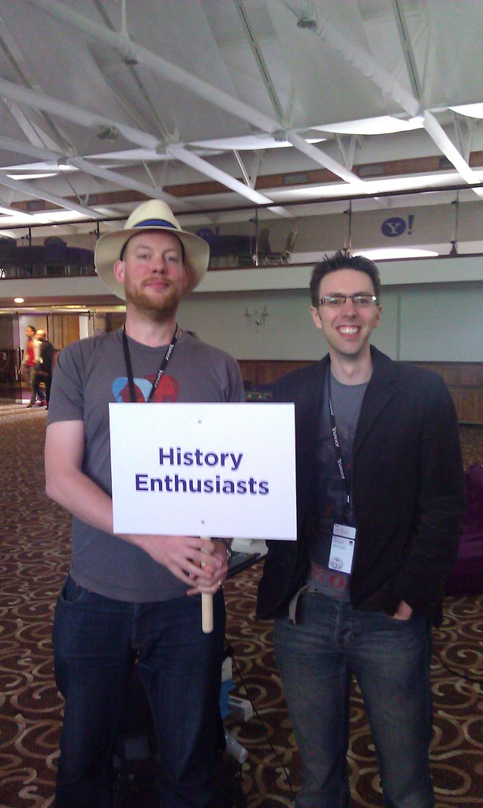
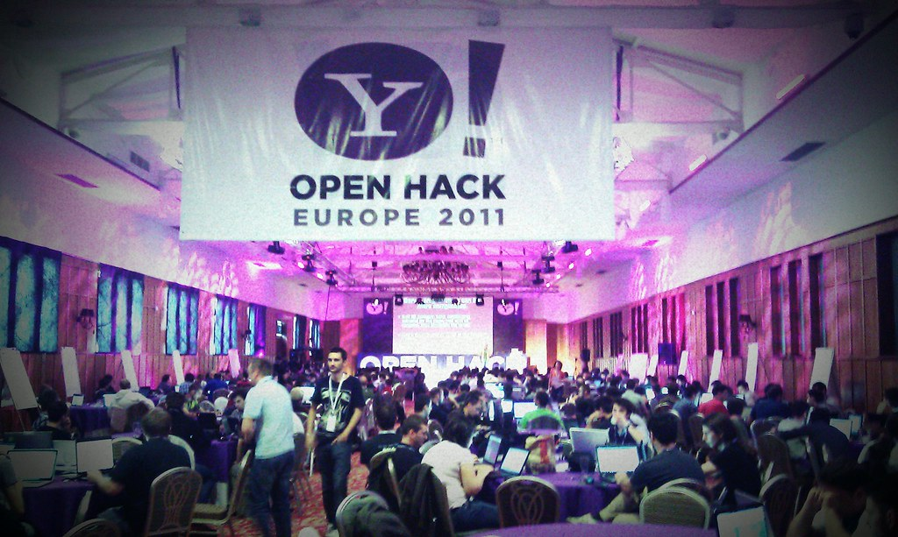
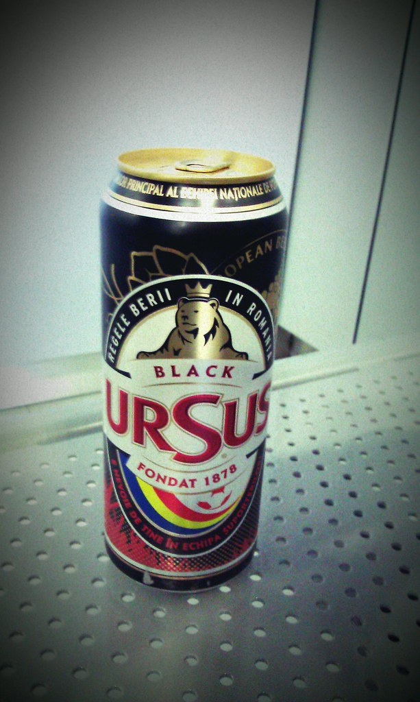

Last weekend, I was invited to attend the Yahoo! Openhack EU event that was held in Bucharest, Romania as part of a team of &#8220;History Enthusiasts&#8221; to try and help participants generate ideas using cultural sector data. This came about from the really successful [History Hack Day](http://historyhackday.org "The history hack day website") that [Matt Patterson](https://twitter.com/fidothe "Matt's twitter") organised earlier this year and due to this, Yahoo!'s Murray Rowan invited him to assemble a team to go to Romania and evangelise. Our team comprised myself, [Jo Pugh](https://twitter.com/mentionthewar "Jo's twitter") from the National Archives and our leader Matt; we went armed with the [datasets](http://historyhackday.pbworks.com/w/page/30289994/Datasets) that were made available for the hackday and a list of [apis](http://museum-api.pbworks.com/w/page/21933420/Museum%C2%A0APIs) from [Mia Ridge](http://twitter.com/mia_out "Mia's tweets") (formerly of the Science Museum and now pursuing a PhD).

The Openhack event (hosted in the [Crystal Palace Ballrooms](http://www.crystalpalaceballrooms.ro/ "Crystal Palace ballrooms") &#8211; don't leave the complex we were told, the wild dogs will get you!) started with a load of tech talks, most interesting for me was the YQL one (to see how things had progressed), Douglas Crockford (watched this on video later) on JSON and also [Ted Drake](http://twitter.com/ted_drake)&#8216;s accessibility seminar. One thing I thought that was absent was the Geo element, something that is extremely strong at Yahoo! (api wise before you moan about maps) and an element that always features strongly at hack days in mashups or hacks. Our team then gave a series of short presentations to the Romanians who were interested in our data unfortunately not too many, but that seemed to be the norm for the enthusiasts. We felt that a lot of people had already come with ideas and were using the day as a collaborative catalyst to present their work, not that this is a bad thing, be prepared and your work will be more focused at these events. Between us, we talked about the success of the hackday at the Guardian and Jo presented material from the National Archives, and then we discussed ideas with various people throughout the day; for example:
ickr
  1. Accessing shipping data &#8211; one of the teams we spoke to wanted some quite specific data about routes. However, we found a static html site with a huge amount of detail and suggested scraping and then text extraction for entities mentioned and producing a mashup based on this &#8211; see [submarines hack](http://hummezum.hu/openhackeu/ "Submarines locations from text ww2")
  2. How to use Google Earth time slider to get some satellite imagery for certain points in time (the deforestation project was after this)
  3. Where you can access museum type information &#8211; history hack days list
  4. Which apis they could use &#8211; Mia Ridge's wiki list

I tried to do a few things whilst there, some Twitter analysis with Gephi and R (laptop not playing ball with this) and building some YQL opentables for Alchemy's text extraction apis and Open Library (I'll upload these when tested properly). Matt looked at trying to either build a JSON api or a mobile based application for [Anna Powell-Smith](https://twitter.com/darkgreener "Anna's twitter")&#8216;s excellent [Domesday mapping project](http://domesdaymap.co.uk/ "Domesday map website") (django code base) and Jo played with his data for Papal bullae from the National Archives using Google's fusion tables and also looking at patterns within the  syntax via IBM's [Manyeyes](http://www-958.ibm.com/software/data/cognos/manyeyes/visualizations/popethink "Jo's visualisations") tool.

 Hacking then progressed for the next 24 hours, interspersed with meals and some entertainment provided by the Algorythmics (see the embedded video below from Ted Drake) who danced a bubble sort in Romanian folk style, and 2 brief interludes to watch the Eurovision (Blue and the Romanian entry). We retired to the bar at the JW Marriot for a few Ursus beers and then back to the Ibis for the night before returning the next day to see what people had produced to wow their fellow hackers and a panel of judges. Unfortunately, I had to head back to the UK (to help run the ARCN CASPAR conference) from OTP when the hacks were being presented, so I didn't get to see the finished products. The internet noise reveals some awesome work and a few that I liked the sound of are commented on below. I also archived off all the Twitter chat using the #openhackeu hashtag if anyone would like these (currently over 1700 tweets). There was also some brilliant [live blogging](http://palcu.blogspot.com/2011/05/yahoo-open-hack-live-blogging.html "Live blogs from Alex") by a very nice chap called Alex Palcuie, which gives you a good idea of how the day progressed.

So, after reading through the [hacks list](http://developer.yahoo.com/hacku/show/2011/may/openhackeu "The hacker roll call"), these are my favourites:

  1. [Mood music](http://www.mooooody.com/ "Mood music hack")
  2. [The Yahoo! Farm](https://docs.google.com/present/view?id=0AUOHo6CXojbVZGhrYmtzNGdfMjRmdmZ2NmNkYg&hl=en&authkey=CODP4LcE "Down on the farm") &#8211; robotics and web technology meshed, awesome
  3. [Face off](http://faceoff.demo.zitec.ro/ "Faceoff ") (concept seems good)
  4. [Pandemic alert](http://hackday.ross-warren.co.uk/) &#8211; uses webgl (only chrome?)
  5. [Where's tweety](http://openhack.filipnet.ro/)

And these are the actual winners (there was also a proper &#8216;hack', which wasn't really in the vein of the competition as laid out on the first day, but shows skill!):

  * _Best Product Enhancement &#8211;_ <a href="http://www.youtube.com/watch?v=4V7HfypLod0" data-rel="lightbox-video-0">TheBatMail</a>
  * _Hack for Social Good &#8211;_ Map of Deforested Areas in Romania
  * _Best Yahoo! Search BOSS Hack &#8211;_ Take a hike
  * _Best Local Hack_ &#8211; [Tourist Guide](http://tg.code5.ro/tourist_guide/)
  * _Hacker's choice_ &#8211; Yahoo farm
  * _Best Messenger Hack_ &#8211; Yahoo Social Programming
  * _Best Mashup_ &#8211; YMotion
  * _Best hacker in show_ &#8211; Alexandru Bádiu, he built 3 hacks in 24 hours!

To conclude, [Murray Rowan](http://twitter.com/murrayrowan "Murray on twitter") and [Anil Patel](http://twitter.com/anilpatel "Anil on twitter")&#8216;s team produced a fantastic event which for once had a very high proportion of women (maybe 10-25% of an audience of over 300) in attendance &#8211; which will please many of the people I know via Twitter in the UK and beyond. We met some great characters (like [Bogdan Iordache](https://twitter.com/bogdaniordache "Bogdan's twittering")) and saw the [second-biggest building](http://en.wikipedia.org/wiki/Palace_of_the_Parliament "Second largest building") on the planet (it was the biggest on 9/11 the taxi drivers proudly claim) and met a journalist I never want to meet again&#8230;.. According to the [hackday write up](http://ycorpblog.com/2011/05/17/openhackeurope/), 1090 cans of Red Bull, 115 litres of Pepsi and 55 lbs of coffee were consumed (and a hell of a lot of food seeing some food mountains that went past!)

Here's to the next one. Maybe a cultural institution can set a specific challenge to be cracked at this. And I leave you with [Ted Drake](http://www.flickr.com/photos/draket/5720274789/)&#8216;s video:
