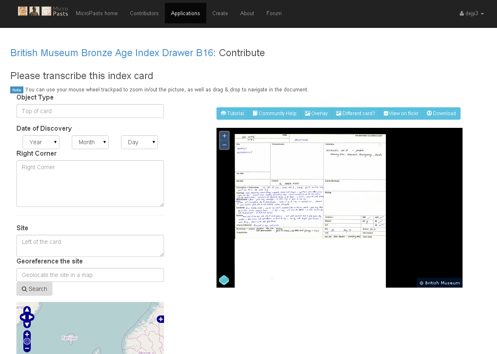

Originally published on the <a href="https://blog.micropasts.org/2014/04/30/preparing-the-index/](http://blog.micropasts.org/2014/04/30/preparing-the-index/">micropasts blog</a>

Since late 2013, the MicroPasts team has been preparing the [British Museum](http://britishmuseum.org)&#8216;s (BM) Bronze Age Index to be the first offering on our [crowdsourcing platform](http://crowdsourced.micropasts.org "The MicroPasts crowd sourcing platform"). This corpus consists of around 30,000 (roughly A4 sized) cards (holding information going back to as early as 1913).  The majority of these are double-sided and generally have text on the front and a line drawing on the reverse (there are many variants that have been discovered, such as large fold out shield plans.)

## The Crowdsourcing platform

Over the last few years, several curators have mooted exercises ([Ben Roberts](https://www.dur.ac.uk/archaeology/staff/?id=10573), 
now at Durham University attempted to turn the transcription into an AHRC funded collaborative Doctoral Award) to turn this amazing 
resource into a digital archive, but this had not come to fruition until the advent of the MicroPasts project. Internal 
discussions had been raging on how best to deal with these cards for a number of years, and it was felt that this project 
could perhaps be the ideal solution and provide museum and public interaction of a new type, which the BM had not explored previously.

To enable this corpus to be digitised is reasonably straight forward, and we have employed Dr Jennifer Wexler ([@jwexler](https://twitter.com/JWexlerBM "jennifer on Twitter") on Twitter) 
to manage the scanning process, and she has been doing this since February after her return from field work in Benin.

The equipment needed for this is relatively straight forward, the BM has acquired two high capacity/speed scanners (Canon) 
which can scan 60 and 100 sheets per minute at 600 dpi and once this initial project is over, they can be reused for turning 
more archival materials into potential crowdsourcing materials. You can see a picture of Neil's former office (he's just 
moved to a nicer one -we're not jealous) being used as the scanning centre below in one of his tweets:

<blockquote class="twitter-tweet">
    
Scanning palstave cards by the score <a href="https://twitter.com/portableant?ref_src=twsrc%5Etfw">@portableant</a> <a href="https://twitter.com/MicroPasts?ref_src=twsrc%5Etfw">@MicroPasts</a> <a href="https://t.co/TsAvn3lBZV">pic.twitter.com/TsAvn3lBZV</a>
&mdash; Neil Wilkin (@NWilkinBM) <a href="https://twitter.com/NWilkinBM/status/432912139213615104?ref_src=twsrc%5Etfw">February 10, 2014</a>
</blockquote> 

The first drawer scanned is known as A9 ([this application](http://crowdsourced.micropasts.org/app/drawA9/ "Application A9") 
on the platform), and this was done by the Bronze Age Curator Neil Wilkin ([@nwilkinBM](https://twitter.com/NWilkinBM "neil on Twitter") on Twitter) 
over a few weeks whilst dispensing with his other duties. Once Jennifer returned, scanning started in earnest! These high 
resolution images were then stored in various places to facilitate good data preservation (on an external 4TB hard drive, 
the Portable Antiquities Scheme server cluster and onto Amazon S3) and they were then stitched together by Daniel Pett 
([@portableant](http://twitter.com/portableant) on Twitter), as composite images using a [simple python script](https://github.com/findsorguk/MicroPasts-Scripts/blob/master/imageStitch.py "Github script for image stitching") 
and then uploaded to Flickr (for example see [this set](https://www.flickr.com/photos/micropasts/sets/72157641305131374/ "Flickr set")) 
for the crowdsourcing platform to access and then present them as tasks for our audience to assist with. All of these 
images have been released under the most liberal licence that Flickr permits (we would have ideally liked to make them CC0, 
but this option does not exist) and so they are served up under a CC-BY licence. The data that will be transcribed, will 
also be made available for download and reuse by anyone, under a CC0 licence. The embedded tweet below, shows an example of one of the stitched cards:

<blockquote class="twitter-tweet" data-lang="en">
    
Playing with Python scripts to merge Bronze Age Palstave images together for <a href="https://twitter.com/MicroPasts?ref_src=twsrc%5Etfw">@MicroPasts</a> An example image attached. <a href="https://t.co/Xe0Rdb7prz">pic.twitter.com/Xe0Rdb7prz</a>
&mdash; Daniel Pett @ #mozfest (@DEJPett) <a href="https://twitter.com/DEJPett/status/436817767983890432?ref_src=twsrc%5Etfw">February 21, 2014</a>
</blockquote>

The platform that we're using for serving up the crowdsourcing tasks has been created by Daniel Lombraña González (lead 
developer &#8211; [@teleyinex](https://twitter.com/teleyinex "Daniel's twitter profile")  on Twitter) and the 
[Pybossa](https://pybossa.com "Pybossa site") team, and it is a departure from the usual technology stack that the project 
team has used previously. Installation of the platform is straightforward, and it was deployed on to [Portable Antiquities Scheme](http://finds.org.uk) 
hardware in around 15 minutes. We then employed Daniel to assist with building the transcription application skeleton 
(in conjunction with project lead Andy Bevan (not on Twitter!) and Daniel Pett) that would be used for each drawer, whilst 
we also developed our own look and feel to give MicroPasts some visual identity. If you're interested, the code is available 
on [GitHub](https://github.com/findsorguk) and if you have suggestions from improvements, you could either fork the code or 
comment on our [community forum](https://community.micropasts,org).

For the last few months, building up to launch, lots of debugging and user testing was conducted to see how the site reacted,
whether the tasks we offered were feasible and interesting enough. Chiara Bonacchi ([@Chiara_Bonacchi](https://twitter.com/Chiara_Bonacchi)) and Adi Keinan ([@Adi_Keinan](https://twitter.com/Adi_Keinan)) worked on the main project site, building our [Facebook](http://facebook.com/micropasts) and [Twitter](http://twitter.com/micropasts) engagement.

[Chiara](https://www.ucl.ac.uk/archaeology/people/staff/bonacchi) has also developed our evaluation frameworks, which we were integrating into the system and feel are vital to discovering more about people's engagement with our platforms and how their motivations progress through time, and hopefully the project's success! This evaluative work hopes to be one of the first following the development of individual users' interaction on a crowdsourcing website.

And then we launched and tasks are ongoing:

<blockquote class="twitter-tweet" data-width="500" data-dnt="true">
  

    <a href="https://twitter.com/MicroPasts?ref_src=twsrc%5Etfw">@MicroPasts</a> Launches today!Help us discover the lost secrets of the Bronze Age Index at the BM:<a href="https://t.co/T1nErnWVbi">https://t.co/T1nErnWVbi</a> <a href="https://t.co/nyTdUwjCyA">pic.twitter.com/nyTdUwjCyA</a>
  

  

    &mdash; Jennifer Wexler (@JWexlerBM) <a href="https://twitter.com/JWexlerBM/status/456467924920721408?ref_src=twsrc%5Etfw">April 16, 2014</a>
  

</blockquote>

This project is very exciting for the BM and especially for our curatorial staff. It could unlock new opportunities and Neil sums up very succinctly, why we are doing this public archaeology project, so we'll leave it to him:

<blockquote class="twitter-tweet" data-width="500" data-dnt="true">
  

    Opening the treasures of the Bronze Age to the widest public is why I get up, I would love your help: <a href="https://t.co/q7eWlIrD9j">https://t.co/q7eWlIrD9j</a>
  

  

    &mdash; Neil Wilkin (@NWilkinBM) <a href="https://twitter.com/NWilkinBM/status/456421634237140992?ref_src=twsrc%5Etfw">April 16, 2014</a>
  

</blockquote>

Thank you for participating!
