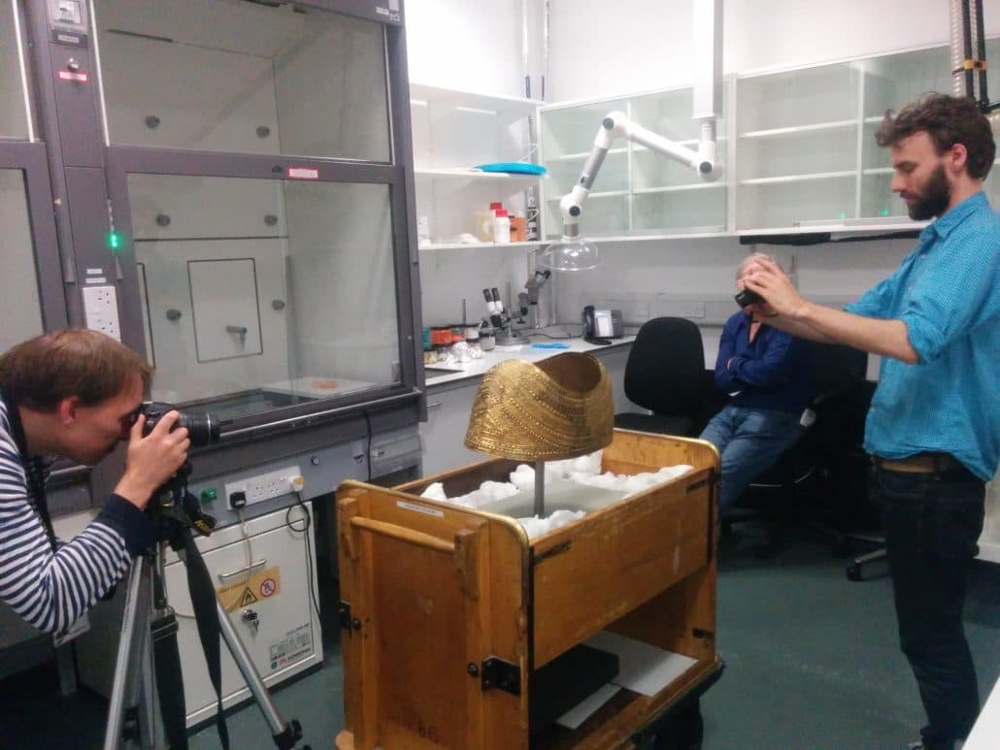

This was originally published as part 1 of a 3 part interview on the SketchFab blog in January 2017.

__Our [Cultural institutions Page](https://sketchfab.com/museums) highlights our ongoing support of museums and cultural institutions with 
free accounts and access to tools. In [Cultural Heritage Spotlight](https://blog.sketchfab.com/tag/culturalspotlight/), 
we’ll explore museums and cultural institutions who are using 3D technology to bring new life to their collections. 
Today’s blog post features Daniel Pett’s effort to make the collections of the [British Museum](https://sketchfab.com/britishmuseum) 
accessible for anyone in 3D and VR.__

Daniel Pett is a Senior Digital Humanities Manager at the British Museum. He has a background in Archaeology, having studied at the Institute of Archaeology (UCL) and Cambridge University, and he has also worked in Telecoms and Investment Banking technology and subsequently as technical lead for [the Portable Antiquities Scheme](https://finds.org.uk). He has also been co-lead on the [MicroPasts project](https://sketchfab.com/micropasts) with Professor Andy Bevan (UCL) and now leads on the British Museum’s foray into the world of Digital Humanities, sitting in between the curatorial community of the Museum and the Digital and Publishing department. One of the most recent projects he delivered, was the new Knowledge Search application for the Museum, which brings together many of the Museum’s resources in one interface.

As a side-project he has co-created one of the most breathtaking and largest 3D/VR collection of cultural artefacts in the world. The British Museum was early on Sketchfab, they created their account in October 2014: 121 3D models later, with more than 380K views on their models and 3000 likes, they are now the most followed Museum on Sketchfab. The Jericho Skull has been featured by CNN and the National Geographic:

    <iframe title="A 3D model" src="https://sketchfab.com/models/bdcf4843e0964da2931aa7ab1fc1b99d/embed" allow="autoplay; fullscreen; vr" mozallowfullscreen="true" webkitallowfullscreen="true"></iframe>

The first foray into making British Museum 3D content available on Sketchfab was through the [MicroPasts](http://micropasts.org) project, using crowdsourced photo masking and subsequently Thomas Flynn placed his models online under the BM banner. Daniel now shares the British Museum’s collections with the entire world making them easily accessible for educational purposes, scientific reasons and, of course, for anyone who is interested in Culture. Thanks to his initiative and knowledge transfer to colleagues, the British Museum helps to democratize culture and digitally preserve their collections.

Sharing their artefacts is also a way to promote the British Museum’s collections and encourage to actually go in the museum to discover them. It can also be a way to show the hidden artefacts since not all the collections of the museum are shown in the Museum or an easy way to manipulate fragile or very small/big artefacts.

Daniel will explain us today how he has been able to achieve all of this with a restricted budget and a short time allocation!

Daniel, thanks for answering our questions:

1. First, could you explain what is your process to create all these models?

Our 3D work is all based around photogrammetry or Structure from Motion and builds on work first done in the Museum by Southampton University on [Hoa Hakananai’a<](http://search.proquest.com/openview/368aa48d9dee2de8690b48ab8006194a/1), then by the MicroPasts team and collaborators and finally by Thomas Flynn. The BM has seen other 3D scanning techniques employed, mostly via [medical imaging](http://www.tandfonline.com/eprint/5DvAXhcwI3mJbkH3Gieq/full) (led by curator Daniel Antoine) and more costly methods but also some LIDAR usage and the work that CyArk conducted on our Assyrian reliefs. The famous archaeologist, Dominic Powlesland has also done 3D work on BM collections data (see following 3D Cremation Urn) and we’ve had collaborative work with students and academics since:

    <iframe title="A 3D model" src="https://sketchfab.com/models/f2272d1abab64ad2a4a1706b43278181/embed"  allow="autoplay; fullscreen; vr" mozallowfullscreen="true" webkitallowfullscreen="true"></iframe>

Our output is generally done so that [anyone can replicate](https://www.software.ac.uk/blog/2016-09-30-3d-archaeology-now-low-cost-high-volume-and-crowd-sourced) what we can do and this is what has found its way onto Sketchfab. Our basic process for capturing a sculpture in gallery for instance is this (and bear in mind we generally can only do this in opening hours and under gallery lighting):

  1. Find appropriate sculpture, usually on morning walk through gallery to office.
  2. Take photos at 5-10 degree intervals at low, mid and high levels
  3. To process the models, I generally use Agisoft’s Photoscan Pro (which was provided during the AHRC funded MicroPasts project) and Thomas Flynn has experimented with a variety of software.
  4. If complex, we deploy the photographs to MicroPasts for photomasking by our crowd contributors (any museum can use this facility, documentation on how to do this exists)
  5. Import masks into PhotoScan
  6. Align photos
  7. Build dense cloud
  8. Build mesh
  9. Build texture
 10. Upload models, masks, photoscan files and images to GitHub and obtain a DOI for the 3D capture
 11. Upload to Sketchfab under the license that the Museum allows (Creative Commons By Attribution Non-Commercial Share-Alike) under its interpretation of the Public Sector Information Act.
 12. Ask a curator if they will annotate the model and encode their knowledge for others to enjoy.

 

     <iframe title="A 3D model" src="https://sketchfab.com/models/e4dd6d342fa044b99732b484985797b6/embed"  allow="autoplay; fullscreen; vr" mozallowfullscreen="true" webkitallowfullscreen="true"></iframe>
 

Some 3D models have been done in collaboration with other institutions. For example, the very recent Netsuke models have been produced by the Arts Research Center at Ristumeikan University, Japan:

    <iframe title="A 3D model"  src="https://sketchfab.com/playlists/embed?collection=390147ddb60a4b54b83baab64d3d5c31"  allow="autoplay; fullscreen; vr" mozallowfullscreen="true" webkitallowfullscreen="true"></iframe>

**Is it costly (in time, money, equipment, etc.)?**

The biggest cost for all activities is time. We’re all time poor! We use very basic equipment for example mobile phones with decent sensors, high-end digital SLRs and reasonable compact cameras allied with lazy susan turntables and tripods. At the moment, I’m just using my OnePlus3 mobile as my 1-year-old daughter broke my DSLR when she pulled it off the table at home.

We have had no budget set aside (so far) for this work and 3D imagery is usually captured when the opportunity arises or as we walk through the galleries to work and the light is okay! The equipment I use is my own and most of the processing and masking is done in my own time (either on the commute to work or batched overnight). I use a MacBook Pro with 16GB RAM or an iMac with 20GB RAM. My work PC cannot handle the load! 

My colleagues (Jennifer Wexler, Andy Bevan, Chiara Bonacchi, Thomas Flynn and Adi Keinan-Schoonbaert) have access to a few machines of different types, and I am unsure what our contributors to MicroPasts used (for example Hugh Fiske who now produces great content for [DigVentures](https://sketchfab.com/digventures)).

**What has been the turning point that made you think “we need to digitize our collection”?**

The Museum has been digitising its records for many years now, building on Antiquarian and more recent analogue methods and the creation of 3D is just an extension of this process following the adoption of photography. What I want to achieve is a total record for museum objects (but as we have around 8 million objects and many unsuitable for 3D – for example in copyright works of art, culturally sensitive objects and extremely shiny metals) this will not be practicable.

So for the ones we can capture we have curatorial interpretation (the work that Neil Wilkin did on monumental dirks for instance – see The Beaune Dirk 3D model), multiple images, factual data, a 3D model that can be annotated and a wide variety of data points that can be linked off to other information sources.

    <iframe title="A 3D model" src="https://sketchfab.com/models/f9864822c2cd4738b762bd9495f9d8f3/embed"  allow="autoplay; fullscreen; vr" mozallowfullscreen="true" webkitallowfullscreen="true"></iframe>

No museum, apart from maybe the Smithsonian is making 3D data work effectively in their resource yet. I want to see our 3D work being not only a research tool, but a revenue creator, a knowledge sharing device and a way of allowing serendipitous reuse of Museum content. For example, we could make boxes of British Museum chocolates direct from the collection on demand (I’ve experimented with silicon moulds and 90% dark chocolate, the evidence has been eaten); we could make concrete casts of the Molossian Hound (one of my favourite pieces of sculpture in our collection) from the model on Sketchfab and see them in garden centres worldwide; we could see the shop not having to keep replicas in stock, but instead printing on demand; we could see manufacturers buying a license to produce mass replicas of BM content and the museum taking royalties.

    <iframe title="A 3D model" src="https://sketchfab.com/models/a3b10c4681e34440aa61ea2c9a80c233/embed"  allow="autoplay; fullscreen; vr" mozallowfullscreen="true" webkitallowfullscreen="true"></iframe>

Some of the things I’ve seen BM content being used for are really inspiring, for example Robert Kaleta’s PhD work at UCL, the fantastic Paul Mellon funded [Digital Pilgrim](https://sketchfab.com/britishmuseum/collections/digital-pilgrim) from Amy Jeffs and Lloyd de Beer, or the [Museum in a Box](http://museuminabox.org/) project that George Oates and Thomas Flynn run. I would ideally like to take the opportunity to scan any new acquisition (see for example [the Virgin and Child](https://sketchfab.com/models/5724bfac35974e6db2078823c66da00f)) or objects that are going on loan for long periods (see for example the [Ancient Lives collection](https://sketchfab.com/britishmuseum/collections/ancient-lives-exhibition)) which allows the public to still see them in detail even if they cannot view the real thing.

  <iframe src="https://www.youtube.com/embed/yNk-BmQr5SQ"></iframe>

We’re also seeing our 3D work propagating onto the museum floor as handling objects (for example the Egyptian house for the Sunken Cities exhibition handling desk), as information points in gallery (for example the [Jericho Skull](https://sketchfab.com/models/bdcf4843e0964da2931aa7ab1fc1b99d), [statue of A’a](https://sketchfab.com/models/e4dd6d342fa044b99732b484985797b6) and [the Kakiemon ‘Boy on a Go board’](https://sketchfab.com/models/64dcc40a6e9249849f5735ae0ebf41c6)) and in VR work that the museum has done on the Bronze Age and African Rock Art. For all of these bits of work, we’ve had supportive curatorial staff who generally have been enthused by chat in the canteen at lunch.

The use of 3D is now making things possible that the 2D representation cannot, but I do not believe Adrian Hon’s assertion that VR will break the museum. 3D has the potential to augment, enhance and improve the museum experience. Other areas where we’ve started to use 3D models and printing is within exhibition design, for example instead of cardboard mockups of display spaces we can now print directly from CAD models saving our designers lots of time.

_Thanks again for sharing, Daniel! Stay tuned for Part2 of this Q&A next week._

_If you are part of a cultural institution, get in touch with us at museums@sketchfab.com to set up your free business account._
