TL;DR? Maybe...

Last week in **Stirling**, the epicentre of digital cultural imaging in Scotland's burgeoning cultural heritage scene, the amazing <a href="https://twitter.com/HESEngineShed">Engine Shed</a> team organised three days of slick presentations, <strong>magic</strong>, <strong>dancing</strong> and <strong>whisky</strong> that made<a href="https://www.engineshed.scot/digifest-2018">DigiDoc 2018</a>.<em> (Is that breathless enough for you? Are you not entertained?) </em>In years to come, I will be able to say I <strong>was</strong> there.

The organisers [Lyn Wilson](https://twitter.com/scottish3d), [Al Rawlinson](https://twitter.com/Alrawli) and [Clara Molina-Sanchez](https://twitter.com/CMolinaSanchez) + team brought together a programme of wonder and visual delight. I was lucky to attend 2 out of 3 of the days, presenting at the Research and Innovation day (10th October) and on the first day of DigiDoc proper (11th October). They gave speakers a great welcome gift, including Irn-Bru to keep them going for the first day &#8211; I managed to take the box home for my children to use.

<blockquote class="twitter-tweet" data-lang="en">
I have arrived for <a href="https://twitter.com/hashtag/DigiDoc2018?src=hash&amp;ref_src=twsrc%5Etfw">#DigiDoc2018</a> and what a lovely thoughtful welcome box from the fabulous <a href="https://twitter.com/HESEngineShed?ref_src=twsrc%5Etfw">@HESEngineShed</a> <a href="https://twitter.com/Scottish3D?ref_src=twsrc%5Etfw">@Scottish3D</a> <a href="https://twitter.com/AlRawli?ref_src=twsrc%5Etfw">@AlRawli</a> <a href="https://twitter.com/CMolinaSanchez?ref_src=twsrc%5Etfw">@CMolinaSanchez</a> and co. Thank you 😊 <a href="https://t.co/PvRCpksjjK">pic.twitter.com/PvRCpksjjK</a>
&mdash; Jen Mackay 👩🏻‍💻 🌈 (@lookwhatjendid) <a href="https://twitter.com/lookwhatjendid/status/1049783867094327296?ref_src=twsrc%5Etfw">October 9, 2018</a></blockquote>

This pair of events, promised a very different type of presentation and impact when compared to the Iperion funded conference I co-organised with Jennifer Wexler and Dan O'Flynn at the British Museum last year.

So here follows my thoughts and recollections of what was presented, with a few photos, tweets and videos thrown in. I'll then conclude with some of the key themes, whilst avoiding Hamish Harvey's [obsession with poles](https://twitter.com/hamishharvey/status/1050337288322977792).

The whole event was captured on video, and I expect at some point, you'll be able to view in HD some brilliant talks. These presentations were well documented in real-time on the Twitter backchannel, which I have archived off onto [Github](https://github.com/portableant/digidoc-tweets) and also as a [Tags gdoc](http://goo.gl/rCnPiY%20). I'll probably manipulate these in R shortly and add some graphs to the Github repo.

## Research and Innovation Day

The Research and Innovation day's programme, was, I think, set up to create a frame for the rest of the event, providing a grounding and insight as to why we as a sector digitally document objects, people, heritage and events in a wide array of imaging formats &#8211; 3D, 2D etc. Unfortunately for the audience, they got me as first speaker with an erudite intro from Ewan Hyslop who set the scene for the day.

### Opening Pandora's box

My talk is online in various formats (slides, github-pages and notes) and focused on the impact that 3D has had on the cultural sector. Below, I have embedded my talk, and in summary, I tried to talk about ethics (eg the folly of the arch of Palmyra from the IDA), the Gartner hype cycle, bus-factor, standards and preservation, what I and Tom Flynn call &#8216;guerilla scanning' (which I was rightly berated by Hugo Whymark-Anderson about at break) and various other things.

### 3D modelling for the reproduction of musical instruments

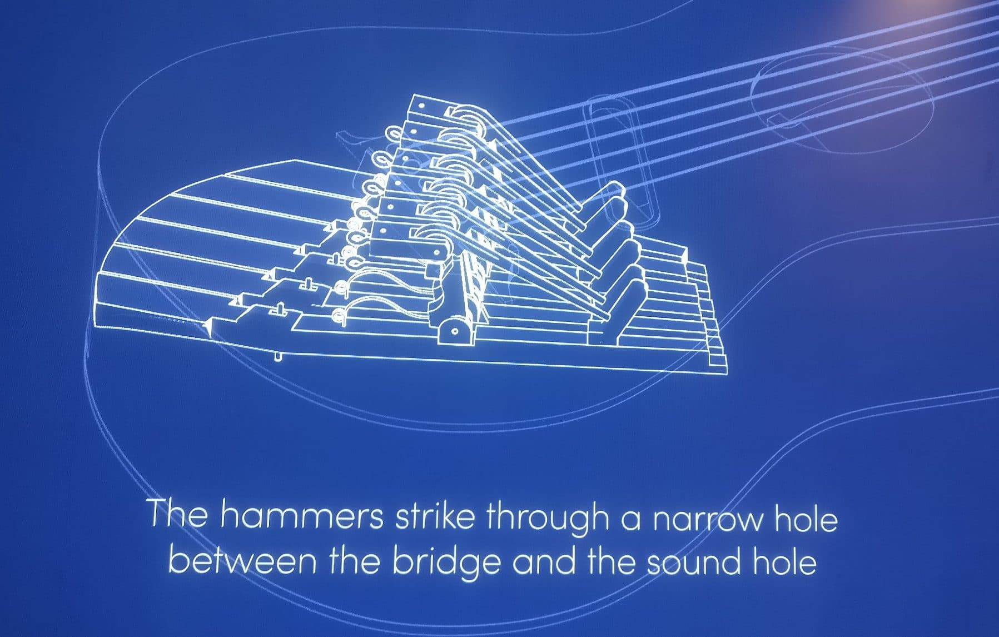

Next up was [Daniel Wheeldon](https://www.eca.ed.ac.uk/profile/daniel-wheeldon), who showed some interesting applications of 3D technology (via AHRC funding at Edinburgh University) to enable him to reproduce elements of musical instruments. He effectively argued that nothing is lost via the incorporation of new and disruptive technologies into traditional processes and likened it to having a bespoke workforce at his and makers' disposal. Daniel showed some slick animations of the various musical instruments he had worked on and explained well about the research he was doing. I had a good chat with Daniel during the break, when he showed me his brass cast fittings, which were very impressively machined and finished.

### Hearing Scotland's history

Following on from Daniel's academic talk, was [Rod Selfridge](https://twitter.com/rodselfridge) and [James Cook](https://www.eca.ed.ac.uk/profile/dr-james-cook) talking about their work with buildings, sound, acoustics, VR and XR. I enjoyed this paper as it mixed the technical side very well with the academic investigation. Again, well presented, with interesting graphics and delivery. Rod introduced us to some of the software that he used for directional sound &#8211; for example Google's [Resonance Audio](https://developers.google.com/resonance-audio/).

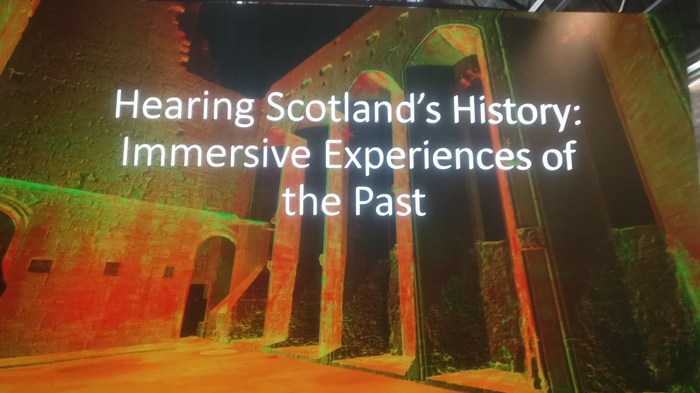

### A lengthy challenge

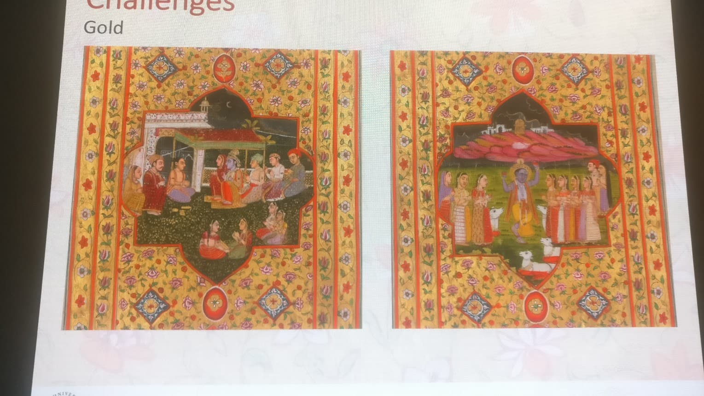

Following Rod and James, the next speakers were Susan Pettigrew & Scott Renton (Digital Imaging Unit, Library and University Collections, University of Edinburgh) who spoke about the immense challenges of digitising the [Mahābhārata](https://images.is.ed.ac.uk/luna/servlet/UoE~3~3) scroll in their collection. This amazing work is 72 metres long and only 13.5 cm wide (I think) and has been imaged and then displayed for viewing via the use of IIIF (this was the second mention of this collaborative project on the first day.) This was a good practical paper and gave lots of novel insight into how they dealt with the issues of specularity, movement, focus and finally image stitching (manual, not automated via Python or other language, but Susan and Scott said they would like this in future.) We then had some demos of the IIIF interface in action, brilliant stuff. Before long, if your institution is not using this protocol you'll be the odd one out.

### The Cheviot model digital reproduction

We then were given a treat of a paper by [Clara Molina-Sanchez](http://@CMolinaSanchez)and Shona Hunter about the challenges, joys and achievements that went into making a digital derivation of John Byrne's Cheviot model book from the National Library of Scotland which has gone on display at the new V&A Dundee.

<blockquote class="blockquote">
  

    Technology should serve heritage and not the other way around
  

  <cite>Shona Hunter</cite>
</blockquote>

This amazing work of art posed a variety of challenges for Clara's [Spectrum Heritage](https://spectrumheritage.com/) team and the curators. Huge cardboard pages, issues with access and timing and equipment were all eloquently discussed and presented by the paper's authors. What a triumph of endeavour this was. The [fabulous 3D models](https://sketchfab.com/natlibscot/collections/the-cheviot-the-stag-and-the-black-black-oil) are now all available on the Sketchfab platform with accompanying information on the process on [Spectrum Heritage's website.](https://spectrumheritage.com/cheviot-book/)<figure></figure>

### Is it real?

We then an interesting paper from [Camilla Perondi](https://twitter.com/sbabilla) from [Memooria](http://www.memooria.org/), an Italian company, who talked about &#8220;Is it real? defining digitisation workflow for a reliable colour and shape reproduction of polychrome flat-like surfaces&#8221;. Camilla had some nice graphical slides, the unicorn, the explosion, a pipeline and multiple shots of great automated kit which reminded me very much of the automation of Google Art Camera.

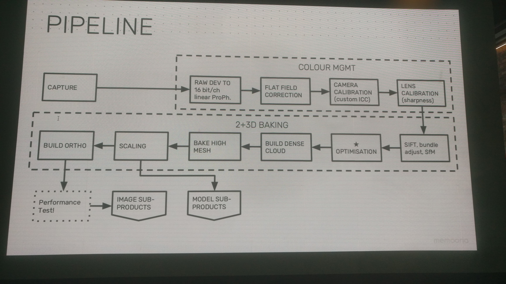

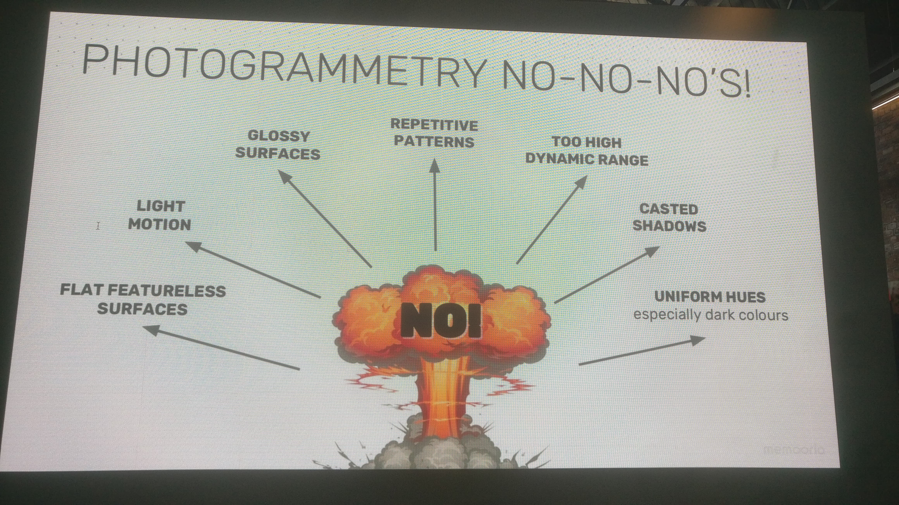

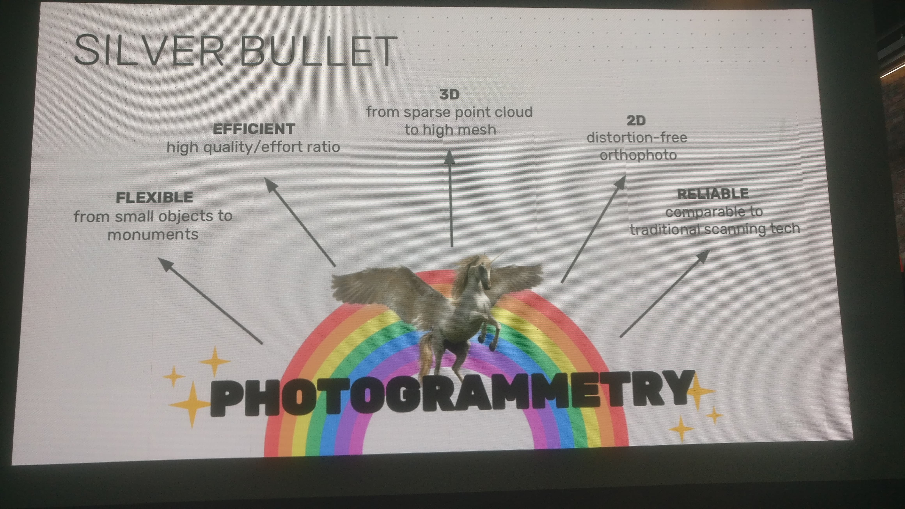

### Emerging digitisation

We then were treated to Scott McGibbon from Heriot-Watt University who spoke about &#8216;Emerging digitisation trends for historic building repair and maintenance projects in Scotland'. I had to switch off for a bit in this paper to answer some work emails (my profuse apologies).

<blockquote class="twitter-tweet" data-width="500" data-dnt="true">
  

    Scott McGibbons <a href="https://twitter.com/HeriotWattUni?ref_src=twsrc%5Etfw">@HeriotWattUni</a> using digital technologies for training and recruiting purposes in the construction industry. Really interesting way of engaging people that are not familiar with the industry. <a href="https://twitter.com/hashtag/DigiDoc2018?src=hash&ref_src=twsrc%5Etfw">#DigiDoc2018</a>
  
&mdash; Clara Molina Sanchez (@CMolinaSanchez)
  <a href="https://twitter.com/CMolinaSanchez/status/1049978764304764929?ref_src=twsrc%5Etfw">October 10, 2018</a>
</blockquote>

### Reading the ruins

<blockquote class="twitter-tweet" data-width="500" data-dnt="true">
  
So much passion coming through from today’s <a href="https://twitter.com/hashtag/DigiDoc2018?src=hash&ref_src=twsrc%5Etfw">#DigiDoc2018</a> speakers. Very clear that our <a href="https://twitter.com/hashtag/digitalheritage?src=hash&ref_src=twsrc%5Etfw">#digitalheritage</a> sector loves what they do! Matt Ritchie <a href="https://twitter.com/fcscotland?ref_src=twsrc%5Etfw">@fcscotland</a> talking now on use of digital tech to better understand brochs <a href="https://t.co/7ms6mehZWm">pic.twitter.com/7ms6mehZWm</a>
&mdash; Scottish 3D (@Scottish3D)
  <a href="https://twitter.com/Scottish3D/status/1049981197286281217?ref_src=twsrc%5Etfw">October 10, 2018</a>
</blockquote>

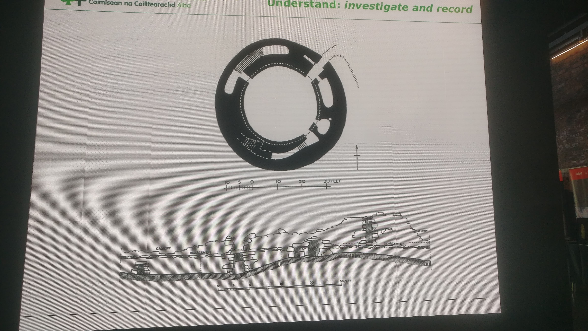

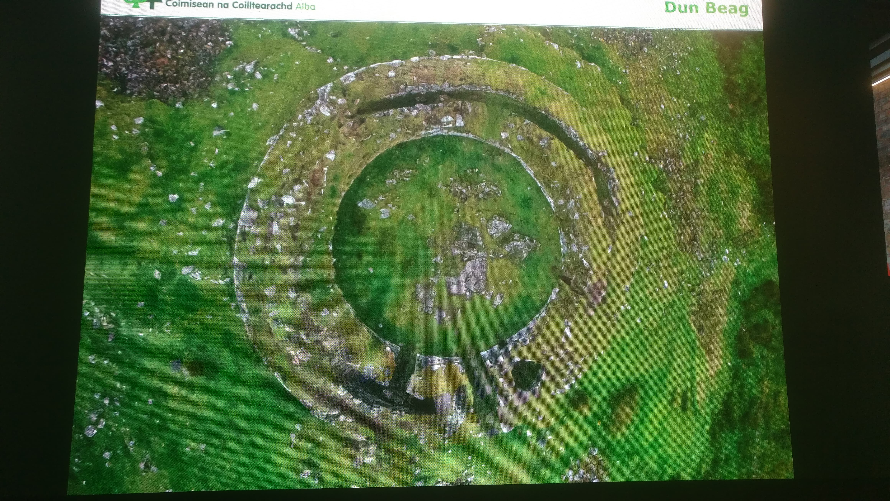

Following Scott, was one of my favourite papers of the day. Matthew Ritchie(Forestry Commission Scotland) who spoke about the consolidation of the broch of Caisteal Grugaig. He styled this as a **love letter** to a structure and I felt this worked very well. Look up this site and there's various great resources to read. Matthew really brought his passion to life and also the use of archives and current work concurrently.

### A digital future for the assets of our past

The final paper before lunch was my new friend [Joann Russell](https://twitter.com/joannrussellarc) (Historic Environment Scotland) who gave an overview of all the digital potential for assets that HES are capturing. I felt like this paper was giving a massive overview of what the HE sector south of the border could be doing if it invested heavily in the future. Joann talked about the challenges they face with all this amazing digital documentation, the workflows this generates and best practise as defined by them.

<blockquote class="twitter-tweet">
.<a href="https://twitter.com/JoannRussellArc?ref_src=twsrc%5Etfw">@JoannRussellArc</a>: The challenges of digi documentation is about CHANGE with 3 challenges: bring the people with you, change processes &amp; works flows, keep pace and master technology <a href="https://twitter.com/hashtag/DigiDoc2018?src=hash&amp;ref_src=twsrc%5Etfw">#DigiDoc2018</a> <a href="https://t.co/7a8IMe6ljE">https://t.co/7a8IMe6ljE</a>
&mdash; Maria Economou (@MariaEcoGl) <a href="https://twitter.com/MariaEcoGl/status/1049988373648162816?ref_src=twsrc%5Etfw">October 10, 2018</a></blockquote> 

**Lunch came and went, friends were made etc etc**

### From portencross to the palace

Following an excellent lunch, we were then treated to the king of Blender, with [Bob Marshall](https://bobmarshall.co.uk/) speaking about his work for the [Royal Collection](https://www.rct.uk/). His slide deck showed off the magic he creates from first sketch to fully fledged reconstruction. A truly talented man, I cannot say anything but wow to his work. Bob showed reconstructions of [Windsor Castle](https://bobmarshall.co.uk/portfolio/illustrations/windsorcastle.asp) through the key stages of its development and the way that rendering gave flesh to the reconstructions. Pain staking work!

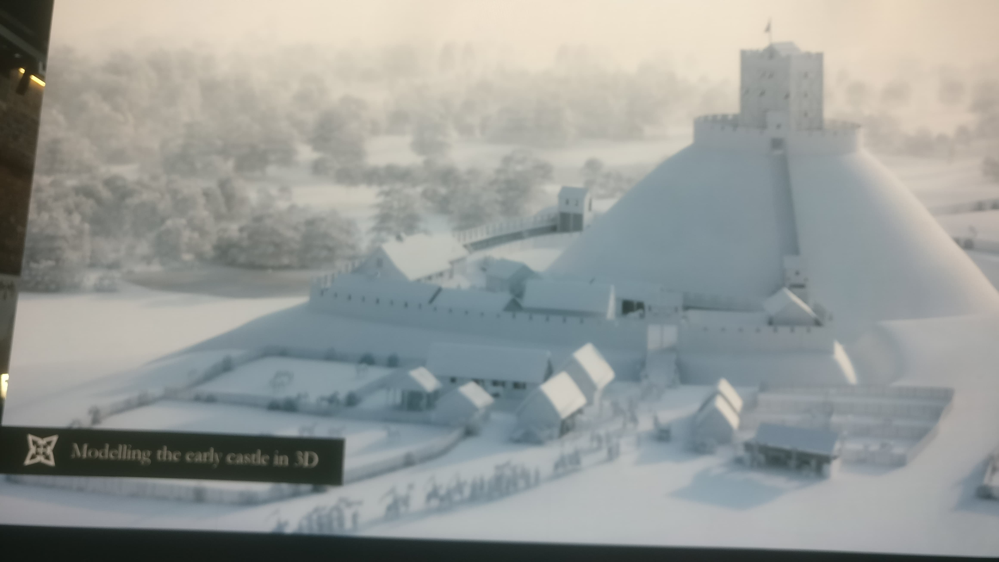

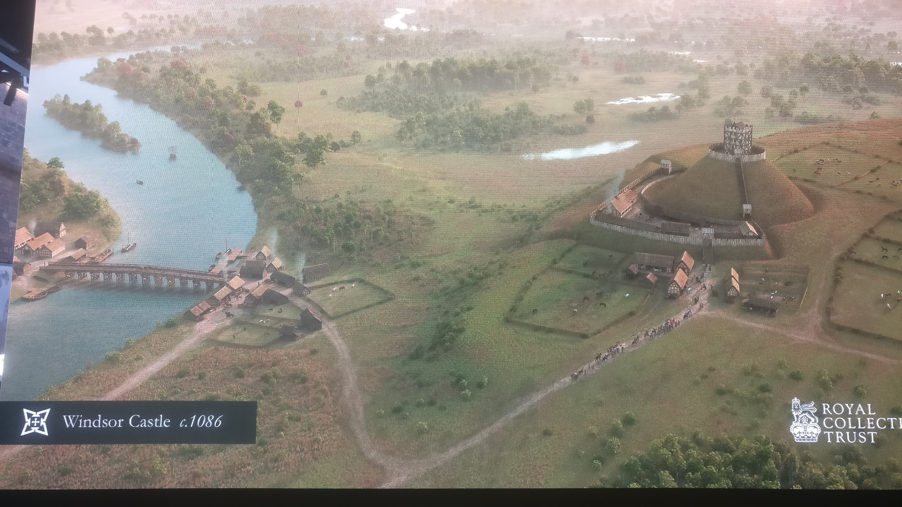

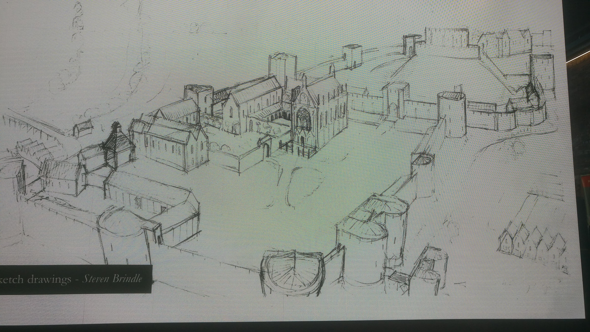

### Dynamic digital worlds

The next paper, by Marcus Abbott ([The JESSOP Consultancy](http://www.thejessopconsultancy.co.uk/our-team/)) was another practically minded tour de force of how he created the amazing digital resources around the mesolithic site of Star Carr (currently a great display at the [Museum of Archaeology and Anthropology](http://maa.cam.ac.uk/) at Cambridge &#8211; go check it out.) Marcus showed us how he created elements &#8211; water, trees etc and tied them into his reconstruction of landscape. Phenomenological genius&#8230;. QR codes in print? Top quality work and archaeology. Go see it at the MAA.

  <blockquote class="twitter-tweet" data-width="500" data-dnt="true">
    

      And finally the plug for <a href="https://twitter.com/MAACambridge?ref_src=twsrc%5Etfw">@MAACambridge</a> go see it and the 3d prints from <a href="https://twitter.com/ThinkSee3D?ref_src=twsrc%5Etfw">@ThinkSee3D</a> <a href="https://t.co/03aXikWwOr">pic.twitter.com/03aXikWwOr</a>
    
&mdash; Daniel Pett (@DEJPett)
    <a href="https://twitter.com/DEJPett/status/1050010245815304192?ref_src=twsrc%5Etfw">October 10, 2018</a>
  </blockquote>

### Digital testing of historical theories

Digidoc then had one of it's speakers from outside the UK, with Professor Chris Landorf from Brisbane, who spoke about work around the : the windmill tower. This was an intriguing talk, and had lots of content to think about. Experimental archaeology, VR, forced labour, prisoners and lack of wind.

<blockquote class="twitter-tweet">
    

      What do you do with a windmill in a place with no wind? In early European settlement of Brisbane, you could just add a treadmill for convicts! Chris Landorf gives a great insight into early colonial Australia <a href="https://twitter.com/hashtag/DigiDoc2018?src=hash&ref_src=twsrc%5Etfw">#DigiDoc2018</a> <a href="https://t.co/0Kvpe0ypt6">pic.twitter.com/0Kvpe0ypt6</a>
    
&mdash; Susan Pettigrew (@pettigrew_s)
    <a href="https://twitter.com/pettigrew_s/status/1050016939072983040?ref_src=twsrc%5Etfw">October 10, 2018</a>
</blockquote>

I lost track of this talk slightly as work email distracted me, so I am sorry I cannot do this one any justice. One of the key things I do remember that came out of this talk was:

<blockquote>
  

    We have seen a fall in interest in heritage amongst our architecture students. Could the use of digital technology help reignite the passion to interact with it?
  

  <cite>Professor Chris Landorf</cite>
</blockquote>

### Authenticity vs fiction in cultural heritage digital storytelling

We now had a case study of the Hunterian Museum’s Antonine wall EMOTIVE experiences from my good friends at theUniversity of Glasgow,Dr Maria Economou & Dr Hilary Young (who unfortunately could not come.)

I was lucky enough to try this experience out for myself in Glasgow the week before, when I dropped in unannounced on their user testing in gallery. The EMOTIVE team used a definition of a continuous exhibition space &#8211; online and on site. Keeping a cohesive overview going. The idea was to use the Antonine Wall gallery to create an emotional attachment to the experience they offered. In this project, an in-gallery app was tested with the tale of Ebutius, with limited agency of choice in the steps you took, whilst offering NFC/RFID interactions with loaned smartphones (no public WIFI like most University Museums &#8211; JANET regs) stops the BYOD experience.

This concept of capturing the emotional experience is an interesting facet. I look forward to the write ups.

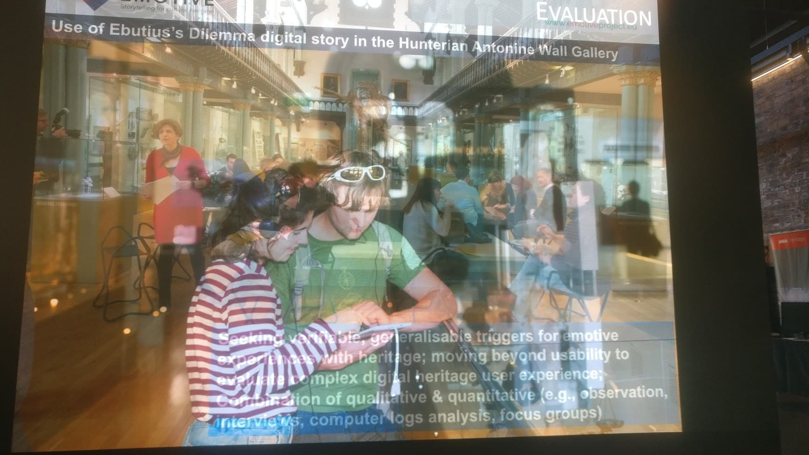

### New visualisation technologies for historic assets, heritage institutions & cultural audience engagement  

Next up was Fergus Bruce ([Soluis Group](https://www.soluis.com/heritage/)), a company with which I and colleagues have had a relationship going back a couple of years now. This talk featured the work they have done on various British Museum DH activity &#8211; the Bronze Age round house, African Rock Art VR, the Amaravati installation (they showed me up a rickety ladder with no H&S equipment for instance &#8211; the things I do for friends, hey [Tess](https://twitter.com/TesstingTimes).)

Fergus also gave us background on their company, potential for the future and featured Simon Kaner's Global British Perspectives (amazing how much of their work has also had Jennifer Wexler's involvement.)

  <blockquote class="twitter-tweet" data-width="500" data-dnt="true">
    

      Here's me up a rickety ladder and <a href="https://twitter.com/AmeliaKnowlson?ref_src=twsrc%5Etfw">@AmeliaKnowlson</a> with her artec. This failed through the glass, whereas photogrammetry worked. All these models are on <a href="https://twitter.com/Sketchfab?ref_src=twsrc%5Etfw">@Sketchfab</a> on <a href="https://twitter.com/britishmuseum?ref_src=twsrc%5Etfw">@britishmuseum</a> account. These models were made at short notice and are perhaps not best practice. Heights, meh. <a href="https://t.co/C9Y4vU0ckI">pic.twitter.com/C9Y4vU0ckI</a>
    
&mdash; Daniel Pett (@DEJPett)
    <a href="https://twitter.com/DEJPett/status/1050030509122830336?ref_src=twsrc%5Etfw">October 10, 2018</a>
  </blockquote>

We were also treated to a picture of most bonkers VR headset ever&#8230;

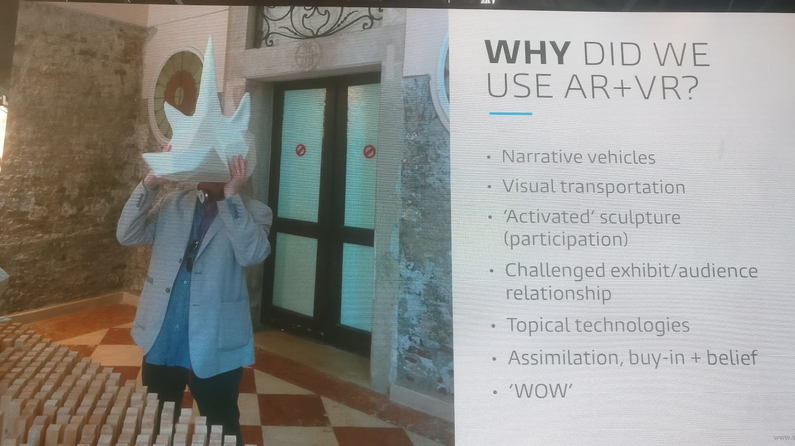

### Letting heritage structures talk through photogrammetry

Hamish Harvey (Bill Harvey Associates Limited) now spoke about his love for bridges (shared with his father) and talked passionately about Pontypryidd's, photogrammetry, their extensive use of Capturing Reality and what they had managed to achieve. I won't say much about this, but Lyn can in her tweet below.

  <blockquote class="twitter-tweet" data-width="500" data-dnt="true">
    

      Bridges! We have a bit of a weakness for them, so great to see <a href="https://twitter.com/hamishharvey?ref_src=twsrc%5Etfw">@hamishharvey</a> presentation on bridge photogrammetry at <a href="https://twitter.com/hashtag/DigiDoc2018?src=hash&ref_src=twsrc%5Etfw">#DigiDoc2018</a> So many camera rigs too 😍 <a href="https://t.co/Y0Lq3QgBic">pic.twitter.com/Y0Lq3QgBic</a>
    
&mdash; Scottish 3D (@Scottish3D)
    <a href="https://twitter.com/Scottish3D/status/1050033599037222912?ref_src=twsrc%5Etfw">October 10, 2018</a>
  </blockquote>

Albert Sierra also captured this great video:

  <blockquote class="twitter-tweet" data-width="500" data-dnt="true">
    

      <a href="https://twitter.com/hamishharvey?ref_src=twsrc%5Etfw">@hamishharvey</a> demostrant el que es pot fer amb un model fotogramètric ultra detallat d’un edifici: trobar angles en una volta inaccessible. <a href="https://twitter.com/hashtag/DigiDoc2018?src=hash&ref_src=twsrc%5Etfw">#DigiDoc2018</a> <a href="https://t.co/e4YBcmoAt8">pic.twitter.com/e4YBcmoAt8</a>
    
&mdash; Albert Sierra (@albertsierra_re)
    <a href="https://twitter.com/albertsierra_re/status/1050036413587234818?ref_src=twsrc%5Etfw">October 10, 2018</a>
  </blockquote>

### The archaeoptics archive

As we headed towards the end of the first day, we were then presented to by Alistair Carty (Replicade LTD) who has been involved with 3D in heritage for many years. He ran through the archive of work that he and colleagues have generated over time and posed serious questions. They have a vast data set, what do they do with it, where do you store it, how do you make it accessible.

  <blockquote class="twitter-tweet" data-width="500" data-dnt="true">
    

      Now on <a href="https://twitter.com/hashtag/DigiDoc2018?src=hash&ref_src=twsrc%5Etfw">#DigiDoc2018</a> Alistair Carty <a href="https://twitter.com/archaeoptics3d?ref_src=twsrc%5Etfw">@archaeoptics3d</a> &#8211; a journey into the history of <a href="https://twitter.com/hashtag/3D?src=hash&ref_src=twsrc%5Etfw">#3D</a> &#8211; groundbreaking high res data capture & coding undertaken in early 2000’s &#8211; still looks fab today <a href="https://t.co/AZVSM4FNGC">pic.twitter.com/AZVSM4FNGC</a>
    
&mdash; Scottish 3D (@Scottish3D)
    <a href="https://twitter.com/Scottish3D/status/1050037765491052544?ref_src=twsrc%5Etfw">October 10, 2018</a>
  </blockquote>

### Getting the measure of brochs

Following Alistair's passionate talk, we were given a treat by Li Sou (University of Bradford, Historic Environment Scotland) who was presenting her PhD work on investigating Shetland’s Iron Age archaeology with digital documentation and historic survey records. I really enjoyed this as she used 2D archive records to compare with modern 3D captures and renderings. I took some pictures of the brochs she talked about in this paper, but I haven't downloaded them yet, so for now you can have another tweet to highlight her work.

  <blockquote class="twitter-tweet" data-width="500" data-dnt="true">
    

      Our <a href="https://twitter.com/hashtag/PhD?src=hash&ref_src=twsrc%5Etfw">#PhD</a> student <a href="https://twitter.com/LZSou?ref_src=twsrc%5Etfw">@LZSou</a> presenting an update on her digital research on Shetland’s brochs &#8211; reuse of old 2D data to compare with new 3D laser scans <a href="https://twitter.com/hashtag/DigiDoc2018?src=hash&ref_src=twsrc%5Etfw">#DigiDoc2018</a> <a href="https://t.co/q8XU61uYRE">pic.twitter.com/q8XU61uYRE</a>
    
&mdash; Scottish 3D (@Scottish3D)
    <a href="https://twitter.com/Scottish3D/status/1050043438023012352?ref_src=twsrc%5Etfw">October 10, 2018</a>
  </blockquote>

### Integrated 3D data management in commercial archaeology

The last talk for the first day was from Rafael Maya Torcelly (Headland Archaeology). My phone battery and laptop went flat by this point, so my notes on this talk are non-existent. The key takeaway from Rafael's talk for me was:

<blockquote class="blockquote">
  

    &#8220;We adopt any tech advance we determine is helpful after thoroughly testing it in the field.&#8221; This is where archaeology excels.
  

</blockquote>

### The Lyn and Al show

To close the day down, we then had Lyn Wilson and Al Rawlinson gave an overview of what the fantastic team are doing, will be doing and a summation of the day.

  <blockquote class="twitter-tweet" data-width="500" data-dnt="true">
    

      Awesome time at DigiDoc Research and Innovation event. Very enlightening hearing about the latest research in the digital heritage field <a href="https://twitter.com/HESEngineShed?ref_src=twsrc%5Etfw">@HESEngineShed</a> <a href="https://twitter.com/hashtag/Inspired?src=hash&ref_src=twsrc%5Etfw">#Inspired</a> <a href="https://twitter.com/hashtag/DigiDoc2018?src=hash&ref_src=twsrc%5Etfw">#DigiDoc2018</a> <a href="https://twitter.com/hashtag/HESDigiFest?src=hash&ref_src=twsrc%5Etfw">#HESDigiFest</a> <a href="https://twitter.com/hashtag/EngineShed?src=hash&ref_src=twsrc%5Etfw">#EngineShed</a> <a href="https://twitter.com/hashtag/Stirling?src=hash&ref_src=twsrc%5Etfw">#Stirling</a> <a href="https://twitter.com/hashtag/HES?src=hash&ref_src=twsrc%5Etfw">#HES</a> <a href="https://twitter.com/hashtag/HistoricEnvironmentScotland?src=hash&ref_src=twsrc%5Etfw">#HistoricEnvironmentScotland</a> <a href="https://twitter.com/hashtag/Digital?src=hash&ref_src=twsrc%5Etfw">#Digital</a> <a href="https://twitter.com/hashtag/Heritage?src=hash&ref_src=twsrc%5Etfw">#Heritage</a> <a href="https://twitter.com/hashtag/3DPrinting?src=hash&ref_src=twsrc%5Etfw">#3DPrinting</a> <a href="https://t.co/J6OIsHio56">pic.twitter.com/J6OIsHio56</a>
    
&mdash; Alice Martin (@alicecmartin)
    <a href="https://twitter.com/alicecmartin/status/1050099039549775872?ref_src=twsrc%5Etfw">October 10, 2018</a>
  </blockquote>

That was the end of Research and Innovation day, which was then capped by a reception in the brilliant Engine Shed facility and a conference speaker's dinner and late night network building in Hotel Colessio bar.

### Digifest Day 1

The second day of Stirling's digital adventures started after a night in the bar with Leica and Joann Russell. There were a few heavy heads, but lots of new friends had been made and connections created. On with the show. This was opened by David Mitchell and I thought this slide is all you need:

  <blockquote class="twitter-tweet" data-width="500" data-dnt="true">
    

      The vision of HES explained by <a href="https://twitter.com/DSM888?ref_src=twsrc%5Etfw">@DSM888</a> digital as integral, embedded, not special. Lots of organisations are starting to say this, are they achieving this? <a href="https://twitter.com/hashtag/DigiDoc2018?src=hash&ref_src=twsrc%5Etfw">#DigiDoc2018</a> <a href="https://t.co/TLJ7dr5jcS">pic.twitter.com/TLJ7dr5jcS</a>
    
&mdash; Daniel Pett (@DEJPett)
    <a href="https://twitter.com/DEJPett/status/1050303610389782529?ref_src=twsrc%5Etfw">October 11, 2018</a>
    </blockquote>   

### Instruments of creation

The keynote for day 1 was Mario Klingemann artist-in-residence at Google and former BL labs prize winner. Now was this a talk to blow your mind, oh yes, mind blown. GANs etc, the territory that Shawn Graham loves.

<blockquote class="blockquote">
  

    Machine learning was invented to turn cats into data
  

  <cite><a href="https://twitter.com/quasimondo">@quasimondo</a></cite>
</blockquote>

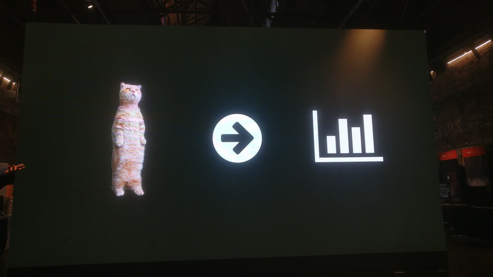

Can he draw cats using AI, hell has frozen over. Yes he can. Can he make new works of art from the Google Cultural Institute catalogue, yes he can. He also showed AI driven music videos, with the Beastie Boys Sabotage reinvented. Way out.

<blockquote class="twitter-tweet" data-width="500" data-dnt="true">
    

      Fantastic way to start the day. <a href="https://twitter.com/quasimondo?ref_src=twsrc%5Etfw">@quasimondo</a> presentation has not left anyone in the audience indifferent. Inspiring, provoking&#8230; basically mind-blowing! 🤯 <a href="https://twitter.com/hashtag/DigiDoc2018?src=hash&ref_src=twsrc%5Etfw">#DigiDoc2018</a> <a href="https://t.co/c4Pfy13tWU">pic.twitter.com/c4Pfy13tWU</a>
    
&mdash; Clara Molina Sanchez (@CMolinaSanchez)
<a href="https://twitter.com/CMolinaSanchez/status/1050315174001946625?ref_src=twsrc%5Etfw">October 11, 2018</a>
</blockquote>

### Mixing it up: photogrammetry/lightfields, living/ built heritage, 3DOF/6DOF VR

Following on from the magic code of Mario, we were then shown more Google-ness from Greg Downing (X-Rez Studios), who has been doing work with them for a while.

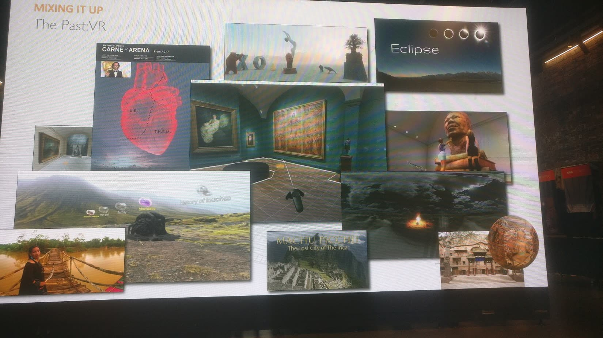

<blockquote class="twitter-tweet" data-width="500" data-dnt="true">
  

    Amazing VR museum concepts by Greg Downing <a href="https://twitter.com/hashtag/DigiDoc2018?src=hash&ref_src=twsrc%5Etfw">#DigiDoc2018</a> Now looking at lightfields and photogrammetry. <a href="https://t.co/diaQEBj6iL">pic.twitter.com/diaQEBj6iL</a>
  
&mdash; ALApp (@RomanLimesApps)
  <a href="https://twitter.com/RomanLimesApps/status/1050319527974752257?ref_src=twsrc%5Etfw">October 11, 2018</a>
</blockquote>

He showed some fantastic technology, that unfortunately is not available to everyone yet &#8211; Lightfield &#8211; and how his team and colleagues have managed to capture high res VR content for prestigious institutions.

<blockquote class="twitter-tweet" data-width="500" data-dnt="true">
  

    Lightfield is a dense array of images est. in the 90s capturing volume inside the cameras via lightray capture VR has opened up its potential <a href="https://twitter.com/hashtag/DigiDoc2018?src=hash&ref_src=twsrc%5Etfw">#DigiDoc2018</a> <a href="https://t.co/S2vETHNIvk">pic.twitter.com/S2vETHNIvk</a>
  
&mdash; Sally King (@SKing_Botanics)
  <a href="https://twitter.com/SKing_Botanics/status/1050319894292631552?ref_src=twsrc%5Etfw">October 11, 2018</a>
</blockquote>

_The DIGIDOC crowd were then lumbered with my ham-fisted attempt to chair the next two papers, which I had great pleasure to introduce. (I am glad I didn't have to speak today, serious imposter syndrome would have kicked in with the quality on display.)_

### On the verge of 3D-mass digitisation

I firstly introduced Pedro Santos (Fraunhofer Institute), who spoke with great technical authority on the automated processes to capture 3D data at scale in the museum environment (caveat that this needs expensive kit and lots of room &#8211; we couldn't do this in Cambridge at present.) Pedro showed the roots of the work he and colleagues did via Co-Form and how this has now progressed to conveyer belts, automated arms (CULTARM) and arcs and very little post processing. The twitter stream that you can find a download of above has lots more information to gather and learn from. No, it wasn't the real bust of Nefertiti on the belt either&#8230;

<blockquote class="twitter-tweet" data-width="500" data-dnt="true">
  

    The automated digitisation pipeline at <a href="https://twitter.com/Fraunhofer_IGD?ref_src=twsrc%5Etfw">@Fraunhofer_IGD</a> is mind blowing&#8230;though I'm disappointed that I couldn't find a Generation Game conveyer belt gif to accentuate this tweet <a href="https://twitter.com/hashtag/DigiDoc2018?src=hash&ref_src=twsrc%5Etfw">#DigiDoc2018</a> <a href="https://t.co/cRbrJKCYH8">pic.twitter.com/cRbrJKCYH8</a>
  
&mdash; Kelly Forbes (@Macfack)
  <a href="https://twitter.com/Macfack/status/1050333704713854976?ref_src=twsrc%5Etfw">October 11, 2018</a>
</blockquote>

### Smithsonian open source 3D pipeline

I then had the honour of introducing Vince Rossi from the Smithsonian who gave us a full on tour of their integrated 3D digitisation programme. I've been a fan of their work for a while now, and it was really interesting to see the pipelines, LEAN project methodology, software and processes they are working on and how this will become open source and [beta testing](https://docs.google.com/forms/d/1jdJxawnAK9u03nrV8KRzUEmg5u-Hzsh8euUC7uoAmh8/viewform?edit_requested=true) in Spring 2019. Vince also showed their massive metadata model (not sure if this is published anywhere, but they do contribute to C3DSP).

<blockquote class="twitter-tweet" data-width="500" data-dnt="true">
  

    'Insects to airplanes to spaceships&#8230;and everything in between' (!!) Vince Rossi and his team <a href="https://twitter.com/3D_Digi_SI?ref_src=twsrc%5Etfw">@3D_Digi_SI</a> taking on the vast challenge of digitizing the <a href="https://twitter.com/hashtag/Smithsonian?src=hash&ref_src=twsrc%5Etfw">#Smithsonian</a> collections! <a href="https://twitter.com/HESEngineShed?ref_src=twsrc%5Etfw">@HESEngineShed</a> <a href="https://twitter.com/hashtag/DigiDoc2018?src=hash&ref_src=twsrc%5Etfw">#DigiDoc2018</a>
  
&mdash; Sophia Mirashrafi (@ssmirash)
  <a href="https://twitter.com/ssmirash/status/1050340255776288769?ref_src=twsrc%5Etfw">October 11, 2018</a>
</blockquote>

I absolutely loved the mammoth remix manga cartoon that Vince showed and how they encouraged reuse (though not using fully fledged CC licenses).

### Reality made digital and how the film industry make digital look like reality

Next up was a high impact tour of the film world, with Steven Ramsey (4D Max) running through the tech you don't see, that goes into making the blockbuster amazing. Iron Man's costume, the car chase in Luc Besson's Lucy.

Computer generated wizardry. 5GB/s data production, your worst nightmare in data storage land in cultural heritage.

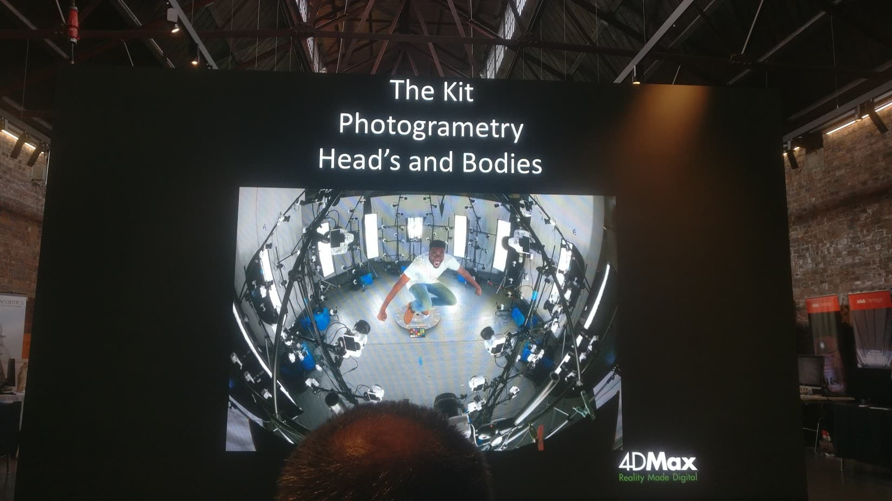

### History in your hand: how we made BBC civilisations AR

<blockquote class="twitter-tweet" data-width="500" data-dnt="true">
  

    Claire Spencer Cook of <a href="https://twitter.com/nexusstories?ref_src=twsrc%5Etfw">@nexusstories</a> on the BBC civilisations app.  On starting the project first question was ‘Who Is It For?’   👍👍👍👍👍👍👍👍<a href="https://twitter.com/hashtag/digidoc2018?src=hash&ref_src=twsrc%5Etfw">#digidoc2018</a> <a href="https://twitter.com/HESEngineShed?ref_src=twsrc%5Etfw">@HESEngineShed</a> <a href="https://t.co/HJQhSNXrgH">pic.twitter.com/HJQhSNXrgH</a>
  
&mdash; Kit Reid (@kitreid1)
  <a href="https://twitter.com/kitreid1/status/1050373646953455616?ref_src=twsrc%5Etfw">October 11, 2018</a>
</blockquote>

We then had Claire Spencer Cook from Nexus Studios, creator of apps for the BBC (Civilisations AR &#8211; which features my scan of the British Museum's Rosetta Stone and could have had more if the Museum's digital steering group had not vetoed) and the Gruffalo trail.

<blockquote class="twitter-tweet" data-width="500" data-dnt="true">
  

    Yesss queen, Claire Spencer Cook talking about projects at <a href="https://twitter.com/nexusstories?ref_src=twsrc%5Etfw">@nexusstories</a> where their work is character led. Also only one of two female speakers today, more please! <a href="https://twitter.com/hashtag/DigiDoc2018?src=hash&ref_src=twsrc%5Etfw">#DigiDoc2018</a> <a href="https://t.co/ct0aJqbmlM">pic.twitter.com/ct0aJqbmlM</a>
  
&mdash; Eleanoir 🕸 MLitt (@eleanor_scope)
  <a href="https://twitter.com/eleanor_scope/status/1050373051815202816?ref_src=twsrc%5Etfw">October 11, 2018</a>
</blockquote>

I really enjoyed Claire's talk as she demonstrated background, story boards, production and the cycle of giving the product life.

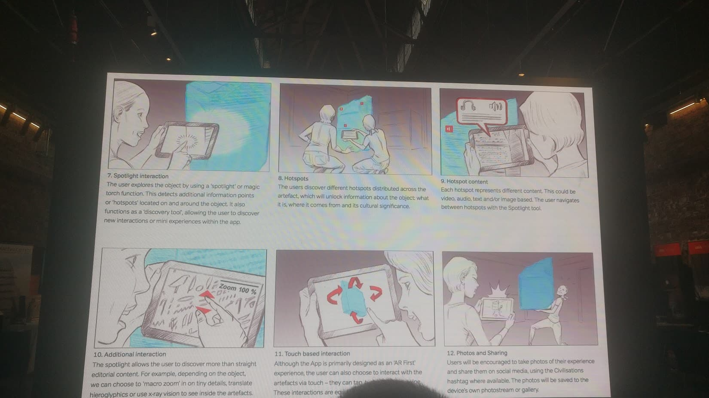

### How can heritage organisations offer VR to visitors?

Then Catherine Allen (Limina Immersive), award winning VR creator extraordinaire (and author of the Digital Catapault report on the state of the use gave her talk about how we could get in on the game. Catharine talked about small scale VR theatre installations, using stand alone headsets and dedicated areas, the material she had worked on and become known for.

<blockquote class="twitter-tweet" data-lang="en">
.<a href="https://twitter.com/_CatherineAllen?ref_src=twsrc%5Etfw">CatherineAllen</a>
: get away from the glowing rectangle by moving from representation to simulation. Visitors can take ownership of the experience: I did that vs. I saw that! <a href="https://twitter.com/hashtag/DigiDoc2018?src=hash&amp;ref_src=twsrc%5Etfw">#DigiDoc2018</a>
&mdash; Charlotte Rixten (@c_rixten) <a href="https://twitter.com/c_rixten/status/1050394510516207616?ref_src=twsrc%5Etfw">October 11, 2018</a></blockquote>

Catharine also gave us an overview of some much needed statistical analysis of the VR industry and told us stories of her discovery of VR. A very engaging speaker. Recommend her if you see her on a programme in future.

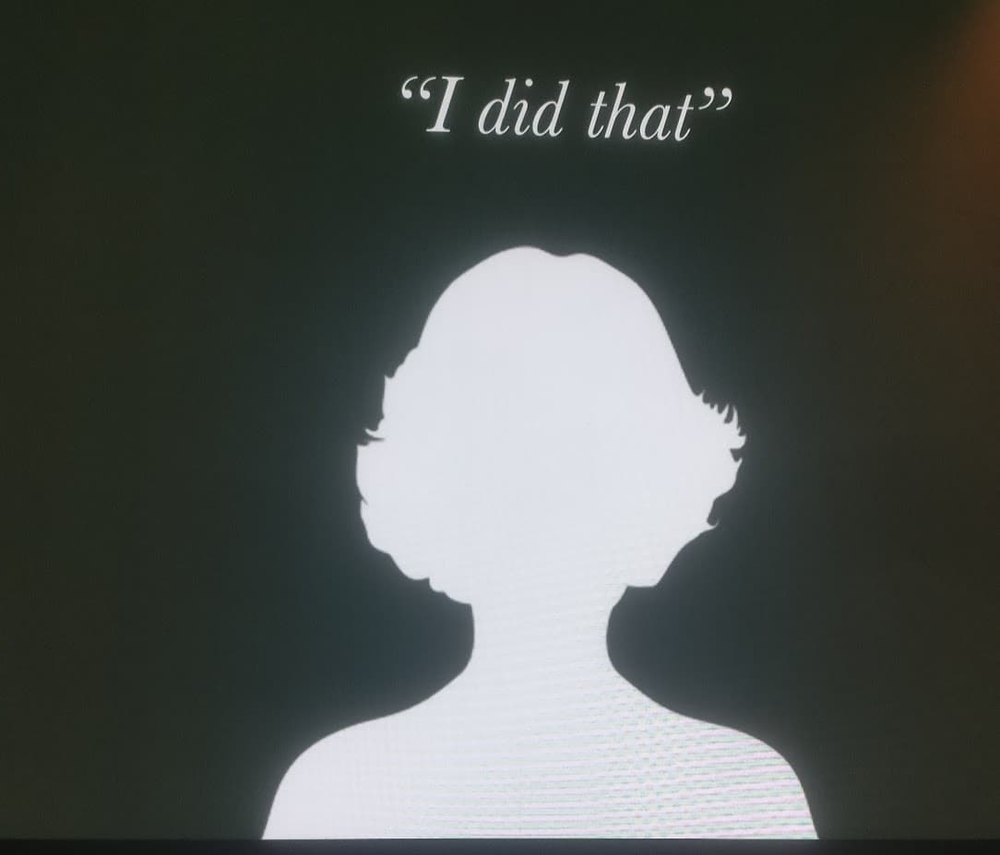

### Immersive environments: enough gimmicks already

Two talks to go and we were assailed by Prof. Paul Chapman (Glasgow School of Art), who gave us another view of the Gartner Hypecycle (see my talk above), pictures of him swimming. Paul's talk was very entertaining and covered much ground. The tweets about this paper are worth checking out in the archive.

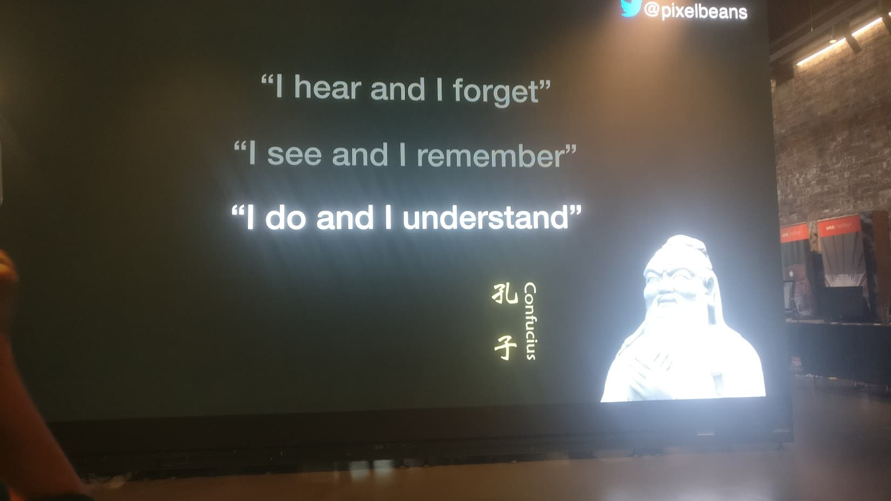

### The art of pointcloud

Then closing paper for the 1st day of Digidoc proper was from Patryk Kizny (Kizny Visuals). He'd been lost in transit and I was on standby to talk, thank you for getting there. He spoke about an aesthetic approach to visualising LiDAR / pointclouds / photogrammetry data with much style and some great visuals, that just showed you what could be achieved. Hats off to your skills.

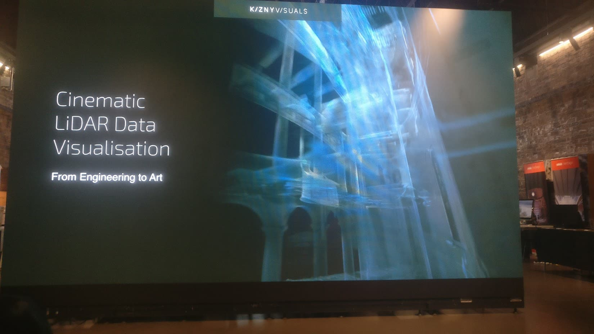

## Closing thoughts

The 2/3 of Digidoc that I attended were amazing, and the ability to vaguely follow on what was happening on Twitter for day 3 was a bonus. Content, graphics, equipment used, goodie bags, displays, people and atmosphere were all top notch. Some interesting questions were raised by participants, eg Rob Cawston below.

<blockquote class="twitter-tweet">
Interesting from Mario Klingemann from Google but... tech can never be *just* a tool. Not sure we can / should depoliticise data, new interactions or cultural output <a href="https://twitter.com/hashtag/digidoc2018?src=hash&amp;ref_src=twsrc%5Etfw">#digidoc2018</a>
&mdash; Rob Cawston (@cawston) <a href="https://twitter.com/cawston/status/1050308983825854464?ref_src=twsrc%5Etfw">October 11, 2018</a></blockquote>  

However I did leave with the thought that the issue of the Digital Divide was not addressed well. There was definitely:

<blockquote class="blockquote">
  

    I have expensive kit and access to funding and resources and we can create wonders type of feeling.
  

  <cite>Dan's paraphrasing 🙂</cite>
</blockquote>

I wondered what those without the same opportunities would leave with, perhaps a feeling of despair. On the first day, I talked about reproducibility of method and access to equality of access to equipment and skills (I know a bit utopian) and I would like to see more emphasis on that. That, and only that, was the one thing that detracted from a most excellent event. Bravo team, bravo!

That, however is the only bad thing I have to say about a splendid event. Fantastic to see a national funded body and local organisation who truly believe in the power of digital allied to all the fantastic speakers and content that was generated.

Go to the next one, you won't be disappointed. And I leave you with this from Soluis Heritage's Fergus &#8230;

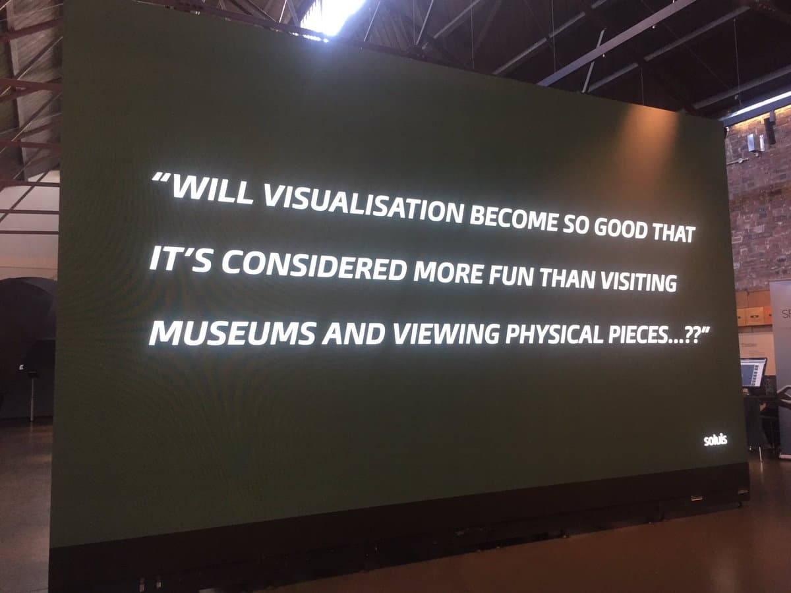

