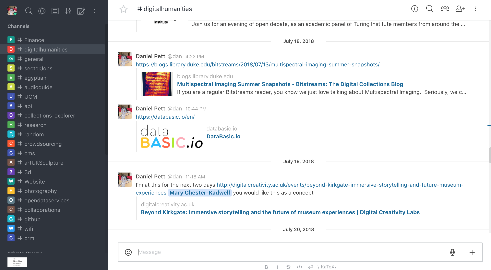
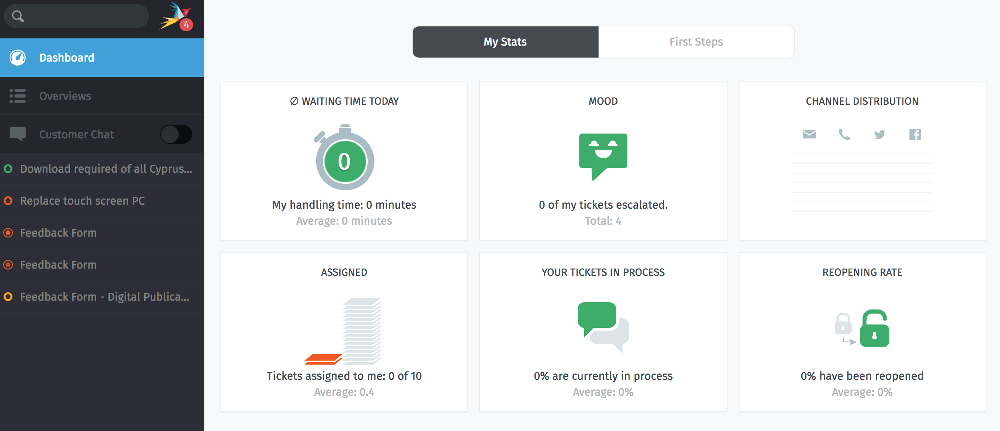

Last week at the Museum Computer Group's conference at the National Gallery, the great Jon Pratty, gave a talk entitled "[Doing us the Power of Good? Ethics, sustainability, and continuing GLAM reliance on Google and Facebook](https://www.slideshare.net/museumscomputergroup/doing-us-the-power-of-good-ethics-sustainability-and-continuing-glam-reliance-on-google-and-facebook?ref=http://www.museumscomputergroup.org.uk/events/museumstech2018/)". This can be seen on the [MCG report](http://www.museumscomputergroup.org.uk/events/museumstech2018/) on that conference alongside all the other high quality pieces that were presented on that day.

Since moving to the [Fitzwilliam Museum](https://fitzmuseum.cam.ac.uk), I have been thinking a bit about becoming reliant on free/freemium and paid for solutions that we have rapidly taken on in the museums sector. In slide 9 of Jon's paper, he spoke about one of the key things we should be worried about; trade in data via these large platforms that we have begun to rely on.

As most people know, money is extremely tight in our field, and the combined fees for various platform alongside the potential risk of them not sticking around (e.g. Google+, GeoCities, Storify, etc.) can lead to data loss/ or strategic goals being missed.

Soon after joining the Fitzwilliam, I set up a Slack channel, as one does, following good experience of using it at the British Museum with team Digital before it all went wrong for that business unit. We merrily started using it, then I got the jitters about how I would fund this tool alongside all the other things (which quite frankly are more important at the moment &#8211; network, storage, equipment, etc). So what alternatives are out there? Well quite a few that you can self-host.

As everyone says, who remembers it, Slack is just ICQ with a nice coat on. I therefore looked at a few of these (for example [Mattermost](https://mattermost.com/)) and gave them a spin on a VM that we set up and finally plumped for [RocketChat](https://rocket.chat/) (which also has an app if you like that sort of thing). This package is pretty easy to set up on Ubuntu, and has auto-updating SNAPs. Maintenance of this has been a couple of minutes a month! We've tied this into our LDAP for the museum and restricted access to the groups we need, and will probably also hide it behind our RAVEN authentication if need be and a Caddy version can be found for the plugin (or we'll proxy behind Apache 2).

However, we didn't stop there. We also had multiple [Trello](https://trello.com/) subscriptions, as you'll find in many places (like you find every department has been paying for Survey Monkey!) So we're currently trialling [WeKan](https://wekan.github.io/) on an Ubuntu snap, running on a Caddy server. We are not heavy users of this software by any means, but we have full control over this package too, which means we only have ourselves to blame if things go wrong.

Following on from this, we also have been looking at open source software for managing IT helpdesk calls. We have been trying out [Zammad](https://zammad.org/) (Ruby, PostGres, Elasticsearch powered) for this business function and have so far found it to be quite good. We're not using any of these packages in anger yet, but we now need to make them work for us and extract their true potential.
