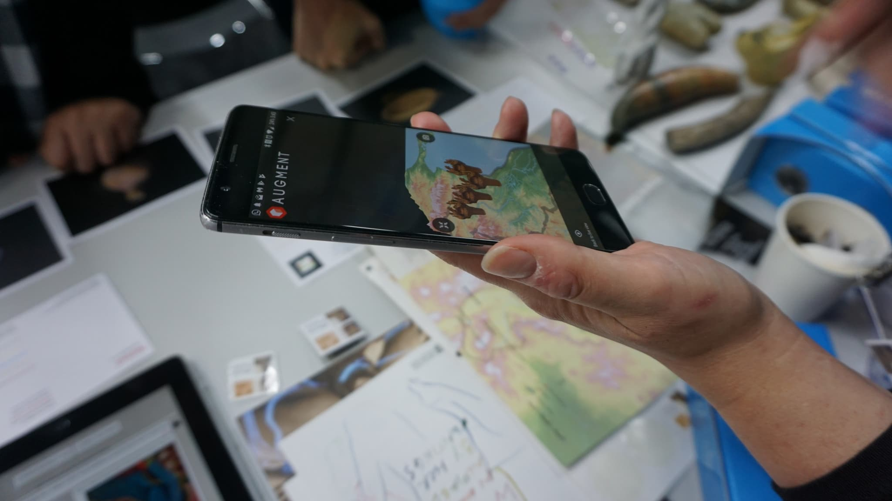
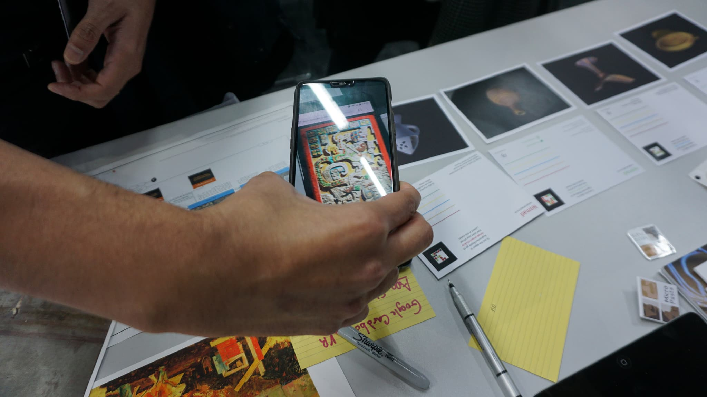

Over the weekend of the 27-28th October 2018 our team took a pop-up museum to [Ravensbourne University](https://www.ravensbourne.ac.uk) in Docklands to feature in the excellent [Mozilla Festival](https://mozillafestival.org/) of the Open Web. 

Our team consisted of museums ([Cambridge University Museums](https://www.museums.cam.ac.uk) represented by the [Fitzwilliam Museum](https://www.fitzmuseum.cam.ac.uk/), the [British Museum](https://britishmuseum.org), the [Victoria and Albert Museum](https://www.vam.ac.uk/), [Slovak National Gallery](https://www.sng.sk/en)), creative industries ([Mnemoscene](https://mnemoscene.io/), [ThinkSee3D](https://www.thinksee3d.com/)), [University of Stirling](https://www.stir.ac.uk/) and [Heritage Lottery Funded](https://www.hlf.org.uk/) projects ([Abira Hussein](https://twitter.com/AbiraHussein)‘s brilliant [Nomad Project](https://nomad-project.co.uk/).)

### What is Mozfest, I hear you ask?

Mozfest is a wonderful event that brings people together from all round the world. The website claims over 2500 people participate over the course of the week:

> MozFest has something for everyone. You’ll find a diverse set of sessions and spaces where you will meet, make, and learn with others. Jump into an interactive session for some hands-on building. Join a small group discussion and debate the most pressing issues facing the Internet today. Or simply wander the festival and take in all the ongoing displays to explore at your own speed. [Why come to Mozfest?](https://mozillafestival.org/why-come-to-mozfest)

Mozfest is truly high energy, highly mind-expanding and very different to any cultural heritage event you might attend. For example, an opening rap (badly filmed by me!)<figure class="wp-block-embed-twitter wp-block-embed is-type-rich is-provider-twitter">

<blockquote class="twitter-tweet" data-lang="en">
<a href="https://twitter.com/hashtag/mozfest?src=hash&amp;ref_src=twsrc%5Etfw">#mozfest</a> opening rap part 1 <a href="https://t.co/1QfR3XYyYG">pic.twitter.com/1QfR3XYyYG</a>
&mdash; Daniel Pett (@DEJPett) <a href="https://twitter.com/DEJPett/status/1056275200252264449?ref_src=twsrc%5Etfw">October 27, 2018</a></blockquote>

### Our attendance record

This was our second foray into the world of Mozfest, after Professor Andrew Prescott suggested I put a session in for the 2017 version (which I did with Jennifer Wexler and [Amelia Knowlson](http://ameliaknowlson.com/)), and this year on behalf of the team, I decided to go for a weekend long session, and we were fortunate to be given a gallery space for the whole weekend &#8211; thank you to Yo and the other space wranglers. We aren't the first pop-up museum to attend, as [George Oates pointed out](https://twitter.com/ukglo/status/1056502154440130560), they took the [Small Museum](https://thesmallmuseum.org/2015/11/14/the-small-museum-v2/) to Mozfest in 2015 &#8211; we're standing on the shoulders of giants there!

### Who were these intrepid museologists and creative wizards?

Originally the team consisted of myself, [Jennifer Wexler](https://twitter.com/JWexlerBM) (BM), [Chiara Bonacchi](https://twitter.com/ChBonacchi) (Stirling) and [Lisa Galvin](https://twitter.com/LisaGalvin_) (V&A), but I was worried we would not have enough to show or bodies to hold the fort. [Steve Dey](https://twitter.com/thinksee3d)and his company ThinkSee3D were first additions to the museum proposal, and for the last 4 -5 years, he has been producing all the prints for our many projects &#8211; MicroPasts, BM, etc. I scoured the [Mozfest](https://mozillafestival.org/) guidebook and asked on Twitter if some people going would like to join us. The generosity of Twitter friends is amazing, and we were joined by [PhiloKemenade](https://twitter.com/phivk) from the [Unfold Collective](http://unfold.is/), [Sophie Dixon](https://twitter.com/SophieDixon1), [Ed Silverton](https://twitter.com/edsilv) and [Abira Hussein](https://twitter.com/AbiraHussein). Our pop-up museum now had a more appealing set of things to talk about, and I am very grateful to them for joining us.

### What did we do?

Our table was set up on the 7th floor of the 9 active floors of Ravensbourne and had a huge array of projects to display (was it too overwhelming, maybe in the space we had?)

* 3D prints from the British Museum, V&A, Oxford's Natural History Museum etc., and all produced by ThinkSee3D &#8211; Steve Dey's magic is getting round the world rapidly. The V&A jug was a wow object.
* The [Iron Age and Roman Identities](http://ancientidentities.org/) Project (Sunday only and led by Chiara) and a discussion of Brexit
* The [Slovak National Gallery](https://sng.sk/)&#8216;s Filla Fulla[chat application](https://fillafulla.sng.sk/) (source code on GitHub) from an exhibition and some high grade reproductions of prints
* Promotional materials from many of the museums
* The [African Rock Art](https://africanrockart.britishmuseum.org) project (Saturday only and led by Jennifer)
* [Project Nomad](https://nomad-project.co.uk/) &#8211; [AR postcards](https://nomad-project.co.uk/ar), their excellent Hololens Mixed Reality experience. **This was the biggest hit of the weekend.**
* SISJAC's [Shinano River](http://sainsbury-institute.org/research/archaeology-and-heritage/shinano-river/) AR leaflets
* [3D digital models](https://sketchfab.com/danielpett/collections/university-of-cambridge-museums) from Cambridge University Museums
* [Sketchfab](https://sketchfab.com)&#8216;s Google Cardboard viewers (kindly donated by Tom Flynn and Alban Denoyl) and AR/VRcontent &#8211; a great draw for the teenagers who visited us who cleaned us out in less than 2 minutes!
* The [Universal Viewer](http://universalviewer.io) demonstrated by Sophie Dixon and Ed Silverton
* Attempt to crowdsource people's views for [Micropasts](https://micropasts.org), of what a museum meant to them

### By products of the pop-up

We were also fortunate to be joined by people who wanted to show their own museum derived creations. For example,[Roy Rodenhaeuser](https://twitter.com/RoyRodenhaeuser) and [Eleonora Bacchi](https://twitter.com/EleonoraBacchi) of [Dymon Lab](https://www.dymonlab.com/) brought their recoloured Maya panel AR application to show the assembled throng of people. Brilliant stuff and a simple way of enhancing museum visitor experience. Having people bring their things to us, made our event intervention a far more collaborative event and I hope we can repeat this in the future.

More photos of what we got up to [are available on Flickr](https://www.flickr.com/photos/dankate/albums/72157702805961974).

        <blockquote class="twitter-tweet" data-width="500" data-dnt="true">
        

            <a href="https://twitter.com/hashtag/mozfest?src=hash&ref_src=twsrc%5Etfw">#mozfest</a> pop up museum will have delayed opening due to jubilee line tech failure. Bringing the real museum operating flaws to ravensbourne college&#8230;
        
&mdash; Daniel Pett (@DEJPett)
        <a href="https://twitter.com/DEJPett/status/1056494441320595456?ref_src=twsrc%5Etfw">October 28, 2018</a>
    </blockquote>

On the Sunday (following horrendous train troubles getting people to the venue), at the suggestion of Philo, we had an open chat for 1 hour around how we, the [#openGLAM](https://openglam.org/) community could obtain a higher profile at the next Mozfest and beyond. The group that came together included attendees of Mozfest and not just the organisers of the popup, we weren't just a little echo chamber. We were lucky to be joined by [Andrew Prescott](https://twitter.com/Ajprescott) and his colleague Luca, [Kat Braybrooke](https://twitter.com/codekat) and [Hannah Winn](https://twitter.com/HannahWinn3) amongst others (once they had navigated the leave an empty chair policy to enable others to join.)<figure class="wp-block-embed-twitter wp-block-embed is-type-rich is-provider-twitter">

<blockquote class="twitter-tweet">
Nice to see so many positive new community projects in the works at this year&#39;s <a href="https://twitter.com/hashtag/Mozfest?src=hash&amp;ref_src=twsrc%5Etfw">#Mozfest</a>. Highlights: Meeting <a href="https://twitter.com/hashtag/openGLAM?src=hash&amp;ref_src=twsrc%5Etfw">#openGLAM</a> folk and their excellent Pop-Up Museum; the Art+Data exhibit; the entire &#39;Inclusivity&#39; stream; seeing many <a href="https://twitter.com/mozilla?ref_src=twsrc%5Etfw">@mozilla</a> and <a href="https://twitter.com/hashtag/opensource?src=hash&amp;ref_src=twsrc%5Etfw">#opensource</a> faces whom I&#39;ve missed. 🎉 <a href="https://t.co/IuYwUf4Bfm">pic.twitter.com/IuYwUf4Bfm</a>
&mdash; ▇ Dr Kit Braybrooke ▇▇▇ (@dr___kitkat) <a href="https://twitter.com/dr___kitkat/status/1056596037060755457?ref_src=twsrc%5Etfw">October 28, 2018</a></blockquote> 

Between us, we hope to work together to create co-ordinated GLAM proposals (including child-friendly programming) for the next Mozfest and to investigate how to get a track or larger theme running. Perhaps your museum or creative industry would like to join us? Let me, or Philo know if you do.

Next year, I hope to actually attend some other sessions and fully participate. As I didn't get to see anyone else's installations or experience much, I can't therefore give a review of the whole event.

Be prepared, if you commit to run an event at Mozfest it can be serious fun, but time-consuming.
