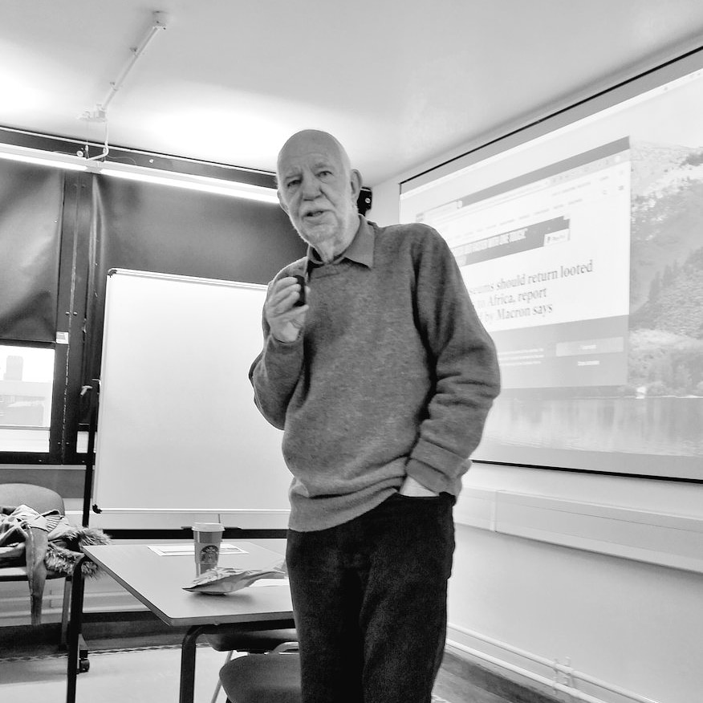

Today I found out that the great Tim Schadla-Hall died on Monday 9th January. He was a friend, mentor and supporter to me and so many others in the world of archaeology and museums. A massively complex and unique character, he was a museum curator, archaeologist, communicator, lobbyist and a joy to be around. At all times he focused on how the public could engage with the past, the present and the future. He didn't teach me at UCL, he found me by accident whilst I was working for the Portable Antiquities Scheme at the British Museum.

I met him through my wife Kate, in 2003 whilst he was supervising her masters on repatriation as part of the Public Archaeology course that he ran. He was rude to me and I chipped back, from that moment on we got on and were friends for ever. He'd be quite happy to swear at me and tell me I was being an idiot, but he'd also be there to support me and help me when I needed it.

Through Tim, my relationship with the Institute of Archaeology was reawakened, he got me to lecture on his modules - frequently as a double header with Dominic Tweddle and he nominated me for honorary status as a lecturer. Often he would sit and heckle, I would wind him up for being a closet Tory, he'd growl and tell me to shut up. Inevitably we'd end up laughing and like most of his meaningful relationships, we'd end up in the Store Street Paridiso and towards the end in the Olivelli in Marylebone.

Lunches, dinners, grappa - always shared with multiple people - you don't mind do you, I've invited XYZ and you will get on well or this chap is a bit of a plonker. Conversation was far ranging, full of tall stories, the naval gardens of Malta, tales of HMS Caroline and stitching up Irish Ministers. We'd have lunch with political lobbyists, museum directors, students, friends of friends and maybe sometimes the people you though you were meeting.

Stories of him will live on for his friends, like trying to drive the wrong mini bus on field trips, losing a cohort of undergrad dissertations to his office bin and all the covert and not so covert lobbying that went on.

I'll miss the swearing, the fags, the wine from another meal that was left over and the bonkers text messages, the emails - 'Oi you, why haven't you emailed me?' and the short phone calls - 'I'm so behind', banging on his door in the IOA to be told to go away.

Tim, I'm sorry I failed to call you at the end of December like I said I would.

Rise in glory my friend, Vale! Legend.

x