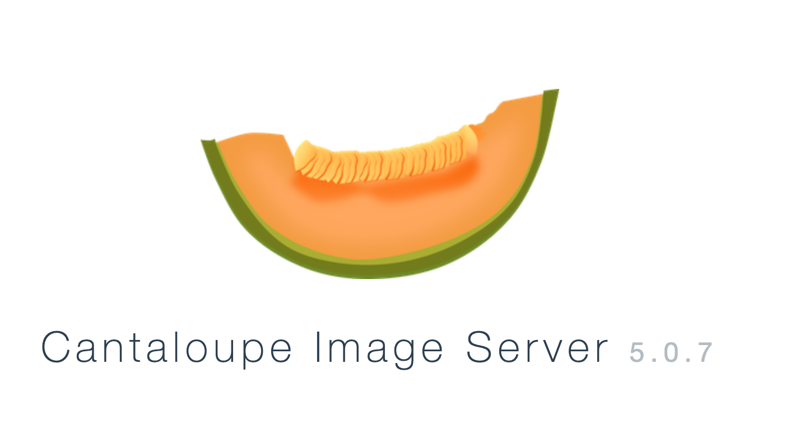
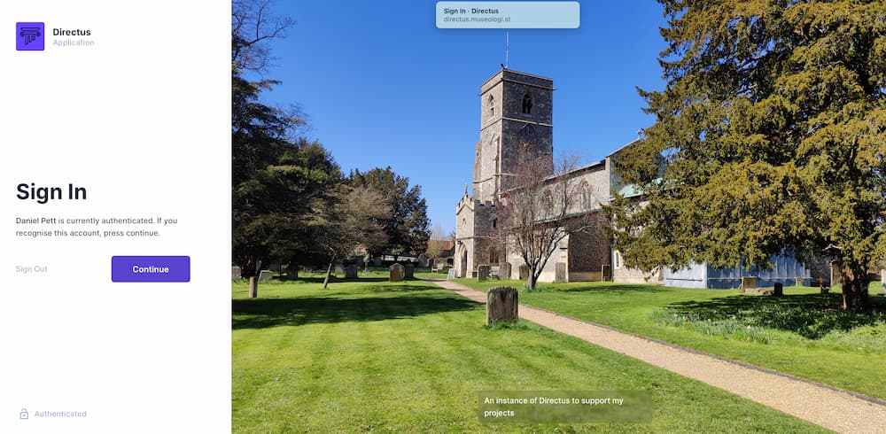
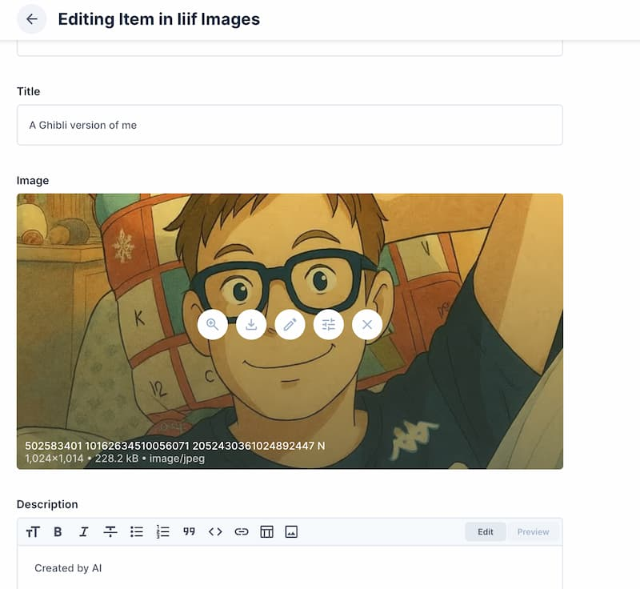

At the start of July, I gave a talk for Historic England about digital innovation which followed
on from my time there leading their digital strategy team. We had talked a lot about implementing the 
widely used IIIF systems that are used by many leading collections. I had installed a system in a couple 
of days for the Fitzwilliam Museum, but I wanted to try something different for my demos. I found Cantaloupe and 
Directus to be very robust, and even though I left in 2022, the architecture still works...

<div class="alert alert-primary" role="alert">
This is quite long! Warning!
</div> 

So for this demo I decided to use:

* AWS EC2 instance to run the IIIF system and CMS - £
* AWS S3 bucket to store the images
* Docker for the container to run the CMS - £
* Directus for the CMS - £
* Cantaloupe to run the IIIF system - £
* Github pages to serve manifests and build them using an action - free

The instructions below cover how I got this up and running and the server configs I have added, locking this down a bit.

## Setting Up an AWS EC2 Instance

Follow these steps to launch and access an AWS EC2 instance for your IIIF system:

### 1. Launch an EC2 Instance

1. Log in to the [AWS Management Console](https://console.aws.amazon.com/).
2. Navigate to **EC2** and click **Launch Instance**.
3. Choose an Ubuntu Server AMI (e.g., Ubuntu LTS).
4. Select an instance type (e.g., t3.small or t3.medium). I used a t3.medium. 
5. Configure instance details as needed.
6. Add storage if required. I added a 20 GB drive.
7. Add tags (optional).
8. Configure the security group to allow SSH (port 22) and any other required ports (e.g., 8182 for Cantaloupe).
9. Review and launch the instance.
10. Download the SSH key pair (`.pem` file) when prompted.

### 2. Connect to Your EC2 Instance

1. Open a terminal on your local machine.
2. Change permissions on your key file:

    ```bash
    chmod 400 /path/to/your-key.pem
    ```

3. Connect using SSH:

    ```bash
    ssh -i /path/to/your-key.pem ubuntu@<EC2_PUBLIC_IP>
    ```

    Replace `<EC2_PUBLIC_IP>` with your instance's public IP address.

You now have shell access to your EC2 instance and can proceed with installing Docker, Directus, and Cantaloupe.

## Limiting SSH Access to Your Fixed IP

To enhance security, restrict SSH access to your EC2 instance so only your fixed IP address can connect. This can be done both in AWS Security Groups and on the server using UFW.

### 1. Restrict SSH in AWS Security Group

1. In the AWS Console, go to **EC2 > Instances** and select your instance.
2. Under the **Security** tab, find the Security Group and click its ID.
3. In the Security Group settings, edit the **Inbound rules**.
4. Find the rule allowing SSH (port 22). Change the **Source** from `0.0.0.0/0` (anywhere) to your fixed IP address in CIDR notation (e.g., `203.0.113.5/32`).
5. Save the rule.

### 2. Restrict SSH with UFW on the Server

1. Enable UFW if not already enabled:

    ```bash
    sudo ufw enable
    ```

2. Allow SSH only from your fixed IP:

    ```bash
    sudo ufw allow from 203.0.113.5 to any port 22
    ```

    Replace `203.0.113.5` with your actual fixed IP address.

3. Deny all other SSH connections (optional, if not already default):

    ```bash
    sudo ufw deny 22
    ```

4. Check UFW status:

    ```bash
    sudo ufw status
    ```

Now, only your fixed IP can access SSH on your EC2 instance.

## Configuring UFW for Apache2 and Local Ports

To allow web traffic and restrict certain ports to localhost, configure UFW as follows:

### 1. Allow Apache2

Enable full access for Apache2:

```bash
sudo ufw allow "Apache Full"
```

This opens ports 80 (HTTP) and 443 (HTTPS).

### 2. Allow Ports 8055 and 8182 for Localhost Only

To restrict ports 8055 (Directus) and 8182 (Cantaloupe) to local access:

```bash
sudo ufw allow from 127.0.0.1 to any port 8055 proto tcp
sudo ufw allow from 127.0.0.1 to any port 8182 proto tcp
```

This ensures only processes on the server can access these ports.

### 3. Reload and Check UFW Status

Reload UFW to apply changes and verify:

```bash
sudo ufw reload
sudo ufw status numbered
```

Your firewall now allows public web access and restricts sensitive ports to localhost. I've also installed fail2ban as well, but you can work that bit out from their docs. 

## Setting Up Cantaloupe on Ubuntu

## What is Cantaloupe?

Cantaloupe is a high-performance, open-source image server designed to deliver images using the [IIIF](https://iiif.io/) (International Image Interoperability Framework) and other image APIs. It is widely used by libraries, museums, and archives to serve high-resolution images in a flexible and standards-compliant way.

### Key Features

- **IIIF Support:** Cantaloupe implements the IIIF Image API, allowing clients to request images at different sizes, regions, qualities, and formats on-the-fly.
- **Dynamic Image Processing:** It can crop, resize, rotate, and convert images in real time, without needing to store multiple derivatives.
- **Multiple Source Backends:** Supports a variety of image sources, including local file systems, Amazon S3, Azure Blob Storage, HTTP(S), and more.
- **Format Support:** Handles many image formats such as JPEG, PNG, TIFF, JP2 (JPEG 2000), and PDF, depending on the Java imaging libraries you configure.
- **Authentication and Authorization:** Offers flexible options for securing image access, including basic authentication and integration with external systems.
- **Caching:** Built-in support for caching processed images to improve performance and reduce server load.
- **Extensible:** Highly configurable and supports custom scripting for advanced workflows.

### Typical Use Cases

- Serving digitized collections for museums, archives, and libraries.
- Enabling deep zoom and pan functionality for high-resolution images.
- Integrating with IIIF-compatible viewers like Mirador or Universal Viewer.
- Providing on-demand image transformations for web applications.

Cantaloupe is a robust solution for any project that needs to serve and manipulate large image collections efficiently and in compliance with IIIF standards.
Follow these steps to install and configure Cantaloupe, an open-source IIIF image server, on Ubuntu:

### 1. Install Java

Cantaloupe requires Java 11 or newer.

```bash
sudo apt update
sudo apt install openjdk-17-jre-headless
```

### 2. Download Cantaloupe

Visit the [Cantaloupe releases page](https://github.com/medusa-project/cantaloupe/releases) to get the latest version. For example:

```bash
wget https://github.com/medusa-project/cantaloupe/releases/download/v5.0.7/cantaloupe-5.0.7.zip
unzip cantaloupe-5.0.7.zip
cd cantaloupe-5.0.7
mkdir ~/cantaloupe
cp -r cantaloupe-5.0.7/* ~/cantaloupe
cd ~/cantaloupe
mkdir images # I found that without this, things fail later on
```

### 3. Configure Cantaloupe

Copy the default configuration file:

```bash
cp cantaloupe.properties.sample cantaloupe.properties
```

Edit `cantaloupe.properties` to suit your needs, especially the `source` and `endpoint.iiif.*` settings. I am using an S3 
bucket you will need to get the userid and keys for this from the AWS console to add to your config. 


### 4. Start Cantaloupe

```bash
java -Dcantaloupe.config=cantaloupe.properties -jar cantaloupe-5.0.6.war
```

By default, Cantaloupe runs on port 8182. Access it at [http://localhost:8182](http://localhost:8182).

### 5. (Optional) Run as a Service

For production, consider creating a systemd service to manage Cantaloupe.

```bash
sudo adduser --system --no-create-home --group cantaloupe
sudo chown -R cantaloupe:cantaloupe ~/cantaloupe/cantaloupe
sudo chown -R cantaloupe:cantaloupe ~/cantaloupe
sudo nano /etc/systemd/system/cantaloupe.service
```

Now configure your service like this:

```bash
[Unit]
Description=Cantaloupe IIIF Image Server
After=network.target
[Service]
User=cantaloupe
Group=cantaloupe
Type=simple
ExecStart=/usr/bin/java -Dcantaloupe.config='/var/cantaloupe/cantaloupe.properties' -Xmx2g -jar '/var/cantaloupe/cantaloupe-5.0.7.jar'
Restart=always
RestartSec=5
StandardOutput=syslog
StandardError=syslog
SyslogIdentifier=cantaloupe
[Install]
WantedBy=multi-user.target
```

And now enable it and start it.

```bash 
  sudo systemctl daemon-reload
  sudo systemctl enable cantaloupe
  sudo systemctl start cantaloupe
  sudo systemctl status cantaloupe
```

You should now be able to access your iiif images from your S3 bucket you have configured and got to the control panel. 



---

For more details, see the [official Cantaloupe documentation](https://cantaloupe-project.github.io/).

## Setting Up Directus with Docker on Ubuntu

Directus is a modern open-source headless CMS that can be easily deployed using Docker. Follow these steps to get the latest version running on your Ubuntu server:

### 1. Install Docker and Docker Compose

If you haven't already installed Docker:

```bash
sudo apt update
sudo apt install ca-certificates curl gnupg -y
curl -fsSL https://download.docker.com/linux/ubuntu/gpg | sudo gpg --dearmor -o /etc/apt/keyrings/docker.gpg
sudo chmod a+r /etc/apt/keyrings/docker.gpg
echo   "deb [arch="$(dpkg --print-architecture)" signed-by=/etc/apt/keyrings/docker.gpg] https://download.docker.com/linux/ubuntu \
 "$(. /etc/os-release && echo "$VERSION_CODENAME")" stable" |   sudo tee /etc/apt/sources.list.d/docker.list > /dev/null
sudo apt install docker-ce docker-ce-cli containerd.io docker-buildx-plugin docker-compose-plugin -y
sudo docker run hello-world
sudo usermod -aG docker $USER
newgrp docker # Apply group changes immediately for current session
sudo systemctl enable --now docker
```

### 2. Create a Docker Compose File

Create a directory for Directus and navigate into it:

```bash
mkdir ~/directus
cd ~/directus
```

Create a `docker-compose.yml` file with the following content (change the "directus" entries to your own usernames and passwords):

```yaml
version: "3"
services:
  database:
    image: postgis/postgis:13-master
    # Required when running on platform other than amd64, like Apple M1/M2:
    # platform: linux/amd64
    volumes:
      - ./data/database:/var/lib/postgresql/data
    restart: unless-stopped # <--- Add this line for the restart policy 
    environment:
      POSTGRES_USER: "directus"
      POSTGRES_PASSWORD: "directus"
      POSTGRES_DB: "directus"
    healthcheck:
      test: ["CMD", "pg_isready", "--host=localhost", "--username=directus"]
      interval: 10s
      timeout: 5s
      retries: 5
      start_interval: 5s
      start_period: 30s
  cache:
    image: redis:6
    healthcheck:
      test: ["CMD-SHELL", "[ $$(redis-cli ping) = 'PONG' ]"]
      interval: 10s
      timeout: 5s
      retries: 5
      start_interval: 5s
      start_period: 30s
  directus:
    image: directus/directus:11.5.1
    ports:
      - 8055:8055
    volumes:
      - ./uploads:/directus/uploads
      - ./extensions:/directus/extensions
    depends_on:
      database:
        condition: service_healthy
      cache:
        condition: service_healthy
    environment:
      SECRET: "" # Set a random secret
      DB_CLIENT: "pg"
      DB_HOST: "database"
      DB_PORT: "5432"
      DB_DATABASE: "directus"
      DB_USER: "directus"
      DB_PASSWORD: "directus" # Make sure this is the same as the POSTGRES_PASSWORD
      CACHE_ENABLED: "true"
      CACHE_AUTO_PURGE: "true"
      CACHE_STORE: "redis"
      REDIS: "redis://cache:6379"
      ADMIN_EMAIL: "" # Make sure to set this
      ADMIN_PASSWORD: "" # Make sure to set this 
      # Make sure to set this in production
      # (see https://docs.directus.io/self-hosted/config-options#general)
      PUBLIC_URL: ""
```

> **Tip:** For production, use a strong database like PostgreSQL or MySQL. 

### 3. Start Directus

Run the following command in the same directory as your `docker-compose.yml`:

```bash
sudo docker-compose up -d
```

### 4. Access Directus

Once the containers are running, access the Directus admin interface at [http://localhost:8055](http://localhost:8055) or replace `localhost` with your server's IP address.




### 5. (Optional) Manage Directus

- To view logs: `sudo docker-compose logs -f`
- To stop Directus: `sudo docker-compose down`
- To update Directus: `sudo docker-compose pull && sudo docker-compose up -d`

For more details, see the [Directus Docker documentation](https://docs.directus.io/self-hosted/docker/).

## Configuring Apache Virtual Hosts and SSL for Directus and Cantaloupe

To securely expose Directus and Cantaloupe via standard HTTPS ports, set up Apache as a reverse proxy and use Certbot for SSL certificates.

### 1. Enable Required Apache Modules

Enable proxy and SSL modules:

```bash
sudo a2enmod proxy proxy_http ssl headers
sudo systemctl reload apache2
```

### 2. Create Virtual Host Configurations

Create separate config files for each service, e.g., `/etc/apache2/sites-available/directus.conf` and `/etc/apache2/sites-available/cantaloupe.conf`.

#### Example: Directus Virtual Host

Replace `directus.example.com` with your domain.

```bash
<VirtualHost *:80>
    ServerName directus.example.com

    ProxyPreserveHost On
    ProxyPass / http://localhost:8055/
    ProxyPassReverse / http://localhost:8055/

    ErrorLog ${APACHE_LOG_DIR}/directus_error.log
    CustomLog ${APACHE_LOG_DIR}/directus_access.log combined
</VirtualHost>
```

#### Example: Cantaloupe Virtual Host

Replace `iiif.example.com` with your domain.

```bash
<VirtualHost *:80>
    ServerName iiif.example.com
    ProxyPreserveHost On
    ProxyPass / http://localhost:8182/
    ProxyPassReverse / http://localhost:8182/
    ErrorLog ${APACHE_LOG_DIR}/cantaloupe_error.log
    CustomLog ${APACHE_LOG_DIR}/cantaloupe_access.log combined
</VirtualHost>
```

### 3. Enable the Sites

```bash
sudo a2ensite directus.conf
sudo a2ensite cantaloupe.conf
sudo systemctl reload apache2
```

### 4. Obtain SSL Certificates with Certbot

Install Certbot if needed:

```bash
sudo apt install certbot python3-certbot-apache
```

Run Certbot for each domain:

```bash
sudo certbot --apache -d directus.example.com
sudo certbot --apache -d iiif.example.com
```

Certbot will update your Apache configs to use SSL and reload Apache.

### 5. Test Everything

- Visit `https://directus.example.com` and `https://iiif.example.com` in your browser.
- Both should proxy securely to the respective services.

For more details, see [Apache reverse proxy docs](https://httpd.apache.org/docs/current/mod/mod_proxy.html) and [Certbot instructions](https://certbot.eff.org/instructions).

### Example vhosts config

### Directus

```bash
<IfModule mod_ssl.c>
<VirtualHost *:443>
    ServerName directus.museologi.st
    ServerAdmin user@gmail.com
    # Redirect all HTTP requests to HTTPS
    RewriteEngine On
    # Some rewrite rules in this file were disabled on your HTTPS site,
    # because they have the potential to create redirection loops.
    #     RewriteCond %{HTTPS} off
    #     RewriteRule ^ https://%{HTTP_HOST}%{REQUEST_URI} [L,R=301]
    ErrorLog ${APACHE_LOG_DIR}/directus.museologi.st_error.log
    CustomLog ${APACHE_LOG_DIR}/directus.museologi.st_access.log combined
    SSLCertificateFile /etc/letsencrypt/live/directus.museologi.st/fullchain.pem
    SSLCertificateKeyFile /etc/letsencrypt/live/directus.museologi.st/privkey.pem
    Include /etc/letsencrypt/options-ssl-apache.conf
    # Reverse Proxy Configuration
    ProxyPreserveHost On
    ProxyRequests Off
    <Proxy *>
        Order deny,allow
        Allow from all
    </Proxy>
    # Proxy all requests to the Directus Docker container
    ProxyPass / http://127.0.0.1:8055/
    ProxyPassReverse / http://127.0.0.1:8055/
    # Important: Pass necessary headers for Directus
    # Directus needs X-Forwarded-For and X-Forwarded-Proto for correct public URLs
    RequestHeader set X-Forwarded-For %{REMOTE_ADDR}s
    RequestHeader set X-Forwarded-Proto "https"
    # Optional: Increase client body size if you expect large file uploads
    LimitRequestBody 52428800
</VirtualHost>
</IfModule>
```

---
### Cantaloupe
Example for Cantaloupe. 

```bash
<IfModule mod_ssl.c>
<VirtualHost *:443>
    ServerName iiif.museologi.st
    ServerAdmin user@gmail.com
    # Redirect all HTTP requests to HTTPS
    RewriteEngine On
    # Some rewrite rules in this file were disabled on your HTTPS site,
    # because they have the potential to create redirection loops.

    #     RewriteCond %{HTTPS} off
    #     RewriteRule ^ https://%{HTTP_HOST}%{REQUEST_URI} [L,R=301]

    ErrorLog ${APACHE_LOG_DIR}/iiif.museologi.st_error.log
    CustomLog ${APACHE_LOG_DIR}/iiif.museologi.st_access.log combined
    SSLCertificateFile /etc/letsencrypt/live/iiif.museologi.st/fullchain.pem
    SSLCertificateKeyFile /etc/letsencrypt/live/iiif.museologi.st/privkey.pem
    Include /etc/letsencrypt/options-ssl-apache.conf
    RequestHeader set X-Forwarded-Proto "https"
    RequestHeader set X-Forwarded-Ssl "on"
    # Reverse Proxy Configuration
    ProxyPreserveHost On
    ProxyRequests Off
    <Proxy *>
        Order deny,allow
        Allow from all
    </Proxy>
    # Proxy all requests for / (the root of the domain) to Cantaloupe
    ProxyPass / http://127.0.0.1:8182/
    ProxyPassReverse / http://127.0.0.1:8182/
</VirtualHost>
</IfModule>
```

## Creating a Content Model in Directus for IIIF Images

To manage IIIF images and their metadata in Directus, you need to set up a collection (table) with relevant fields. Here’s how to create a basic content model suitable for IIIF:

### 1. Access the Directus Admin Panel

- Open your browser and go to your Directus instance (e.g., `https://directus.example.com`).
- Log in with your admin credentials.

### 2. Create a New Collection

1. In the left sidebar, click **Settings** (gear icon) > **Data Model**.
2. Click **+ Create Collection**.
3. Enter a name, e.g., `iiif_images`.
4. Optionally, add a display name and description.
5. Click **Create Collection**.

### 3. Add Fields to the Collection

Add fields to store IIIF image metadata. Common fields include:

- **id** (Primary Key, auto-generated)
- **title** (String): Human-readable title for the image.
- **description** (Text): Description or notes.
- **image_file** (File): Upload or reference the image file.
- **annotations** (json): this will contain a json string obtained elsewhere.
- **attribution** (String): Attribution or copyright info.
- **license** (Dropdown): Choose from a series of licenses
- **source_collection** (String): Where the image came from

To add a field:

1. Click **+ Add Field**.
2. Choose the field type (e.g., String, File, JSON).
3. Set the field name and options.
4. Click **Save Field**.

Repeat for each field you need.

### 4. Set Permissions

- Go to **Settings > Roles & Permissions**.
- Set who can view, create, update, or delete IIIF images.
- Set access to the public api or via secret protected endpoint

### 5. Add IIIF Images

- Go to the new `iiif_images` collection.
- Click **+ Create Item** to add images and metadata.

You can now use Directus as a CMS for your IIIF images, and expose the data via the Directus API for use in IIIF manifests or viewers.

### 6. Example upload to an S3 Bucket

After navigating to the admin section and the collection to add an image to, you can upload an image easily and add the attributes required. For example:



This image is now available in the S3 bucket defined in both Cantaloupe and Directus config (they both use the same one - did I forget to say that earlier?)

## Getting an image from the IIIF endpoint

You can now get the IIIF compliant json back from your server endpoint - ```https://iiif.museologi.st/iiif/3/``` is the one I have configured so for ```https://iiif.museologi.st/iiif/3/9f6fe27e-f60a-46a1-95bb-e0a618b3be3a.jpg/info.json``` (which uses the file upload name from Directus as the file to retrieve) which references the various versions generated:

```json
{
    "@context": "http://iiif.io/api/image/3/context.json",
    "id": "https://iiif.museologi.st/iiif/3/9f6fe27e-f60a-46a1-95bb-e0a618b3be3a.jpg",
    "type": "ImageService3",
    "protocol": "http://iiif.io/api/image",
    "profile": "level2",
    "width": 4000,
    "height": 2250,
    "maxArea": 9000000,
    "sizes": [
        { "width": 125, "height": 70 },
        { "width": 250, "height": 141 },
        { "width": 500, "height": 281 },
        { "width": 1000, "height": 563 },
        { "width": 2000, "height": 1125 },
        { "width": 4000, "height": 2250 }
    ],
    "tiles": [
        {
            "width": 512,
            "height": 512,
            "scaleFactors": [1, 2, 4, 8, 16, 32]
        }
    ],
    "extraQualities": ["bitonal", "color", "gray"],
    "extraFormats": ["tif", "gif"],
    "extraFeatures": [
        "baseUriRedirect",
        "canonicalLinkHeader",
        "cors",
        "jsonldMediaType",
        "mirroring",
        "profileLinkHeader",
        "regionByPct",
        "regionByPx",
        "regionSquare",
        "rotationArbitrary",
        "rotationBy90s",
        "sizeByConfinedWh",
        "sizeByH",
        "sizeByPct",
        "sizeByW",
        "sizeByWh"
    ]
}
```

### Creating manifests

I then wanted to be able to serve up manifests. So I have written a bit of Nodejs to convert the json returned data from directus and cantaloupe to a IIIF v3 manifest served off [Github pages for free](https://manifests.museologi.st) with an index page that lists all the available manifests. I have two scripts that do the majority of the work - a generator file and an index page creator. 

```javascript
// src/generateCantaloupeIIIFManifests.js

const axios = require('axios');
const fs = require('fs');
const path = require('path');

// --- Configuration ---
const DIRECTUS_API_URL = 'https://directus.museologi.st'; // Your Directus API URL
const CANTALOUPE_IIIF_URL = 'https://iiif.museologi.st/iiif/3'; // Your Cantaloupe IIIF endpoint for v3
const PUBLIC_MANIFEST_BASE_URL = 'https://manifests.museologi.st'; // Where your static manifests will be served
const OUTPUT_DIR = path.join(__dirname, '../docs'); // Output directory for static manifests
const DIRECTUS_COLLECTION_NAME = 'iiif_images'; // The Directus collection holding your items with image files
const FILE_FIELD_NAME = 'image'; // The field in your Directus collection that links to a directus_files entry
const ACCESS_TOKEN = process.env.DIRECTUS_ACCESS_TOKEN || ''; // Optional: for private Directus collections

// --- Main Manifest Generation Logic ---

async function fetchDirectusData() {
    const allItems = [];
    let page = 1;
    const limit = 50;
    try {
        const headers = {};
        if (ACCESS_TOKEN) {
            headers['Authorization'] = `Bearer ${ACCESS_TOKEN}`;
        }

        const fieldsToFetch = [
            'id',
            'image.*',
            'title',
            'description',
            'annotations',
            'license',
            'source_collection',
            'date_created'
        ].join(',');

        while (true) {
            const response = await axios.get(`${DIRECTUS_API_URL}/items/${DIRECTUS_COLLECTION_NAME}`, {
                params: {
                    fields: fieldsToFetch,
                    filter: { status: { _eq: 'published' } },
                    limit,
                    page
                },
                headers: headers
            });

            const items = response.data.data;
            if (!items || items.length === 0) break;

            allItems.push(...items);

            // If less than limit, we've reached the last page
            if (items.length < limit) break;

            page++;
        }
        return allItems;
    } catch (error) {
        console.error('Error fetching data from Directus:', error.message);
        if (axios.isAxiosError(error) && error.response) {
            console.error('Directus Response Status:', error.response.status);
            console.error('Directus Response Data:', error.response.data);
        }
        process.exit(1);
    }
}
/**
 * Fetches the IIIF Image API info.json from Cantaloupe for a given filename.
 * @param {string} cantaloupeImageIdentifier The filename or identifier for the image (e.g., "my_image.jpg").
 * @returns {Promise<object|null>} The parsed info.json object, or null if not found.
 */
async function fetchCantaloupeInfoJson(cantaloupeImageIdentifier) {
    const url = `${CANTALOUPE_IIIF_URL}/${cantaloupeImageIdentifier}/info.json`;
    try {
        const response = await axios.get(url);
        console.log(`Fetched Cantaloupe info.json for: ${cantaloupeImageIdentifier}`);
        return response.data;
    } catch (error) {
        console.warn(`Could not fetch Cantaloupe info.json for ${cantaloupeImageIdentifier}: ${error.message}`);
        return null;
    }
}


/**
 * Creates a IIIF Presentation 3.0 Manifest from a Directus item.
 * @param {object} item The Directus item data.
 * @returns {Promise<object|null>} A IIIFManifest object or null if no valid images are found.
 */
async function createIIIFManifest(item) {
   
    console.log(item[FILE_FIELD_NAME]['filename_disk']);
    const linkedImageData = item[FILE_FIELD_NAME]['filename_disk'];

    if (!linkedImageData) {
        console.warn(`Item "${item.title || item.id}" has no associated image file in the '${FILE_FIELD_NAME}' field. Skipping manifest generation.`);
        return null;
    }

    const manifestId = `${PUBLIC_MANIFEST_BASE_URL}/${path.parse(linkedImageData).name}.json`;
    const canvases = [];
    const thumbnailServices = [];

    // Since we only have a single image, process it directly
    const cantaloupeImageIdentifier = linkedImageData; // Use the filename as the identifier for Cantaloupe
    const cantaloupeImageServiceBaseUrl = `${CANTALOUPE_IIIF_URL}/${cantaloupeImageIdentifier}`;

    // Fetch info.json to get width and height
    const infoJson = await fetchCantaloupeInfoJson(cantaloupeImageIdentifier);

    let imageWidth = 0;
    let imageHeight = 0;

    if (infoJson && infoJson.width && infoJson.height) {
        imageWidth = infoJson.width;
        imageHeight = infoJson.height;
        console.log(`Found dimensions for ${cantaloupeImageIdentifier}: ${imageWidth}x${imageHeight}`);
    } else {
        console.warn(`Could not determine dimensions for ${cantaloupeImageIdentifier}. Canvas will have 0x0 dimensions.`);
    }

    const canvasId = `${manifestId}/canvas/p1`;
    const annotationPageId = `${canvasId}/annotationpage/1`;
    const annotationId = `${annotationPageId}/annotation/1`;

    canvases.push({
        id: canvasId,
        type: 'Canvas',
        height: imageHeight,
        width: imageWidth,
        label: item[FILE_FIELD_NAME].title ? { en: [item[FILE_FIELD_NAME].title] } : undefined,
        description: item.description ? { en: [item.description] } : undefined,
        items: [
            {
                id: annotationPageId,
                type: 'AnnotationPage',
                items: [
                    {
                        id: annotationId,
                        type: 'Annotation',
                        motivation: 'painting',
                        body: {
                            id: `${cantaloupeImageServiceBaseUrl}/full/max/0/default.jpg`,
                            type: 'Image',
                            format: item[FILE_FIELD_NAME].type || 'image/jpeg',
                            width: imageWidth,
                            height: imageHeight,
                            service: [
                                {
                                    id: cantaloupeImageServiceBaseUrl,
                                    type: 'ImageService3',
                                    profile: 'http://iiif.io/api/image/3/level2.json'
                                }
                            ]
                        },
                        target: canvasId
                    }
                ]
            }
        ]
    });

    if (item.annotations) {
        // Push annotations into the last canvas object after 'items'
        const lastCanvas = canvases[canvases.length - 1];
        if (lastCanvas) {
            lastCanvas.annotations = Array.isArray(item.annotations) ? item.annotations : [item.annotations];
        }
    }
    // Add a thumbnail for the manifest (from the single image)
    thumbnailServices.push({
        id: `${cantaloupeImageServiceBaseUrl}/full/256,/0/default.jpg`,
        type: 'Image',
        service: [
            {
                id: cantaloupeImageServiceBaseUrl,
                type: 'ImageService3',
                profile: 'http://iiif.io/api/image/3/level2.json'
            }
        ]
    });

    if (canvases.length === 0) {
        return null; // No valid canvases generated
    }

    // Add metadata from Directus item
    const metadata = [];
   
    if (item.description) {
        metadata.push({ label: { en: ['Summary'] }, value: { en: [item.description] } });
    }
    if (item.creator) {
        metadata.push({ label: { en: ['Creator'] }, value: { en: [item.creator] } });
    }
    if (item.date_created) {
        metadata.push({ label: { en: ['Date Created'] }, value: { en: [item.date_created] } });
    }
    if (item.license && item.license.length > 0) {
        metadata.push({ label: { en: ['License'] }, value: { en: [item.license] } });
    }
    if (item.source) {
        metadata.push({ label: { en: ['Source'] }, value: { en: [item.source] } });
    }  
    if (item.attribution) {
        metadata.push({ label: { en: ['Attribution'] }, value: { en: [item.attribution] } });
    }  
    if (item.rights) {
        metadata.push({ label: { en: ['Rights'] }, value: { en: [item.rights] } });
    }
    // You can add more metadata fields here based on your Directus item schema

    const manifest = {
        '@context': 'http://iiif.io/api/presentation/3/context.json',
        id: manifestId,
        type: 'Manifest',
        label: { en: [item.title || `Item ${item.id}`] },
        summary: item.description ? { en: [item.description] } : undefined,
        items: canvases,
        thumbnail: thumbnailServices.length > 0 ? thumbnailServices : undefined,
        metadata: metadata.length > 0 ? metadata : undefined,
        // Add other properties as needed, e.g., rights, homepage, etc.
    };

    return manifest;
}

async function generateStaticManifests() {
    console.log('Starting IIIF manifest generation from Directus for Cantaloupe...');

    // Create output directory if it doesn't exist
    if (!fs.existsSync(OUTPUT_DIR)) {
        fs.mkdirSync(OUTPUT_DIR, { recursive: true });
        console.log(`Created output directory: ${OUTPUT_DIR}`);
    } else {
        console.log(`Output directory already exists: ${OUTPUT_DIR}`);
    }

    const directusItems = await fetchDirectusData();

    console.log(`Fetched ${directusItems.length} items from Directus collection: ${DIRECTUS_COLLECTION_NAME}.`);
    let generatedCount = 0;
    for (const item of directusItems) {
        // Await the manifest creation as it now involves async calls to Cantaloupe
        const manifest = await createIIIFManifest(item);
        if (manifest) {
            const fname = path.parse(item.image.filename_disk).name;
            const fileName = `${fname}.json`;
            const filePath = path.join(OUTPUT_DIR, fileName);

            try {
                fs.writeFileSync(filePath, JSON.stringify(manifest, null, 2), 'utf8');
                console.log(`Generated manifest for item ${item.id}: ${filePath}`);
                generatedCount++;
            } catch (error) {
                console.error(`Error writing manifest for item ${item.id}:`, error);
            }
        }
    }

    console.log(`IIIF manifest generation complete. Generated ${generatedCount} manifests.`);
}

// --- Execution ---
generateStaticManifests();
```

#### Index page creation

```javascript
// Import required modules
const fs = require('fs');
const path = require('path');

// Define the path to the 'docs' directory (one level up from current file)
const docsDirectory = path.join(__dirname, '..', 'docs');
// Output directory is the same as docsDirectory
const outputDirectory = docsDirectory;
// Name of the output HTML file
const outputFileName = 'index.html';

const repositoryUrl = 'https://github.com/portableant/cantaloupe-iiif-generator/'; // URL of the GitHub repository
/**
 * Generates an HTML string for a list of files with pagination and manifest details.
 * @param {string[]} files - Array of file names in the directory.
 * @param {string} directoryPath - Path to the directory containing the files.
 * @returns {string} - Complete HTML string for the index page.
 */
function generateHtmlContent(files, directoryPath) {
    let listItems = '';
    files.forEach(file => {
        // Skip certain files from the listing
        if (file.toUpperCase() === 'CNAME' || file === 'styles.css') return;

        const filePath = path.join(directoryPath, file);
        const stats = fs.statSync(filePath); // Get file stats

        // Format the created date for display
        const createdDate = stats.birthtime
            ? new Date(stats.birthtime).toLocaleDateString('en-GB', { weekday: 'long', day: '2-digit', month: '2-digit', year: 'numeric' }).replace(/\//g, '-')
            : '';
        // Format file size for display (if not a directory)
        const fileSize = !stats.isDirectory()
            ? `${(stats.size / 1024).toFixed(1)} KB`
            : '';

        // Variables for manifest details
        let hasAnnotations = false;
        let manifestTitle = '';
        let annotationCount = 0;

        // If the file is a JSON manifest, try to extract title and annotation info
        if (!stats.isDirectory() && file.endsWith('.json')) {
            try {
                const content = fs.readFileSync(path.join(directoryPath, file), 'utf8');
                const json = JSON.parse(content);

                // Count annotations at the manifest level (IIIF v3)
                if (json && typeof json === 'object' && Array.isArray(json.annotations)) {
                    annotationCount = json.annotations.reduce((sum, page) => {
                        if (Array.isArray(page.items)) {
                            return sum + page.items.length;
                        }
                        return sum;
                    }, 0);
                    hasAnnotations = annotationCount > 0;
                } else if (Array.isArray(json.items)) {
                    // Check for annotations in items (e.g., canvases)
                    json.items.forEach(item => {
                        if (Array.isArray(item.annotations)) {
                            annotationCount += item.annotations.reduce((sum, page) => {
                                if (Array.isArray(page.items)) {
                                    return sum + page.items.length;
                                }
                                return sum;
                            }, 0);
                        }
                    });
                    hasAnnotations = annotationCount > 0;
                }

                // Extract manifest title (IIIF v3: label, v2: label or title)
                if (json) {
                    if (json.label) {
                        // IIIF v3: label is an object with language keys
                        if (typeof json.label === 'object' && !Array.isArray(json.label)) {
                            // Prefer English, fallback to any available language
                            manifestTitle = json.label.en?.[0] || Object.values(json.label)[0]?.[0] || '';
                        } else if (typeof json.label === 'string') {
                            manifestTitle = json.label;
                        }
                    } else if (json.title) {
                        manifestTitle = json.title;
                    }
                }
            } catch (e) {
                // Ignore parse errors, treat as no annotations/title
                hasAnnotations = false;
                manifestTitle = '';
                annotationCount = 0;
            }
        }

        // Render directory or file as a list item
        if (stats.isDirectory()) {
            listItems += `<li class="px-4 py-2"><a href="./${file}/" class="fw-bold text-decoration-none">${file}/</a> <span class="text-muted small ms-2">Created: ${createdDate}</span></li>`;
        } else {
            listItems += `<li class="d-flex justify-content-between align-items-center px-4 py-2">
            <span>
            ${manifestTitle ? `<span class="ms-2"><a href="./${file}" class="fw-semibold link-dark" title="View manifest">${manifestTitle}</a></span>` : ''}
            <span class="text-muted small ms-2">Created: ${createdDate}</span>
            <span class="text-muted small ms-2">Size: ${fileSize}</span>
            ${hasAnnotations ? `<span class="badge bg-primary text-white ms-2">Annotations: ${annotationCount}</span>` : ''}
            </span>
            <a href="https://samvera-labs.github.io/clover-iiif/docs/viewer/demo?iiif-content=https://manifests.museologi.st/${file}" class="btn btn-dark btn-sm ms-2" target="_blank" rel="noopener">Demo</a>
            </li>`;
        }
    });

    // Pagination logic
    const itemsPerPage = 12;
    const totalItems = files.length;
    const totalPages = Math.ceil(totalItems / itemsPerPage);

    // Split listItems into paginated lists
    let paginatedLists = [];
    for (let i = 0; i < totalPages; i++) {
        const start = i * itemsPerPage;
        const end = start + itemsPerPage;
        // Split listItems by </li> and rejoin for each page
        const pageItems = listItems
            .split('</li>')
            .slice(start, end)
            .filter(Boolean)
            .map(item => item + '</li>')
            .join('\n');
        paginatedLists.push(pageItems);
    }

    // Generate pagination controls if needed
    let paginationControls = '';
    if (totalPages > 1) {
        paginationControls = `
        <nav>
            <ul class="pagination justify-content-center">
                <li class="page-item disabled" id="prevPage">
                    <button class="page-link" tabindex="-1">Previous</button>
                </li>
                ${Array.from({ length: totalPages }, (_, i) => `
                    <li class="page-item${i === 0 ? ' active' : ''}">
                        <button class="page-link" onclick="showPage(${i})">${i + 1}</button>
                    </li>
                `).join('')}
                <li class="page-item${totalPages === 1 ? ' disabled' : ''}" id="nextPage">
                    <button class="page-link">Next</button>
                </li>
            </ul>
        </nav>
        `;
    }

    // Return the complete HTML page as a string
    return `<!DOCTYPE html>
<html lang="en">
<head>
    <meta charset="UTF-8">
    <meta name="viewport" content="width=device-width, initial-scale=1.0">
    <title>Available Manifests</title>
    <link rel="preconnect" href="https://fonts.googleapis.com">
    <link rel="preconnect" href="https://fonts.gstatic.com" crossorigin>
    <link href="https://fonts.googleapis.com/css2?family=Inter:wght@300;400;600&display=swap" rel="stylesheet">
    <link href="https://cdn.jsdelivr.net/npm/bootstrap@5.3.3/dist/css/bootstrap.min.css" rel="stylesheet">
    <link rel="stylesheet" href="styles.css">
    <link rel="stylesheet" href="https://cdnjs.cloudflare.com/ajax/libs/font-awesome/6.5.2/css/all.min.css">
</head>
<body>
    <div class="container py-4">
        <header class="mb-4">
            <h1 class="display-5">Available Manifests</h1>
        </header>
        <main>
            <p>Welcome to the manifest index.</p>
            <p>Below is a list of available simple manifests and links to the file and a demo using clover.</p>
            <ul id="manifestList" class="file-list">
                ${paginatedLists[0] || '<li class="empty-state">No manifests found at this time.</li>'}
            </ul>
            ${paginationControls}
        </main>
        <footer class="footer-classy mt-5 text-muted">
            <div>
                &copy; 2025 Daniel Pett 
                <a class="text-dark" href="${repositoryUrl}" target="_blank" rel="noopener" title="GitHub repo for this project">
                    <i class="fab fa-github"></i> GitHub Repo
                </a>
            </div>
        </footer>
    </div>
    <script>
        // Store paginated lists and page state for client-side pagination
        const paginatedLists = ${JSON.stringify(paginatedLists)};
        let currentPage = 0;
        const totalPages = ${totalPages};

        // Show a specific page of the manifest list
        function showPage(page) {
            if (page < 0 || page >= totalPages) return;
            currentPage = page;
            document.getElementById('manifestList').innerHTML = paginatedLists[page] || '';
            // Update pagination controls
            const pagination = document.querySelectorAll('.pagination .page-item');
            pagination.forEach((item, idx) => {
                if (item.classList.contains('active')) item.classList.remove('active');
                if (idx === page + 1) item.classList.add('active'); // +1 for prev button
            });
            // Enable/disable prev/next buttons
            document.getElementById('prevPage').classList.toggle('disabled', page === 0);
            document.getElementById('nextPage').classList.toggle('disabled', page === totalPages - 1);
        }

        // Set up event listeners for pagination controls after DOM loads
        document.addEventListener('DOMContentLoaded', function() {
            // Previous page button
            document.getElementById('prevPage')?.addEventListener('click', function() {
                if (currentPage > 0) showPage(currentPage - 1);
            });
            // Next page button
            document.getElementById('nextPage')?.addEventListener('click', function() {
                if (currentPage < totalPages - 1) showPage(currentPage + 1);
            });
            // Page number buttons
            document.querySelectorAll('.pagination .page-link').forEach((btn, idx) => {
                if (btn.textContent.match(/^\\d+$/)) {
                    btn.addEventListener('click', function() {
                        showPage(Number(btn.textContent) - 1);
                    });
                }
            });
        });
    </script>
</body>
</html>`;
}

/**
 * Recursively get all files in a directory and its subdirectories.
 * @param {string} dir - Directory to search.
 * @param {string[]} fileList - Accumulator for file paths.
 * @param {string} baseDir - Base directory for relative paths.
 * @returns {string[]} - Array of relative file paths.
 */
function getFilesRecursively(dir, fileList = [], baseDir = dir) {
    const files = fs.readdirSync(dir);

    files.forEach(file => {
        const filePath = path.join(dir, file);
        const stats = fs.statSync(filePath);

        if (stats.isDirectory()) {
            // Recursively list files in subdirectories
            getFilesRecursively(filePath, fileList, baseDir);
        } else {
            // Get path relative to the base 'docs' directory
            const relativePath = path.relative(baseDir, filePath);
            fileList.push(relativePath);
        }
    });
    return fileList;
}

// Main execution block
try {
    // Ensure the docs directory exists
    if (!fs.existsSync(docsDirectory)) {
        console.error(`Error: The 'docs' directory not found at ${docsDirectory}`);
        process.exit(1);
    }

    // Read files directly in the docs directory (non-recursive for simple index)
    // For recursive listing, use getFilesRecursively instead
    // const files = getFilesRecursively(docsDirectory);
    const filesInDocs = fs.readdirSync(docsDirectory);

    // Exclude index.html itself from the listing
    const filteredFiles = filesInDocs.filter(file => file !== outputFileName);

    // Generate the HTML content for the index page
    const htmlContent = generateHtmlContent(filteredFiles, docsDirectory);
    const outputPath = path.join(outputDirectory, outputFileName);

    // Write the generated HTML to the output file
    fs.writeFileSync(outputPath, htmlContent.trim());
    console.log(`Successfully created ${outputPath}`);

} catch (error) {
    // Handle errors gracefully
    console.error('An error occurred:', error.message);
}
```

These scripts are run every week off a github action. 