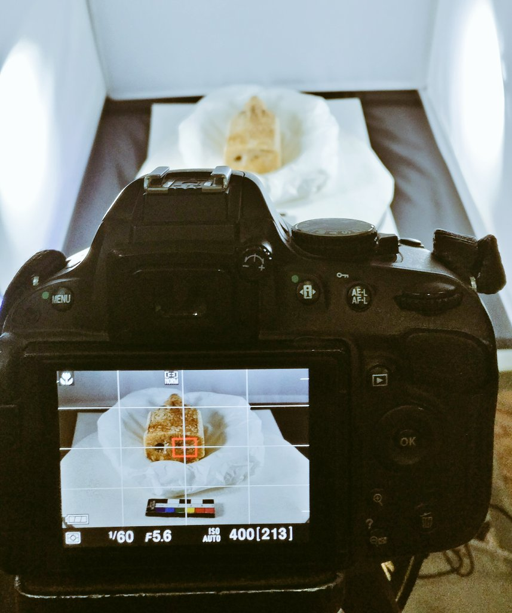

This collection of 3D scans was created for the British Museum's gallery 40, mostly before opening hours. I taught my colleagues
to create scans of these amazing objects in the gallery using teathered capture from a Nikon D5100 or Canon 5D, a turn table and a light box.
The curator for these, Naomi Speakman, was very supportive of the project, and we were able to create a number of scans of the Lewis Chessmen.

My colleagues and friends, Lucy Ellis and Florence Dassonville were taught how to take the images. None of these are perfect, they were a learning 
device for the team, but they are still pretty good. 

For some reason, the Sketchfab collection for the BM has a rogue
scan of Carian stelae. I can't remove that...

  <iframe title="A 3D model playlist from gallery 40" src="https://sketchfab.com/playlists/embed?collection=9bf3b5cabc8d4ddb9a0d51fce0a4d433"  allow="autoplay; fullscreen; vr" mozallowfullscreen="true" webkitallowfullscreen="true"></iframe>

