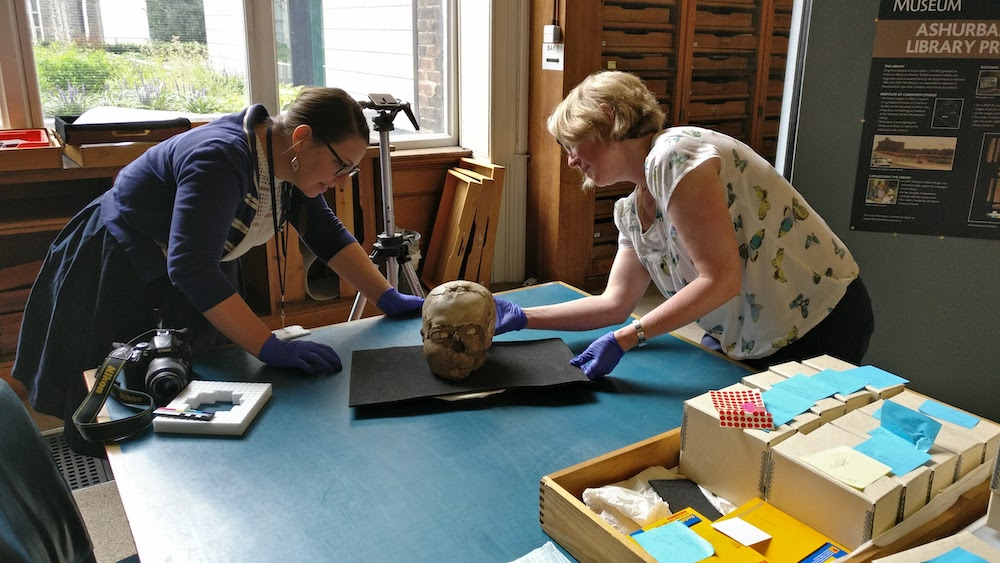

This scan of ancient human remains was produced for Sally Fletcher, to complement
the CT scans she had produced for a room 3 exhibition that focused on the skull. I scanned 
this with Jennifer Wexler, just using a DSLR and mobile phone and processed it in 
Agisoft overnight. 

A plastered human skull; the skull was taken as the base and the features of the face were modelled on it in plaster. 
One eye is made from a bivalve shell divided in two. The other has one, smaller, complete shell in place and is missing its twin.

Culture/period: Pre-Pottery Neolithic B (8500 BC- 6000BC)

Height: 17 centimetres
Width: 14.6 centimetres
Depth: 18 centimetres
Weight: 3.4 kilograms
[Collection online record](http://bit.ly/jerichoSkull3D)

[Google Cultural Institute](https://www.google.com/culturalinstitute/beta/asset/swH1nFuqOHaDLQ)

Created from 138 photographs (Nikon D5100/ OnePlus3 mobile) and Photoscan by Daniel Pett.

    <iframe title="A 3D model of the Jericho Skull"  src="https://sketchfab.com/models/bdcf4843e0964da2931aa7ab1fc1b99d/embed"  allow="autoplay; fullscreen; vr" mozallowfullscreen="true" webkitallowfullscreen="true"></iframe>

