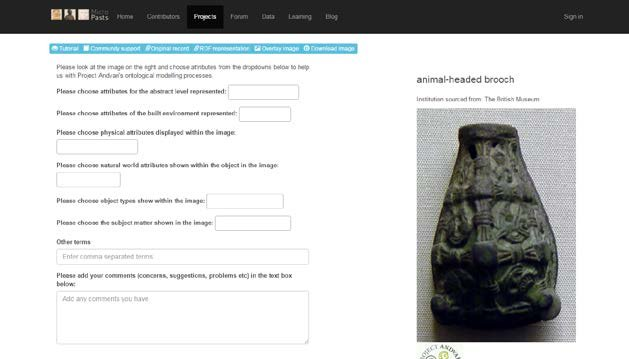

In 2013, I was lucky to be invited to the NEH funded Project Andvari workshop at Catholic University of America, led by Lilla
Kopar and Nancy Wicker (and bring my son and wife for a holiday in Washington DC). 

## The project 

Project Andvari is an international collaborative project designed to create a free digital portal that will provide integrated access to collections of northern European art and artifacts of the early medieval period (4th–12th centuries).

The project title Andvari evokes many of the features of the new research tool. Andvari (Old Norse ‘the careful one’) is the name of a dwarf in Norse mythology, in which dwarves are associated with arts and crafts. Andvari is the collector of a great treasure and a shape-shifter. Thus his character echoes the idea of a digital portal functioning as ‘collector’ or aggregator as well as its utility in the scholarly pursuit of artistic elements transformed across media, regions, and cultures.

Project Andvari has four main objectives:

1. to address the challenge of providing integrated access to the existing but dispersed artifactual record of northern European art of the early medieval period;
2. to augment and enhance existing data and metadata;
3. to allow humanities scholars to study the aggregated material in an interdisciplinary fashion, promoting analyses of relationships (both of artifacts and of cultures) hitherto unrecognized; and
4. to promptly disseminate information about new archaeological discoveries and provide a shared virtual workspace for researchers to examine new finds.

## Rationale

In spite of the wealth of the surviving material culture from early medieval northern Europe, primary materials are often difficult to access because they are scattered in specialized collections and publications with a national or geographical focus. Furthermore, specialists working on artifacts in one medium are often unaware of parallels in another and use different terminology to describe similar elements. Recently, several subsets of material, mainly restricted by medium, object type, or location, have been made available through online databases and catalogues. However, there has been no way to connect these subsets. Furthermore, the search functions of existing databases are oftentimes limiting since they pre-structure material in conventional categories dictated by scholarly traditions. In response to these challenges, we propose a research tool that will help scholars answer a variety of questions that involve broad searches across visual media beyond national and temporal boundaries.

Ultimately, Project Andvari will facilitate interdisciplinary research of the northern periphery of medieval Europe. It will allow users to study visual culture across media and beyond traditional geographical and disciplinary boundaries. Its innovative application of search methods will promote analyses of relationships of artifacts and cultures, and help researchers discover the hitherto unnoticed and unexpected.

The first phase of the project is sponsored by a Digital Humanities Start-Up Grant (Level I) of the National Endowment for the Humanities.

Technical support is provided by The Institute for Advanced Technology in the Humanities of the University of Virginia.

## The Outcome

The final project was derailed by the BM not playing ball with their open linked data. However, 
we did manage to produce a collaborative citizen science project to augment vocabulary.

