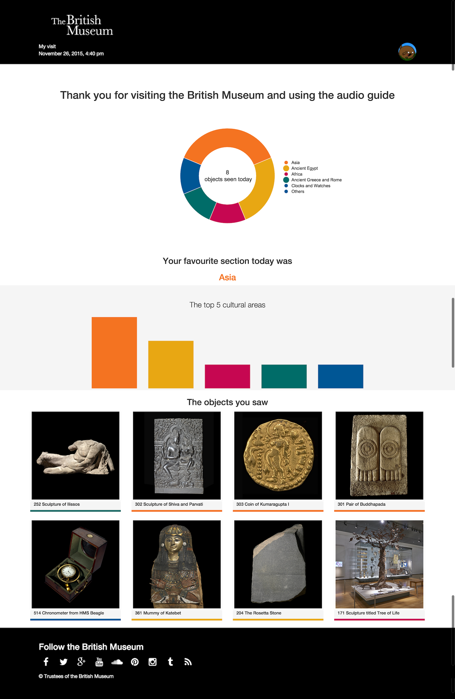

In 2015, I joined the Department of Digital and Publishing at the British Museum. The first project
I was asked to help with, was to create an API for the audio guides endpoint for the public to retrieve 
details of their visit. 

The audio guides project had been written to interface with Contentful, but there was no budget to 
create the public endpoint, so I was asked to do this. I made a simple API using Zend Framework 2 &  Apigility 
framework. 

The basic premise behind this project is this:

* Customer rents audio guide
* Follows trail around museum listening to audio at different stops
* Returns device, which is cleared and data sent via NFC integration
* This POSTS a JSON data file to the API endpoint
* A personalised webpage is generated and an email is sent to the user for them to view.

The JSON file was very simple: 

```json
{
  "email": "no@email.com",
  "locale": "en",
  "started": "2015-11-18 11:35:52",
  "ended": "2015-11-18 11:43:56",
  "subscribed": "false",
  "stops": [
    {
      "stop_id": "4ONf3sj0eIE4IcE0E2GwkO",
      "date_visited": "2015-11-18 11:43:35"
    },
    {
      "stop_id": "1MQ21QWbVCuyI8uGWuIUei",
      "date_visited": "2015-11-18 11:43:28"
    },
    {
      "stop_id": "4xwPhFW54cSAaCaYUuWCwu",
      "date_visited": "2015-11-18 11:43:28"
    },
    {
      "stop_id": "24lu9axfd2QkgcW6c6oYAk",
      "date_visited": "2015-11-18 11:43:28"
    },
    {
      "stop_id": "22626eTuvqSeO0oWEcm8iA",
      "date_visited": "2015-11-18 11:43:28"
    },
    {
      "stop_id": "1tn1NOdQzSIYKG0SoAqea8",
      "date_visited": "2015-11-18 11:43:28"
    },
    {
      "stop_id": "19kfJVj4GUo0Eq48EgoSUO",
      "date_visited": "2015-11-18 11:43:28"
    },
    {
      "stop_id": "2nvxSuLlJaqAK8qyYWwac0",
      "date_visited": "2015-11-18 11:43:28"
    },
    {
      "stop_id": "6Wr8NhErvOksagusSoa24k",
      "date_visited": "2015-11-18 11:43:28"
    },
    {
      "stop_id": "3cCkxzlla0imO2Q68CSmcY",
      "date_visited": "2015-11-18 11:43:28"
    },
    {
      "stop_id": "3J1Cm7YIIo4oOu2cuoWI0O",
      "date_visited": "2015-11-18 11:43:28"
    },
    {
      "stop_id": "60sn0B0XQsGuekigoq0e2y",
      "date_visited": "2015-11-18 11:43:28"
    }
  ]
}
```
The contentful stop id, and the date visited. The API then used the stop ID to get further data. 

The page they saw looked like the below: 



The consumer would receive the email in one of the languages that the system supported, 
and the page would be in the same language and present as LTR or RTL depending on the language. They could 
click on the object and get further details. 

The API allowed [simple analytics](https://github.com/portableant/audioGuideExtractorInRstats) to be done via R stats 
using a MYSQL connection. 

## How did the tech work at the back end?

1. NFC tag read by the returning desk 
2. Data sent to the API as a JSON file 
3. API saves the data to a database
4. Web page would pull data from Contentful system and present the web page 

The project's code has been deleted from the GitHub repository I set up for the BM, but the code 
is available via Zenodod and on my personal repository account. 