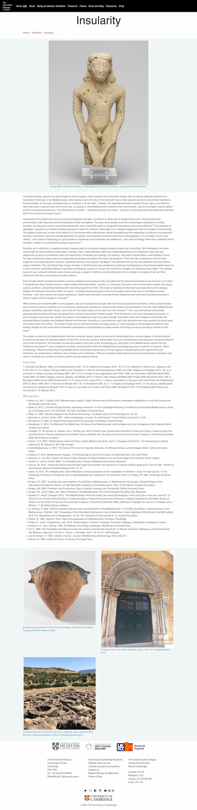

I've been lucky to work on this project with my friend and 
ex-colleague Anastasia Christophilopolou over the last couple of years. She 
has a large exhibition that will be installed in the Fitzwilliam Museum in 2023
(substantially delayed due to pandemic working and museum management machinations). Work from 
the AHRC funded Linking Islands of Data project and CEEF 3D fellowships were set to feed into exhibition preparation and this 
included:

1. Development of tactile 3D objects for the exhibition (we created a large 3D cast of the Dionysos of Salmis torso)
2. Development of a Museum in a Box installation by Jennifer Wexler, which focused on Winifred Lamb and travelling objects
3. Creation of a dedicated exhibition/research website, controlled and created by the curatorial team
4. Enriched museum collections records - maps, metadata

All of the above were achieved and delivered as part of our work, often with lukewarm 
institutional response; innovative elements were blocked from being delivered - for example
a virtual reality installation and a collaboration with a large gaming corporation - due to 
lack of vision from leadership. 

## Project website 

The project website followed the tried and tested Egyptian Coffins project framework using 
Jekyll to deliver a research component for Anastasia's work. Working together, I taught her
how to create, update and maintain her digital presence for the project, store images on 
the Museum's Directus 8 instance and to be digitally independent. The website covers a wide
variety of aspects - team membership, research topics, archaeological information, basic exhibition
information and maps. 

## Traveling objects Museum in a Box

As part of the AHRC CEEF3D fellowships, my colleague Jennifer Wexler built a collection of objects
and content using 3d prints, voice overs (with Hannah Platts as Winifred Lamb) and other techniques to produce a box for self discovery around the themes 
for the exhibition. 

## Mapping antiquity

A very quick outcome from rebuilding the collections database for the Fitzwilliam was 
the ability to repurpose and reuse data easily. This enabled the generation of the mapping interface
below, which uses geocoded archaeological objects from the Antiquities department, and provides
faceted access to information. This intervention made use of British Library funded Peripleo
software, and I worked with Elton Barker and Rainer Simon to create a version that suited our needs.

    <iframe src="https://mapping-antiquity.fitzmuseum.cam.ac.uk/#/?/?/?/mode=points" 
        title="Mapping True to Nature" 
        allowfullscreen></iframe>

