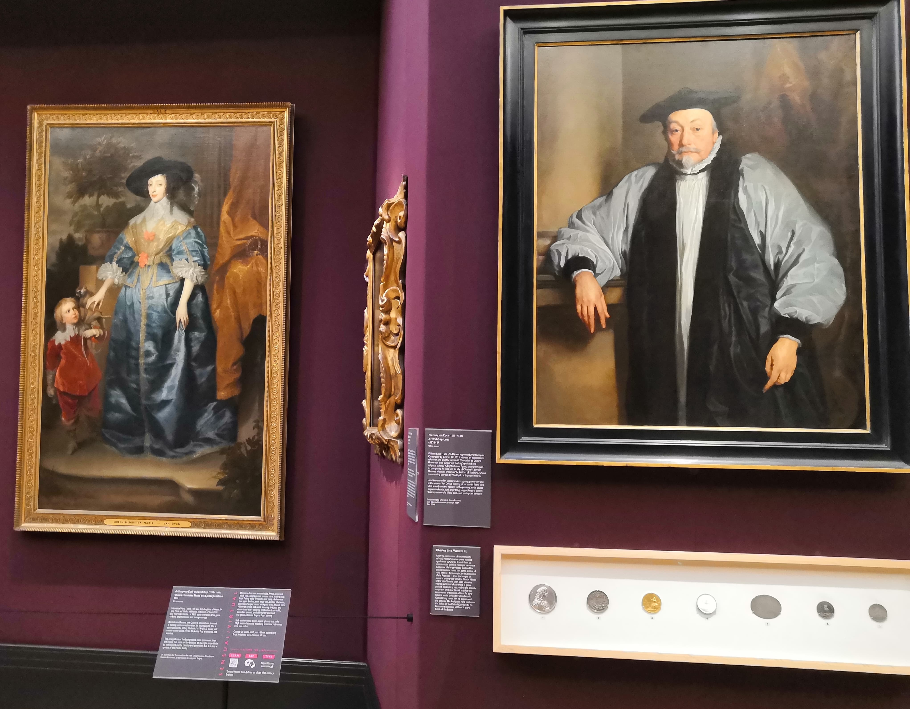
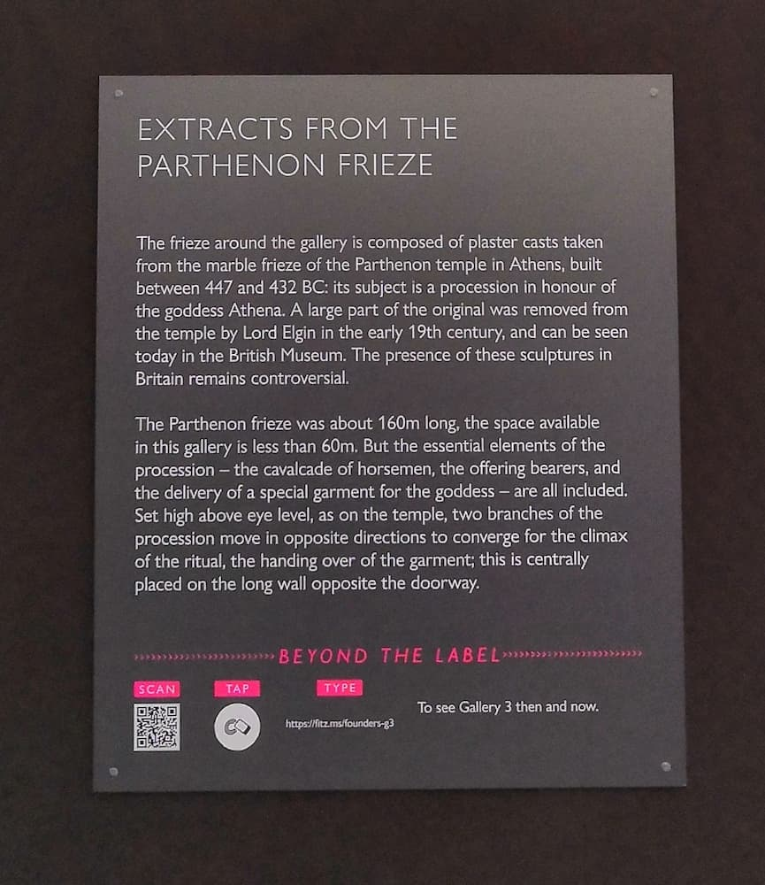
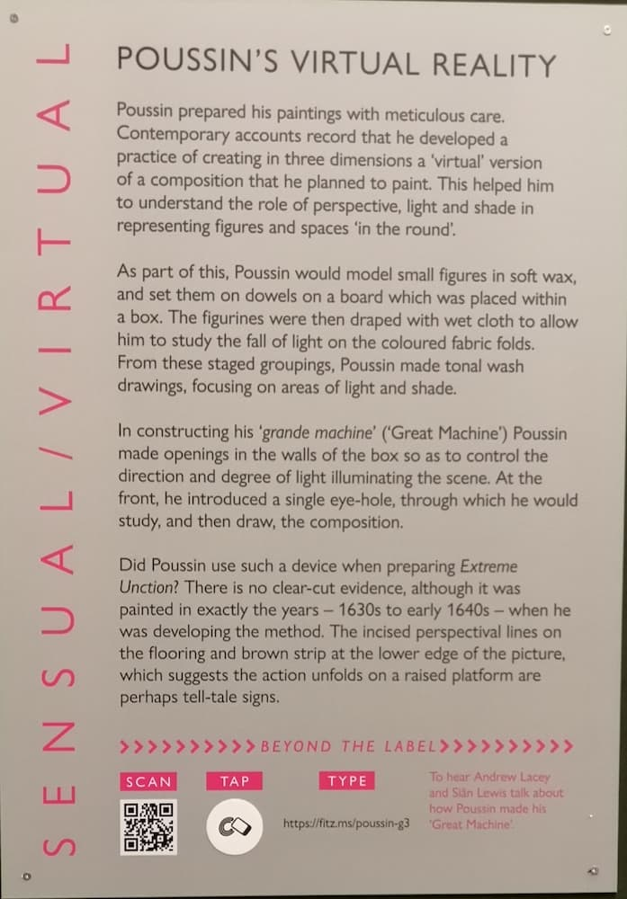

This project was a rapid sprint development of a digital intervention for the refurbished Gallery 3,
the Fitzwilliam Museum's flagship gallery. We had been given the task by the gallery's curator, Jane Munro, to find a 
method to give visitors the chance to find out further information on the objects using digital means. 

This project was given the name "Beyond the Label" and was created with my colleagues from my department (George Doji and
Rosie Forrest) and the curatorial team and a guest writer. It built on projects we'd seen elsewhere and didn't really 
bring anything new to the world of museology... but it was a fun project to work on.

#### Beyond the Label: Scan, tap, type

The below is how we described the project on the website:

A new digital intervention in the Fitzwilliam Museum has been released as part of the celebrated refurbishment of Gallery 3. Within this glorious space, the museum’s Digital and Curatorial teams have collaborated to create a  ‘bring your own device’ (BYOD) experience, which enables the visitor to access enhanced information about key objects displayed within this gallery and one object found in the Courtauld.

Enhanced information is accessed through the visitor’s smart phone using 3 methods of interaction – QR codes, Near Field Communication chips (NFC) or by typing in a short URL – which has been compiled on a [simple website](https://beyondthelabel.fitzmuseum.cam.ac.uk) accessible on and off the museum estate. Combining the methods on one label ensures that as many visitors as possible are able to experience the enhanced content in-gallery.

These pages enable the visitor to discover assets from the Museum’s digital archives, from newly commissioned photography and collaboratively written essays with colleagues from the University. To build on the public’s sense-of-wonder at the physical objects, they can use several of their senses to engage on a virtual level with masterpieces from Keats, Poussin, Gainsborough, van Dyck and Mytens.

This project is very much an experimental, but reproducible digital project which was developed in just 2 weeks, with the only cost being the NFC enabled stickers, which are found behind the labels – a grand total of £2.75 – and uses open source code to create a website that other museums could reuse and adapt. The technology is not that innovative, having been used in many museums and cultural settings around the world, but is steadily becoming more ubiquitous. This work builds upon recently funded AHRC research projects that the museum has been pursuing and brings elements of the technologies explored by our post-doctoral researchers to bear within the galleries of the museum.

## How did it work? 

Very simple. 

1. Build Jekyll website with mobile by default interface 
2. Use an instance of URL shortener ([yoururls](https://yourls.org/)) to create links for each piece of work
3. Generate QR code (we used [QR code monkey](https://www.qrcode-monkey.com/)) or NFC sticker for each piece of work (I bought ours from [https://zipnfc.com/](https://zipnfc.com/) - never got the money back)
4. QR codes printed on labels and NFC stickers placed behind the labels under a touch icon (probably best to get them printed professionally as colours fade...)
5. Hope people use them...either by scanning the QR code or tapping the NFC sticker or [typing a url such as fitz.ms/founders-g3](https://fitz.ms/founders-g3)

## Example labels

## Was it used? 

The statistics gathered, show that take up was actually pretty low. Marketing for the feature was pretty non
existent, and the paucity of good wifi signal hampered uptake. 

The table below shows the poor volume of use up to September 2022 (first use October 1, 2019).

| URL             | QR destination                                                                                               | Total |
|-----------------|--------------------------------------------------------------------------------------------------------------|-------|
| focus-g3        | [Heneage Lloyd and his sisters](https://beyondthelabel.fitzmuseum.cam.ac.uk/labels/painting-in-focus)        | 139   |
 | southampton-g3  | [Elizabeth Vernon, Countess of Southampton](https://beyondthelabel.fitzmuseum.cam.ac.uk/labels/southampton)  | 322   |
| silks-g3        | [Going in silks](https://beyondthelabel.fitzmuseum.cam.ac.uk/labels/going-in-silks)                          | 42    |
| charles-g3      | [Portrait of Charles I](https://beyondthelabel.fitzmuseum.cam.ac.uk/labels/going-in-silks)                   | 153   |
| henriett-g3     | [Queen Henrietta Maria](https://beyondthelabel.fitzmuseum.cam.ac.uk/labels/going-in-silks)                   | 136   |
| basevi-g3       | [George Basevi and the Parthenon frieze](https://beyondthelabel.fitzmuseum.cam.ac.uk/labels/g3-then-and-now) | 2     |
| founders-g3     | [Founder's Building](https://beyondthelabel.fitzmuseum.cam.ac.uk/labels/g3-then-and-now)                     | 330   |
| sensual-g3      | [Introduction to Sensual/Virtual theme](https://beyondthelabel.fitzmuseum.cam.ac.uk/labels/sensual-virtual)  | 1     |
| poussin-g3      | [Poussin's virtual reality](https://beyondthelabel.fitzmuseum.cam.ac.uk/labels/poussin)                      | 76    |
| ode-g3          | [Ode to a Nightingale](https://beyondthelabel.fitzmuseum.cam.ac.uk/labels/nightingale)                       | 79    |
| handel-g3       | [Statuette of Georg Frederic Handel](https://beyondthelabel.fitzmuseum.cam.ac.uk/labels/handel)              | 769   |
| pamela-g3       | [Pamela and Mr B](https://beyondthelabel.fitzmuseum.cam.ac.uk/labels/pamela-and-mr-b)                        | 43    |
| before-after-g3 | [Before and After](https://beyondthelabel.fitzmuseum.cam.ac.uk/labels/before-and-after)                      | 128   |

## What did we learn?

1. Promotion is key, build it and they will come will not work, tell people about it.
2. Instructions, if you provide easy to follow instructions, people will use it (see the gif of instructions from XYFI)
3. Location of interactives is important, put them out of reach and they won't get used
4. The least used codes are in doorways (intro to Sensual theme) and on an inaccessible balcony where wifi is poor
5. The most used codes are on the transit route to galleries eg Handel
6. If your audience is not very mobile device ready, then will it work?
7. Make your content interesting...
8. Use special NFC stickers if near metal backing
9. Lock your NFC stickers 
10. Remember to install the stickers before deployment, lucky George had one in her handbag at the launch event.

## Did this inspire anything else?

The University of Cambridge Museums team took this a little bit further and created [labels for museum remix](https://www.museums.cam.ac.uk/blog/2022/01/06/to-qr-or-nfc-that-is-the-question/), 
but the blogpost fails to acknowledge the work that went on here first (which was inspired by other work elsewhere anyway.)
Here's a video to show what their labels did - simple instructions are key. 

    <iframe src="https://www.youtube.com/embed/C-SaHHZM1m8" title="YouTube video player" allow="accelerometer; autoplay; clipboard-write; encrypted-media; gyroscope; picture-in-picture" allowfullscreen></iframe>

