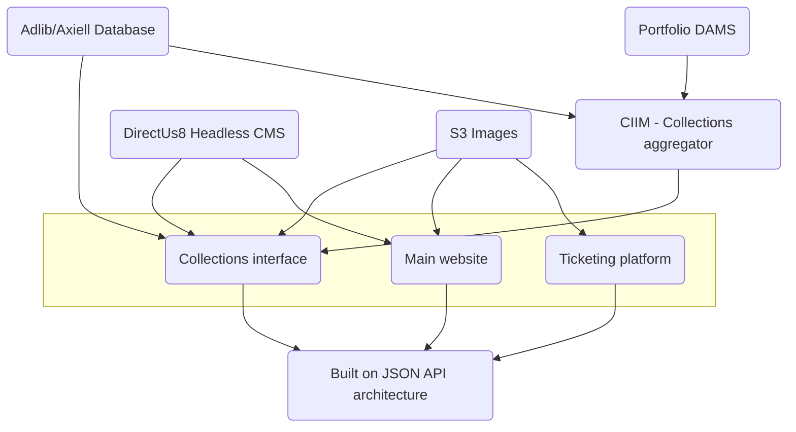
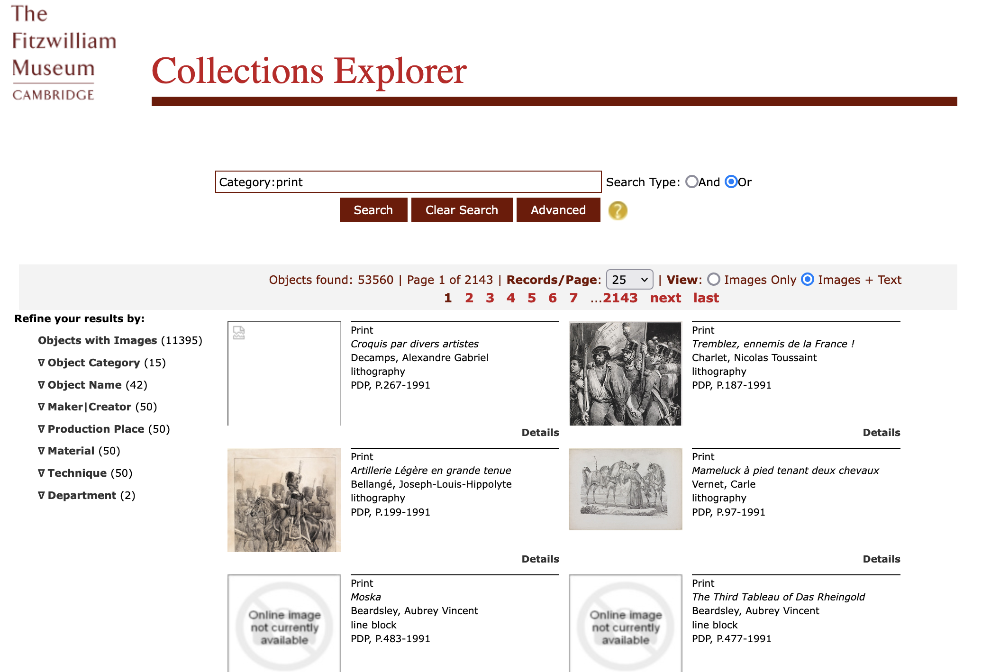
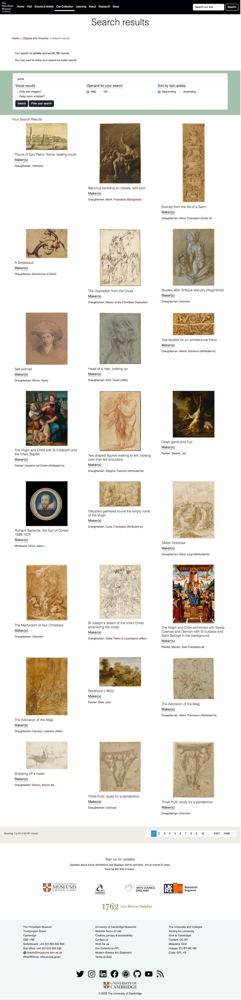
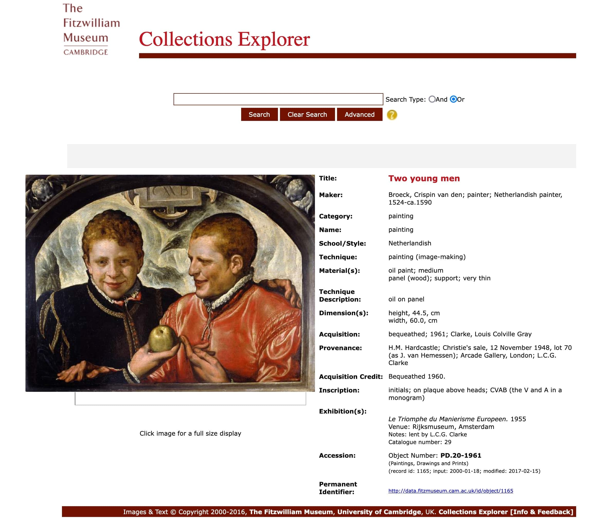
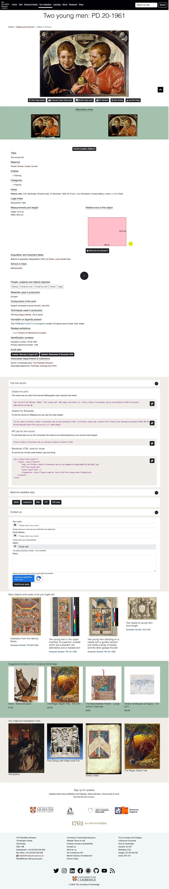
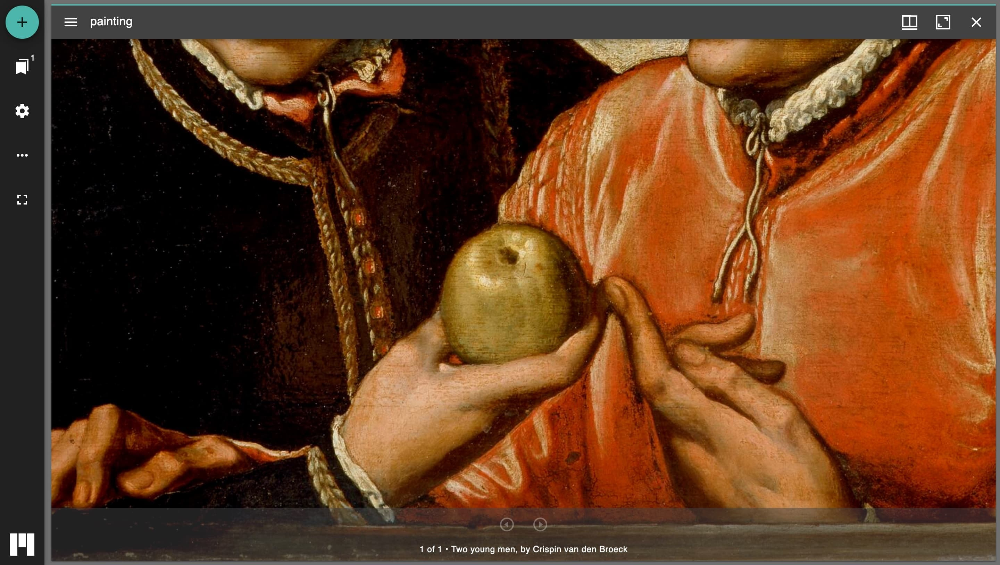
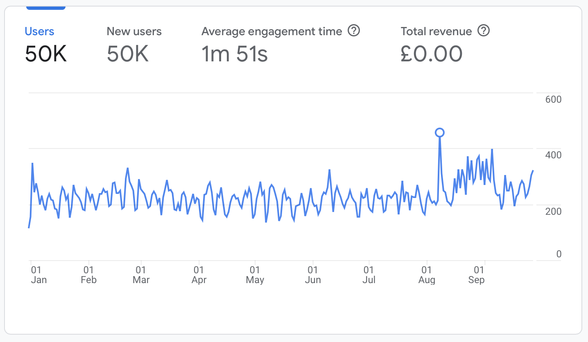

After joining the Fitzwilliam I inherited the aging Collections Explorer system, with partially 
complete work to create a new interface between Adlib, Portfolio and Knowledge Integration's CIIM software.
Within a short period of time, the University security team informed my team that the system had been compromised 
by a remote code injection that was spreading malicious code to all and sundry. 

With my team and management, we took the decision to remove the system from public use until we had a minimum viable product 
working with Knowledge Integration's CIIM (elastic search endpoint), which would allow me to have a foundation on which to 
build a new system. Unfortunately, I lost one of the key people in the process, our excellent Captain Adlib, Rosie Forrest who got 
a new role in Scotland; her moving meant some mappings of data between Adlib/Axiell Collections and data enrichment 
didn't get implemented (so some firewalled use of the Axiell API was used to show things like object location at low level detail.)
However before she left, she managed to upgrade the museum from Adlib to Axiell Collections in a matter of weeks 
to enable remote working during the pandemic - what should have taken a year was done in days. :fire:

## How this system works

Collections explorer, the collections interface, the database or whatever
you want to call the fundamental bedrock of Fitzwilliam digital, is the most complex bit of architecture
that the museum runs. It is the most important piece of the infrastructure, it provides
the basis for the museum to:

* effectively communicate what it holds
* comply with accreditation requirements
* provide a searchable database of collections and objects
* enable social media story telling

## How was it built?

The collection project was built entirely by me and sits on top of several systems and was
created rapidly in the space of a few days using the Laravel framework (starting at version 7, now on version 9.)
Lots of moving parts of digital architecture exist for this project as shown in this diagram.




The basic gist of the system is this:
* Collections information is retrieved from the CIIM software run on our behalf by Knowledge Integration (CIIM), which is an elastic search
endpoint. 
* This integration pulls data from Axiell Collections (Adlib), Portfolio image management and presents as a JSON
API. 
* This is then consumed by a [Laravel 9 project](https://github.com/FitzwilliamMuseum/fitz-collection-online) deployed to an AWS EC2 server, 
using Blade templating, Redis caching and RDF generation. Endpoints are restricted for IP address access - e.g. 
ElasticSearch CIIM, Solr cluster, Adlib.
* Code is all library driven - e.g. ElasticPHP library, so easy for people to pick up if they take over product development/management

## Visual change 









## What features did this MVP have?

I took a lot of inspiration from previous work I had done at the BM for the PAS and on API research, and
I was inspired by generous interface thinking (see Mitchell Whitelaw's work); Nomisma, the Getty, Yale and V&A and not by the BM or the Ashmolean. 
What I wanted to have was as much information available to researchers as possible. 

* IIIF deep zooming images - served using IIIP Server and KINT's IIIF generator
  * Mirador
  * Universal Viewer 
  * A port of CogApp's Slow Looking concept
* Cool URIS (using persistent identifiers that date back to early 2000s)
* OAI-PMH - served using KINT system
* An authenticated JSON API - built with full documentation and Postman collection and Sanctum token generation
* Exportable data
  * JSON
  * XML
  * Linked Art implementation
* [Twitter Bot](https://twitter.com/fitzartbot) (though the Royal funeral was used as a reason to decommission it)
* Random image generator as a Chrome extension
* WordPress plugin for displaying images on blogs
* Citation generator - Harvard, Wikipedia 
* Twitter cards & OpenGraph implementation
* Microformats (remember that?)
* Data exported from the system to GitHub en masse



## An example of Linked Art implementation 

The system now pushes out data mapped to the LinkedArt standard, which is a JSON-LD implementation of the CIDOC CRM.
Every single record is now available as a LinkedArt JSON-LD file, which can be used by other systems to consume the data, and 
where possible, links to other resources were included. I rushed this before I left the Fitzwilliam 
so don't judge me on the code :blush:

```json
{
  "@context": "https://linked.art/ns/v1/linked-art.json",
  "id": "https://data.fitzmuseum.cam.ac.uk/id/object/1165",
  "type": "HumanMadeObject",
  "_label": "Two young men",
  "classified_as": [
    {
      "id": "https://data.fitzmuseum.cam.ac.uk/id/terminology/term-106226",
      "type": "Type",
      "_label": "painting",
      "classified_as": {
        "id": "https://vocab.getty.edu/aat/300435444",
        "type": "Type",
        "_label": "Classification (Category)"
      }
    },
    {
      "id": "https://data.fitzmuseum.cam.ac.uk/id/terminology/term-9005",
      "type": "Type",
      "_label": "Netherlandish",
      "classified_as": {
        "id": "https://vocab.getty.edu/aat/300055768",
        "type": "Type",
        "_label": "Culture"
      }
    },
    {
      "id": "https://vocab.getty.edu/aat/300133025",
      "type": "Type",
      "_label": "Work of Art"
    },
    {
      "id": "https://data.getty.edu/local/thesaurus/object-record-structure-whole",
      "type": "Type",
      "_label": "Object Record Structure: Whole",
      "classified_as": {
        "id": "https://data.getty.edu/local/thesaurus/object-record-structure-type",
        "type": "Type",
        "_label": "Object Record Structure Type"
      }
    }
  ],
  "identified_by": [
    {
      "id": "https://data.fitzmuseum.cam.ac.uk/id/object/1165/identifiers/title",
      "type": "Title",
      "classified_as": [
        {
          "id": "https://vocab.getty.edu/aat/300417193",
          "type": "Name",
          "_label": "Titles (General, Names)"
        },
        {
          "id": "https://vocab.getty.edu/aat/300404670",
          "type": "Type",
          "_label": "Preferred Term"
        }
      ],
      "content": "Two young men",
      "language": [
        {
          "id": "https://vocab.getty.edu/aat/300388277",
          "type": "Language",
          "_label": "English"
        }
      ]
    },
    {
      "id": "https://data.fitzmuseum.cam.ac.uk/id/object/1165/identifiers/accession_number",
      "type": "Identifier",
      "classified_as": [
        {
          "id": "https://vocab.getty.edu/aat/300404626",
          "type": "Type",
          "_label": "Identification Number"
        },
        {
          "id": "https://vocab.getty.edu/aat/300312355",
          "type": "Type",
          "_label": "Accession Number"
        },
        {
          "id": "https://vocab.getty.edu/aat/300404670",
          "type": "Type",
          "_label": "Preferred Term"
        }
      ],
      "content": "PD.20-1961"
    },
    {
      "id": "https://data.fitzmuseum.cam.ac.uk/id/object/1165/identifiers/priref",
      "type": "Identifier",
      "classified_as": [
        {
          "id": "https://vocab.getty.edu/aat/300404626",
          "type": "Type",
          "_label": "Primary Reference"
        },
        {
          "id": "https://vocab.getty.edu/aat/300404626",
          "type": "Type",
          "_label": "Identification Number"
        }
      ],
      "content": "1165"
    },
    {
      "id": "https://data.fitzmuseum.cam.ac.uk/id/object/1165/identifiers/axiell_system_number",
      "type": "Identifier",
      "classified_as": [
        {
          "id": "https://vocab.getty.edu/page/aat/300417447",
          "type": "Type",
          "_label": "Axiell System Identifier"
        }
      ],
      "content": "object-1165"
    }
  ],
  "referred_to_by": [
    {
      "id": "https://data.fitzmuseum.cam.ac.uk/id/object/1165/credit_line",
      "type": "LinguisticObject",
      "_label": "Source Credit Line",
      "classified_as": [
        {
          "id": "https://vocab.getty.edu/aat/300435418",
          "type": "Type",
          "_label": "Credit Line"
        },
        {
          "id": "https://vocab.getty.edu/aat/300404764",
          "type": "Type",
          "_label": "Sources (General Concept)"
        },
        {
          "id": "https://vocab.getty.edu/aat/300418049",
          "type": "Type",
          "_label": "Brief Text"
        }
      ],
      "content": "Owned by The Chancellor, Masters, and Scholars of the University of Cambridge"
    },
    {
      "id": "https://data.fitzmuseum.cam.ac.uk/id/object/1165/legal",
      "type": "LinguisticObject",
      "_label": "Source Credit Line",
      "classified_as": [
        {
          "id": "https://vocab.getty.edu/aat/300435418",
          "type": "Type",
          "_label": "Credit Line"
        },
        {
          "id": "https://vocab.getty.edu/aat/300404764",
          "type": "Type",
          "_label": "Sources (General Concept)"
        },
        {
          "id": "https://vocab.getty.edu/aat/300418049",
          "type": "Type",
          "_label": "Brief Text"
        }
      ],
      "content": "Bequeathed 1960."
    },
    {
      "id": "https://data.fitzmuseum.cam.ac.uk/id/object/1165/dimensionsStatement",
      "type": "LinguisticObject",
      "_label": "Dimensions Statement",
      "classified_as": [
        {
          "id": "https://vocab.getty.edu/aat/300435430",
          "type": "Type",
          "_label": "Dimensions Description"
        },
        {
          "id": "https://vocab.getty.edu/aat/300418049",
          "type": "Type",
          "_label": "Brief Text"
        }
      ],
      "content": "60.0 cm Width 44.5 cm Height"
    },
    {
      "id": "https://data.fitzmuseum.cam.ac.uk/id/object/1165/object_type",
      "type": "LinguisticObject",
      "_label": "Object Type",
      "classified_as": [
        {
          "id": "https://vocab.getty.edu/aat/300435443",
          "type": "Type",
          "_label": "Object/Work Type (Category)"
        },
        {
          "id": "https://vocab.getty.edu/aat/300418049",
          "type": "Type",
          "_label": "Brief Text"
        }
      ],
      "content": "painting"
    }
  ],
  "dimension": [
    {
      "id": "https://data.fitzmuseum.cam.ac.uk/id/object/1165/dimensions/Height",
      "type": "Dimension",
      "classified_as": [
        {
          "id": "https://vocab.getty.edu/aat/300055644",
          "type": "Type",
          "_label": "Height"
        }
      ],
      "value": 44,
      "unit": {
        "id": "https://vocab.getty.edu/aat/300379098",
        "type": "MeasurementUnit",
        "_label": "cm"
      }
    },
    {
      "id": "https://data.fitzmuseum.cam.ac.uk/id/object/1165/dimensions/Width",
      "type": "Dimension",
      "classified_as": [
        {
          "id": "https://vocab.getty.edu/aat/300055647",
          "type": "Type",
          "_label": "Width"
        }
      ],
      "value": 60,
      "unit": {
        "id": "https://vocab.getty.edu/aat/300379098",
        "type": "MeasurementUnit",
        "_label": "cm"
      }
    }
  ],
  "produced_by": {
    "id": "https://data.fitzmuseum.cam.ac.uk/id/object/1165/production",
    "type": "Production",
    "_label": "Production of Artwork",
    "timespan": [],
    "carried_out_by": [
      {
        "id": "https://data.fitzmuseum.cam.ac.uk/id/terminology/agent-18314",
        "type": "Person",
        "_label": "Broeck, Crispin van den",
        "referred_to_by": [
          {
            "id": "https://data.fitzmuseum.cam.ac.uk/id/object/1165/maker/b302e03b-632d-3382-9b2a-d47bfd49caad",
            "type": "Type",
            "_label": "Painter",
            "classified_as": [
              {
                "id": "https://data.getty.edu/local/thesaurus/producer-role-statement",
                "type": "Type",
                "_label": "Artist/Maker (Producer) Role Statement"
              },
              {
                "id": "https://vocab.getty.edu/aat/300418049",
                "type": "Type",
                "_label": "Brief Text"
              }
            ],
            "content": "Artists (Visual Artists)",
            "close_match": {
              "id": "https://vocab.getty.edu/aat/300025103",
              "type": "Type",
              "_label": "Artists (Visual Artists)"
            }
          }
        ]
      }
    ]
  },
  "current_keeper": [
    {
      "id": "https://data.fitzmuseum.cam.ac.uk/id/departments/Paintings,%20Drawings%20and%20Prints",
      "type": "Groups",
      "_label": "Paintings, Drawings and Prints",
      "format": [
        "application/ld+json;"
      ],
      "LinguisticObject": {
        "id": "https://vocab.getty.edu/aat/300263534",
        "type": "Type",
        "_label": "Department"
      }
    }
  ],
  "current_location": {
    "id": "https://vocab.getty.edu/ulan/500219279",
    "type": "Place",
    "_label": "Display Fitzwilliam Museum Gallery 8",
    "classified_as": [
      {
        "id": "https://vocab.getty.edu/aat/300240057",
        "type": "Type",
        "_label": "Galleries (Display Spaces) [Object On Display]"
      }
    ]
  },
  "current_owner": [
    {
      "id": "https://vocab.getty.edu/ulan/500219279",
      "type": "Group",
      "_label": "The Fitzwilliam Museum",
      "classified_as": [
        {
          "id": "https://vocab.getty.edu/aat/300312281",
          "type": "Type",
          "_label": "Museum"
        }
      ],
      "member_of": [
        {
          "id": "https://vocab.getty.edu/ulan/500247221",
          "type": "Group",
          "_label": "The University of Cambridge",
          "classified_as": [
            {
              "id": "https://vocab.getty.edu/ulan/500000003",
              "type": "Type",
              "_label": "Corporate Body"
            }
          ]
        }
      ],
      "subject_of": [
        {
          "id": "https://fitzmuseum.cam.ac.uk",
          "type": "LinguisticObject",
          "_label": "Homepage for the Museum",
          "classified_as": [
            {
              "id": "https://vocab.getty.edu/aat/300264578",
              "type": "Type",
              "_label": "Web Page"
            },
            {
              "id": "https://vocab.getty.edu/aat/300404670",
              "type": "Type",
              "_label": "Primary"
            }
          ],
          "format": "text/html"
        }
      ],
      "exact_match": [
        {
          "id": "https://www.wikidata.org/wiki/Q1421440",
          "type": "Type",
          "_label": "The Fitzwilliam Museum"
        }
      ]
    }
  ],
  "subject_of": [
    {
      "id": "https://data.fitzmuseum.cam.ac.uk/id/object/1165",
      "type": "LinguisticObject",
      "_label": "Fitzwilliam Homepage for PD.20-1961",
      "digitally_carried_by": [
        {
          "id": "https://data.fitzmuseum.cam.ac.uk/id/object/1165",
          "type": "DigitalObject",
          "_label": "Fitzwilliam Homepage for PD.20-1961",
          "format": "text/html",
          "access_point": [
            {
              "id": "https://data.fitzmuseum.cam.ac.uk/id/object/1165",
              "type": "DigitalObject",
              "format": [
                "application/ld+json"
              ]
            }
          ],
          "classified_as": [
            {
              "id": "https://vocab.getty.edu/aat/300264578",
              "type": "Type",
              "_label": "Web Page"
            }
          ],
          "identified_by": [
            {
              "id": "https://data.fitzmuseum.cam.ac.uk/id/object/1165",
              "type": "Name",
              "content": "Fitzwilliam Museum homepage for PD.20-1961: Two young men"
            }
          ]
        }
      ]
    },
    {
      "id": "https://api.fitz.ms/data-distributor/iiif/object-1165/manifest",
      "type": "InformationObject",
      "_label": "IIIF Manifest for PD.20-1961: Two young men",
      "classified_as": [
        {
          "id": "https://data.getty.edu/local/thesaurus/iiif-manifest",
          "type": "Type",
          "_label": "IIIF Manifest"
        }
      ],
      "conforms_to": [
        {
          "id": "https://iiif.io/api/presentation",
          "type": "InformationObject",
          "_label": "IIIF Presentation API"
        }
      ],
      "format": "application/ld+json;profile='https://iiif.io/api/presentation/2/context.json'"
    }
  ],
  "representation": [
    {
      "id": "https://data.fitzmuseum.cam.ac.uk/imagestore/pdp/pdp2/PD_20_1961.jpg",
      "type": "VisualItem",
      "_label": "A representation of the artwork",
      "classified_as": {
        "id": "https://vocab.getty.edu/aat/300215302",
        "type": "Type",
        "_label": "Digital Image"
      },
      "format": "image/jpeg",
      "dimension": [
        {
          "id": "https://data.fitzmuseum.cam.ac.uk/imagestore/pdp/pdp2/PD_20_1961.jpg",
          "type": "Dimension",
          "classified_as": [
            {
              "id": "https://vocab.getty.edu/aat/300055644",
              "type": "Type",
              "_label": "Height"
            }
          ],
          "value": 565,
          "unit": {
            "id": "https://vocab.getty.edu/aat/300266190",
            "type": "MeasurementUnit",
            "_label": "pixels"
          }
        },
        {
          "id": "https://data.fitzmuseum.cam.ac.uk/imagestore/pdp/pdp2/PD_20_1961.jpg",
          "type": "Dimension",
          "classified_as": [
            {
              "id": "https://vocab.getty.edu/aat/300055647",
              "type": "Type",
              "_label": "Width"
            }
          ],
          "value": 760,
          "unit": {
            "id": "https://vocab.getty.edu/aat/300266190",
            "type": "MeasurementUnit",
            "_label": "pixels"
          }
        }
      ],
      "access_point": [
        {
          "id": "https://data.fitzmuseum.cam.ac.uk/imagestore/pdp/pdp2/PD_20_1961.jpg",
          "type": "DigitalObject"
        }
      ]
    },
    {
      "id": "https://data.fitzmuseum.cam.ac.uk/imagestore/portfolio/F25982D9_7CB9_CFFF_028E_8BBFC531887C/591/808/large_PD_20_1961_mas.jpg",
      "type": "VisualItem",
      "_label": "A representation of the artwork",
      "classified_as": {
        "id": "https://vocab.getty.edu/aat/300215302",
        "type": "Type",
        "_label": "Digital Image"
      },
      "format": "image/jpeg",
      "dimension": [
        {
          "id": "https://data.fitzmuseum.cam.ac.uk/imagestore/portfolio/F25982D9_7CB9_CFFF_028E_8BBFC531887C/591/808/large_PD_20_1961_mas.jpg",
          "type": "Dimension",
          "classified_as": [
            {
              "id": "https://vocab.getty.edu/aat/300055644",
              "type": "Type",
              "_label": "Height"
            }
          ],
          "value": 812,
          "unit": {
            "id": "https://vocab.getty.edu/aat/300266190",
            "type": "MeasurementUnit",
            "_label": "pixels"
          }
        },
        {
          "id": "https://data.fitzmuseum.cam.ac.uk/imagestore/portfolio/F25982D9_7CB9_CFFF_028E_8BBFC531887C/591/808/large_PD_20_1961_mas.jpg",
          "type": "Dimension",
          "classified_as": [
            {
              "id": "https://vocab.getty.edu/aat/300055647",
              "type": "Type",
              "_label": "Width"
            }
          ],
          "value": 1024,
          "unit": {
            "id": "https://vocab.getty.edu/aat/300266190",
            "type": "MeasurementUnit",
            "_label": "pixels"
          }
        }
      ],
      "access_point": [
        {
          "id": "https://data.fitzmuseum.cam.ac.uk/imagestore/portfolio/F25982D9_7CB9_CFFF_028E_8BBFC531887C/591/808/PD_20_1961_mas.jpg",
          "type": "DigitalObject"
        }
      ]
    },
    {
      "id": "https://data.fitzmuseum.cam.ac.uk/imagestore/portfolio/F25982D9_7CB9_CFFF_028E_8BBFC531887C/631/592/large_PD_20_1961_dc1.jpg",
      "type": "VisualItem",
      "_label": "A representation of the artwork",
      "classified_as": {
        "id": "https://vocab.getty.edu/aat/300215302",
        "type": "Type",
        "_label": "Digital Image"
      },
      "format": "image/jpeg",
      "dimension": [
        {
          "id": "https://data.fitzmuseum.cam.ac.uk/imagestore/portfolio/F25982D9_7CB9_CFFF_028E_8BBFC531887C/631/592/large_PD_20_1961_dc1.jpg",
          "type": "Dimension",
          "classified_as": [
            {
              "id": "https://vocab.getty.edu/aat/300055644",
              "type": "Type",
              "_label": "Height"
            }
          ],
          "value": 773,
          "unit": {
            "id": "https://vocab.getty.edu/aat/300266190",
            "type": "MeasurementUnit",
            "_label": "pixels"
          }
        },
        {
          "id": "https://data.fitzmuseum.cam.ac.uk/imagestore/portfolio/F25982D9_7CB9_CFFF_028E_8BBFC531887C/631/592/large_PD_20_1961_dc1.jpg",
          "type": "Dimension",
          "classified_as": [
            {
              "id": "https://vocab.getty.edu/aat/300055647",
              "type": "Type",
              "_label": "Width"
            }
          ],
          "value": 1023,
          "unit": {
            "id": "https://vocab.getty.edu/aat/300266190",
            "type": "MeasurementUnit",
            "_label": "pixels"
          }
        }
      ],
      "access_point": [
        {
          "id": "https://data.fitzmuseum.cam.ac.uk/imagestore/portfolio/F25982D9_7CB9_CFFF_028E_8BBFC531887C/631/592/PD_20_1961_dc1.jpg",
          "type": "DigitalObject"
        }
      ]
    }
  ],
  "carries": [
    {
      "id": "https://data.fitzmuseum.cam.ac.uk/id/object/1165/inscription/1",
      "type": "LinguisticObject",
      "classified_as": [
        {
          "id": "https://vocab.getty.edu/aat/300435414",
          "type": "Type",
          "_label": "Inscription Description"
        },
        {
          "id": "https://vocab.getty.edu/aat/300418049",
          "type": "Type",
          "_label": "Brief Text"
        }
      ],
      "content": "CVAB  (the V and A in a monogram) on plaque above heads."
    }
  ],
  "member_of": [
    {
      "id": "https://data.fitzmuseum.cam.ac.uk/id/exhibition/exhibition-215",
      "type": "Set",
      "_label": "Objects exhibited in : Le Triomphe du Manierisme Europeen"
    }
  ]
}
```

## Did it cost much to do?

The thing that everyone wants to know! The answer in the grand scheme of things is no. The hidden labour
behind the scenes is the expensive part - the cataloguing, imaging and documentation, registrar work, learning new 
coding standards and systems. The software side sits on top of business as usual systems, the ones that 
allow staff to run the inventory and DAMS:

* circa £7000 for CIIM per year 
* circa £6000 for Axiell per year 
* circa £2000 for Portfolio per year
* front end development work in house (all aspects by me)

## Did anyone use this system?

Well, yes, they did. However unlike the majority of Museum collections online the uptake is small annually, there was no surge
through the pandemic as was documented elsewhere. Why? I'm not sure. The Fitz system provides lots of digital humanities functions - portable data & images, IIIF etc.; it's 
super optimised under Lighthouse scores (100% SEO, > 90% for all other factors) but it is under marketed by the Museum. Links to 
objects are rarely added on social media and marketing copy. I tried to change this...

