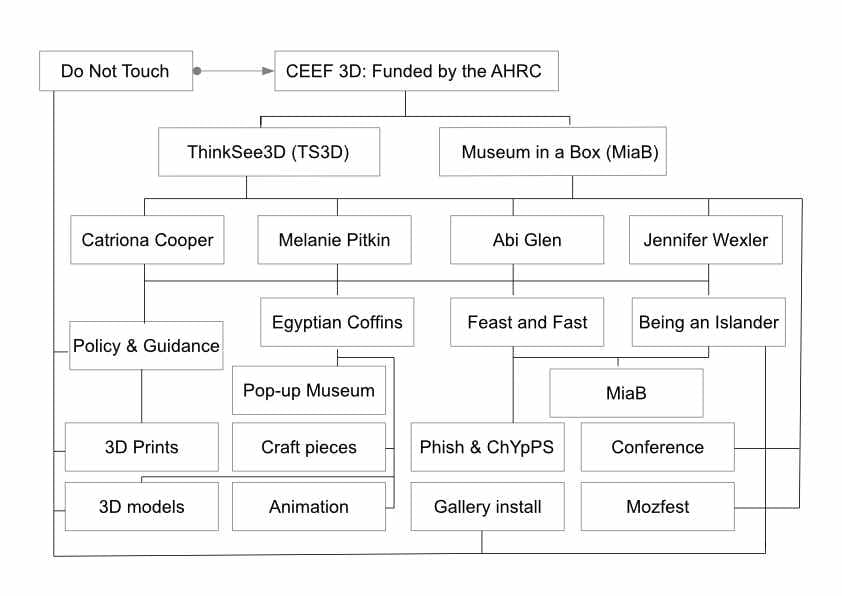
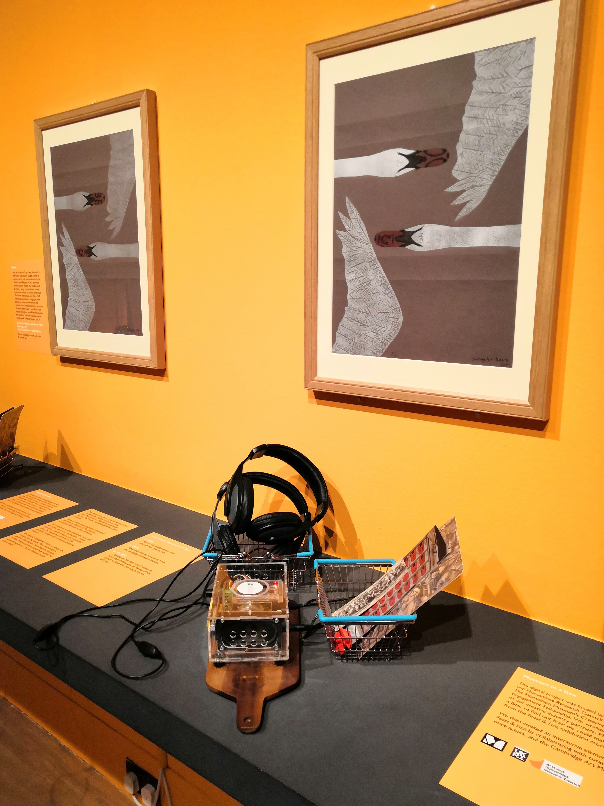
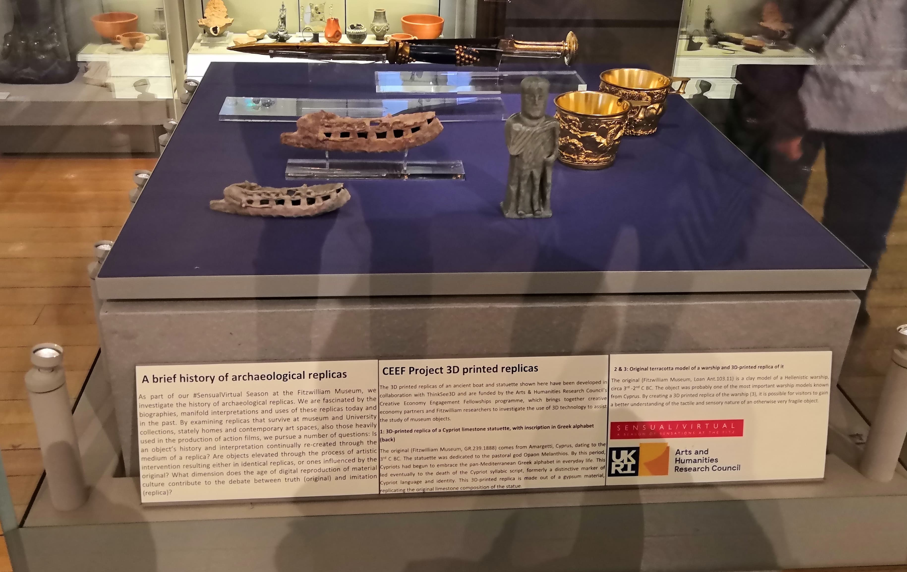

This project which is generously funded by the Arts and Humanities Research Council (AHRC) brings together three key actors in the heritage ecosystem:

* the University of Cambridge
* the Fitzwilliam Museum
* two industrial collaborators - Museum in a Box and ThinkSee3D

When combined they provide three essential perspectives that will enable us to choose and drive forward four early career researcher (ECR) projects that will lead to enhanced collaborations that benefit the creative economy. The University of Cambridge is home to a nucleus of world leading collections under the banner of University of Cambridge Museums (UCM) and this project will aim to enable innovation across the group.

The efficacy of this type of partnership can be developed during this project to refine engagement models for the future. A particular challenge for businesses selling into the cash-strapped heritage industry is access to customers; in this project the Fitzwilliam Museum will be in the unique position of being both a research partner and the provider of invaluable input as a potential customer/end user for heritage industry products.

By providing a shared base within a museum and through partnership with industrial collaborators, the researchers will benefit from exposure to two new contexts in which their research could be used. The ECRs will also be able to apply their expertise to a live challenge and foster cross-sectoral information sharing and awareness-raising both during this project and in their future careers.

Our partners bring unique skill sets to the Museum. ThinkSee3D and Museum in a Box are innovators in joining heritage with digital. This site will document our 2019 journey of collaborations, events and products.

This project is grant AH/S012583/1 part of the Development Grants Scheme. It starts on January 1st 2019 and finishes on December 31st 2019.

## How did it fit in with digital activity?

## Outputs 

The fellows created a wide array of outputs during their short 6-month stay in the Fitzwilliam Museum. These included:

* A [website to showcase the project](https://creative-economy.fitzmuseum.cam.ac.uk) and the fellows' work (this was [built in Jekyll,](https://github.com/FitzwilliamMuseum/ahrc-creative-economy-fellows) and they were taught basic RSE skills)
* [3D models of objects](https://sketchfab.com/fitzwilliammuseum/collections/ahrc-ceef3d-97cb70135c1c4cc482c83b14849271c5) in the collection 
* Several Collections for Museum in a Box
  * [Travelling Objects Part 1](https://heart.museuminabox.org/view_collection/379)
  * [Travelling Objects Part 2](https://heart.museuminabox.org/view_collection/380)
  * [Travelling Objects Part 3](https://heart.museuminabox.org/view_collection/384)
  * [Feast and Fast](https://heart.museuminabox.org/view_collection/344)
  * [Dialysis Unit](https://heart.museuminabox.org/view_collection/277) at Addenbrookes Hospital (ChYpPs collection)
* Audio files linked to Museum in a Box (found embedded below and voiced by Hannah Platts, Abi Glen and James)
  * Winifred Lamb and Being an Islander
  * Feast and Fast

* An installation in the Feast and Fast exhibition
* An installation in the Antiquities Gallery temporary case
* Commissioned artwork with local artists in Cambridgeshire
* 3D tactile prints for handling collections (printed by Steve Dey at ThinkSee3D, and Shapeways)
* Publication relating to the project
* A fully catered one day conference at the Judge Business School attended by 100 people
* Pop up museum segments for the Egyptian Coffins project
* Several workshop talks for academics and students
* A wooden replica of a box coffin from Egypt
* A derived 3d model from DICOM data of an Egyptian coffin

## 3D models

The embed below shows all the 3d models that the team created in their short period of time.

    <iframe src="https://sketchfab.com/playlists/embed?collection=97cb70135c1c4cc482c83b14849271c5&autostart=0"
    title="AHRC-CEEF3D"
    allowfullscreen
    mozallowfullscreen="true"
    allow="autoplay; fullscreen; xr-spatial-tracking"
    execution-while-out-of-viewport
    execution-while-not-rendered
    web-share
    ></iframe>

