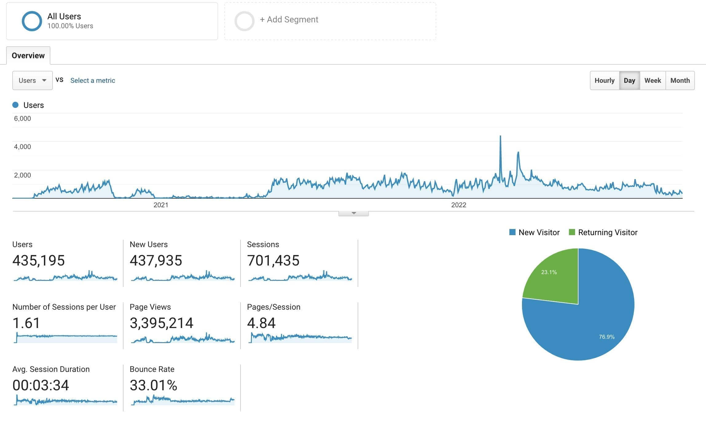

The Fitzwilliam's journey to using a CRM had started long before I joined them and had failed on several occasions. 
At my interview, the CRM process was meant to be well advanced and likely to be implemented before I joined, but this 
was not to be the case and one of my projects to enable digital transformation was to procure and assist with 
the implementation of full ticketing and CRM functions.

After a rigorous tendering exercise carried out from the end of 2018 to mid 2019, we selected Tessitura from a short list of 3 companies, and 
they began work with the Museum in October 2019, with difficulties arising at the Museum end due to paucity of staff
availability to work on the process. This was alleviated when the brilliant Grace Hadley joined the team and project managed our implementation work alongside 
Mark Hazell (an excellent consultant if you need one). One of the major problems in the Fitzwilliam is 
asking staff to take on major projects alongside their full workload, and this project is an example of that.

## Data sources to integrate

The Museum had legacy to integrate and clean to get to delivery. Systems to integrate were:

* a very out of date [Artifax event management](https://artifax.com) system which had not been updated for nearly a decade
* multiple spreadsheets of disparate data (if you work in a museum, you'll know this well)
* proprietary fund-raising systems
* people's contact lists 

## Pandemic stimulus 

The pandemic focused the minds of the Museum and made the journey to delivery 
far faster than it would have done otherwise. Tessitura's team provided some of the best training 
I have seen from a tech organisation for users of its product - days of Nicola and Chloe's time with lots of patience. 

By the start of July 2020, the Museum and Tessitura team managed to 
deliver an iteration of the ticketing system for the Fitzwilliam Museum. Soon after, fund-raising came online and then the
TNEW API was used to integrate with the Laravel front end I had built for the Fitz. 

## Consortium (well sort of...)

As the pandemic continued, other members of the UCM museums needed to implement ticketing functions, so 
the TNEW (front end) and main Tessitura backend were reconfigured to deliver a shared service platform for capturing 
visitor data. It worked, but enthusiasm for using the system waned due to complexity and effort required to 
make full use of the system. 

## Is Tessitura right for your organisation?

Questions to think about:

* Are your staff very digitally literate? If not you will need a lot of hand holding
* How much data do you want to capture on your visitors, think long and hard about data structure
* Capital expenditure for getting on board is quite high, which includes:
  * Initial contracting 
  * Purchase of hardware for ticketing
  * Design and implementation fees for front end work and integration
* Annual Operational expenditure is a large factor for your operating costs
  * License fees
    * Tessitura
    * TNew
  * Hardware charges
  * Transactional fees for payments 
    * For example Mastercard, Windcave or Tessitura Merchant Services
  * Email transaction fees
    * You will need to use a third party e.g. Wordfly

## TNEW front end 

The TNEW system is meant to be your window onto ticketing and CRM, however, management for us 
wanted it to have tighter integration into the Fitz website. We combined Directus with TNEW to get an 
MVP working for integrated ticketing information. The front end template was built using Jekyll and served off 
GitHub pages (for free!!) and is completely version controlled. TNEW takes your HTML template and inserts
into their wrapper. 

## Usage 

The Museum's community and consumers were forced into using this project more quickly than expected 
due to the pandemic. Data capture was more intrusive than we had anticipated, due to tracking requirements (which 
had some push back), but these data grew rapidly. The project was there to create new data insights into 
visitors' relationships with the museum and track and facilitate fundraising. The two Google Analytics graphs below
show how the visitor's usage of the site panned out from July 2020 to September 2022.

## Wordfly email compromise

[Wordfly's system was compromised in July 2022](https://www.theregister.com/2022/07/26/wordfly_ransomware_attack/) and subjected to a ransomware attack, with exported data being held
by the bad actors. A large amount of Tessitura's client base were effected by this cybercrime and could not send transactional 
email for a long period of time. The [ICO determined no breach of GDPR](https://www.artsprofessional.co.uk/news/ico-taking-no-action-arts-data-breach) 
had occurred, but reputational damage was a significant risk to institutions. 

You can read different institutional reactions via links below:

* [Cleveland Museum of Art](https://www.cleveland.com/news/2022/07/cleveland-museum-of-art-alerts-email-subscribers-about-ransomware-attack-on-external-provider-wordfly.html)
* [Courtauld statement](https://courtauld.ac.uk/news-blogs/2022/wordfly-incident-and-response/)
* [Glyndebourne statement](https://www.glyndebourne.com/news/wordfly-ransomware-data-breach/)
* [The Box, Plymouth statement](https://www.theboxplymouth.com/blog/news/wordfly-data-security-incident)
* [Smithsonian (Cooper Hewitt) statement](https://www.cooperhewitt.org/smithsonian-statement-wordfly-data-security-incident/)
* [National Gallery of Australia statement](https://nga.gov.au/about-us/website-privacy/email-marketing-service-provider-update/)

This most definitely won't be the last ransomware attack on museums...