The Fitzwilliam Museum website that I inherited on arrival was a curate's egg of a product. Great in places 
riddled with things that did not work and massive amounts of technical debt and content that no one ever read. 
From the beginning of my contract, the product ownership of the website was unclearly from management directives. 
Was I responsible for it, or were the marketing team who lacked digital literacy to make it work. My colleague George
Doji had ported a previous iteration of the website to Drupal 7, and with a whole host of broken and problematic content. 
As an organisation, we continued using it in its state of disrepair, whilst trying to patch over the cracks and biding time to 
decide when it could be replaced.

## Iterations of the Fitzwilliam Museum website

The Fitz website has been through a number of iterations since its inception in 2000. The screenshots below give you an 
idea of progression prior to my redevelopment work

    

        

            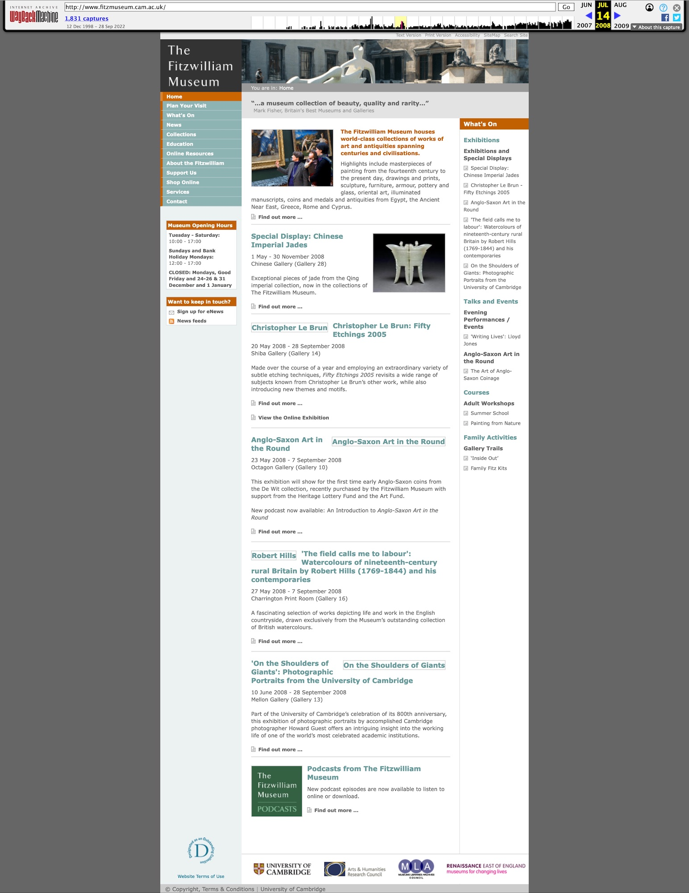
        

        

            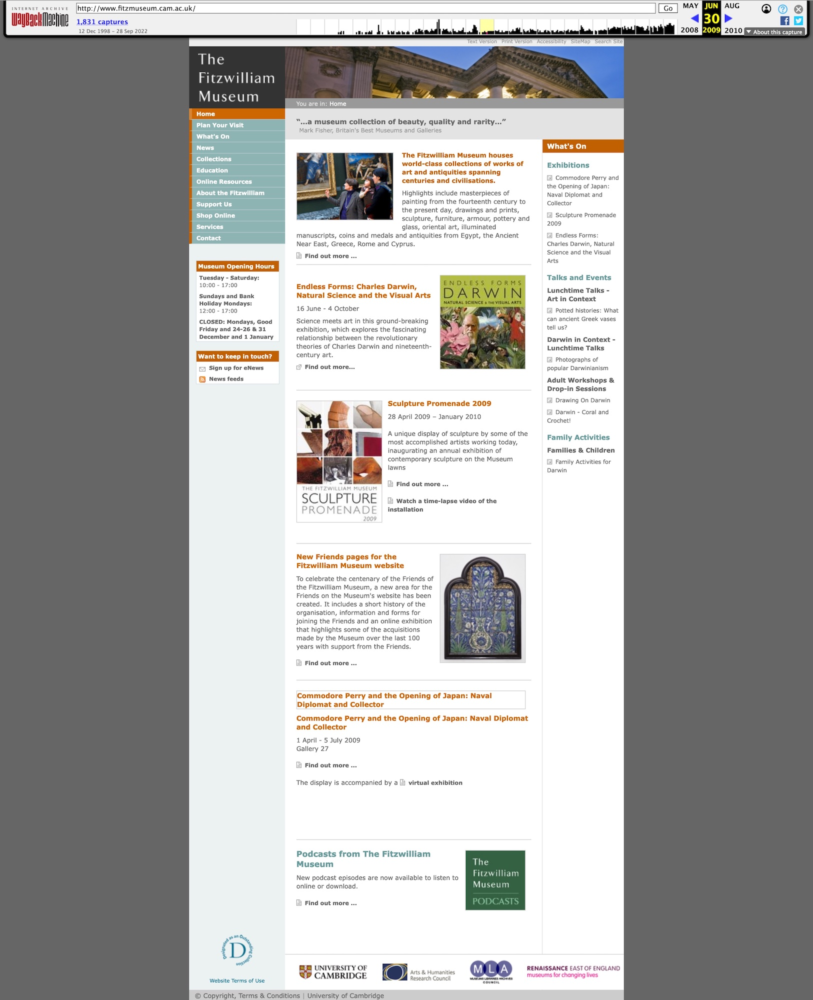
        

        

            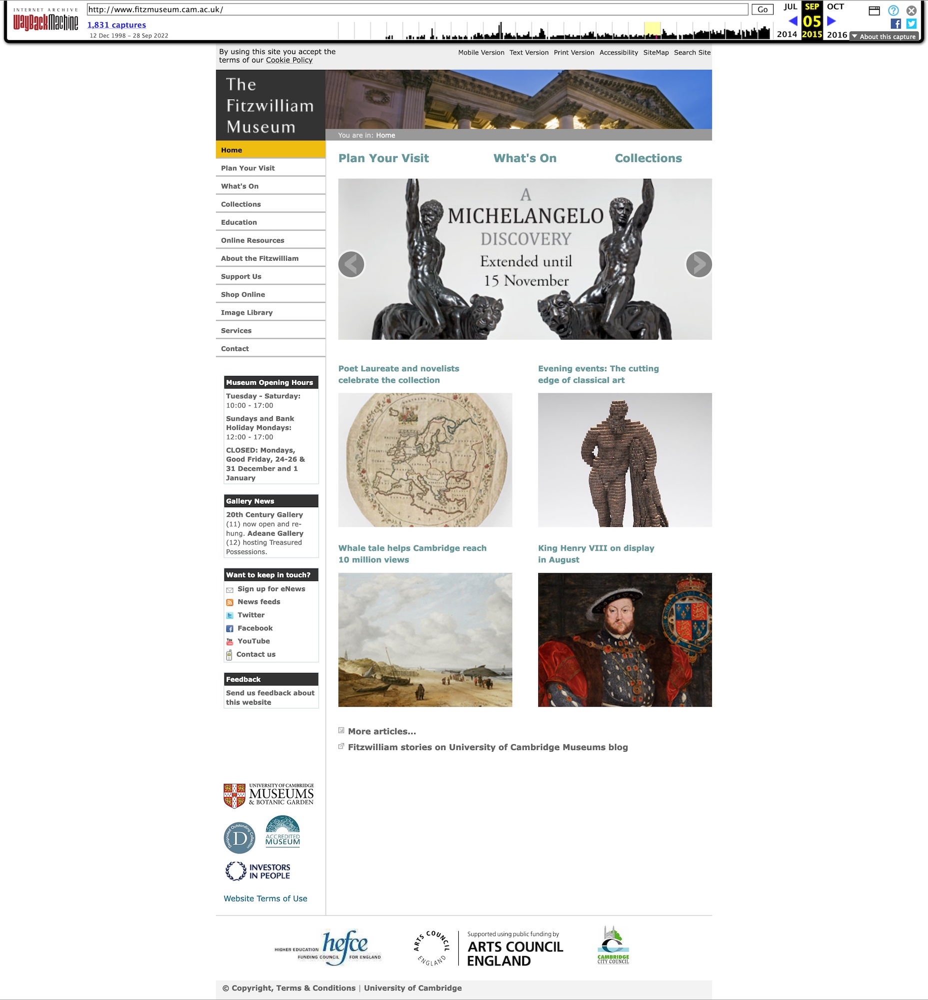 
        

        

            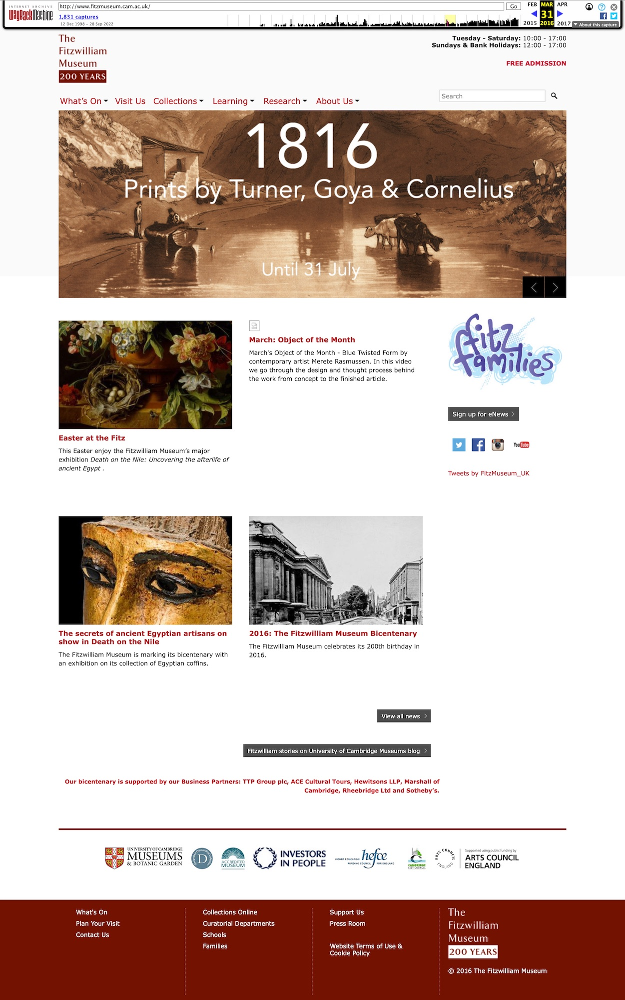        
        

        

            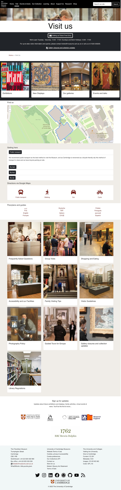        
        

    

## What I wanted to do

Whilst at the British Museum, work had been going on to use the headless CMS concept to power digital products - a concept
that I believed had lots of potential and could provide opportunities for the museum to innovate. I wanted to use open source tech
rather than commercial subscription products, and I wanted to build the front end of the website how we wanted it, without
traditional CMS bloat and security issues. I began experimenting on various platforms (for example Strapi - though I didn't think
my team could support a node application) and eventually settled on using the open source CMS [DirectUS](https://directus.io/)
to power a proof of concept that I was working on. However, when would be a good time to start deploying decent code?

## Pandemic opportunity? Drupal End of Life.

As everyone knows, the Covid-19 pandemic gripped the world in March 2020 and the Fitzwilliam Museum shut its doors like everyone else,
staff were furloughed, and the museum was in a state of flux. The website was the main platform that the museum had to communicate with
its audience, and it was in a state of disrepair. The Drupal 7 platform was no longer supported, and the security issues were becoming
more and more apparent. The website was not mobile friendly, and the content was not being updated, audience relevant or fit for purpose.
Over 10,000 pages of content existed and fewer than 1000 visitors a day were using the web site. 

The Museum had a conundrum; several services and software packages were coming to end of their life cycle. 
Tthe website was running on Drupal 7, with lots of bespoke messy code. End of life was approaching
(with prolonged dates due to the Covid 19 pandemic) and the Museum's webserver managed by UIS was being decommissioned 
and was running an old version of PHP. Drupal's lifecycle was timetabled to end:

> Drupal 7 was first released in January 2011. In November 2021, after over a decade, Drupal 7 will reach end of life (EOL). (More information on why this date was chosen.) Official community support for version 7 will end, along with support provided by the Drupal Association on Drupal.org. This means that automated testing services for Drupal 7 will be shut down, and there will be no more updates provided by the Drupal Security Team.

However end of life dates changed! 

> Well, it’s hard to tell since the end of the support period has been moved several times. At first, it was scheduled for the second half of 2021, but on June 24, 2020, the Drupal Community announced a customer support extension for yet another year—until the end of November 2022. And at the beginning of 2022, the latest Drupal 7 end-of-life date was once again moved to November 1, 2023.

My colleague George, had tried to upgrade the website to Drupal 8, but the process was fraught with issues and tears, and failed 
attempts to get it working. I was keen to get the website working on a modern stack, and I wanted to use the opportunity to
use Headless CMS tech, PHP 8 and AWS services. I had a vision of a website that was easy to use, and easy to maintain. I wanted
it to be innovative and to be a showcase for the Museum's digital work. 

We had 3 major opportunities:

1. Refresh, rebuild and innovate with the website
2. Develop a new collections system 
3. Integrate with Tessitura

All of these were done from March 2020, with final delivery of a production website (after a year of beta cycle), collections 
system and Tessitura integration in July 2021.

## FitzVirtual Steering Group

The Museum's Senior Management Team decided to form a steering group to oversee the digital activities of the Museum during the pandemic period comprising
of a number of senior managers (collections, learning and operations and for a while communications). I was invited to join the group as the sole digital leader, and I was keen to use the opportunity 
to make changes and influence the digital agenda with colleagues. However, my expertise and views conflicted with others on the panel, others
who regularly called for IT support to fix their problems. FitzVirtual was a great opportunity to make changes, but brought several projects with it
that I would have recast and done very differently if I had been given the freedom to direct them:

1. The Schools website project (devloped by a third party team and the learning team)
2. The podcasting programme 
3. Digital events programme
4. Content audit 

## Staffing 

Unlike many museums, the digital team was left with a skeleton staff throughout the pandemic; 
we had one secondment from front of house who made excellent progress on digital content and code skills (worked
on revamping conservation blog) and two secondments to the documentation team.  

What we really needed was bolstering with

* Front end developer (part time)
* 2 x back end developers (one for collections, one for website)
* 1 fulltime project manager (to oversee all the digital work)
* 2 x content producers (to create the content
* 1 x UX designer (part time)
* 1 x digital marketing specialist (to create a digital marketing presence, fit for purpose)
* 1 x broadcast specialist or out sourced broadcast team

Instead, I developed all the digital infrastructure and front end myself, ported all the old content and allowed
my IT colleagues to firefight their own work and keep the museum afloat.

## The website architecture 

The website and collections system (two separate code stacks with commonality) were built using the following technologies listed 
below. I tried to maintain and develop using the latest and best versions of PHP software and practises.

* PHP 8.1
* Laravel 8 at the beginning, latest version of 9 by the time I left in September 2022
* Elastic Search 7 
* Solr 8.11.1 - on a Fitzwilliam Server 
* Redis 6.24
* AWS EC2 (for the web server)
  * T2.Small for CMS 
  * T3.Medium for Website and collections (and Redis)
* S3 for image storage, backups and serving IIIF images
* DirectUs 8 for the Headless CMS 
* MySQL 8
* Blade templating engine
* HTML 5
* CSS 3
* Webpack 5
* JQuery (dropped in 2022)
* SASS
* Bootstrap 4, migrated to Bootstrap 5 in 2022
* Universal Viewer 4 
* Mirador 3 
* LetsEncrypt SSL

All code was developed using Laravel libraries, using Atom or JetBrains PhpStorm, with custom classes written for integration with several services, and 
version controlled via GitHub. A branching methodology was used, with a staging environment run off local machines - not a production website - to drive 
costs to minimal level. The site became mobile by default, used the latest web standards and was built to be accessible, a massive improvement on the inherited version. 
Having been at the Fitz for a few years, I appreciate the constraints under which the team had operated previously!

## Alpha, Beta, Omega/Production and co-production (alright that bit failed)

We went through a short period of alpha testing from March 2020 to July 2020, with a beta period from July 2020 to July 2021.
Our beta urls were https://beta.fitz.ms and https://collections.beta.fitz.ms (which still resolve).

Project management was done using a massive Trello board, with tasks being assigned and completed with deadlines set aggressively - Museum management could 
only cope with GANTT charts - and everything went to schedule porting and reformatting content from the Drupal system and legacy 
to make a new presence. I wanted to get the community far more involved in co-creation of the website (as shown in the video below), 
furnishing them with a discussion platform, bug reporting software (bugherd) and opportunities to be involved in UX
groups and feedback (the pandemic may have been a good time to do this as people were looking for things to do).
However, this aspect just didn't seem to click with our audiences and take up of that was minimal.

    

        <iframe src="https://www.youtube.com/embed/-r6G4KfPkXs?controls=0" title="YouTube video player" allow="accelerometer; autoplay; clipboard-write; encrypted-media; gyroscope; picture-in-picture" allowfullscreen></iframe>
    

## UX survey 

The Museum [tendered for UX research](/pdf/ux.pdf) on the Beta website and received just two tenders for the work (probably due to the low value of the contract). The steering group 
chose One Further to execute the work. Their report can be found in the documents section at the foot of the page, 
and we acted pretty quickly to fix everything that they found out. 

## First year of production 

The Beta website moved to production in July 2021, and the collections system was moved in September 2021. The website has exceeded the 
performance of the old versions substantially - better architecture, search engine optimisation, and a better user experience have made 
it far more useful. However, numbers are still pretty low in the grand scheme of things. Is the Fitzwilliam 
actually that relevant to the local population or the world? I wanted the digital presence to be far more 
co-curated with the community, but that was not to be.

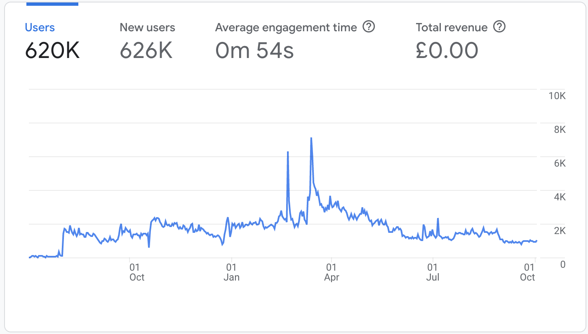

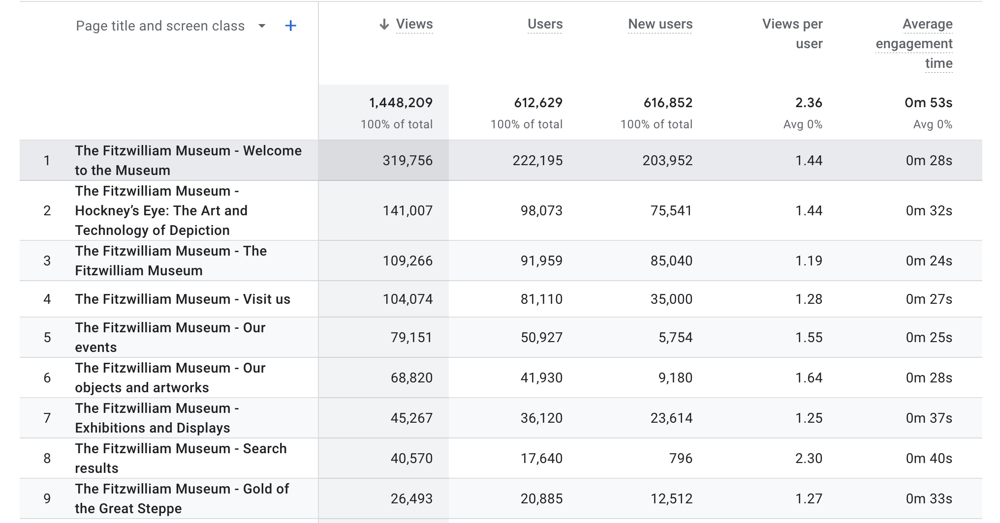

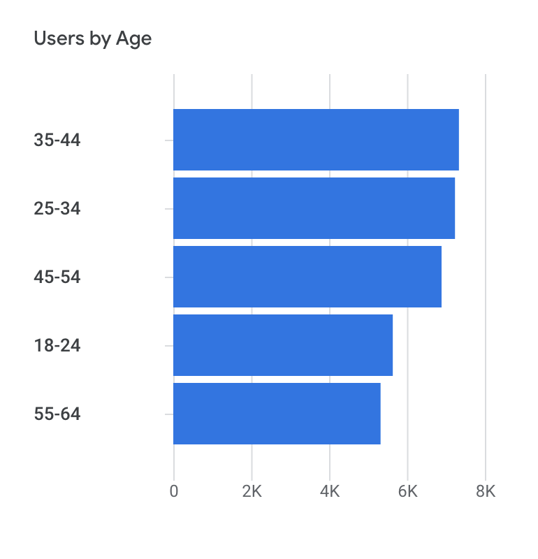

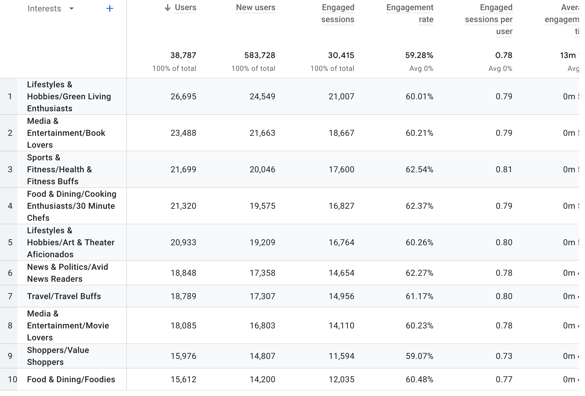

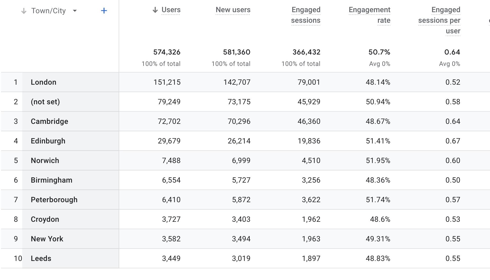

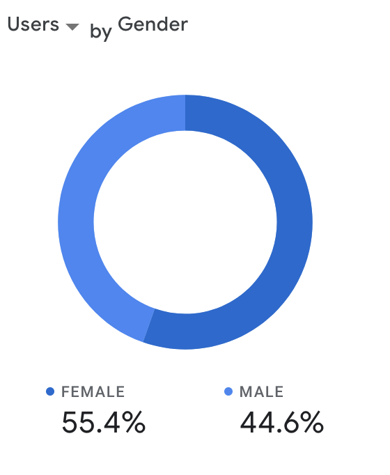

## Handover, September 2022

Following the Museum's restructuring (which began in early 2022), I left in September 2022 after a drawn out process. The 
website and collections systems are now supported by Studio24, a Cambridge digital agency I recommended (local economy boost) and they 
were furnished with a massive documentation package built in MkDocs. 
