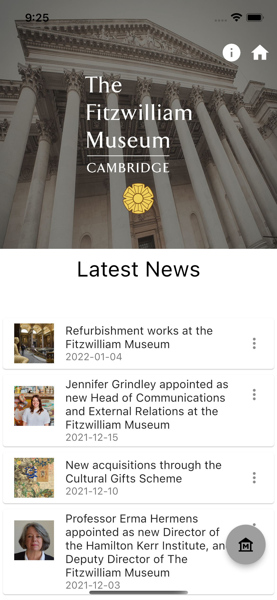

When I rebuilt the Fitzwilliam Museum collections explorer, I wanted to test out the data systems 
to see how we could build on the Create Once, Publish Everywhere paradigm (COPE). I am always looking 
to learn new concepts and technologies, and I wanted to see how I could use Google's nascent app development 
framework, Flutter, to build a mobile app for the museum as an experiment. 

## What is Flutter?

Flutter is an open-source UI software development kit created by Google. It is used to develop cross-platform applications 
for Android, iOS, Linux, macOS, Windows, Google Fuchsia, and the web from a single codebase. It is written in a programming language
called Dart a programming language designed for client development, such as for the web and mobile apps. 
It is developed by Google and can also be used to build server and desktop applications.

## What did I want the app to do?

* Work on the two major mobile platforms and pull data dynamically
* Have a clean aesthetic look and feel
* Be able to search the collections
* Pull news and other information from the Directus Content Management System
* Interact with the collections API
* Serve up IIIF images
* Interact with our burgeoning 3d library
  * Possibly create AR interventions
  * Display 3d models of objects
* Provide a proof of concept that app development could be done:
  * Cheaply
  * In house 
  * Iteratively 

## What did I learn?

In creating this application, I learned:

* The Flutter framework
* Dart programming language
* Android studio and how to use emulators
* My colleague were apathetic to R&D and that they would rather it was paid for by a grant/philanthropy

I based all the code around established libraries and plugins and managed to create a decent prototype 
or MVP. I managed to get the app to work on both Android and iOS and to pull data from all the sources mentioned above. 
I found the language and framework easy to use, but I found that Android Studio was computed heavy and drained 
laptop batteries extremely quickly. I have not pushed the APK or packages to the app stores as there was no interest 
shown in any way by the Fitzwilliam Museum management, who would rather not make decisions and wait for 
philanthropic funding. We had been approached by Smartify and a few other services to run mobile app
based BYOD projects, there was no appetite amongst the senior team to innovate. 

## Screenshots and video 

  <video src="/video/screen.mp4" controls></video>

