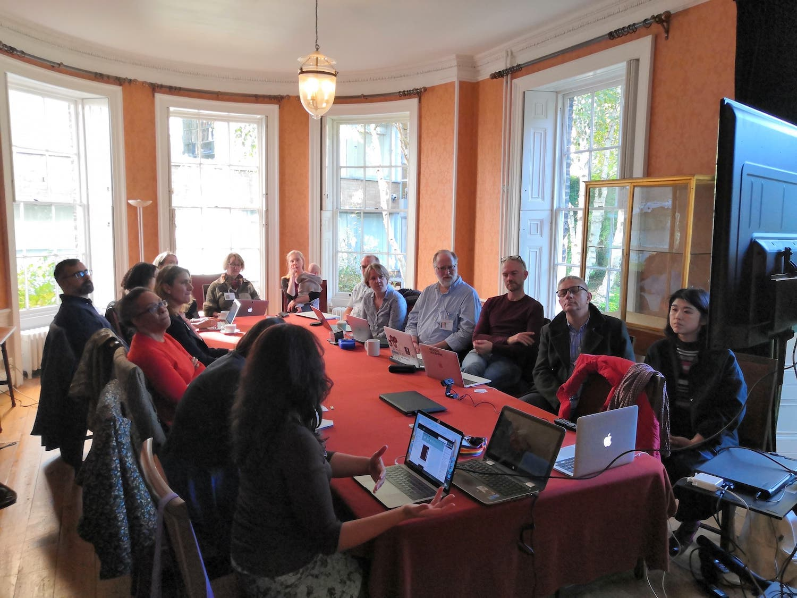
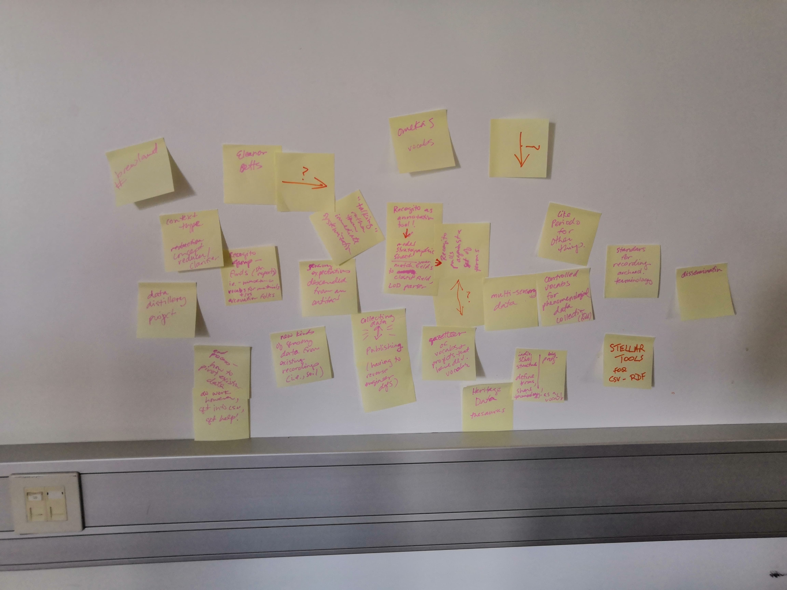
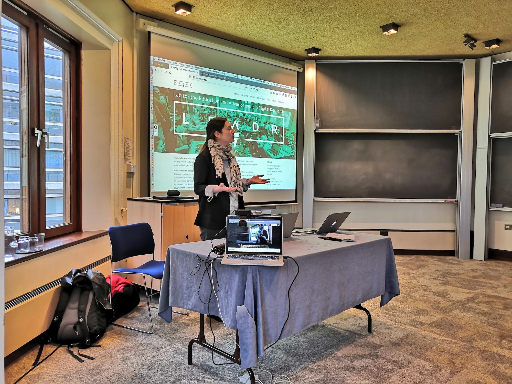

Linking Islands of Data will create a research network based around centres of excellence that study the Classical World
on both sides of the Atlantic and build upon the legacy of the National Endowment for Humanities funded Linked Ancient
World Data Institute.

This network will focus on classics, archaeology, epigraphy and museology and create a variety of digital and analogue
outputs - including an application programming interface (API), documentation and guidance for best practice in the use
of Linked Open Data and high resolution document handling - using established and emergent technological methods and
communities of practice based around 3 workshops held at the Fitzwilliam Museum, Brown University and Open Context.

These research project web pages will document our progress, host examples of what we generate and provide an archive of
activity whilst ultimately leading towards the Fitzwilliam’s Being an Islander: Art and Identity of the large
Mediterranean Islands exhibition in 2021.

This project which is generously funded by the Arts and Humanities Research Council (AHRC) and can be found under grant
number AH/S012478/1.

## Project Outputs

The project was derailed by the COVID-19 pandemic (preventing the planned events in America), but we have managed to
produce a number of outputs:

* Several workshops held at the Fitzwilliam Museum, St John's College and St Edmund's College, Cambridge
* Implementation of a Linked Open Data representation for the Fitzwilliam Museum's collection of Classical Art (Linked
  Art applied to all objects in the collection)
* Implementation of IIIF for the Fitzwilliam Museum collection
* Presentations at AIA and domestic conferences
* Two animations to explain linked open data (see embeds below)
* The creation of a [Peripleo geospatial](https://mapping-antiquity.fitzmuseum.cam.ac.uk) interface for the Museum's
  Classical collection

    

        

            
        

        

            
        

        

             
        

    

## Animations

These animations were created in 2022 (in conjunction with Ed Tracey of Too Tall Productions), to explain Linked Open Data and this project.
They build on work conducted by Jennifer Wexler on the AHRC CEEF3D programme and her research centred on Winifred Lamb and the Fitzwilliam 
Museum's antiquities collection.

  

    
<iframe src="https://www.youtube.com/embed/0m79yDb4AzE?controls=0" title="YouTube video player" allow="accelerometer; autoplay; clipboard-write; encrypted-media; gyroscope; picture-in-picture" allowfullscreen></iframe>

  
  
  

    
<iframe src="https://www.youtube.com/embed/mMR6JQ1M6qE?controls=0" title="YouTube video player" allow="accelerometer; autoplay; clipboard-write; encrypted-media; gyroscope; picture-in-picture" allowfullscreen></iframe>

  

