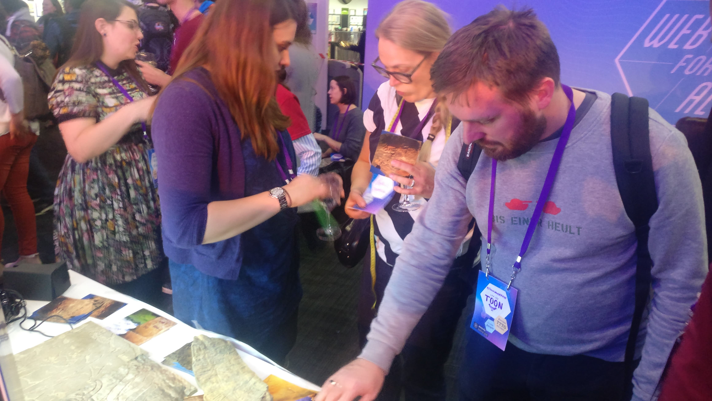
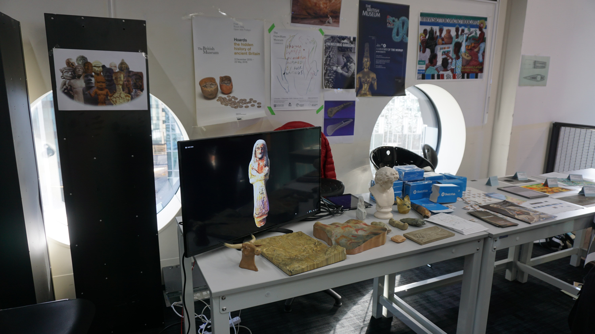
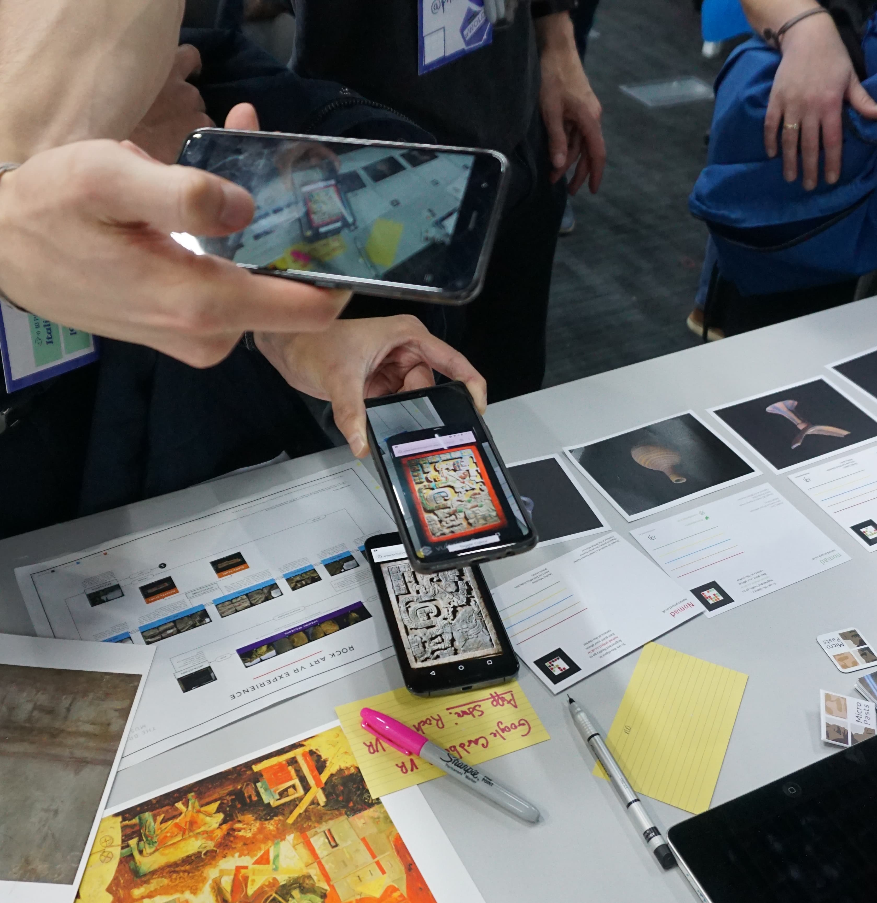
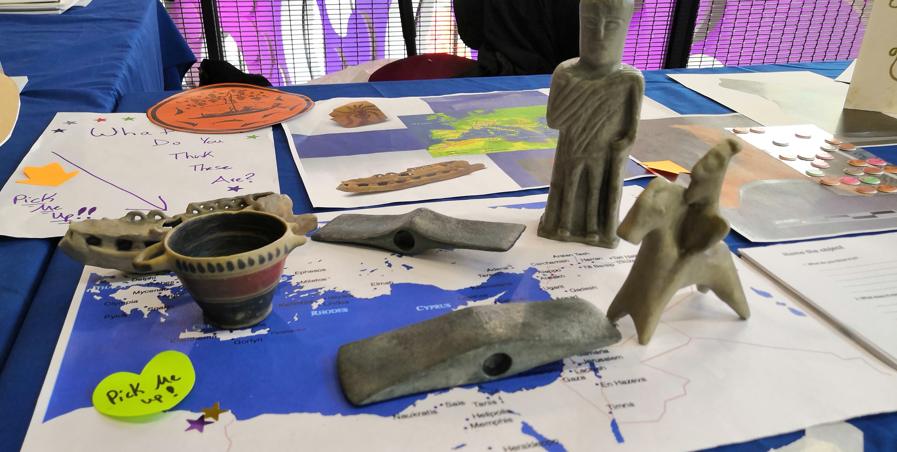
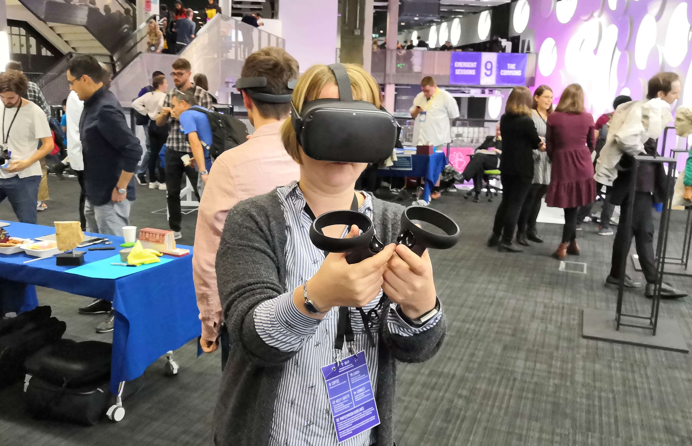
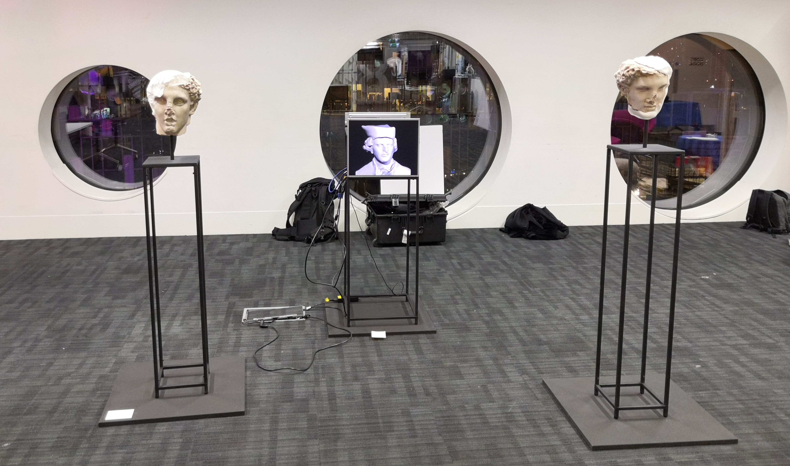

Over the last few years I've attended Mozfest at the brilliant Ravensbourne University in Greenwich (next to the Millenium Dome), first attending 
in 2017 at the suggestion of Prof Andrew Prescott, who thought it would be a fab place to meet people 
and spread digital museological ideas to a larger audience. I've been with my AHRC funded collaborators 
and made great friends and contacts there and been lucky to work with Phil van Kemenade and the Mozfest team to help
organise the Arts and Culture salon. 

## Mozfest 2017 

My first visit to Mozfest was in 2017, and I was lucky enough to be able to attend with my AHRC funded friends
Chiara Bonnachi, Elisabeth Galvin and Jennifer Wexler. I ran a session about 3d modelling and museums, which was attended by about 
15 people. We discussed the processes involved and talked about 3d printing, rights, ethics and learned 
from others about what they would like to see in the future. We attended other people's sessions and forged a new 
friendship with Philo van Kemanade.

<blockquote class="twitter-tweet">
3:15, 9th floor of <a href="https://twitter.com/hashtag/mozfest?src=hash&amp;ref_src=twsrc%5Etfw">#mozfest</a> <a href="https://twitter.com/MicroPasts?ref_src=twsrc%5Etfw">@micropasts</a> &amp; <a href="https://twitter.com/britishmuseum?ref_src=twsrc%5Etfw">@britishmuseum</a> staff will be talking 3D, cultural heritage, VR, AR, <a href="https://twitter.com/PyBossa?ref_src=twsrc%5Etfw">@pybossa</a> and more. Join us? <a href="https://t.co/IfXABHN9Aw">pic.twitter.com/IfXABHN9Aw</a>
&mdash; Daniel Pett (@DEJPett) <a href="https://twitter.com/DEJPett/status/924577542933241856?ref_src=twsrc%5Etfw">October 29, 2017</a></blockquote>

We then organised a stall at the evening science fair event, where we displayed some of our 3d printed objects from the British
Museum African Rock Art project, engaged in discussion with attendees and made new friends. 

## Mozfest 2018

For our second trip to Mozfest, I'd been let go by the British Museum by that point. Instead, I and colleagues
attended and set up a pop up museum stand amongst other cultural heritage exhibits that we pulled together. We organised 
talks by various other people and grew the Arts and Culture community a bit further. Fab people who got involved included
Andrew Prescott, Ed Silverton, Philo, Jennifer, Roy Raudenhauser, Steve Dey, Museum in a Box and many more. 

## Mozfest 2019

By 2019, Philo had convinced the Mozfest organisers that Arts and Culture needed more space and the Arts and Culture Salon
was formed. The space expanded to have stalls from various organisations including the Ure Museum from Reading, a University of 
Cambridge Museums pop up museum, art installations from Egor Kraft and Tom Schofield and a whole host of other things. We ran 
sessions on democracy and heritage, digital heritage, digital art, digital art and the environment and had a good flow of people visiting
throughout the weekend

<blockquote class="twitter-tweet">
The 8th floor of <a href="https://twitter.com/hashtag/mozfest?src=hash&amp;ref_src=twsrc%5Etfw">#mozfest</a> is for <a href="https://twitter.com/hashtag/artsculture?src=hash&amp;ref_src=twsrc%5Etfw">#artsculture</a>. Curated by <a href="https://twitter.com/phivk?ref_src=twsrc%5Etfw">@phivk</a> &amp; me, we have some amazing cultural things (<a href="https://twitter.com/hashtag/3d?src=hash&amp;ref_src=twsrc%5Etfw">#3d</a> <a href="https://twitter.com/hashtag/ai?src=hash&amp;ref_src=twsrc%5Etfw">#ai</a> <a href="https://twitter.com/hashtag/decolonisation?src=hash&amp;ref_src=twsrc%5Etfw">#decolonisation</a>) from <a href="https://twitter.com/FitzMuseum_UK?ref_src=twsrc%5Etfw">@FitzMuseum_UK</a> <a href="https://twitter.com/UreMuseum?ref_src=twsrc%5Etfw">@UreMuseum</a> <a href="https://twitter.com/britishmuseum?ref_src=twsrc%5Etfw">@britishmuseum</a> <a href="https://twitter.com/tomschofield?ref_src=twsrc%5Etfw">@tomschofield</a> <a href="https://twitter.com/mnemoscene_ltd?ref_src=twsrc%5Etfw">@mnemoscene_ltd</a> <a href="https://twitter.com/UreMuseum?ref_src=twsrc%5Etfw">@UreMuseum</a> <a href="https://twitter.com/CamUnivMuseums?ref_src=twsrc%5Etfw">@CamUnivMuseums</a> <a href="https://twitter.com/StirHeritage?ref_src=twsrc%5Etfw">@StirHeritage</a> <a href="https://twitter.com/hashtag/meetthevotives?src=hash&amp;ref_src=twsrc%5Etfw">#meetthevotives</a> <a href="https://twitter.com/ahrcpress?ref_src=twsrc%5Etfw">@ahrcpress</a> <a href="https://t.co/2312nmhtyO">pic.twitter.com/2312nmhtyO</a>
&mdash; Daniel Pett (@DEJPett) <a href="https://twitter.com/DEJPett/status/1188032904024248320?ref_src=twsrc%5Etfw">October 26, 2019</a></blockquote>
<blockquote class="twitter-tweet">
Coming in 801 <a href="https://twitter.com/hashtag/mozfest?src=hash&amp;ref_src=twsrc%5Etfw">#mozfest</a> are my <a href="https://twitter.com/ahrcpress?ref_src=twsrc%5Etfw">@ahrcpress</a> funded <a href="https://twitter.com/hashtag/ceef3d?src=hash&amp;ref_src=twsrc%5Etfw">#ceef3d</a> fellows on the &quot;objects formerly known as prints&quot; (see what they did there?) At 4:30 <a href="https://twitter.com/hashtag/artsculture?src=hash&amp;ref_src=twsrc%5Etfw">#artsculture</a> <a href="https://t.co/RREg0twhJR">pic.twitter.com/RREg0twhJR</a>
&mdash; Daniel Pett (@DEJPett) <a href="https://twitter.com/DEJPett/status/1188114540350885889?ref_src=twsrc%5Etfw">October 26, 2019</a></blockquote> 