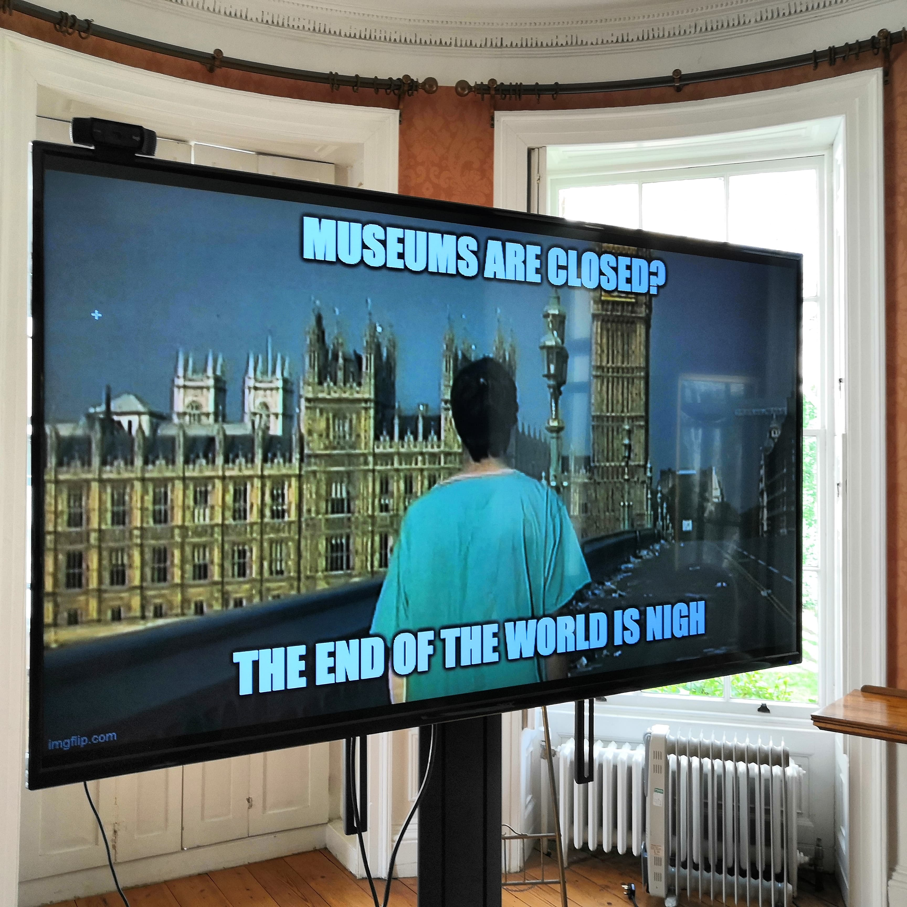
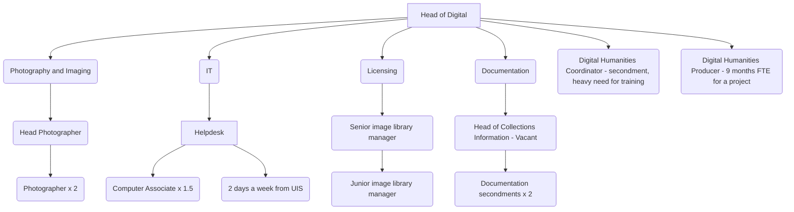
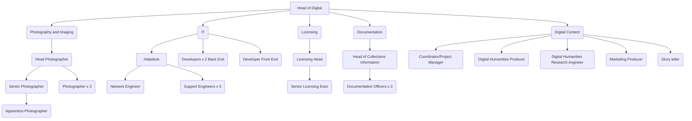

A week before first the first lockdown was implemented, I had suspicions that we would be working from
home for a long period of time. I walked into the IT office, ignored the mess that was always there and said to 
George that we needed everyone ready for VPN use immediately and that we should run IT skills drop ins that week. 
Then of course, it happened, and we were all exiled to working from home and the majority of staff went on their merry 
way to try and cope with digital tools when their literacy normally was not that high.

We were lucky, the Museum was supported by a larger entity - the University of Cambridge Information Services division - and 
unlike many of our colleagues - e.g. the British Museum - we could roll out Microsoft Teams to all our staff within a week, a VPN 
was available to all of them before they left, we had unlimited Google Drive storage and premium Google Meet, and Rosie had been working to get 
remote access to our Collections Management System in place. What we didn't have in place was:

* a team of staff who could create digital content easily
* a high level of buy-in to my vision from management as to what digital could do for the Museum
* a powerful website and social media presence and collections system
* a CRM ready and waiting to be used (it was a few months away from being ready)

## Team in place to cope 

The team at the Fitz was tiny and not adequately bolstered during the pandemic. We had one person other
than me who was fully competent to create code and web architecture, and they were keeping UCM afloat for their digital presence.

We had the following across key areas:

Two projects came along that brought extra staff during the pandemic (podcasting and schools website) - they were assigned to the learning team...

## Developing digital presence 

As documented elsewhere on this site, the museum needed several facets revamped for a meaningful digital 
transformation:

1. A new website to replace Drupal 7 version
2. A new collections system to replace the old one (which was not fit for purpose and had been compromised)
3. A new CRM and ticketing system to replace the old one - implemented in July 2020

<blockquote class="twitter-tweet">
We&#39;re experimenting with a beta website (<a href="https://t.co/AmmdLcIj4B">https://t.co/AmmdLcIj4B</a>) for the Museum and need your help.  Could you spare a few minutes to tell <a href="https://twitter.com/OneFurther?ref_src=twsrc%5Etfw">@OneFurther</a> and <a href="https://twitter.com/DEJPett?ref_src=twsrc%5Etfw">@dejpett</a> about our site&#39;s navigation? <a href="https://t.co/QSRJXhMaUj">https://t.co/QSRJXhMaUj</a>
&mdash; Fitzwilliam Museum (@FitzMuseum_UK) <a href="https://twitter.com/FitzMuseum_UK/status/1392877093042675718?ref_src=twsrc%5Etfw">May 13, 2021</a></blockquote> 

## Software in use at the Museum during the pandemic

To deal with working from home, I (and team when appropriate) implemented a variety of software to enable us to
all work remotely. The majority of our software is served over the web and accessed via VPN and is hidden behind 
Raven (University) web auth. 

These were:

1. Password storage - we used the [BitBetter version](https://github.com/jakeswenson/BitBetter) of [Bitwarden](https://bitwarden.com) to store passwords and share them with each other
2. Password sharing - we used [Snappass](https://github.com/pinterest/snappass), which is like SnapChat for passwords and comes from Pinterest product team.
3. Intranet - we used WordPress, with a custom theme (though I believe that the new comms team have replaced the theme based on my email alerts for upgrades)
4. Email - we used Office 365, which is the University's email system
5. Miro - for collaborative white boarding (free license as an academic)
6. Padlet - for educational boards
7. Trello - for project management (senior management were averse to this and liked Excel charts, d'oh)
8. Instant messaging - we originally used RocketChat, but moved to Microsoft Teams when that became available site wide during the first week of lockdown
9. Collections recording system - we used Axiell Collections (upgrade from Adlib by Rosie Forrest in 3 weeks)
10. DAMS - Portfolio from Extensis
11. Collections middleware - CIIM from Knowledge Integration
12. IIIF server - Cantaloupe and IIIP Server
13. Web servers - Apache/Nginx
14. GitHub - for code storage and version control and serving static websites 
15. Documentation of systems - Mkdocs 
16. Rebuilt website content management system - DirectUs 8 
17. Server infrastructure - migrated to AWS for nearly all web architecture
18. Web analytics - Google Analytics
19. Smartway - implemented by Ops division with no IT intervention for room management at the end of the pandemic 
20. Edays - implemented by HR and Ops at the end of the pandemic
21. CRM - Tessitura and TNEW
22. YourUrls - for short URL generation using the fitz.ms domain
23. Discourse - discussion platform for co-creation of the website (could not get any community traction)
24. Zammad - for the IT helpdesk
25. SnipeIT - for IT inventory

All services are backed up to AWS S3 buckets, and a full backup plan is in place for all architecture. Monthly spend on
11 servers was around £1200 (80% of that was on the collections EC2 instances).

## Staffing for the future
To deliver any semblance of digital ambition and transformation, the museum needs:

Following restructure, the structure is now pared back even further for digital and IT expertise and I left in 
September 2022.