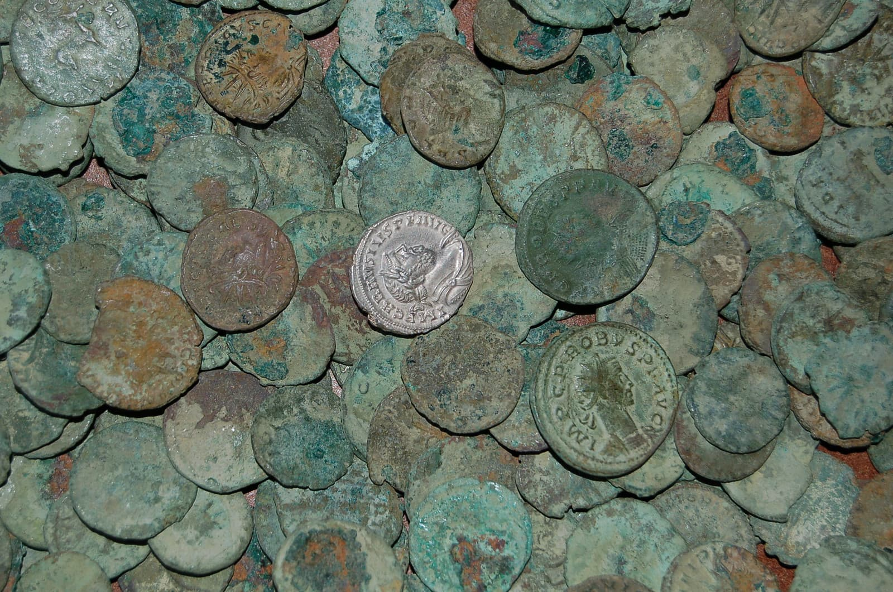
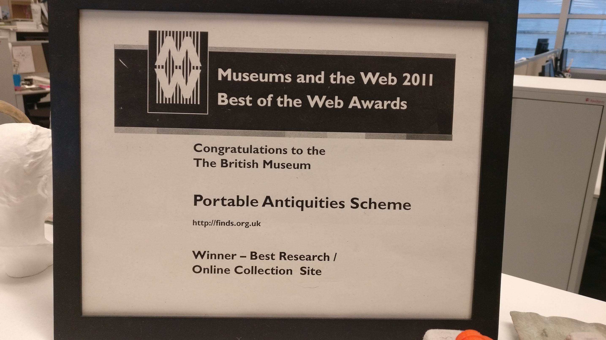
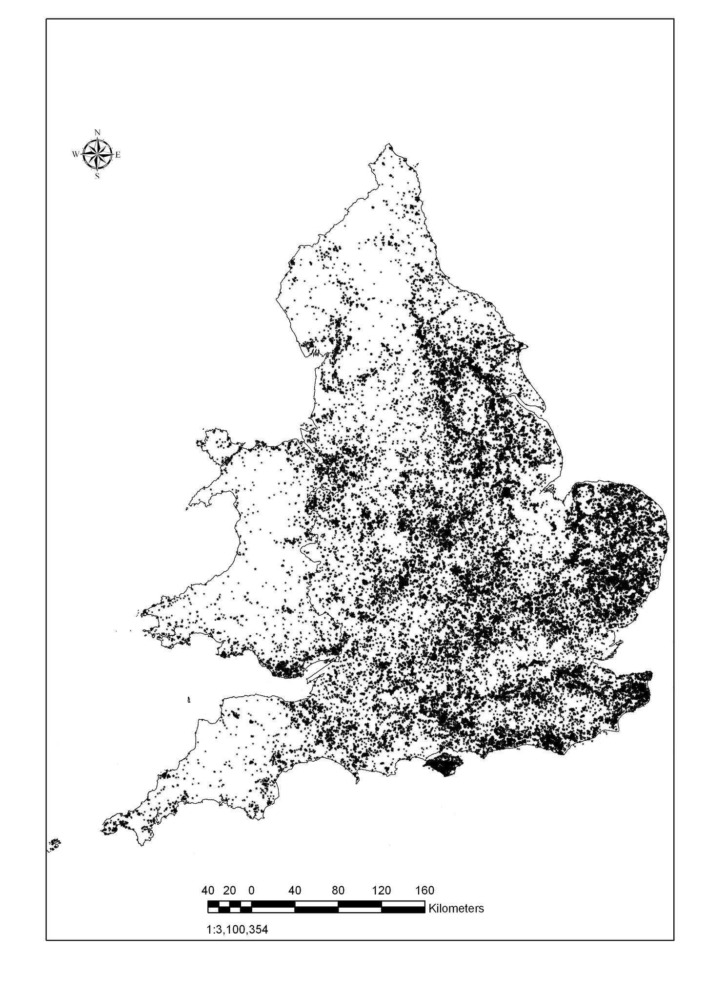

> Every year many thousands of archaeological objects are discovered, many of these by metal detector users, but also by people whilst out walking, gardening or going about their daily work. Finds recorded with the Scheme help advance knowledge of the history and archaeology of England and Wales.

The Portable Antiquities Scheme is run by the British Museum and Amgueddfa Cymru - National Museum Wales to 
encourage the voluntary recording of archaeological objects and the mandatory recording of Treasure cases, 
found by members of the public in England and Wales. In 1996, Roger Bland established a pilot network of Finds Liaison
Officers (FLO) in 6 areas of the UK, and then in 2003 via funding from the Heritage Lottery Fund, the PAS was
made into a national network with over 60 partners and the creation of a unified database. 

The PAS database came under my purview as ICT Advisor, and from 2003 to 2006, I project and product managed
the software that was developed by Oxford ArchDigital (a spin out from Oxford University, led by Tyler Bell.) In 2006, 
OAD unfortunately went into administration, and the PAS database was at substantial risk of being lost. 
I learnt to programme in PHP and MySQL and took over the development of the PAS database, and in 2007, I released my 
first version of the database, which was a complete rewrite of the original OAD software, but used their underlying structure.

I then released new versions of the database every year, and in 2011, I released the first version of the database that was 
fully open source (winning the Best of the Web award at Museums and the Web), 
and the final version in 2016 when I was transferred to the new Digital and Publishing team of the British Museum.

The PAS database records thousands of data points annually, massive amounts of geospatial data that provides a picture 
or sampling of the archaeological landscape of England and Wales, and the database is used by researchers worldwide. 

The PAS database is now in its 20th year of national operation, and has grown substantially from its 2003 first iteration. 
Back then, 33,000 records were recorded, and in 2022 there are over 1.6 million records - the majority released under Creative Commons By Attribution
license and. The database is written as open source software, but sits on outdated PHP frameworks from Zend and probably 
out of date MySQL and Solr versions. 

## Technical data

* Zend Framework 1.21 
* MySQL 5.5 + 
* Solr 4+ 
* Ubuntu 14.04 LTS
* Tomcat
* Java 8
* Fuseki 2 (Jena) for a triplestore (this has been removed since I left)

The system was set up across 4 servers - a master and three slaves (MySQL and Solr) on Ubuntu OS. 
Instant replication was set up for the MySQL database and Solr instances, a software load balancing system was in place, which 
enabled uptime to be _epic_, servers rarely went down.

## Unique features for heritage systems

* Only unified and national system for recording archaeological objects worldwide at the time of construction
* Completely open source 
* Open data - all data released under Creative Commons Attribution license
* Linked Open Data - all data is available as RDF triples modelled using CIDOC CRM
* Integration with Nomisma for numismatic data
* Integration with Ordnance Survey for geospatial data (using RDF)