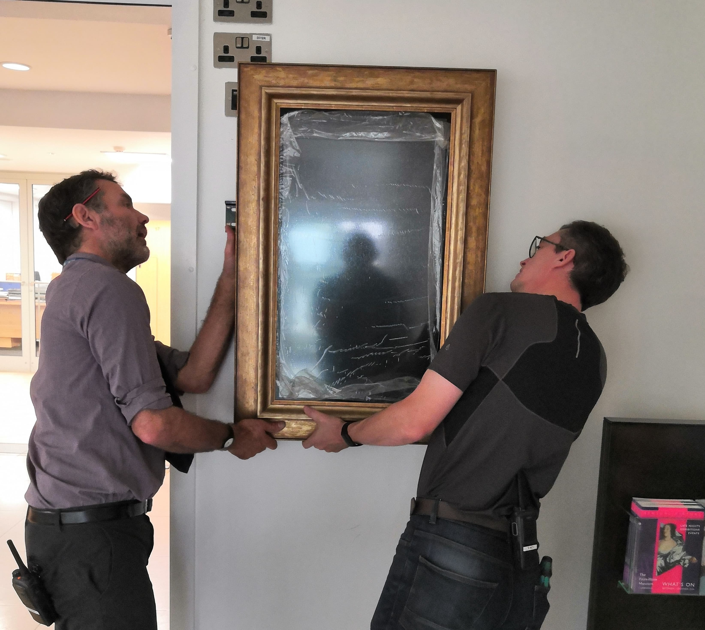
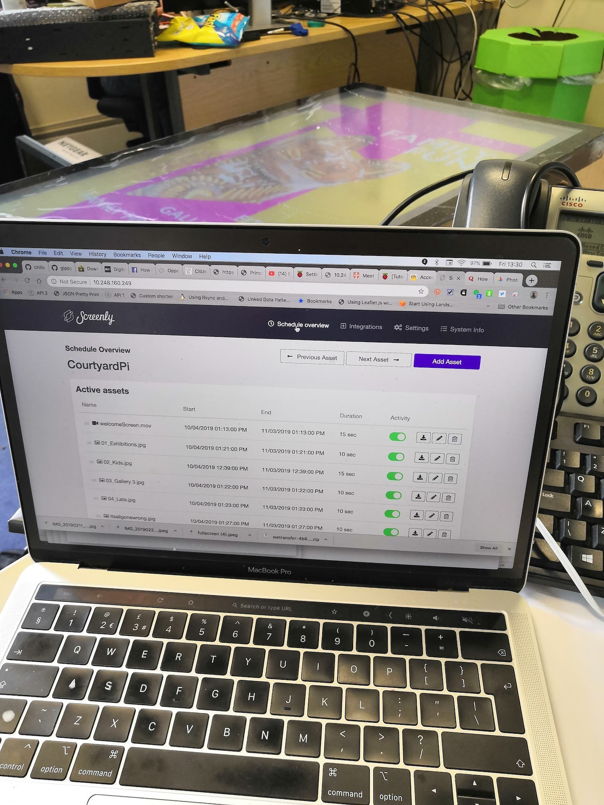
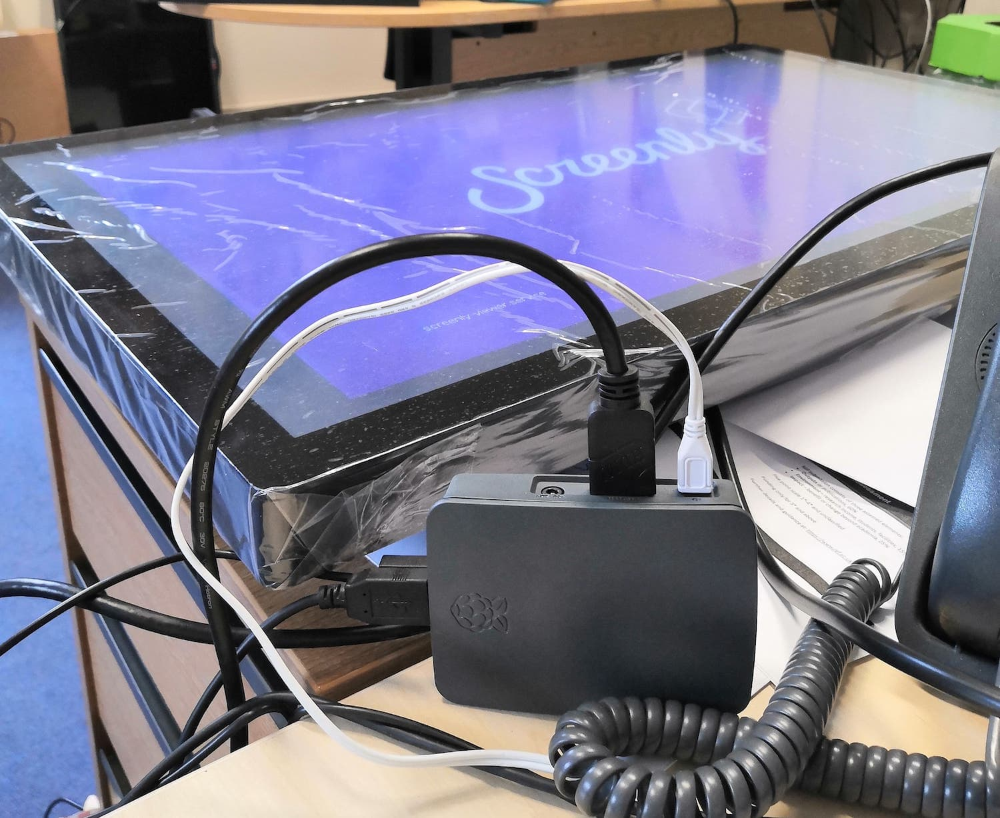

I was asked to install the first digital marketing screen at the Fitzwilliam Museum with 2 days notice, just before the 
reopening of gallery 3 (this went alongside all the work we were putting in on [enhanced labels](/content/projects/beyond-the-label)).

We purchased an [Iiyama touch screen](https://www.iiyama-monitors.co.uk) (not using that bit yet), and connected a [Raspberry Pi 4](https://www.raspberrypi.com/products/raspberry-pi-4-model-b/) that I donated to the Museum and [Screenly's Open Source Edition](https://www.screenly.io/ose/).
The purpose of the screen wasn't fully defined at the point of installation, but the marketing team wanted to 
display a video loop of the Museum's exhibitions and events. 

The solution for this project cost £845 - the screen was about £800, Pi about £40 and fixtures about £5. 
Set up for the screen took a couple of hours due to the trickiness of getting the machine to [connect to Eduroam](https://www.instructables.com/Access-Eduroam-on-a-Raspberry-Pi-in-Cambridge/) within 
the museum's estate (at the point of install, the museum network had not been upgraded) and getting it to stay connected to the Wi-Fi. 

Images and video are rotated 90 degrees to the right to fit the screen which has been installed in portrait mode 
(this had a better effect on the device than rotating the screen software side.) Content is rotated every 30 seconds and listed to 
change and expire based on the date and time.

The device is scheduled to turn off automatically at the end of the day, but I've noticed that the Front of House staff tend to turn it off manually at the socket at the end of opening hours.

## Where can I find this screen?

The screen is located in the Museum's main entrance, and has been fitted to the stud wall with a bracket and then an old 
picture frame was used to hide the bezels of the screen and to hold the Raspberry Pi in place. The sockets were luckily in place for 
the security team to easily install the screen and not create new work for the maintenance crew. 

## An example of content displayed 

<video controls>
  <source src="/video/welcomescreen.mp4" type="video/mp4">
</video> 

