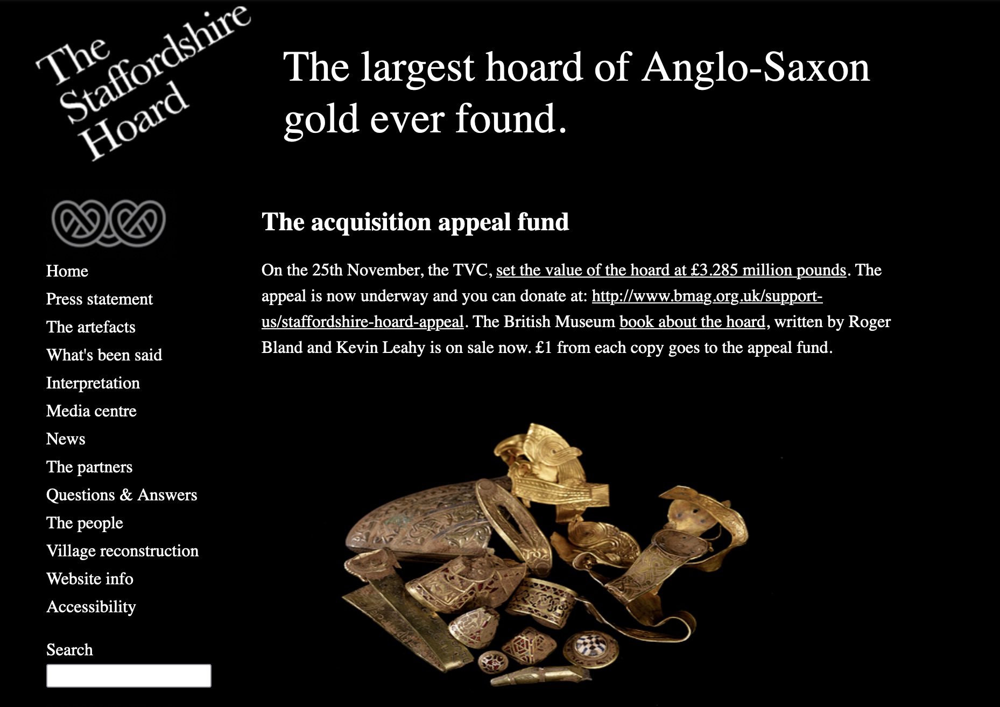

> Surge domine et dissipentur inimici tui et fugiant qui oderunt te a facie tua ~ "Rise up, o Lord, and may thy enemies be dispersed and those who hate thee be driven from thy face"

The Staffordshire Hoard is an unparalleled treasure find dating from Anglo-Saxon times. Both the quality and quantity of 
this unique treasure are remarkable. The story of how it came to be left in the Staffordshire soil is likely to be more 
remarkable still. The Hoard was first discovered in July 2009. The find is likely to spark decades of debate among archaeologists, 
historians and enthusiasts.

> It will redefine the Dark Ages. 

## Website 

The original website was built in one day by Daniel Pett, PAS ICT Adviser, using the OpenSource [Textpattern](https://textpattern.com) Content Management System (used to 
great effect by friends like LP-Archaeology).  The labeling of images was conducted by Katharine Kelland over a period of a few days whilst the data was manipulated from original work by Kevin Leahy 
via Roger Bland. The fantastic images come from a variety of sources - Daniel Buxton, David Rowan Birmingham University, 
the councils involved and Duncan Slarke (the local FLO). The website was replaced by Staffordshire County Council soon after
the acquisition of the hoard by Birmingham Museum and Art Gallery. A version of the original is now served off 
[GitHub Pages](https://portableant.github.io/staffordshire-hoard/).

## Technical Details

* Textpattern CMS
* Images sourced via Flickr API