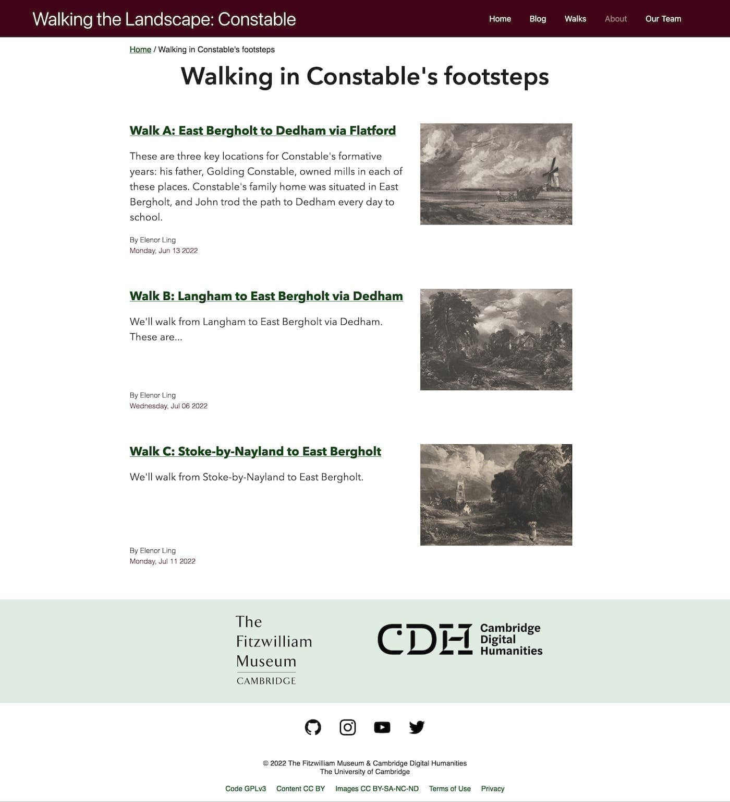
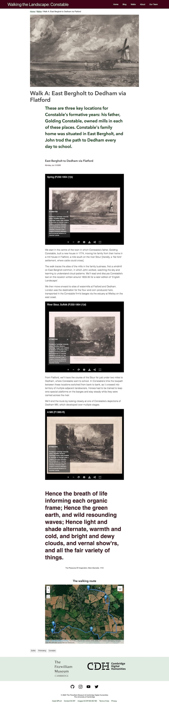

## About the project's research questions

>This spot saw the day spring of my Life, Hours of Joy, and years of Happiness, This place first tinged my boyish fancy with a love of the art, This place was the origin of my fame.

Constable’s connection with the countryside and intimate familiarity with rural life is evident in his paintings, drawings and prints, in his choice of subjects and attentive observation of the smallest detail of the natural world. Moreover, Constable was convinced that it was the Stour Valley, on the Suffolk-Essex border, that made him a painter.

This project uses digital technologies to take prints locked in a museum back into the landscape which made them, which represents them, and of which they are part. Using digital techniologies that enable us to pinpoint and ‘see’ various Constable compositions we will curate a series of public walks in landscapes Constable sketched, documenting them to produce a walking diary as a form of public writing.

How much has the landscape changed and how recognizable are the same views today?

How can we capture what it feels like to walk with Constable?

## What did we do?

For this project to disseminate the research findings, I created a website following my usual low-cost, sustainable 
digital humanities approach. The website is built using Jekyll, a static site generator, and hosted on GitHub pages and 
uses the Tachyons CSS framework and has embedded IIIF images, maps, audio and video. It is a simple piece of 
engineering and easy for anyone in the team to learn to update, nothing particularly groundbreaking and a pretty common
type of research project in archaeology. 

## Types of content

The website provided details for 3 walks through Constable's landscapes. 

In turn each walk had a dedicated page with a map, audio and video and sometimes IIIF images (hosted via CUDL).

Which begot blog posts related to each walk and participant's reflections on the walks.

