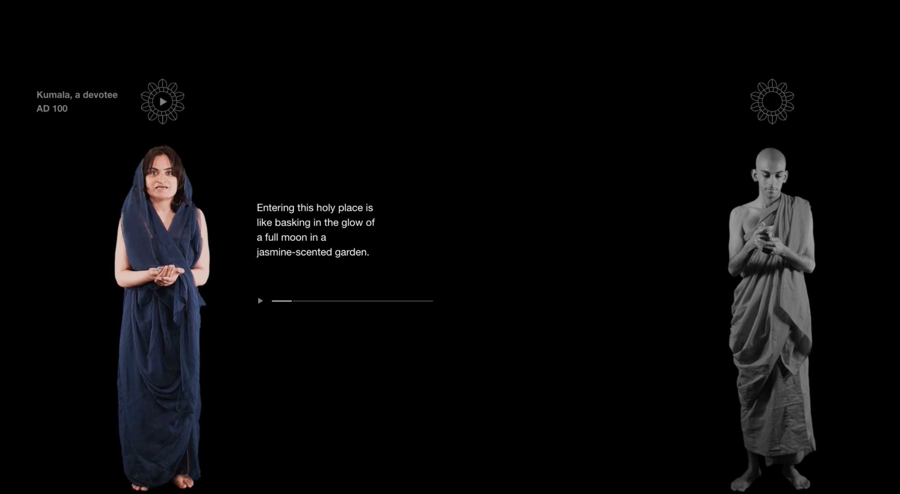
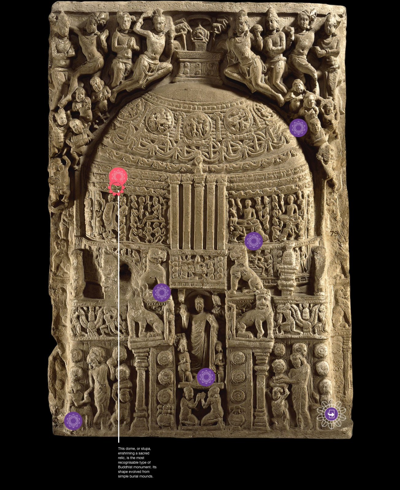
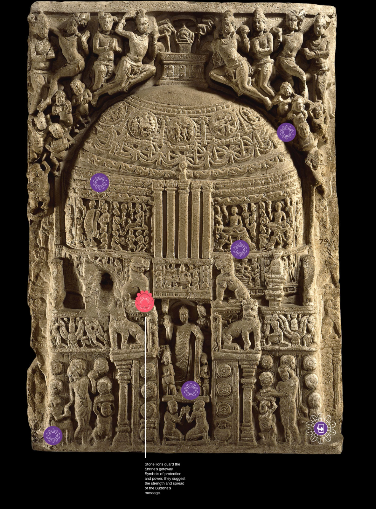

In 2017, the British Museum partnered with Google’s Creative Lab (based in Sydney, Australia) to work on an immersive digital 
experience focused on a single piece of the world revered Buddhist site of the Great Shrine of Amaravati.

This experience used projection, sonification and human computer interaction methodologies to blend together an experience 
built upon bring your own device principles (BYOD), which enabled the public to unpack in depth information about the focal 
point of the gallery. In just under 3 months, over 100,000 people visited this single gallery installation bringing with 
it a wide array of lessons for technologists engaged with in gallery digital works. 

The source code for this project was released under an open licence by Google on GitHub and the 3D model generated was 
released on SketchFab and was download ready for people to reproduce in their own homes.

    <iframe type="text/html" src="https://www.youtube.com/embed/fGIH0EsgVN8"></iframe>

## What came after XYFI?

This was the first part of the journey for the British Museum’s collection of architectural fragments of this shrine to 
be reinstalled in its own dedicated gallery, with an associated digital reconstruction built by Soluis Heritage (Glasgow). 

The video of this installation piece can be found [on Vimeo](https://fitz.ms/d) and shows off the magic of Steve Colmer 
and team at Soluis Heritage.

This reconstruction is a simple video tour of the site, built with architectural modelling and incorporating 3D models 
created at short notice using photogrammetry (with no regard for health and safety of the author).

### Associated 3D models

All of these 3D models can be recreated by any one with the appropriate software, as their source data has been released openly under creative commons licence, and they are all available on [Sketchfab](https://fitz.ms/g33bm), some with annotations encoding the scholarly knowledge of Dr Imma Ramos and Dr Richard Blurton.

    <iframe title="A 3D model" src="https://sketchfab.com/playlists/embed?collection=131719c4c31e47e5a40307d7dcc70709"  
    allow="autoplay; fullscreen; vr" 
    mozallowfullscreen="true" 
    webkitallowfullscreen="true"></iframe>

