> The archive is traumatic, testimony not to a successful encounter with thepast but to a […] “missed encounter with the real” — that is, an allegory of the impossible bridging of a gap. (Ernst 2013, 114)

As we approach the “media” used to record and store archaeological data over the last century or so, Huhtamo’s (2010) definition of media archaeology as a “historically-attuned enterprise” that involves “excavating forgotten media-cultural phenomena” certainly seems apt to describe the types of processes involved. How do we begin to contemplate the thousands of forgotten archaeological archives hidden away in repositories (for example, see Figure 1) all over the world? These lost worlds where many scholars have toiled away for years, trying to record every detail and bit of information (Figure 2) available about rare and precious archaeological objects in an attempt to bring order and understanding to an almost incomprehensible past seems now like a most Sisyphean task.

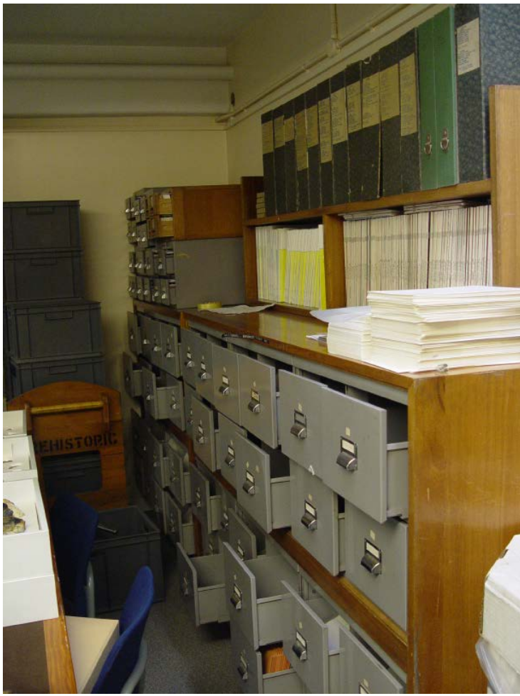

The physical “media” of choice was often the **index card**, a type of heavy paper cut to a standard size, used for recording and storing small amounts of discrete data. Invented by Carl Linnaeus, the father of modern taxonomy, in the mid-1760s (Müller-Wille and Scharf 2009), it is an Enlightenment tool for classifying the world that became ubiquitous in museums and archives by the Victorian era of extensive collecting. While stored in a fixed, conventional order (Figure 3), often alphabetically, index cards could be retrieved and shuffled around at will to update and compare information at any time. This employment of a flat surface (a map, a list, a file, a census, the wall of a gallery, a card index, a repertory), has, as Latour has pointed out, commonly enabled one to “master” a question or to “dominate” a subject (1986, 19).

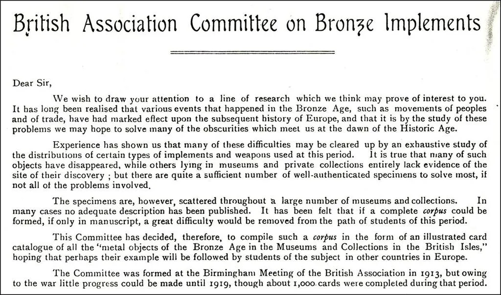

The standardized index card allowed for a “pliable combinability” of texts and objects, produced at a distance from their point of origin, which could be assembled into new networks and relationships (Bennett 2013, 39). This opened up new ways to compare and organize objects, collections, and cultures (see Harrison 2014 for further discussion). For archaeological archives, card indexes tended to be used to classify types of objects, which were then filed according to the typological and chronological information contained in the cards, certainly in the hopes of “mastering” a time period or object type. The cards and documents illustrated here come from the National Bronze Age Index (NBAI) stored at the British Museum (BM), developed in 1913 as one of the first catalogues to document British and European prehistory on a large scale.

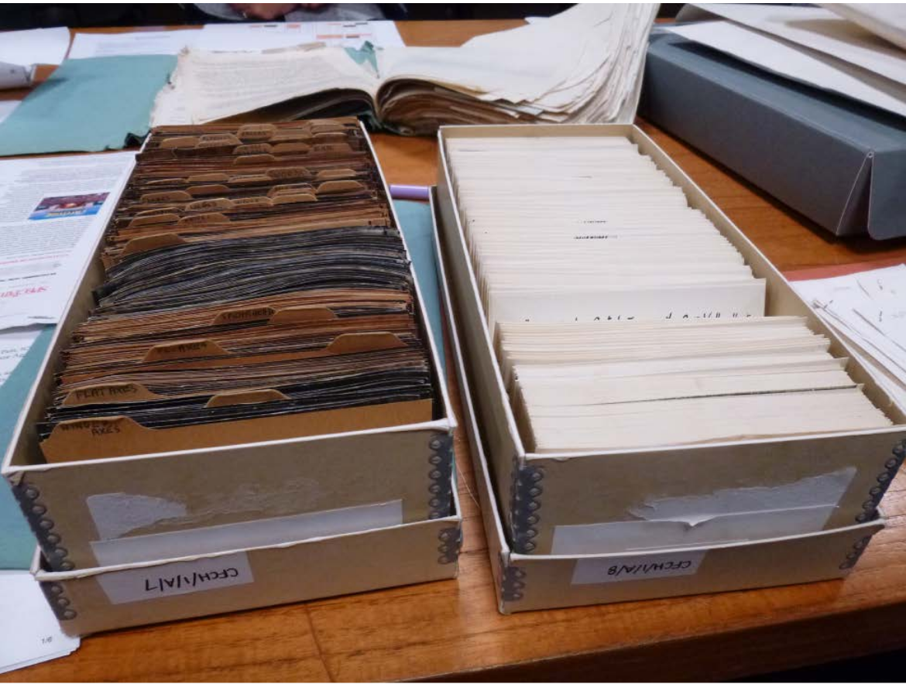

Known as the _“principal instrument of research in the British Bronze Age”_, the main concept behind the Index was the idea that by compiling a corpus of all Bronze Age metal objects found in the various museums and collections across the UK, it would be possible for the first time for researchers to study “the movements of peoples and trade through the exhaustive study of the distributions of certain types of implements and weapons used in the period”. This corpus took the form of an illustrated card catalogue (employing 25 × 18 cm Globe-Wernicke Co. standard filing cards), with each index card detailing object find spots and types, alongside detailed line drawings and a wide range of further information about the object’s context of discovery, illustrated below. For over 80 years, it represented the highest standards of Bronze Age object studies, eventually containing around 30,000 double-sided cards, and was worked on by numerous well-known prehistorians and former BM curators, most famously Christopher Hawkes in the 1930s–1960s and Stuart Needham in the 1970s–1990s.

The amount of information on such cards could be extensive and intriguing. We often see a tension on these cards between systematization (Figure 4) and free-form narrative (Figure 5), beautiful typological drawings and quick sketches (Figure 6), and classification and creativity. The human hand, though, is always present, bringing to mind Harris’s conception of an archive as:

> a crucible of human experience, a battleground for meaning and significance, a babel of stories, a place and a space for complex and ever- shifting power-plays. Here one cannot keep one’s hands clean. (Harris 2002, 85)

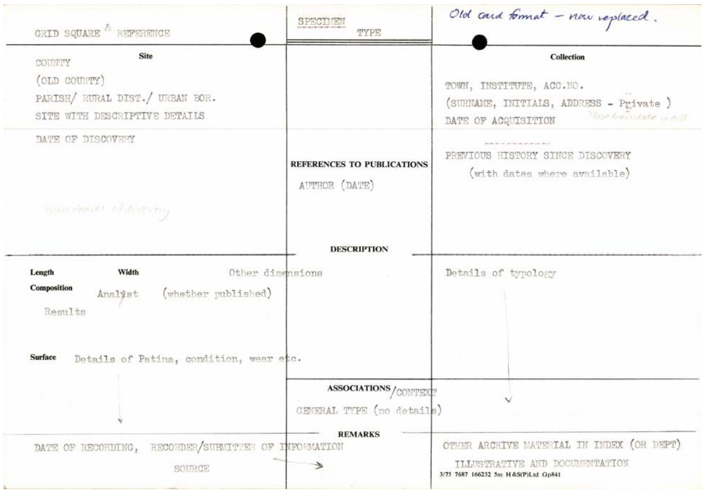 

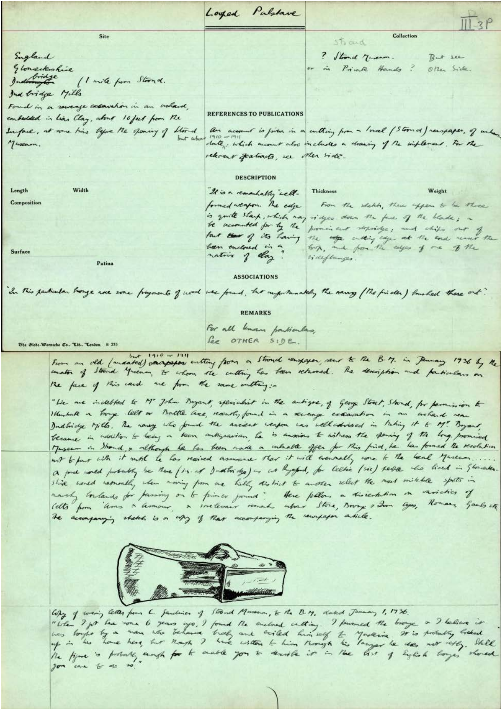 

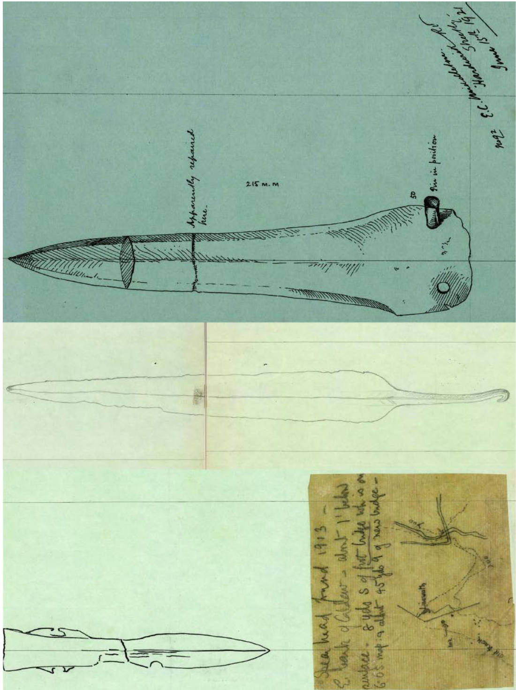 

Beyond recording typological data, these cards often contain additional information (Figure 7), offering fascinating insights into the circumstances of an object’s discovery. There is serendipity in the archives as well. We have cards that record donations by Queen Victoria (Figure 8) to the BM of a bronze axe found in Windsor Great Park in 1866. Another card (Figure 9) records an object discovered in 1808 at Osmington Hill, Dorset whilst cutting a hill figure dedicated to King George III, who would often pass by on his way to his seaside residence at Weymouth. In these cases, and many others, the cards’ record of historical moments or connections to significant personages seems to eclipse their primary function as a record of archaeological artefacts. 

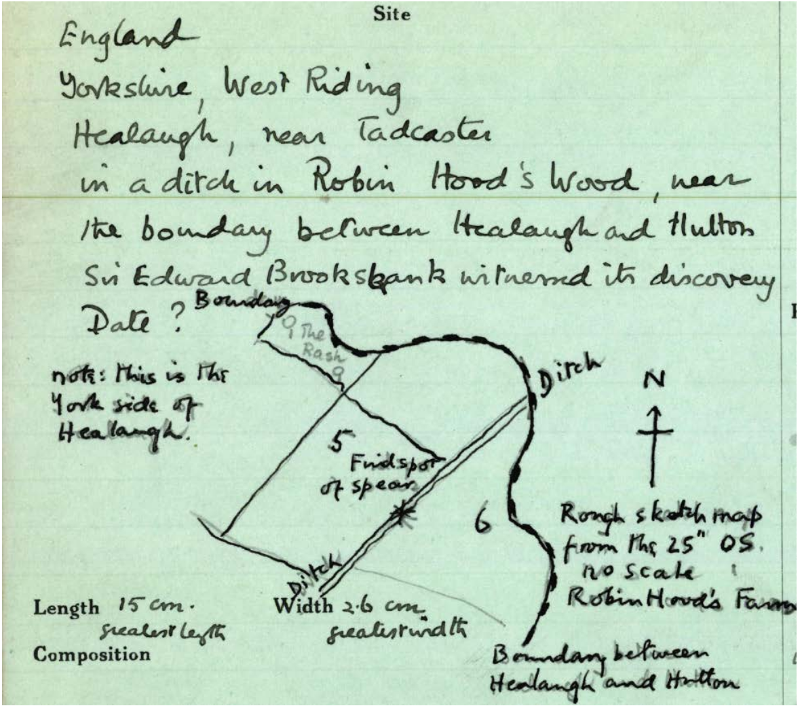

The cards also begin to act as a sort of proxy for the objects themselves, an idea of materiality. The records are descriptions of something material on a medium that is a “material” itself, but in reality it is the information itself that is the historical artefact and the main object of study (Newman 2011, 9). Consequently, the record of the human interaction (Figure 10) with these archives proves to be just as fascinating to study as the information actually contained in the records, as contributors to the field of history of archaeology can certainly attest to (for example, see Murray 2014).

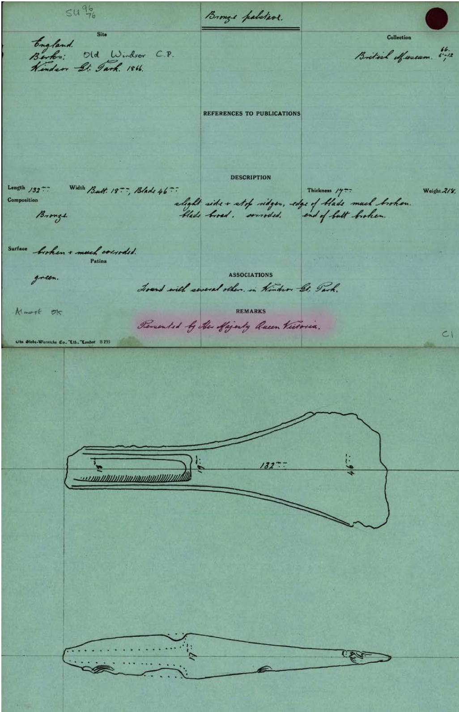

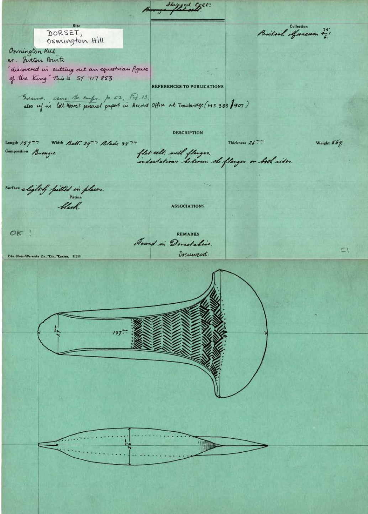

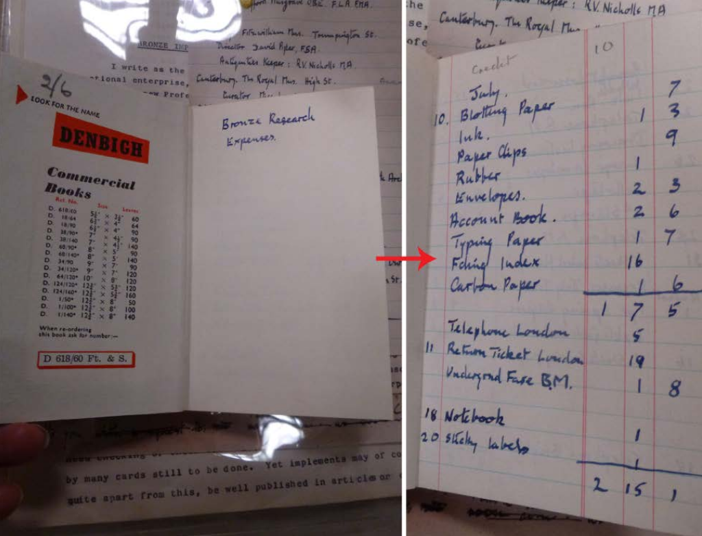

Along with connected archival material, the cards exhibit the curatorial practices at the time of their recording. Many have been altered numerous times as classification schemes and recording procedures changed over time, documenting not only basic archaeological information but also the history of shifting archaeological practices. The Index varied between being a public reference collection and a tool for private research, largely depending on the whims of the person and institutions in charge of it. This is most obviously played out from 1955–1965, when the Index was loaned from the BM, where it was publicly accessible, to the Institute of Archaeology, Oxford University under the supervision of Professor Christopher Hawkes, the new Chair of European Archaeology. The reasoning behind this move was that he had been in charge of the Index when he was an Assistant Keeper in the Department of British and Medieval Antiquities at the BM and was "wishing to supervise its re-classifying, indexing, and augmentation."[^1]

While Hawkes did greatly enhance the Index, it became his personal research collection, kept away from both the public and other scholars, which he used to pursue his theories of Bronze Age metalwork chronologies (see Bradley 2013 for further discussion). This is most visibly seen (Figure 11) in his reorganization of the entire Index according to his (unpublished) typological scheme, the particulars (Figure 12) of which have only recently been rediscovered and catalogued at the Institute of Archaeology’s archive. The Index became a public reference collection once again after being returned to the BM in 1966, although it was not actively researched again until 1973 when Stuart Needham took over its stewardship and was largely abandoned by the 1990s.

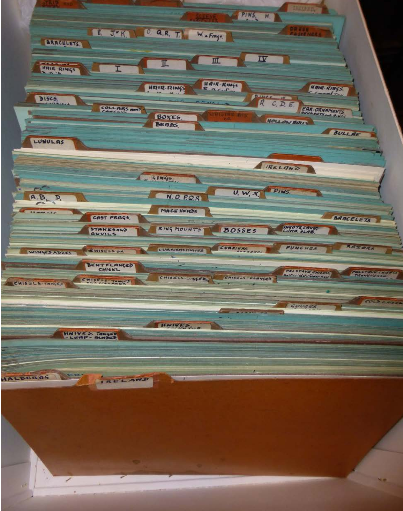

## Switching “Media” from Old to New

The multi-layered history of card indexes in archaeological studies is equally intriguing to study and complicated to deal with. How can we approach or, indeed, “excavate” these antiquated media sources to both draw meaning and data from these overlooked archives as well as make them relevant to modern communities?

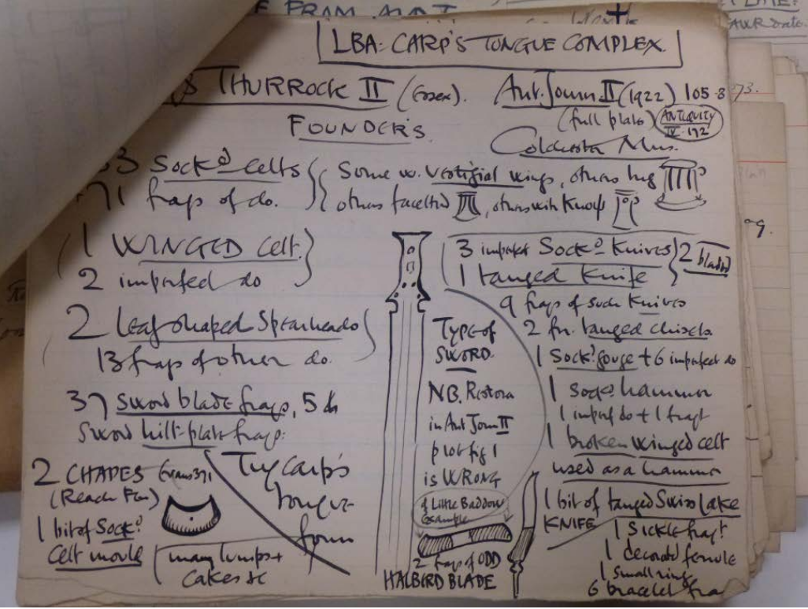

Index cards continue to act as “mobilization devices”, allowing access to information and data about a physical object without actual interaction with this object in the physical world (Latour 1986, 10). However, although indexes are a good example of a type of mustering technology in which dispersed items of knowledge are codified and brought into the centre for agonistic (e.g. academic, imperial, economic, nationalist) arguments, in reality the politics of aggregation and dispersal often makes these indexes largely inaccessible. The widespread notion that archives are, as Parikka (2013:1) states, “slightly obsolete and abandoned places where usually the archivist or the caretaker is someone swallowed up in the dusty corridors”, often hidden away from the public is not completely false, unfortunately. In the case of the NBAI, for example, although it has been moved around over the last hundred years, as mentioned previously, it has remained for much of its existence in a largely inaccessible, off-site BM storage facility where its visitors’ book records only six visitors over the course of 30 years (though conspicuously this does include everyone who has ever written significant books on Bronze Age metalwork during that period). Even if this Index and others were more accessible, specialist knowledge would still be needed to even begin to approach such large behemoths of information. 

Wide-scale dispersal, therefore, has not been generally possible but new forms of media and digital engagement perhaps now offer us innovative inroads into some of these issues (for example, see Bonacchi 2012; Richardson 2013). As part of the MicroPasts Project, the digitization of the entire Bronze Age Index has been undertaken. This project is focused on demonstrating how the interplay between reassessing archaeological archives and the employment of new technologies can open up new avenues of research and public engagement. The MicroPasts project employs an open-source crowd-sourcing platform (Figure 13) in order to solicit help from members of the public, also known as “citizen scientists” or “citizen archaeologists”, to assist us with transcribing these cards (Bevan et al. 2014; Bonacchi, Pett and Keinan-Schoonbaert 2014; Bonacchi, Pett, Keinan-Schoonbaert et al. 2014; Doherty 2014; Keinan-Schoonbaert 2014).[^2]

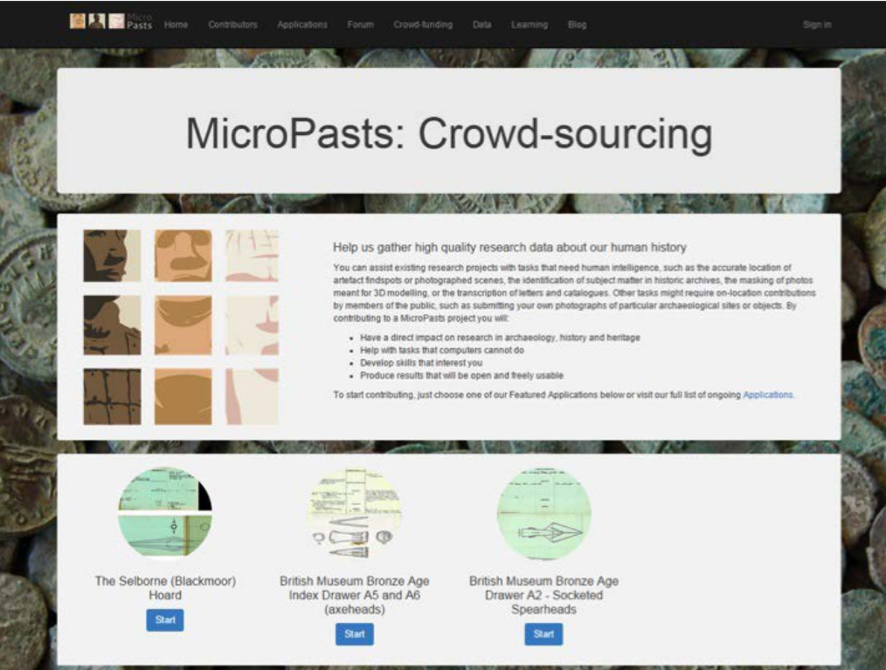

Reflecting the existing physical organization of the Index, pictured in Figure 1, each “app” generally represents one “drawer” (e.g. Drawer A9: Palstaves) organized by object type and geographical location, and each individual card in the drawer is scanned at a high resolution, available via our Flickr site and stored in three secure locations for backup integrity. For each transcription app, the MicroPasts collaborators are prompted to fill in a structured field interface (Figure 14) based on the contents of the cards, and the completed transcribed data is available for download from the project’s website under an open license. These data will eventually be incorporated into the Portable Antiquities Scheme’s database, which on its own includes over one million objects (of which over 15,000 are attributed to the Bronze Age) discovered by the public in England and Wales, eventually making the NBAI records not only easily accessible to the public but also creating possibly the largest national database of prehistoric metal finds anywhere in the world.

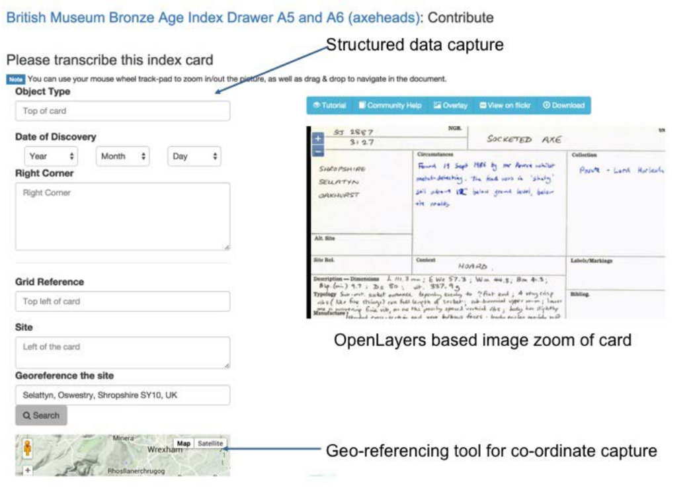

In a way, we are attempting to fulfill the original intentions of the creators of the NBAI from the early twentieth century (Figure 2), by once again calling on the public’s help with documenting and transcribing the archive as well as making the Index a fully renewed publicly-accessible resource. Crowd-sourcing, therefore, can be seen as an act of knowledge aggregation by the dispersed-many rather than the aggregated-few. These processes can be connected to the concept of the “collaborative museum”, where the museum can be viewed as a series of “anthropological assemblages mobilized through existing and emerging scientific-administrative and public-civic apparatuses” creating new social actions and networks (Bennett 2013; Harrison 2014, 231). By changing the medium of the Index via digital technologies, we are removing the institutional controls, for better or worse, and distributing the agency of this data.

Why are people so intrigued to help with this project? While this is something we will be looking at more closely in the future, perhaps it is because it removes the “remoteness” of the archives both symbolically and physically. By digitizing records formerly only accessible to a few experts and museum staff, they are suddenly becoming democratized, open-access resources for anyone to engage with, albeit with the existing but, arguably, progressively shrinking, limits of a digital divide. It took a new infrastructure of communicating realities—the impact of digital media—to put this critique of historical discourse into media-archaeological terms and practice. In an age of renewed archival fever, the re-aggregation and digital mustering of old archives, along with the virtual re-aggregation of object collections via 3D proxies (Figure 15), is also a very popular act. Co-production of archaeological data not only removes the traditional idea of “authority” (Richardson 2013), opening up the possibilities for multi-vocal engagement with the archival record; it gives people a sense of what archaeologists and archivists actually do and the means to actively help them with their work. On the MicroPasts forum, one of the users, for example stated:

> Part of the appeal (of the transcriptions) for me is seeing how the original authors put a little bit of themselves into their record cards, and obviously took pride in analyzing and recording the artefacts. I’m just completing a card now in which the patina is described as “Beautiful apple green”. (curiouscraig42 2014)

This engagement and ongoing dialogue about the Index also create new archival records of human interaction via social media (Twitter, Facebook), adding to our archival layer cake.

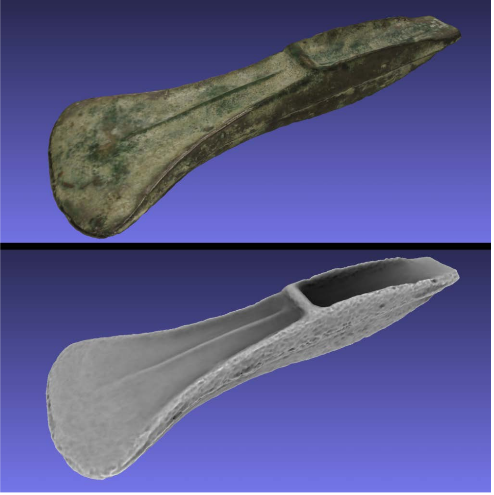 

While the switch in media from a physical, paper format to a digital database for archiving archaeological data makes this information increasingly Cartesian—mathematical objects recorded using binary code—the forms in which data are stored and presented become distinct entities, unlike their paper antecedent (Ernst 2013, 83, 93, 115). Now, the image on the screen is merely a digital representation or surrogate of the encoded data, useful for further research but far removed from its original format. With growing digital accessibility comes the increasing responsibility to preserve and update these digital archives as well as the paper ones they represent, especially if we view the digital record as a modern piece of material culture (Newman 2011, 9). Ultimately, one type of media does not completely replace the other, but greater use of digital media simply changes and extends the terms of engagement, accessibility, and the flow of information from antiquated archaeological archives to the community and back again.

## References

  - Bennett, T. 2013. “The ‘Shuffle of Things’ and the Distribution of Agency.” In **Reassembling the Collection: Ethnographic Museums and Indigenous Agency**, edited by R. Harrison, S. Byrne, and A. Clarke, 39–60. Santa Fe, NM: School for Advanced Research Press.
  - Bevan, A., D. Pett, C. Bonacchi, A. Keinan-Schoonbaert, D. Lombraña González, R. Sparks, J. Wexler and N. Wilkin. 2014. “Citizen Archaeologists. Online Collaborative Research about the Human Past.” **Human Computation** 1(2): 183–197.
  - Bonacchi, C., ed., 2012. **Archaeology and Digital Communication: Towards Strategies of Public Engagement**. London: Archetype Publications.
  - \_\_\_\_., A. Bevan, D. Pett and A. Keinan-Schoonbaert. 2014. “Crowd- and Community-fuelled Archaeology. Early Results from the MicroPasts Project.” **Proceedings of the 42nd Annual Conference on Computer Applications and Quantitative Methods in Archaeology, CAA 2014**, edited by L. Costa, F. Djindjian, F. Giligny and P. Moscati, 1–10. Amsterdam: Amsterdam University Press.
  - \_\_\_\_., A. Bevan, D. Pett, A. Keinan-Schoonbaert, R. Sparks, J. Wexler and N. Wilkin. 2014. “Crowd-sourced Archaeological Research: The MicroPasts Project.” **Archaeology International** 17: 61–68.
  - Bradley, R. 2013. “Time Traveller: Montelius and the British Bronze Age after 100 Years.” In **Counterpoint: Essays in Archaeology and Heritage Studies in Honour of Professor Kristian Kristiansen**, edited by S. Bergerbrant and S. Sabatini, British Archaeological Reports, International Series 2508: 649–653. Oxford: Archaeopress
  - curiouscraig42 [C. Horton] (2014) Comment on forum thread “Just a Silly Thought.” 4 June. Available online: [http://community.micropasts.org/t/just-a-silly-thought/140/6](https://www.google.com/search?q=http://community.micropasts.org/t/just-a-silly-thought/140/6)
  - Doherty, J. 2014. “Crowdsourcing the Bronze Age.” **Pybossa** 5 June. Available online: [http://pybossa.com/blog/2014/06/05/crowdsourcing-the-bronze-age/](https://www.google.com/search?q=http://pybossa.com/blog/2014/06/05/crowdsourcing-the-bronze-age/)
  - Ernst, W. 2013. **Digital Memory and the Archive**. Minneapolis: University of Minnesota Press.
  - Harris, V. 2002. “The Archival Sliver: Power, Memory, and Archives in South Africa.” **Archival Science** 2: 63–86.
  - Harrison, R. 2014. “Observing, Collecting and Governing ‘Ourselves’ and ‘Others’: Mass-Observation’s Fieldwork Agencements.” History and Anthropology 25(2): 227–245.
  - Huhtamo, E. 2010. “Natural Magic: A Cultural history of Moving Images.” In The Routledge Companion to Film History, edited by W. Guynn., 3–15. Abingdon, UK: Routledge.
  - Keinan-Schoonbaert, A., 2014.“MicroPasts – An Innovative Place for Progressing Research.” British Archaeology 139: 50–55.
  - Latour, B. 1986. “Visualisation and Cognition: Drawing Things Together.” In Knowledge and Society: Studies in the Sociology of Culture Past and Present, Volume 6, edited by H. Kuklick and E. Long, 1–40. Greenwich, CT: JAI Press.
  - Müller-Wille, S. and S. Scharf. 2009. Indexing Nature: Carl Linnaeus (1707-1778) and his Fact-Gathering Strategies. Working Papers on The Nature of Evidence: How Well Do ‘Facts’ Travel? 36/08. London: Department of Economic History, London School of Economics. Available online: [http://www.lse.ac.uk/economicHistory/pdf/FACTSPDF/3909MuellerWilleScharf.pdf](https://www.google.com/search?q=http://www.lse.ac.uk/economicHistory/pdf/FACTSPDF/3909MuellerWilleScharf.pdf)
  - Murray, T. 2014. From Antiquarian to Archaeologist: The History and Philosophy of Archaeology. Barnsley, UK: Pen & Sword Archaeology.
  - Newman, M. 2011. “The Database as Material Culture.” Internet Archaeology 29. Available online: [http://dx.doi.org/10.11141/ia.29.8](http://dx.doi.org/10.11141/ia.29.8)
  - Parikka, J. 2013. “Archival Media Theory: An Introduction to Wolfgang Ernst’s Media Archaeology.” In Digital Memory and the Archive, edited by W. Ernst, 1–22. Minneapolis: University of Minnesota Press.
  - Richardson, L. 2013. “A Digital Public Archaeology?” Papers from the Institute of Archaeology 23: Art. 10 (online edition). [http://dx.doi.org/10.5334/pia.431](https://www.google.com/search?q=http://dx.doi.org/10.5334/pia.431)

### About the Authors
- Jennifer Wexler is Bronze Age Index Manager in the MicroPasts Project at the British Museum and an honorary research associate at the UCL Institute of Archaeology. Address for correspondence: Department of Digital & Publishing, British Museum, Great Russell Street, London WC1B 3DG, UK. Email: jwexler@britishmuseum.org
- Andrew Bevan is Professor of Spatial and Comparative Archaeology at the UCL Institute of Archaeology. Address for correspondence: UCL Institute of Archaeology, 31–34 Gordon Square, London WC1H 0PY, UK. Email: a.bevan@ucl.ac.uk
- Chiara Bonacchi is a Research Associate on the MicroPasts and MicroPasts Knowledge Exchanges Projects at the UCL Institute of Archaeology. Address for correspondence: UCL Institute of Archaeology,31–34 Gordon Square, London WC1H 0PY, UK. Email: c.bonacchi@ucl.ac.uk
- Adi Keinan-Schoonbaert is a digital curator at the British Library and an honorary research associate at the UCL Institute of Archaeology. Address for correspondence: UCL Institute of Archaeology, 31–34 Gordon Square, London WC1H 0PY, UK. Email: adi.keinan.09@ucl.ac.uk
- Daniel Pett is the former ICT officer for the Portable Antiquities Scheme (finds.org.uk) and is now developing of creative digital projects at the British Museum. He is an Honorary Lecturer at the UCL Institute of Archaeology. Address for correspondence: Department of Digital & Publishing, British Museum, Great Russell Street, London WC1B 3DG, UK.Email: dpett@britishmuseum.org
- Neil Wilkin is Curator of the British and European Bronze Age collection at the British Museum. Address for correspondence: Department of Britain, British Museum, Europe, and Prehistory, Great Russell Street, London WC1B 3DG, UK. Email: nwilkin@britishmuseum.org

## Footnotes  

[^1]: British Museum Bronze Age Index archive history file.  
[^2]: For the MicroPasts Project and the crowd-sourcing programme see http://micropasts.org and
http://crowdsourced.micropasts.org
