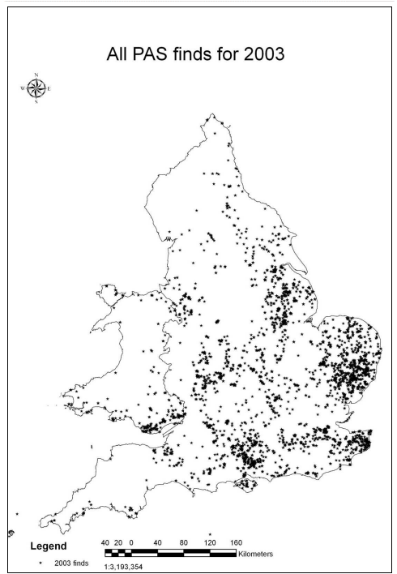
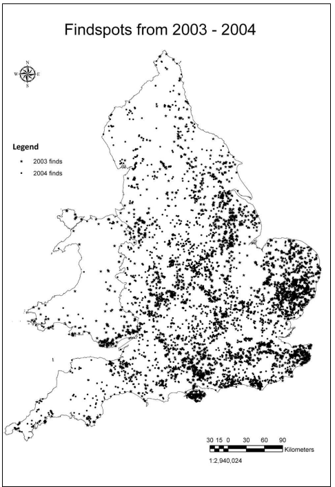
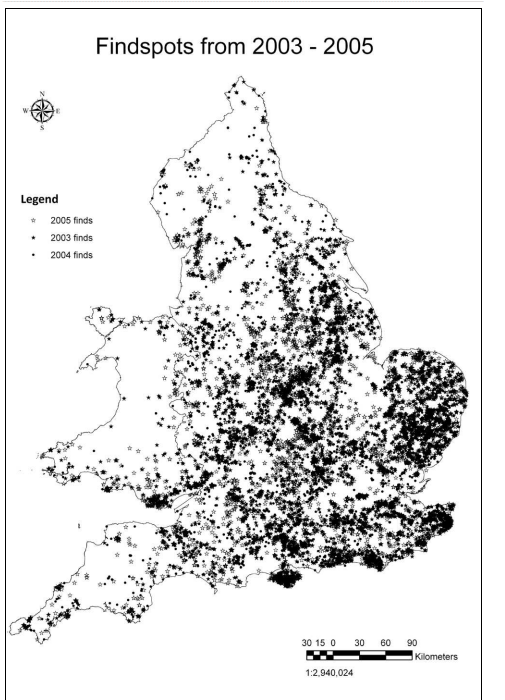
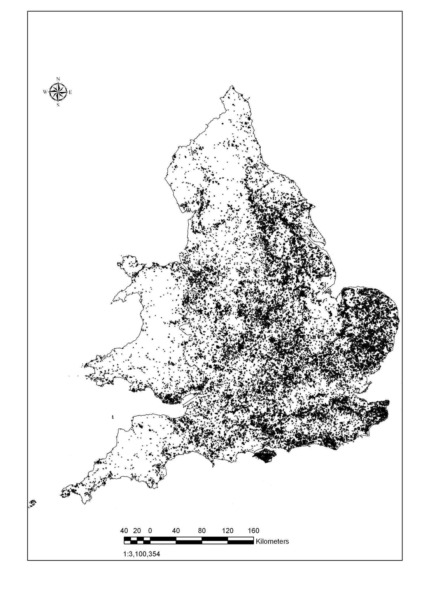
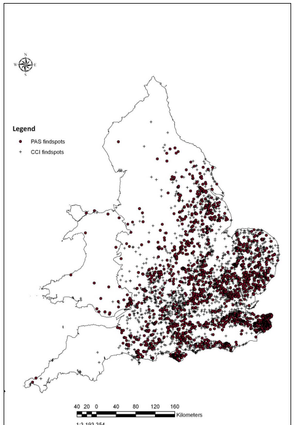
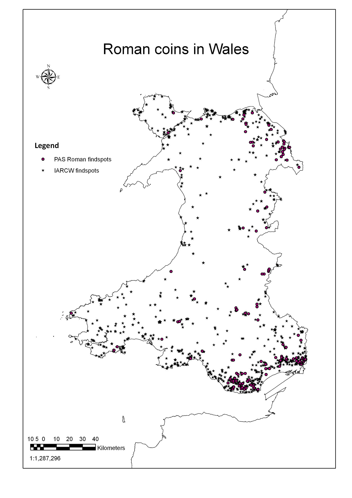
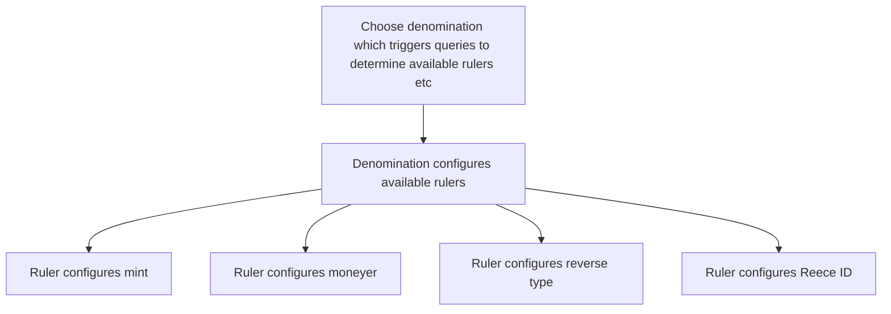
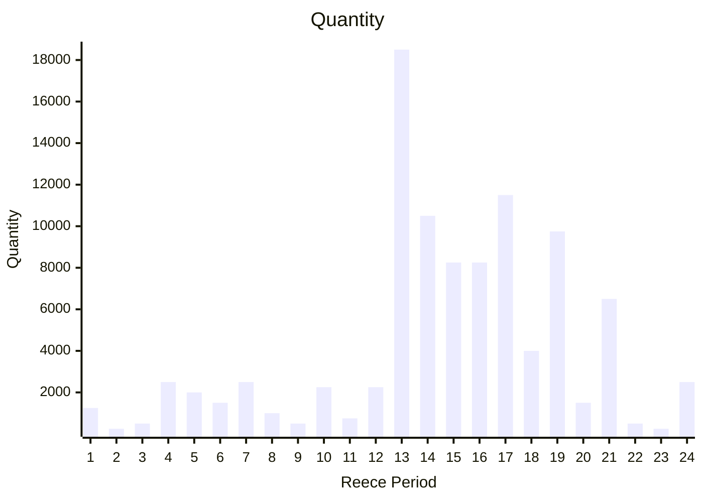
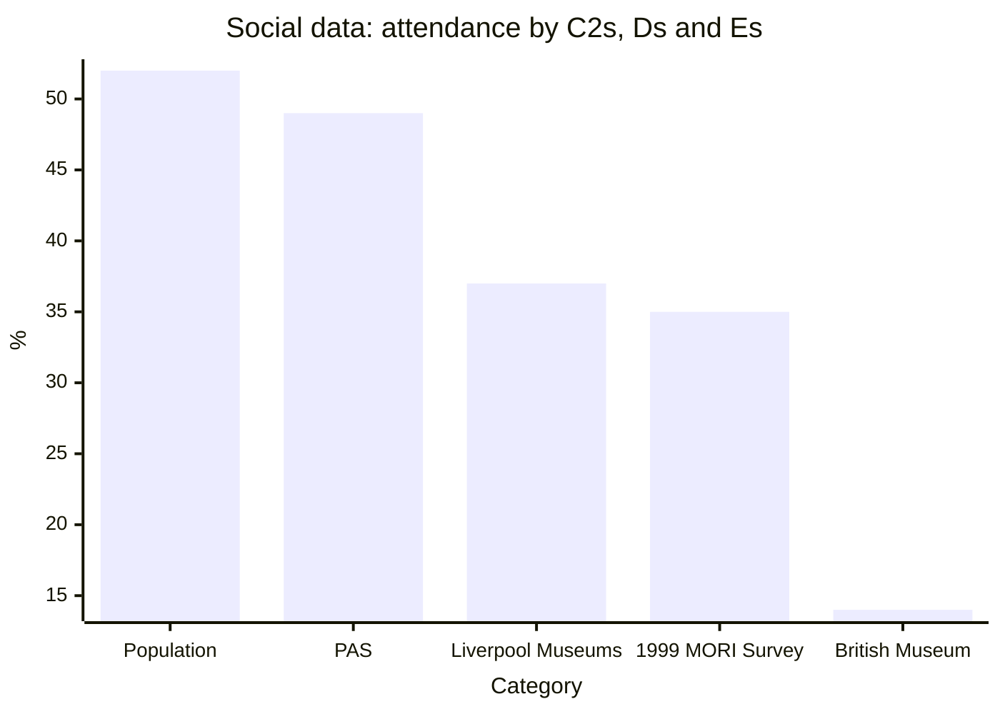

---
title: "The Portable Antiquities Scheme's Database: its development for research since 1998"
section: papers
date: 2010-04-04
slug: /papers/portable-antiquities-development
keywords: antiquities,archaeology
citation: "Pett, D.E.J.(2014) The Portable Antiquities Schemes Database: its development for research since 1998 (2010)"
authors:
 - Daniel Pett (The British Museum)
featuredImg: ../images/papers/decade/5468338246_b54cf05b4d_w.jpg
background: ../images/papers/decade/5200670881_168efebd64_k.jpg
lat: 51.51897
lon: -0.1265
tags:
- digital transformation
- museums
- archaeology
- antiquities
- database
- open data
--- 

In 2003, thanks to Heritage Lottery Fund funding, the  Portable Antiquities Scheme (PAS) began to formulate plans to become the national programme for the recording of archaeological finds found by the public. Through the vision of its Advisory Group, the PAS was now in a position to expand to the whole of England and Wales and sought to deliver the fruits of its work via the Internet. There were no models on which to build this project, and the organisation that now exists, is still the pioneer.

In 1996, Tim Schadla-Hall (1996) stated:

> how ready is our collections information for the super highway? I suspect the answer is that a lot of it is not ready for the mud track or even the occasionally trodden grassy path!

For a self-confessed computer illiterate this statement was extremely precise. The majority of museums, archives and heritage institutions were not in the position to take advantage of the advent of the web and its vast potential. Indeed, even now, many organisations are still unable to take full advantage of what is an inherently fast paced sector. However, this paper will attempt to demonstrate that this is changing rapidly throughout the Heritage Sector and we are now in a period where disparate resources can potentially be joined up and interrogated easily at the click of a button.

## The Scheme's Database

In 1997, when the PAS was a fledgling recording programme, the collation of data was extremely fragmentary. In 2001, the Scheme embraced the digital age and produced its first website under the direction of Richard Hobbs and a skeletal database was available for researchers to access online. Data recorded by the original six pilot regions was collected on individual  Microsoft Access (devised by Cassely 1998) instances and these data subsequently were collated once a year to a central copy and then published onto the Scheme’s website (not fully as some data was retained in the Access instance). The records were the same standard as many found within a wide variety of institutions and, for example, the record would be presented as an outline:

- Object type = coin
- Description = lacking
- Denomination = denarius
- Spatial data = 4-figure National Grid Reference was the normal geo-reference available
- Low resolution image(s)

These data provided a very sparse starting point for any researcher and at the time were heavily criticised by finds researchers who had been asked to assess the value of PAS data, as part of a Review of the Scheme in 2001. Hilary Cool (2001: App. 4.2, 6), for example, stated that:

>currently the entries are of variable value, and it is imperative to improve the quality of the poorer ones. If the objects are not identified accurately and in appropriate terminology, then the database will not be used… The input of senior and experienced finds researchers of the type envisioned for the Object Advisor posts will be vital for this.

The PAS recognised these shortcomings, which helped to devise future recording policy and led to the establishment of the posts of ICT Adviser (that of the author) and the Scheme’s Finds Advisers. That said, the genesis of the IT systems was begun beforehand, with Alice Grant Consulting and David Dawson (then Head of Digital Futures, MLA) fundamental in the specifications being drawn up for the development of an online recording application and building on the Access model devised by Victoria Cassely (formerly British Academy).

This was granted in December 2002 after a competitive tendering exercise, to Oxford Arch Digital (OAD), and this partnership was maintained until August 2007, when they went into liquidation shortly after this conference closed. The key concepts behind the development of the Scheme’s database were:

- Open access to all
- Available 24 hours a day
- Provision of a mechanism for collection of data centrally
- Controlled terminology to standardise entries
- Ordnance Survey based spatial data
- Protection of all sensitive data and compliance with the Data Protection Act (1996)
- Publishing the data online, negation of the Freedom of Information Act (2002)

In April 2003, the Scheme’s database went live to the public. Since then, there has been a steady progression of user interfaces and server-side enhancement, including:

- Extensive workflow policy to enable validation of records entered
- Integration of zoom and pan technology for high resolution viewing of images
- Numismatic data entry overhaul
- Search engine overhaul
- Integration with web mapping services (Google and open layers)
- Traffic light workflow indicators to signify status of records
- XML MIDAS schema for Historic Environment Record (HER) integration
- CSV (excel) import/export routine for data manipulation
- Really Simple Syndication feeds (RSS) added for reuse of content by external consumer sites (news, events, blog posts and artefact records)
- OAI-PMH and z39.50 routines for external content consumption ([People’s Network Discovery Service]((https://www.peoplesnetwork.gov.uk)) and [HEIRNET](https://www.britarch.ac.uk/HEIRNET))
- Permissions based access for users
- Email reports for registered users

## Sharing archaeological content isn’t just for the archaeological community

One of the key aspects that the Scheme identified with regards to broadening its appeal to the potential audience base was to syndicate content and participate in various projects that will reuse and manipulate our collated data. Since 2005, the Scheme has released all of its content via RSS feeds and participated in the following projects using various content dissemination methodologies:

- [BRICKS](http://www.brickscommunity.org)
- [MICHAEL](http://www.michael-culture.org.uk)
- People’s Network Discovery Service
- Sharing content with the signed up partner Historic Environment Records (HERs): 55 current signatories
- INTERFACE: a German led coins network
- Digital Coins Network

As the PAS core funding is from public funds, it is therefore a key principle that its data is shared with anyone that wishes to make use of it (the Data Protection Act 1996 and site sensitivity concerns prevent certain aspects of our data being disseminated to all parties). The concept behind freeing up public funded data gathered momentum with The Guardian newspaper campaigning for open access models via its [‘Free our data campaign’](http://www.freeourdata.org.uk).

The PAS has been hampered in its use of Ordnance Survey data as the full license is not cost effective: this is ironic given the Ordnance Survey, like the PAS, is publically funded. At one point the Scheme had a free licence under the Pan-Government Agreement, which was subsequently replaced with a pay for use model. The Scheme is now using a basic outline layer of England and Wales, and is making use of the possibilities offered by [Google](www.google.com/apis/maps) and [Yahoo](http://developer.yahoo.com/maps) map Application Programming Interfaces (API). Using these mapping facilities reduces costs substantially and common interfaces are being implemented that users will be familiar with.

## Uptake in the academic community

In May 2007, the database had attracted over 550 registered users, of which approximately 120 are allowed
to enter data directly onto the system; 130 users have access for research. These data are now used by a wide
variety of researchers, with respected scholars seeing the value of PAS database in their work. Martin Biddle (pers. comm.), for example, stated:

> ‘the result [of using PAS data in my research] has transformed knowledge of the pattern of Early Anglo-Saxon settlement of central Hampshire, notably of the Itchen valley, more thandoubling the number of known sites and emphasising the central role of Winchester. It is a marvelous demonstration of the value of the PAS - if only it had been going from the beginning of metal-detecting!’

As the database matures and more researchers make use of these data, its true merits (together with the efforts of the Scheme’s staff and those that offer finds for recording) will be realised. In recent years, several major research topics have been awarded funding to study (in part) the Scheme’s data, including:

- Oxford Archaeology’s night hawking survey (English Heritage funded)
- The Viking and Anglo-Saxon Landscape and Economy (VASLE) project (Naylor and Richards, 2006) at the University of York (AHRC funded; see also this volume)
- The Tribal Hidage project at University College London (Leverhulme funded; see also this volume)
- AHRC funding for three Collaborative PhDs in 2006-07.
  - King’s College London
  - Birkbeck College, University of London
  - University College London
- Over 50 individuals completing research for higher level degrees worldwide (including Australia, Japan USA and the UK).

As the dataset is now rapidly increasing in size, the analysis of de-contextualised find data is now becoming more integral to high level projects. The critical point will be when half a million objects have been recorded and researchers can access a wide variety of information easily for multi-period queries.

## Data collection comes at a price

Most pertinent is the upward trend in recording of archaeological objects (Figure 1). Since 2003, the Scheme has recorded over quarter of a million objects and made them available freely to audiences across the world. The flow of data into the Scheme’s database is rising rapidly as shown below. There are several noticeable points to consider when viewing these figures:

- Pre 2003, there were only six recording centres in operation
- 2001-2 saw the Nationwide ‘Foot and Mouth’ crisis, which restricted access to the countryside
- 2003-4 saw very little activity in Wales due to the Buried Treasure Exhibition: during this period, the Finds Co-ordinator for Wales was engaged in preparation for this installation (Mark Lodwick, pers.comm.)
- 2003-6 saw the inclusion of paper records from Norfolk within these figures
- 2007 saw the import of 10 years of numismatic data from Norfolk in a single batch

| Year of recording | Quantity |
|-------------------|----------|
| 1998              | 4,558    |
| 1999              | 8,201    |
| 2000              | 18,106   |
| 2001              | 16,368   |
| 2002              | 11,996   |
| 2003              | 21,684   |
| 2004              | 39,000   |
| 2005              | 52,202   |
| 2006              | 58,311   |
| 2007              | 79,051   |

Figure 1: The increase in finds recorded by the PAS since 1998 (after Lewis 2003, 2004, 2005 and subsequent compilation from the database).

The recording of these finds always comes at a cost, something that Tim Schadla-Hall highlighted in his paper to the conference (not published within these proceedings). Analysing the Scheme’s return on investment (ROI) in technology, its database can be seen as a widespread and acclaimed success. The embracing of Fully Open Source Software (FOSS) technology has allowed the Scheme to remain free of the shackles of licence fees and proprietary programmes and behave with the flexibility of successful IT companies. If the Scheme had followed the Microsoft or Oracle route, then it would have floundered on a one off product and there would have been less money available for the staffing of the Scheme.

Between 2003 and 2007 the Scheme spent just under £162,000 (initial outlay accounted for the majority) on IT development and running costs. Running two servers with dual processors, equivalent licence costs for Microsoft SQL Server would have been around £50,000 per annum for enterprise level service (pers comm. IT department, British Museum). So in those 4 years, the PAS would have spent significantly more than the budget allowed for and impinged upon other activities.

Cost per unit added to the database, when plotted against total IT spending demonstrates a substantial fall withevery object recorded. Figure 2 shows the annual IT outlay by the Scheme between 2003 and 2007 (in line with the fiscal year) and the cost per find recorded now stands at £0.84. Added value can also be claimed by the Scheme allowing others to recycle these data into their own applications at no access costs. PAS literally gives away its data at the cost of its bandwidth; external consumers pay nothing.

The usual cost efficiency argument that is discussed in many quarters factors in the costs added for recordingeach object by using staff salary and associated costs divided by the number of finds recorded. This could be regarded as a false measure of the Scheme’s workings. It is extremely difficult to attach a cost element to the ‘other work’ of the average Finds Liaison Officer (FLO), such as local society talks, finds days, school visits, gallery talks and local museum or authority duties. For example, between 2003 and 2006, 35,668 people attended 1,073 talks and lectures organised by the PAS, and a further 45,225 people attended 1,187 finds days around the country (Lewis 2006). FLO’s never spend 100% of their time on data entry and hence the unit cost for each recorded find demonstrates that the Scheme is ultimately extremely cost effective.

The use of a centralised repository has allowed the Scheme to produce statistics on demand with regards to these data and it allows for monitoring of find spot precision and number of finds recorded per region/user/county/parish/type, via the creation of simple or extremely complex computational queries.

The perpetual argument over the lack of provenance of objects recorded in the Scheme’s database, versus the archaeological value of finds submitted for recording is now receding. Figure 3 demonstrates the increasing precision to which finds are being recorded. By being able to edit data at any time, these grid references can be improved at any time.

| Financial Year | Expenditure    | Running Total Expenditure | Finds Recorded | Running Total of Finds Recorded | Running Cost per Find |
|----------------|---------------|--------------------------|----------------|-------------------------------|----------------------|
| 2003-04        | £106,278.25   | -                        | 29,344         | -                             | £3.62                |
| 2004-05        | £18,570.89    | £124,849.14              | 39,851         | 69,195                        | £1.80                |
| 2005-06        | £4,050.36     | £128,899.50              | 57,417         | 126,612                       | £1.02                |
| 2006-07        | £33,017.52    | £161,917.02              | 65,705         | 192,317                       | £0.84                |

Figure 2: The falling cost for recording items on the PAS database.

These figures show that precision has dramatically increased since the Scheme went National, and are now at a very acceptable level. Data retrieval and analysis can now allow researchers to accurately map trade routes, distribution patterns, anomalies and anachronisms via GIS, for comparison with other historic environment data.

This precision could be further increased by metal detectorists and field-walkers making greater use of hand-held Global Positioning Systems (GPS) units. It has been suggested that detector manufacturers could produce metal-detectors with built-in GPS units that could log all data as objects are found. These data could then be transferred via USB interface to either the FLO’s or the finder’s computer for further analysis. High precision data (even with the margin of error accounted for under civilian GPS) will aid studies at all levels and can pinpoint geographical trends or what soils objects are recorded from as landscape characterisation exercises become more developed.

The advent of high tech web mapping resources on the Internet, such as Google, Yahoo, MAGIC, Multi-map and the Ordnance Survey’s [‘get-a-map’](http://www.getamap.co.uk/getamap), have also played a major part in the collection of precise point data. The old adage of ‘finds without context are meaningless’ is slowly being negated as the more precise mapping of data is adopted and archaeologists are increasingly aware that the majority of detector finds are found in disturbed plough soil contexts.

The Scheme’s database allows anyone to access a national rather than county based picture from one central point and is therefore extremely attractive to the researcher. By analysing GIS plots of the data that the Scheme holds on its database, one can see the changing face of its recording patterns. Figures 4–7 demonstrate GIS plots of these point data since April 2003.

The GIS point data for finds recorded through the PAS can now be analysed in conjunction with other datasets, as shown in Figure 8 (the entire PAS Iron Age coin dataset for 2003-6 mapped against finds data recorded on the Celtic Coin Index) and Figure 9 (the PAS Roman coin dataset mapped against the Roman coin finds for Wales database Wells and Guest 2007). Both these maps show considerable additions of data to our known
archaeological knowledge base for England and Wales.

The Iron Age data is now forming the basis for the Collaborative PhD being conducted by Ian Leins at Birkbeck College, University of London. Geospatial analysis demonstrates the power of using a variety of sources to analyse patterns and provide the basis for more detailed research. By combination of disparate resources, a much more accurate and informed conclusion can be ascertained and this is demonstrated in the increasing body of work being produced with PAS data as an integral part. Analysis of what the spatial data presented in these maps is outside the scope of this paper and is designed for illustrating the point of synthesising data for greater knowledge.

## An archaeological approach

As the PAS database develops, the Scheme is taking a more archaeologically focused approach to the way that data can be analysed within its mechanisms, and also externally. Typologies can now be assembled through image searches. Perhaps the best example of what can be done dynamically from within the database’s core is the assignation of ‘Reece Periods’ to Roman numismatic data
that has been collected. (Reece 2002: Appendix).

The system now also forces the recorder into implementing a strict relationship model. This presents upon data entry as shown in Figure 10; it should be noted that no methodology currently exists for assigning Rulers to Reece periods 15 and above. By assigning the Reece period to coins, a better chronological picture can be built up for the study of Roman coin distributions in Britain. This is discussed further by Sam Moorhead (published in this volume). Figure 11 demonstrates the Reece periods for Roman coins recorded on the PAS database.

This is but one example of integrating archaeological theoretical models into the Scheme’s database; as more researchers are consulted more archaeological analysis tools will be built into the scripting of the database. This takes time and feedback. Without the latter, there is not the possibility to respond to requests for new features.

| Year | Total | 6-figure NGR and above | Percentage (%) |
|------|-------|------------------------|---------------|
| 1998 | 4,558 | 2,991                  | 65.62         |
| 1999 | 8,201 | 6,607                  | 80.56         |
| 2000 | 18,106| 14,945                 | 82.54         |
| 2001 | 16,368| 14,111                 | 86.21         |
| 2002 | 11,996| 11,247                 | 93.75         |
| 2003 | 21,684| 18,215                 | 84.00         |
| 2004 | 39,000| 30,909                 | 79.25         |
| 2005 | 52,202| 43,569                 | 83.46         |
| 2006 | 58,311| 50,293                 | 86.24         |
Figure 3: Findspot precision between 1997 and 2007

The biggest challenge for the PAS (perhaps) is publicising the fact that the data exists, that anyone can use it and highlighting (particularly for under-graduate and post-graduate students) what needs to be studied. Without doubt, greater marketing presences gleaned from prominence on the funding partner websites (British Museum, DCMS and MLA) will further enhance the Scheme’s visibility within the public eye. In April 2006, the Scheme became a formal department within the Museum and features more prominently upon the new British Museum website launched in May 2007. It is hoped that there will be a permanent front page link to the Scheme on the British Museum’s website at some point in the future.

Figure 10: Flow chart for assigning numismatic data.

Figure 11: Reece periods for Roman coins recorded on the PAS database.

## Experience enhancement

To enhance the experience of people using PAS data the Scheme has implemented various methodologies for studying user behaviour; these include user surveys, the analysis of web logs, behavioural data from Google Analytics, search engine terms and search engine keywords. Figures 13-14 outline the differences between what our registered users want to discover plotted against the unregistered public users. One of the salient points for us is the use of plurality for objects. For example, the plural rather than the singular is a much misused search term. How to communicate this to our users is a challenge.

By implementing ‘stemming’ (Porter 2006) on keyword searching, we can push searches towards a more efficient result. This is one possibility that we can examine for the next iteration of the database.

It is apparent that there is a usability problem within the database for many of our audience. Frequently there have been comments lamenting the impenetrability of the database (which has now been addressed following the redevelopment of the database in 2009-10). Through feedback generated via the Scheme reviews and email correspondence, PAS has enhanced the search mechanism of the database and through this, it is hoped to enhance substantially the user’s experience whilst using our facility. A typical user (to remain anonymous for purposes of data protection) comment prior to the re-development of the database was:

> I wholly support the Portable Antiquities Scheme. However, please try to use the website! Try to access any object that may have been found in your town or county. If you end up as frustrated as I, then please use your influence to ensure that all the wonderful artefacts that have been recorded, are accessible by you and I (and many others)’ (pers. comm., May 2007).

The Scheme can use these comments to benefit its work by asking further questions relating to user experience. By working with the user base, the Scheme’s online resources can only get better.

## What do people look for within our portals?

It is vital that database maintainers analyse the search terms that people enter into their systems. If it is not possible to accurately determine what people are actually looking for then it makes it extremely unlikely that any enhancement to experience can occur. There are several good discussion documents where Museums have analysed fully their database usage, with Chan’s (2007) paper at the ‘Museums on the Web Conference’ an exemplar. The Scheme’s database keeps a running log of search terms entered in the different search areas of the website and by different user groups, and this allows for some detailed statistics to be produced. Since the database has been running on Oxford ArchDigital’s toadHMS users have performed 93,762 visual searches, 215,865 quick searches and 1,102,049 advanced searches. These can be categorised into the following account groups (not all account types are shown):

| Search Type | Public Users | Percent of Total (Public) | Registered Users | Percent of Total (Registered) | FLO Group | Percent of Total (FLO) |
|-------------|--------------|--------------------------|------------------|-------------------------------|-----------|------------------------|
| Quick       | 190,983      | 19.2%                    | 24,898           | 6%                            | 24,269    | 5.9%                   |
| Visual      | 92,246       | 9.3%                     | 1,336            | 0.3%                          | 1,020     | 0.25%                  |
| Advanced    | 710,240      | 71.5%                    | 391,879          | 93.7%                         | 386,655   | 93.85%                 |
| **Total**   | 993,469      |                          | 418,113          |                               | 411,944   |                        |

Figure 12: Frequency of searches performed on the PAS database.

| Search term           | Public users | Registered | FLOs    |
|-----------------------|--------------|------------|---------|
| Lincolnshire          | 37,387       | n/a        | n/a     |
| Roman                 | 17,812       | 28,136     | 28,094  |
| Early Medieval        | 17,992       | 25,782     | 25,751  |
| Coin                  | 34,386       | 25,023     | 24,853  |
| Brooch                | 10,595       | 17,079     | 17,031  |
| Edward the Confessor  | n/a          | 12,694     | 12,690  |
| Medieval              | 20,464       | 9,925      | 9,804   |

Figure 13: Frequency of top search terms using advanced search terms entered by the public user group as a baseline.

| Search term | Public users | Registered | FLOs |
|-------------|--------------|------------|------|
| Coin        | 4,759        | 94         | 80   |
| Brooch      | 1,929        | 80         | 77   |
| Roman       | 1,713        | n/a        | n/a  |
| Coins       | 1,433        | n/a        | n/a  |
| Ring        | 1,415        | 31         | 29   |

Figure 14: Frequency of top search terms compared across the three groups using quick search terms entered by the public user group as a baseline

The above figures (Figure 12) demonstrate that the visual search is pretty much obsolete for registered users and the FLO group (this aspect of the database has been removed as part of the re-development of the database is rebuilt). The advanced search is used heavily across all user groups (mean use at 86.4% of all searches) with quick search being used evenly for registered users and FLOs. This analysis can then be pursued further to demonstrate what people are actually looking for.

Through the analysis of the search terms entered via the advanced interface, it was surprising to see that the top six terms were pretty much even for registered users and FLOs. What stood out was the high occurrence of searches related to coins of Edward the Confessor for registered and FLO groups. Why are these so popular?

Within the public user group, it is demonstrated that a large proportion of users are interested in the county of Lincolnshire, but there is no evidence of an interest in Edward the Confessor… The interpretation of the quick search terminology highlighted some aspects that users do not comprehend about the PAS recording terminology. For example, the plural of coin is used regularly, whilst every object is recorded in the singular. This could be overcome by enabling the thesaurus look up on the quick term field.

The analysis of the search methods taken by users of the PAS database has allowed for a new set of search interfaces to be developed. This has been long overdue. However, as demonstrated above, the Scheme has very little available money for database enhancement. One can determine from the analysis of search patterns, that the public users utilise the quick search method far more than our other groups, whilst advanced search (despite its critics) appears to be used extensively.

## Internet presence: the Scheme’s burgeoning audience development

The Scheme recognised (via anecdotal and statistical evidence taken from the Hawkshead Conservation and Arboretum Archaeological Consultancy reviews) that there was a great opportunity for the development of supplementary resources with specific regard to archaeological objects and learning. As the database and website facilities have developed so much since the Hawkshead review, it is probably only relevant to take the figures from the 2006 User Survey (576 responses) in answer to ‘why do people visit [www.finds.org.uk](https://www.finds.org.uk)?’ (Figure 15).

In the 2006 Review of PAS, Rachel Edwards (2006: 29) stated that ‘the website has been used by three quarters of respondents, and a fifth uses it monthly or more frequently’. These figures are backed up by web statistical data from Google’s analytical program which demonstrates that on average 45% of visitors to the PAS website are returning visitors. If this is compared to the British Museum’s website for instance, they consistently return just 25.64% of repeat visitors.

The Hawkshead Review of PAS (Chitty and Edwards 2004: 4) recommended that the Scheme should:

1. Develop web-based resources for adult learning
2. Enhance the website and the database
3. Prioritise making data available to the Historic Environment Record Offices
4. Implement further audience and user research

To implement these recommendations, the Scheme had several things to overcome. The first obstacle was gaining full access to the web server and changing its technology base to become fully open source. This was achieved in March 2004. The website that had been developed by Reading Room was jettisoned and an in-house
development was released.

| Reason                                                         | Responses | Website Visitors 2006 | Website Visitors 2004 | Variance 2004-06 |
|---------------------------------------------------------------|-----------|----------------------|----------------------|------------------|
| To find out about finds from my local area                    | 299       | 69%                 | 61%                 | +8%              |
| To find information about a particular find type              | 246       | 56%                 | 51%                 | +5%              |
| To report a find or find out contact details                  | 45        | 10%                 | 8%                  | +2%              |
| To use the forum                                              | 41        | 9%                  | 10%                 | -1%              |
| To learn about archaeology and finds in general               | 129       | 30%                 | 30%                 | +/- 0%           |
| To use the interactive village and education resources        | 35        | 8%                  | n/a                 | n/a              |
| For general interest                                          | 194       | 44%                 | 43%                 | +1%              |
| Other                                                         | 43        | 10%                 | 17%                 | -7%              |

Figure 15: Reasons why people visit the PAS website (after Edwards 2006: 17-8)

This then allowed for the following features to be developed (Pett 2006: 35):

- [PASt explorers website](http://www.pastexplorers.org.uk)
- Creation of a [blog](http://www.finds.org.uk/wordpress) with the facility for finders to write about their experiences
- Staff forum and wiki for collaborative working
- RSS feeds for vacancies, news, events, blog posts enabling others to reuse PAS content on their own sites: one example of this can be seen at [Our Past History](http://www.ourpasthistory.com) where a finder’s records have been integrated into their website and automatically update as a new record is added
- Roman coin guide, which has rapidly become the most popular section of the Scheme’s web presence
- Medieval coin guide (under development).
- Delivery of the Celtic Coin Index (CCI) in a new format in conjunction with Oxford University
- Google Earth and Google Maps integrations for the CCI
- geoRSS feeds of objects for use in other mapping applications
- Search engine optimisation: over 54% of visitors to the PAS websites are referrals from Google

However, the Scheme has not been afraid to experiment with the creation of a public forum that went live on 23 September 2003 and finally closed in June 2006 due to the strain it was placing on moderation staff. Other experimental aspects that have been implemented include an image gallery and other collaborative social media tools.

The small team size (web development is one person) and proactive attitude of the Scheme’s staff has allowed PAS to maintain independence and also the will to try new technology and techniques, which has saved a vast amount of money.

The Scheme has been able to measure the increase in the use of its resources with a great degree of accuracy; an area in which PAS can truly measure our worldwide impact and also measure the user’s quality of experience.
Since April 2003, the Scheme’s web statistics has seen an increase in volume of usage by 3,500%, with length and depth of visit increasing month by month (Lewis 2007: 130-1). Figure 16 demonstrates the upsurge in Scheme website usage between 2004 and 2006.

| Month         | Unique visitors | Number of visits | Pages    | Hits      | Mean page views per visit |
|---------------|----------------|------------------|----------|-----------|--------------------------|
| April 2004    | 7,002          | 21,641           | 341,784  | 2,025,978 | 16                       |
| May 2004      | 7,006          | 23,089           | 392,178  | 1,985,003 | 17                       |
| June 2004     | 7,429          | 23,473           | 460,562  | 2,624,770 | 20                       |
| July 2004     | 7,574          | 25,317           | 363,102  | 2,128,634 | 14                       |
| August 2004   | 5,371          | 17,130           | 178,782  | 987,309   | 10                       |
| September 2004| 8,566          | 29,557           | 637,456  | 3,951,582 | 22                       |
| October 2004  | 8,030          | 30,629           | 667,988  | 3,959,589 | 22                       |
| November 2004 | 7,912          | 31,097           | 620,459  | 3,440,933 | 20                       |
| December 2004 | 7,256          | 30,326           | 484,497  | 2,529,853 | 16                       |
| January 2005  | 9,892          | 37,650           | 670,101  | 3,739,255 | 18                       |
| February 2005 | 10,789         | 42,487           | 680,634  | 3,924,317 | 16                       |
| March 2005    | 9,887          | 39,824           | 810,655  | 4,572,750 | 20                       |
| April 2005    | 9,594          | 39,722           | 704,053  | 3,861,520 | 18                       |
| May 2005      | 10,710         | 42,264           | 799,373  | 3,813,346 | 19                       |
| June 2005     | 11,206         | 42,289           | 932,994  | 5,023,172 | 22                       |
| July 2005     | 11,553         | 47,298           | 766,300  | 4,132,458 | 16                       |
| August 2005   | 12,590         | 45,398           | 846,374  | 4,119,401 | 19                       |
| September 2005| 12,386         | 43,801           | 871,472  | 3,834,717 | 20                       |
| October 2005  | 20,624         | 68,566           | 1,037,937| 5,483,918 | 15                       |
| November 2005 | 16,716         | 47,950           | 752,726  | 3,651,337 | 16                       |
| December 2005 | 16,764         | 58,040           | 767,002  | 4,604,073 | 13                       |
| January 2006  | 18,777         | 71,171           | 1,416,044| 6,164,792 | 20                       |
| February 2006 | 18,827         | 69,268           | 1,131,619| 5,297,039 | 16                       |
| March 2006    | 13,116         | 29,696           | 829,173  | 3,270,043 | 28                       |
| **Total**     | 269,577        | 957,683          | 17,163,265| 89,125,789| 18                       |

Figure 16: Visitors, visits, pages, hits and average pages per visit for the Scheme’s websites between April 2004 and March 2006 (during August 2004, the web server was offline for urgent repairs).

| Keyword Phrase                  | Visits | Pages per Visit |
|---------------------------------|--------|-----------------|
| roman coins                     | 7,819  | 7.19            |
| portable antiquities scheme     | 3,743  | 4.73            |
| portable antiquities            | 1,795  | 4.8             |
| www.finds.org.uk                | 1,465  | 3.77            |
| PAS                             | 1,230  | 4.26            |
| medieval coins                  | 736    | 5.82            |
| finds                           | 721    | 3.57            |
| portable+antiquities+scheme     | 666    | 4.08            |
| identifying roman coins         | 604    | 22.54           |
| roman+coins                     | 567    | 10.76           |
| Antiquities                     | 557    | 3.84            |
| coin weights                    | 520    | 1.42            |
| identify roman coins            | 390    | 17.94           |
| roman coin                      | 384    | 4.56            |
| roger bland                     | 383    | 1.36            |
| roman coin identification       | 365    | 21.47           |
| crundale hoard museum           | 355    | 4.8             |
| nummus                          | 341    | 7.43            |

Figure 17: Top search phrases that users have entered to discover www.finds.org.uk in the financial year 2006-2007
(These statistics are determined from log file analysis and Google Analytics software).

The average pages-per-visit (PPV) for website visits in the Cultural and Heritage web community is very hard to ascertain. There are no definitive collections of web statistics available for the cultural sector. The average visit to the Scheme’s websites, when combined across all three available resources is approximately 18.2 ppv. The depth and range of information and the nature of what the website holds within its portals attracts a quality visit; the nature of the database means that users are retrieving a series of results and often page through these to find what they are after. However, many are frustrated by the complexity of the data that we have collated; an issue continually being addressed internally to make access simpler.

## How do our audience find us?

How users of PAS data discover the database and its content is an area worthy of further discussion. This is far easier to accomplish now than it would have been a few years ago. A study of the top keywords that people have entered to discover the PAS websites has also highlighted how the content is now finding its way to the top of the most popular search engines. Figure 17 demonstrates the top search phrases entered to find PAS resources between 1 May 2006 and 31 April 2007. The consistently high ranking and ppv for phrases containing ‘Roman coins’ has been one very satisfying aspect of our content creation. The Scheme is now seen as an authoritative source for information relating to identification of Roman coins. As time progresses and more resources develop, the Scheme will climb rankings for other artefacts also. By using Google’s Webmaster Tools software package, analysis can be made of search rankings for specific words that users have entered to discover the site. By careful manipulation, the important keywords associated with the PAS website, can be harnessed to increase visibility and increase visitors to the website and database. The PAS has also been monitoring its position on various search engines. The most dominant search engine in the market place at present is Google. Figure 18 demonstrates several keywords and their relative position on Google as at 1 May 2007.

| Search Phrase         | Position on Google                |
|----------------------|-----------------------------------|
| Roman coins          | 2 out of 1.56 million results      |
| Antiquities          | 2 out of 6.64 million results      |
| Medieval coins       | 2 out of 1.27 million results      |
| Nummus               | 1 out of 70,100 results            |
| Archaeological finds | 1 out of 1.22 million results      |
| Conservation advice  | 1 out of 4.68 million results      |
Figure 18: Phrase position on Google as at 1 May 2007.

It can therefore be demonstrated that all the website recommendations in the 2004 Hawkshead Review (Chitty and Edwards 2004) have been acted upon and even exceeded with regards to the development of resources and researching our audiences and users. The area in which the Scheme has perhaps made least progress with is the usability of the database, which is currently being addressed.

## Social impact: are we in an Ivory Tower?

In 2004 and 2006, the Scheme’s ICT Adviser conducted a piece of sociological research (Lewis 2007: 6) into the perceived social class of people recording with PAS. This utilised census data, plotted against postcodes collected from finders. After cleaning the data for valid postcodes, it was possible to plot the estimated class of the recorder and produce a figure that compared favourably against the museum sector and did not show much deviation between the two periods over which the test was conducted.

This showed that over 48% of people recording with the PAS come from socio-economic groups C2, D & E, whereas 18% of the British Museum’s visitors fall into that category. PAS may be based within an institution that appeals more to the higher social echelons, but it has a penetration into the community that provides a vital cog in the British Museum’s ‘Partnership UK programme’, a principal component of the museum’s ‘Museum in Britain’ section of its annual plan (Hancock 2006: 78, 89, 158-64, and further described by Orna-Ornstein 2010).

Figure 19: Comparative analysis of PAS users against various institution and national data sets.

## Does the Scheme have an International aspect?

Through an analysis of the web statistics, it can also be seen that the Scheme’s website serves a wide audience base around the world, comparing well with other British Museum resources. However, it does cater for a majority audience in the United Kingdom, a reflection on the content of the site and the audience that PAS aspires to serve. Figure 19 shows geographical data taken from the 1 January 2007 until the 1 April 2007 and has been compiled from Google’s Analytics software. These figures are calculated by Google’s server using a reverse DNS lookup function to approximate the geographical position of the visitor. It is by no means 100% accurate as some users sit behind proxy servers and deliberately conceal their location, others can disable the cookie (Kyrnin 2009) that is used to analyse data and lastly, JavaScript can be disabled to prevent all data collection (Wikipedia 2010).

Website statistical analysis is sometimes seen as an obscure and futile task; there are problems inherent in the collection of ‘accurate’ data. Kyrnin (2009) stated that ‘lots of tools use IP address to assign visitor status, but when a customer is using an ISP such as AOL they are on a dynamic IP. This means that if they come to your site today on IP ‘A’, tomorrow they might come on IP ‘B’. This would be tracked as 2 visitors each with 1 visit, even though it was really 1 visitor with 2 visits’ (Kyrmin 2009). Therefore, however web statistics are collected there is always the caveat that they are never 100% accurate and should be just seen as an extrapolated measure. Figure 20 demonstrates that the Scheme’s core audience in comparison to other British Museum websites is very UK focused. Originally, the Scheme’s web statistics submitted annually to the DCMS suggested that PAS had a very high proportion of American visitors, but this figure was skewed by a large proportion of users having America Online (AOL) as their Internet Service Provider. The original log file analyser placed these IP addresses into the USA block. This has now been rectified by the implementation of the new data analysis package described above. In part, these figures are backed up by the range of queries and research requests that PAS receives from around the globe. It is a relatively easy measure to produce and has been touted frequently as one of the measures of success that the Scheme enjoys. However, what will stand the testament of time is the impact that the Scheme’s data has on the academic output and lay research that is conducted throughout the world.

| Website                                | Resource Name                | UK Visitors (%) | USA Visitors (%) | China Visitors (%) |
|-----------------------------------------|------------------------------|-----------------|------------------|--------------------|
| www.thebritishmuseum.ac.uk              | The British Museum           | 47.71           | 15.33            | 2.41               |
| www.ancientcivilizations.co.uk          | Ancient Civilizations        | 10.82           | 51.49            | <0.25              |
| www.ancientegypt.co.uk                  | Ancient Egypt                | 23.37           | 46.43            | <0.51              |
| www.pastexplorers.org.uk                | Past Explorers               | 78.45           | 8.11             | 0.00               |
| www.finds.org.uk                        | Portable Antiquities Scheme  | 72.64           | 12.70            | 0.00               |
| www.mughalindia.co.uk                   | Mughal India                 | 19.90           | 51.50            | 0.00               |
| www.earlyimperialchina.co.uk            | Early Imperial China         | 8.97            | 69.84            | 0.78               |
| www.ancientgreece.co.uk                 | Ancient Greece               | 29.28           | 55.06            | <0.10              |
| www.britishmuseum.co.uk                 | The British Museum Shop      | 51.19           | 17.03            | <1.00              |
| www.mesopotamia.co.uk                   | Mesopotamia                  | 5.33            | 54.32            | 0.00               |
| **Means**                               |                              | **34.78**       | **34.18**        | **<0.01**          |
Figure 20: Visitors by geographic region to various British Museum hosted websites.

## What next for the Scheme’s web presence?

The coming years will without doubt present the Scheme with a wide variety of challenges with regards to its web presence. These include:

- Keeping pace with increase in data warehousing. The Scheme has already upgraded its storage space twice
- Incorporating other organisation’s data sets and presenting them in an accessible format
- Making best use of new innovative techniques developed by the Open Source community. For example, folksonomic tagging (Chan 2007) of objects could be incorporated
- Improving user interfaces to allow users to have the best experience possible
- Improving brand recognition in the research arena, the Scheme needs to make more people aware of these data and how they can make use of them
- Maintaining visibility within the ‘search’ engine world if the Scheme’s technology and distinct URLs change
- Accessing funding streams to allow for redevelopment of our existing site when it reaches end of life

These are but a few of the possibilities ahead, but if the Scheme’s web presence and technologies fail to evolve then its IT will fall behind and the use of these data will decline. More funding will allow for greater innovation, but that will always be difficult to access, especially in the current economic climate.

## The ‘Superhighway’ - has it been reached or are we in a muddy rut?

Returning to Schadla-Hall’s (1996) statement, when he published his article the majority of institutions had very little idea of what could be achieved by publishing their collections online. Museums and cultural institutions need to study in detail the reasons why they should put their information online, how they should do this, what they hope to gain and what will the end consumer gain from their output. Without this research the end result will be poor and the Information Superhighway will have been misused.

The fact that many institutions were not ready for this transition is now changing very rapidly as the online community has shifted dramatically. It is now starting to mash-up data from disparate sources to provide powerful analysis tools that will eventually provide academics and public archaeologists with a very powerful set of tools. For example, one can now take data sources from different institution’s websites and produce enhanced maps of the ancient world with prosographic data entwined with geographic information and related archaeological finds, such as the Barrington Atlas project at the University of North Carolina (UNC 2004). A more holistic analysis can be achieved from the comforts of the researcher’s home computer. Nirvana? Maybe, but what is really needed is a wider appreciation of what can be achieved by publishing these data in a format where they can be accessed, used, reused and disseminated to aid research.

## Acknowledgements

Thanks are due to the staff of the PAS and the finders who have volunteered their finds for recording, and (as far as the old database is concerned) the technical skills of our supplier at Oxford ArchDigital. Without their efforts, the data would not exist.

## Bibliography

- Bell, T. W. 2003, [Oxford ArchDigital](http://www.oxfordarchdigital.com) [now unavailable]
- Cassely, V. 1998, ‘A database for recording archaeological finds’ (unpublished MSc thesis, Birkbeck College, London).
- Chan, S. 2007, ‘Tagging and Searching – serendipity and museum collection databases’, Museums and the Web 2007: the international conference for culture and heritage online: [Archimuse](http://www.archimuse.com/mw2007/papers/chan/chan.html)
- Cool, H. 2001, ‘The Iron Age and Roman finds in the Portable Antiquities database’ in Chitty, G., Review of the Portable Antiquities Pilot Scheme (Hawkshead Archaeology and Conservation).
- Chitty, G. 2001, Review of the Portable Antiquities Pilot Scheme (Hawkshead Archaeology and Conservation).
- Chitty, G and Edwards, R. 2004, [Review of the Portable Antiquities Scheme (Hawkshead Archaeology and Conservation)](https://www.finds.org.uk/news/reviews/2004)
- Edwards, R. 2006, Portable Antiquities Scheme User Survey (Arboretum Archaeological Consultancy): [Review](https://www.finds.org.uk/news/reviews/2006)
- Guest, P. J and Wells, N. 2007, Iron Age and Roman Coins from Wales (Moneta 66, Wetteren).
- Guest, P. J and Wells, N. 2007, [‘Iron Age and Roman Coins from Wales’](http://ads.ahds.ac.uk/catalogue/resources.html?iarcw_bcs_2007)
- Hancock, Z.. 2006, The British Museum Plan 2006–2007 (British Museum, London).
- Kyrnin, J. 2009, [What Web Analytics Can be Tracked: An Overview of Metrics That Can Be Tracked](http://webdesign.about.com/od/analytics/a/what_can_track.htm)
- Lewis, M. (ed.) 2003, Portable Antiquities Scheme Annual Report 2001/02-2002/03 (Resource, London).
- Lewis, M. (ed.) 2004, Portable Antiquities Scheme Annual Report 2003/04 (MLA, London).
- Lewis, M. (ed.) 2005, Portable Antiquities Scheme Annual Report 2004/05 (MLA, London).
- Lewis, M. (ed.) 2006, The Portable Antiquities Scheme – sharing knowledge about the past (MLA, London).
- Lewis, M. (ed.) 2007, Portable Antiquities Scheme Annual Report 2006 (British Museum, London).
- Naylor, J and Richards, J. D. 2006, [Viking and Anglo-Saxon Landscape and Economy](http://ww.york.ac.uk/depts/arch/vasle/vasleoverview.html)
- Orna-Ornstein, J. 2010, [‘Partnership UK’](http://www.britishmuseum.org/the_museum/museum_in_the_uk/partnership_uk.aspx)
- Pett, D. E. J. 2006, ‘Promoting best practice through open access’, British Archaeology, March/April 2006, 35.
- Porter, M. [‘The Porter Stemming Algorithm’](http://tartarus.org/~martin/PorterStemmer)
- Reece, R. 2002, The Coinage of Roman Britain (Tempus, Stroud).
- Schadla-Hall, T. 1996, ‘What are we groping for?’, MDA Information, 2. 4.
- University of North Carolina (UNC). 2004, Barrington Atlas of the Greek and Roman World [online](http://www.unc.edu/awmc/batlas.html), Chapel Hill, North Carolina
- [Wikipedia Google Analytics](http://en.wikipedia.org/wiki/Google_Analytics)