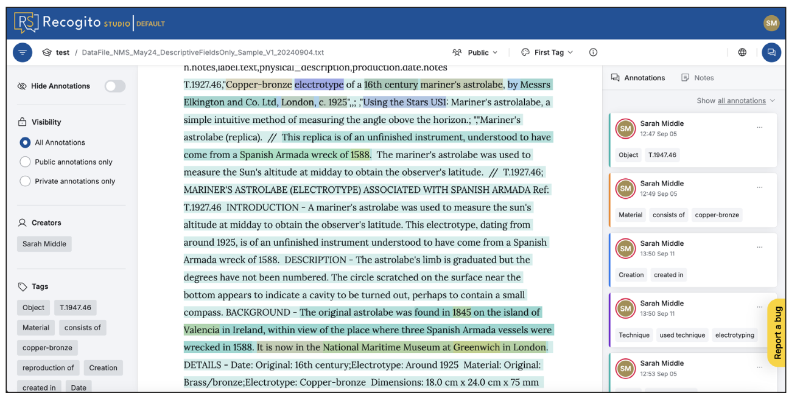
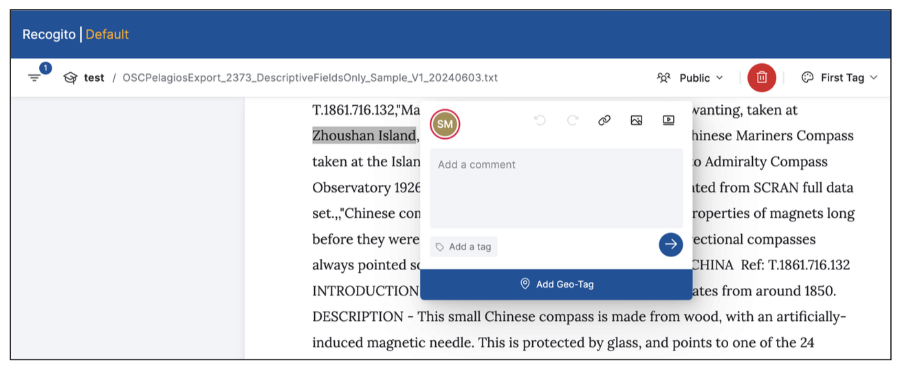
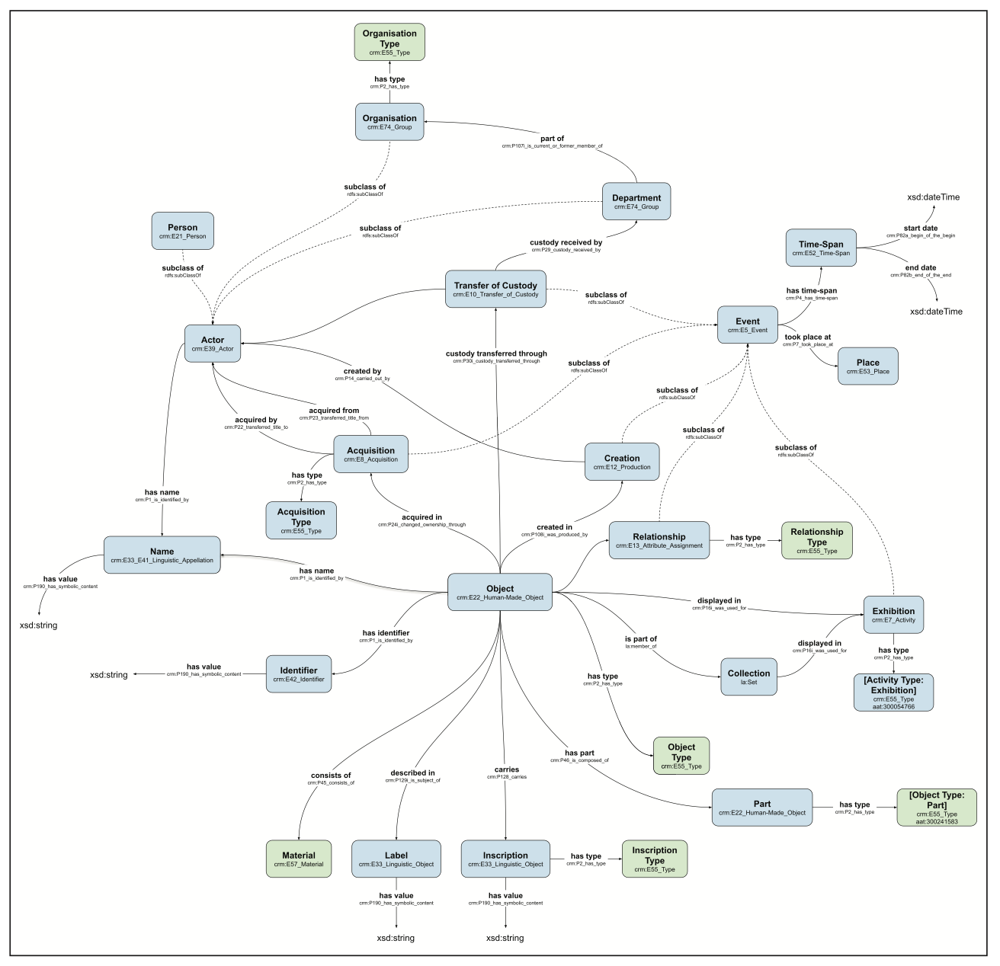
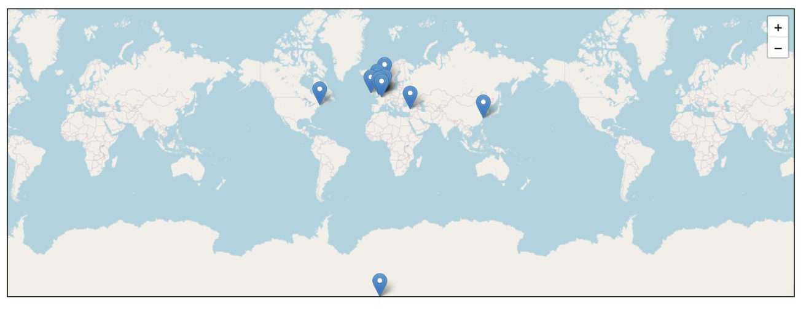
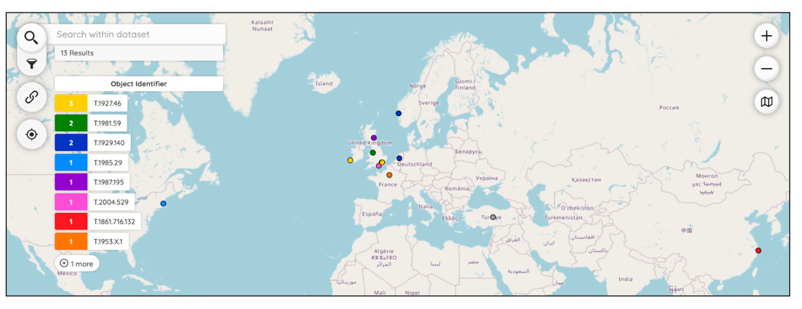

---
title: "Discovering Object Stories: Linking Unstructured Museum Data Through Semantic Annotation"
section: papers
date: 2022-04-07
slug: /papers/discovering-object-stories
keywords: archaeology, museums, digital heritage, digital humanities, digital archaeology, linked data
citation: "Middle, S., Aristeidou, M.,S. (2025). Discovering Object Stories: Linking Unstructured Museum Data Through Semantic Annotation. Journal of Open Humanities Data, 11:5, pp. 1–13. DOI: https://doi.org/10.5334/johd.273"
authors:
  - Sarah Middle
  - Maria Aristeidou
  - Elton Barker
  - Daniel Pett
  - Sarah Alcock
featuredImg: ../images/papers/objects/background.png
background: ../images/papers/objects/background.png
tags:
  - digital transformation
  - museums
  - archaeology
  - digital humanities
  - digital heritage
  - digital archaeology
  - linked data
--- 

## Abstract

This  paper  explores  the  application  of  Recogito  Studio  for  annotating  unstructured museum data to create semantic links and visualisations. The study focuses on a sample dataset from National Museums Scotland, which includes metadata about navigational instruments from the 19th and early 20th centuries.

The authors aimed to develop methods for converting unstructured data into structured formats  using  Recogito  Studio.  Recogito  Studio  facilitates  semantic  annotation  by allowing users to highlight and tag entities and relationships in texts and images, and link places to online gazetteers.

The data model was developed using Linked Art and CIDOC CRM standards, with some bespoke terminology. Annotations focused on unstructured text fields, using Recogito Studio’s Geo-Tagger plugin to identify and tag geographical locations.

The  geo-tagged  data  was  exported  and  visualised  using  Peripleo,  requiring  several data transformations to ensure compatibility. A user evaluation with cultural heritage professionals revealed usability challenges and areas for improvement, with Recogito Studio receiving a UMUX score of 73.3 and recommendations include enhancing geo-tagging, incorporating Named Entity Recognition, and developing automated workflows for Linked Open Data production.

## 1. Context and Motivation

Alongside the structured collections metadata found in databases and collections management systems,  museums  hold  vast  quantities  of  unstructured  data,  in  the  form  of  descriptions, research  notes,  and  exhibition  labels.  Contained  within  this  text  is  a  wealth  of  information with exciting potential for data storytelling, revealing and visualising these objects’ itineraries, i.e.  their  journeys  through  space  and  time  (Dunn  et  al.,  2019).  Examples  from  our  dataset include a replica of an astrolabe that accompanied the Spanish Armada before being recovered on an Irish island over 250 years later, as well as a sextant used by a named crew member in the navigation of the 1902–1904 Scottish National Antarctic Expedition. However, converting these data to a more structured format using existing freely available tools for working with tabular datasets requires substantial data manipulation, complexity and, of course, time. Our study sought to develop methods and approaches to achieve these goals, via the potential for applying semantic annotation using the newly developed Recogito Studio platform.

Recogito  was  originally  an  online  platform  developed  through  the  Pelagios  Network  (Simon et al., 2015, 2017, 2019). It facilitates semantic annotation by providing an interface where researchers  without  substantial  technical  experience  can  highlight  and  tag  entities  and relationships in texts and images. In addition to performing this task manually, users have the option to apply Named Entity Recognition (NER) from external services, which automatically detects  places,  people  and  events.  For  places,  Recogito  provides  the  additional  functionality of  linking  to  their  equivalents  in  online  gazetteers.  These  data  can  be  exported  in  multiple
formats, including Linked Open Data.

The Pelagios Network itself started life as the Pelagios Project, with its initial remit to facilitate the  connection  of  ancient  texts  to  the  places  mentioned  within  them  (Vitale  et  al.,  2021). Alongside  Recogito,  the  Pelagios  team  developed  Peripleo,  a  web-based  spatial  visualisation that  facilitates  the  discovery  of  digitised  objects  from  multiple  sources,  based  on  their annotated places (Simon et al., 2016). Through several rounds of funding from Jisc, the Arts and Humanities Research Council (AHRC) and the Mellon Foundation, Pelagios expanded its geographic/temporal scope, and became a community-led network, whose members contribute their expertise to several activities, including annotation (Kahn et al., 2021).

As  part  of  this  shift  from  a  project  to  a  network,  development  of  both  Recogito  and  Peripleo has been continued by Pelagios partners in conjunction with other initiatives. Following the British  Library’s  ‘Locating  a  National  Collection’  project  (Rees  et  al.,  2022),  Peripleo  is  now available  as  a  GitHub  repository  that  can  be  cloned  and  customised  with  a  dataset  of  the
user’s choosing, then deployed on GitHub Pages (Gadd et al., 2024). Recogito was redeveloped with  funding  from  the  University  of  Bonn  (Universität  Bonn,  2024),  which  reimagined  it  as a  modular  system,  renamed  Recogito  Studio  (Performant  Software,  n.d.).  Its  core  application promotes  collaborative  manual annotation, with  the  potential  for  the  development  of  future plugins to provide additional functionality. The first of these, the Geo-Tagger plugin (Simon, 2024),  partially  replicates  one  of  the  features  of  the  original  Recogito  by  allowing  users  to associate annotated places with their equivalent entries in online gazetteers and authority files.
Like  Peripleo,  Recogito  Studio  is  available  to  install  as  user-customised  instances  (Jameson  & Simon, 2024), rather than as a single, centralised platform.

Although  Recogito  Studio  was  initially  focused  on  classroom  use,  its  predecessor  had  been successful in empowering researchers to create structured data via a usable annotation interface, and steps had already been taken by the Pelagios Network to engage with the cultural heritage sector. Following the release of the new platform, there was already interest in continuing this work,  in  order  that  cultural  heritage  practitioners  might  derive  similar  benefits  and  provide input  into  further  developments.  This  paper  discusses  our  application  of  the  Recogito  Studio platform  to  a  sample  of  collections  data  (19th  century  navigational  instruments  at  National
Museums Scotland), to evaluate its potential for use in a cultural heritage context. Alongside our experiences of data annotation and visualisation, we discuss the outcomes of preliminary user evaluation and provide our reflections on findings so far, as well as their implications for future work.

## 2. Dataset Description

- Repository Location: https://doi.org/10.21954/ou.rd.27323799.v1
- Repository Name: The Open University Research Repository (Figshare)
- Object Name: Annotated Object Itineraries for Museum Collections Data
- Format Names and Versions: PDF, OWL/XML, CSV, GeoJSON, JSON-LD
- Creation Dates: 2024-05-01 - 2024-10-29
- Dataset Creators: Sarah Middle, Elton Barker, Maria Aristeidou (Open University)
- Language: English
- License: CC BY 4.0
- Publication Date: 2024-10-29

## 3. Method

The  dataset  used  for  the  work  discussed  in  the  paper  is  a  sample  of  collections  data  from National Museums Scotland (NMS), comprising metadata about 385 navigational instruments of  several  types,  from  the  19th  and  early  20th  centuries.  These  include  sextants,  quadrants, compasses,  and  astrolabes,  many  of  which  played  a  crucial  role  in  exploration  and  survey expeditions,  with  links  to  imperial  expansion  and  colonialism.  Collections  metadata  at  NMS is managed using the Axiell collections management system (Axiell, 2024); the system is fully compliant with version 4.0 of the Spectrum standard (Collections Trust, 2016) and partially
compliant with version 5.1 (Collections Trust, n.d.). While NMS’ approach to collections data management  facilitates  the  representation  of  much  of  the  fundamental  information  about these objects as structured data, there are rich details contained in unstructured fields, such as research notes, descriptions, and previous exhibition labels.

### 3.1 Data Model Development

We  started  work  on  the  data  model  through  analysing  the  NMS  dataset  and  extracting  the
entities and relationships mentioned in column headings, to produce a draft sketch of the key
elements for expressing object itineraries. This was visualised as a network with the object at the
centre, linked both to related entities and events in its itinerary. In doing so, we quickly realised
that the type of information included here is largely covered by CIDOC CRM. As the intention
was  always  to  produce  a  lightweight  data  model,  our  thoughts  turned  immediately  to  using
Linked Art (Linked Art Editorial Board, n.d.-a), which was developed as an extensible, usable,
lightweight subset of CIDOC CRM, with additional terms as required. Using the documentation
of both CIDOC CRM and Linked Art, we mapped the entities and relationships from our diagram including references to
equivalent terms in Linked Art/CIDOC CRM is shown in Figure 1). Notably, Linked Art/CIDOC
CRM entities are often defined using types (e.g. rather than creating additional subclasses to the
Event class, a particular type of Event can be classified using a term from a relevant external
vocabulary);  the  Linked  Art  documentation  advises  that  types  should  be  provided  from  the
Getty’s Art and Architecture Thesaurus (AAT) (Getty Research Institute, 2023), where available
(Linked  Art  Editorial  Board,  n.d.-b).  For  those  types  not  available  in  AAT,  we  suggest  using
terms  from  Wikidata  (Wikimedia,  2023),  increasingly  used  by  the  cultural  heritage  sector
(Zhao, 2023).

Using our template diagram (Figure 1), a formal specification for our data model was generated
in the OWL 2 Web Ontology Language (W3C OWL Working Group, 2012) using Protégé (Musen,
2015), which also incorporated the Linked Art/CIDOC CRM superclasses and superproperties
and  the  relationships  between  them.  We  used  this  exercise  as  an  opportunity  to  define  the
boundaries of our scope. CIDOC CRM allows further modelling of data about people, e.g. birth,
death, and occupation, but we decided not to include these aspects to maintain our focus on the
objects. This information can also be gleaned through linking person entities to authority file
entries, rather than stating it explicitly as part of an object itinerary.

Data model development continued via a process of refinement and extension in parallel with
the  annotation  phase  of  the  project.  Annotating  the  unstructured  text  revealed  additional
information,  such  as  entities  that  require  more  specific  properties  than  those  currently
included  in  Linked  Art/CIDOC  CRM  (usage,  expedition  and  voyage).  While  the  data  model
that  accompanies  this  article  includes  these  additional  classes  and  properties,  we  recognise
the potential for its further extension, particularly through the annotation of data about multi-
cultural/temporal heritage objects created for different purposes. Examples of such extensions
might include a more granular definition of historical event types, or human-object interactions
that go beyond the museum context (e.g. use or maintenance).

### 3.2 Annotation

Our intention from the start was to ensure that we were using annotation as a method where it
would provide the greatest benefit (enabling machines to understand and process information
in a way that is similar to how humans do). Rather than annotating data in columns that were
already  well-structured  and  populated  by  values  from  controlled  vocabularies,  we  wanted
to  surface  entities  that  are  currently  described  in  unstructured  long  text  fields,  and  which
cannot easily be converted to structured data by other (readily available) means. Therefore,
we selected only fields that are more descriptive in nature for our annotated sample of the
NMS data.

We hoped to annotate records that reflected geographically diverse object itineraries, evaluating
the Geo-Tagger plugin to its full potential. To facilitate sampling of object records, we uploaded
the dataset to the previous version of Recogito and applied the NER functionality. This allowed
us to view the places mentioned in these records ‘at a glance’, enabling us to identify a sample
of nine objects whose unstructured text fields indicated geographical movement.

Annotating  in  Recogito  Studio  requires  the  user  to  upload  text  (TXT)  formatted  data.
Highlighting  text  in  the  resulting  document  prompts  the  annotation  popup  to  appear
(Figure 2), which accepts annotations as a comment, a tag, or (if the Geo-Tagger plugin is
enabled)  a  geo-tag.  Comments  can  include  hyperlinks,  images,  and  videos  alongside  plain
text. Tags are user-generated and can either be added during the annotation process or in
the  configuration  settings  as  a  predefined  tag  set.  On  input,  relevant  tags  that  have  either
been predefined or already added to annotations on a document are displayed to the user via
autocomplete. Finally, the Geo-Tagger plugin uses the highlighted text as a query string to
identify the place in the user’s selected gazetteer; the user can then select the correct place or
modify the query as needed. All annotations on a document can be viewed in the right-hand
pane,  which  can  be  filtered  and  colour  coded  based  on  their  visibility  (public  or  private),
their creator, or their first tag (Figure 3). Geo-tags can additionally be viewed as a simple
map visualisation (Figure 4) and exported as GeoJSON data or a PNG image.1

`youtube: (https://www.youtube.com/embed/LQnPs1Lhc1Q?si=GMEa33Wx9v8UOW7u)`

It  became  clear  that  translating  the  object  itineraries  data  model  into  a  tagging  system  that
could  be  used  consistently  by  different  users  (or,  indeed,  by  the  same  user  during  different
annotation sessions) required a set of guidelines to standardise the process. We developed an
‘annotation  protocol’  (deposited  alongside  the  annotation  data),  stating  which  combination
of tags to use on particular entities. This improved our workflows, and was a useful exercise
that highlighted inconsistencies in the annotation, as well as identifying gaps within the data
model. Emphasis should be placed on how annotation within Recogito Studio is highly flexible,
allowing users to create their own set of tags, and we would not want to inhibit this process
by implying that our approach is ‘correct’. However, the annotation protocol and data model
might provide a useful starting point for those interested in using Recogito Studio for a similar
purpose.

We  found  that  the  object  records  often  contained  repetition,  with  the  same  piece  of
information about a particular entity included multiple times (e.g. descriptions and label fields
can be similar in content). As this information is only useful to capture once for the purpose of
producing object itineraries, entities were usually only annotated the first time they appear in
an object record, unless augmented information is included alongside later mentions. Entities
including  object  types,  materials  and  techniques,  which  would  benefit  from  alignment  with
terms from sources such as AAT and Wikidata, were tagged with a normalised version of the
type, which might then be mapped to their equivalent URIs to facilitate their conversion to
Linked Data later.

Once  we  had  annotated  all  the  object  records  in  our  sample  dataset,  we  exported  the
annotations as a CSV file, with their geo-tags additionally exported in GeoJSON format.

### 3.3 Visualisation

After exporting the geo-tags as GeoJSON, we investigated how this data might be visualised
using Peripleo (introduced in section 1). A Peripleo site can be set up in GitHub Pages using
its code repository and accompanying tutorial (Gadd et al., 2024), with JSON-LD data that
is compliant with the Linked Places format  (Grossner  et al.,  2024).  For our exported Geo-
Tagger data from Recogito Studio, we found that several transformations needed to be made
to the GeoJSON export to ensure compatibility with Peripleo, thereby enabling visualisation
of the data:

1. Replace “"type":"FeatureCollection",” with “"@id":"DATASET URL","type":"FeatureCollection", "@context":"https://w3id.org/locolligo/contexts/linkedplaces.jsonld",”
2. Replace “"id"” with “"@id"” throughout
3. Save as .json

Whilst the tutorial documentation advises that, for data exported from Recogito, the data file
format should be described as “RECOGITO_IMAGE” in the config file, this refers to the previous
version of the Recogito platform. Instead, the file format for data exported from Recogito Studio
(and  transformed  using  the  above  process)  should  be  described  using  the  default  data  file
format “LINKED_PLACES”.

While  the  steps  above  create  an  interactive  map  visualisation  in  Peripleo,  the  exported  data
from  Recogito  Studio  lacks  contextual  information  about  the  annotations  and  objects.  The
visualisation is thus just a collection of points on a map. Since Recogito Studio annotations cannot
be  identified  using  URIs,  we  manually  updated  the  data  export  to  include  links  to  relevant
objects  in  the  NMS  online  catalogue  and  the  context  of  the  geo-tagged  text.  To  emphasise
the connection between map locations  and museum objects, we  added an 'Object Identifier'
property to the dataset and configured the visualisation to display these identifiers as a facet
when the filter icon is clicked (Figure 5).2 Using Recogito Studio for data annotation, despite
the extra manual processing, is a crucial first step in preparing data for visualisation in Peripleo
without needing substantial technical expertise.

### 3.4 User Evaluation

Another  key  component  of  our  study  was  its  evaluation  by  our  target  audience  of  cultural
heritage  professionals.  While  our  experiences  had  been  largely  favourable,  we  aimed  to  test
how usable and useful the platform would be to those less familiar with its predecessor, and
with semantic annotation more generally.

Recogito Studio was assessed using an iterative, mixed-method design with user testing. This
approach,  based  on  Nielsen  and  Landauer’s  (1993)  methodology,  involves  multiple  small-
scale  tests  with  up  to  five  users  for  high-quality  evaluation.  Participants  were  briefed  and
gave informed consent before the in-person testing on 11 June 2024 at a workshop in Historic
England’s  head  office  in  London.  The  usability  assessment  had  two  stages:  a  think-aloud
protocol for seven tasks and a brief user experience survey. In the first stage, two facilitators
guided  five  participants  (n  =  5)  through  task  scenarios  that  mirrored  real-life  activities.
The  participants,  who  included  two  female  and  three  male  practitioners  from  universities,
museums, and archive centres, had no prior experience with Recogito Studio, though two had
used similar tools.

The  primary  goal  was  to  identify  usability  challenges  by  having  participants  verbalise  their
thoughts  while  completing  tasks.  The  20-minute  test  included  functions  like  locating  and
opening documents, annotating words, creating geo-tags, adding comments or tags, accessing
the map view, using filters, visualising tagged words, downloading annotations, and assigning
documents.  Facilitators  observed  and  scored  each  task  on  a  3-point  scale  and  noted  user
feedback for analysis.

In  the  second  stage,  a  post-test  survey  was  conducted  where  participants  completed  the Usability  Metric  for  User  Experience  (UMUX)  (Finstad,  2010)  and  answered  additional questions about their role, likes and dislikes about the platform, and potential use cases for Recogito  Studio.  The  UMUX,  designed  to  measure  perceived  usability  with  four  items,  was slightly adapted for Recogito Studio’s specific functions. Participants rated each statement on a seven-point scale, and scores were adjusted to generate an overall usability score from 0 (poor) to 100 (excellent).

The resulting GitHub Pages site can be found on [Sarah Middle's profile](https://sarahmiddle.github.io/Peripleo_PelagiosOSC).

## 4. Results and Discussion

### 4.1 User Evaluation Findings

During the above evaluation, most users found the task of Finding and Opening the Map View intuitive. Four out of five users easily located the map, though one participant initially clicked through other screen options before identifying the correct icon. While most users found the map without issue, some commented that the icon could be clearer, as they were unsure whether it represented a map or a language change option.

Adding Comments or Tags to Annotations was straightforward for all users. However, one participant accidentally closed the window without saving their tag. They realised this mistake and reopened the window to complete the task. Similarly, Locating and Opening Files was
generally easy for users, though one person initially searched for a non-existent search function,
leading them to manually check folder labels to find the document.

Some tasks presented more challenges. For example, Finding the Filtering  Button was difficult for two out of five users, as they expected filters to be located on the right side of the screen rather than the left. These users eventually found the button but suggested that the icon could be more intuitive. Similarly, Creating Geo-tags proved tricky, with two users failing to notice the geo-tagging option after annotating words. Another participant mistakenly left the default U.S. location for London without realising the error.

Assigning  Documents  also  posed  difficulties.  Three  out  of  five  users  struggled  to  locate the assignment  option,  often  searching  through  menus  on  the  document  page.  Two  users  had trouble finding the 'new assignment' button because it was hidden off-screen. One participant noted  that  the  'next'  button  used  to  complete  the  form  fields  was  also  not  visible  without scrolling. Lastly, none of the participants could use the Download Annotations CSV without help. Most users initially searched through the document menus, but only three out of five eventually located the download option after being guided to the correct menu.

The usability metric for user experience (UMUX) revealed mixed results. While most participants rated Recogito Studio positively, with scores ranging from 5 to 7 (out of 7) for meeting their needs,  two  users  gave  notably  lower  scores  (2–3)  for  overall  usability.  One  participant,  in particular,  found  the  process  of  editing  annotations  to  be  time-consuming  and  frustrating. Overall, Recogito Studio received a UMUX score of 73.33%, which suggests a generally positive user experience but highlights room for improvement, particularly regarding ease of use.

Participants  praised  Recogito  Studio’s  automatic  location  identification  via  gazetteers  and Wikidata,  finding  it  helpful  for  enriching  information.  They  also  appreciated  the  flexibility to annotate text with comments and geo-tags, the visual map displaying all locations, and the ability to share and assign documents for collaboration. Several improvements were suggested: more consistent placement of control buttons to avoid unnecessary scrolling, a search function to locate files more efficiently, automatic object tagging, enhanced visibility of the geo-tagging feature,  and  adjustments  to  the  map  display  to  prevent  it  from  obscuring  chosen  locations.
Participants  also  recommended  a  more  intuitive  way  to  download  annotations  and  clearer visual cues for document assignment.

### 4.2 Our ‘Super User’ Experiences

We  have  evaluated  Recogito  Studio  as  'super  users'  and  reflected  on  its  use  for  annotating cultural heritage data. While we concur with user evaluations regarding usability and potential improvements, we would like to emphasise additional points.

To  address  participant  concerns  about  the  Geo-Tagger  plugin,  we  propose  extending  its functionality to geolocate places to polygons and enabling simultaneous queries from multiple gazetteers, similar to the previous Recogito version.

Recogito Studio’s previous iteration included Named Entity Recognition (NER) for people, events, and places, with the latter linked to gazetteer URIs. While not originally scoped for Recogito Studio,  NER  would  significantly  enhance  data  generation  efficiency,  especially  for  resource-constrained  researchers  and  professionals.  Expanding  this  functionality  to  link  other  entity
types (e.g., people to VIAF, objects to Getty AAT) would further enrich cultural heritage data annotation, enabling more effective representation of object itineraries. We might also consider adopting an approach similar to that developed by Luthra et al. (2023) for automated entity recognition in Dutch East India Company probate records. Here, the authors used a bespoke taxonomy to annotate information about people who were not mentioned by name, thereby surfacing  a  greater  depth  of  narratives  involving  interactions  with  indigenous  and  enslaved people.

Of  particular  interest  to  our  study  is  the  conversion  of  annotation  data  to  RDF,  a  feature available in the previous Recogito platform, to increase its discoverability and interoperability. There  exist  various  online  tools  for  converting  CSV  to  RDF,  as  well  as  frameworks  such as  Candela's  (2023)  for  converting  more  structured  metadata.  However,  Recogito  Studio complicates this process due to the inability to annotate relations between entities. We partially mitigated this by annotating entities with their properties, but additional processing of the CSV export is still required to ensure accurate RDF representation.

Although Recogito Studio generates a unique identifier for each annotation, these identifiers do not act as resolvable URIs. Therefore, even if a user were to convert their annotations to RDF, it is not currently possible for them to link back to them, thereby pointing to the source(s) used for their work. For example, it was initially anticipated that the locations pinpointed on the Peripleo visualisation might link to the annotations in which they were identified; however, as this was not possible, they currently only include links to the online catalogue records for the relevant objects. Again, this would be another useful feature to include as part of any future development of Recogito Studio.

Although  the  GeoJSON  export  from  Recogito  Studio  provided  a  good  starting  point  for visualisation using Peripleo, further processing is required before the resulting file is compatible with Peripleo, and with the Linked Places format more generally. Additionally, our particular visualisation incorporates data enhancements, to increase its usefulness within the context of representing  object  itineraries  for  a  small  sample  of  museum  objects.  However,  it  would  be difficult  to  reproduce  a  similar  result  on  a  larger  scale  as  these  enhancements  necessitated manual editing, rather than being produced automatically as part of the Recogito Studio export.
The result is therefore likely to conceal, rather than highlight, information about the object’s itinerary, historical context, and (in many cases) its colonial past. As this is a limitation of the Recogito  Studio  software,  rather  than  the  data  structure,  this  process  might  be  improved  by developing an automated, customisable workflow to allow the conversion of a Recogito Studio CSV export (which contains more information than the GeoJSON export) into a Linked Places-compliant JSON-LD file with the relevant details to enhance and contextualise the visualisation. An interim step towards this might be to fully document the pipeline between these two tools, i.e. how the Recogito Studio output might be enhanced to optimise the input into Peripleo.

An  issue  common  to  all  tools  and  resources  that  rely  on  external  services  for  part  of  their functionality is the extent to which those services are available. Our initial intention was to use the Geo-Tagger to link to place URIs from the World-Historical Gazetteer (WHG), to provide a greater level of historical accuracy than linking to their modern-day equivalents. However, following several extended periods of WHG server downtime that prevented geo-tagging from taking place, it was decided to instead use Wikidata URIs (prioritising server availability over temporal nuance), as Recogito Studio does not currently allow the same piece of text to be geo- tagged with multiple gazetteer references, and time was limited. This experience highlights a potential barrier to using external services for entity definition and classification, particularly when  they  are  not  supported  by  major,  well-resourced  infrastructures.  Such  an  issue  is  by
no means unique to Recogito Studio and the data sources connected to its Geo-Tagger plugin; however, it is likely to be compounded with the introduction of further plugins that rely on external  services,  such  as  those  recommended  above.  While  we  would  still  argue  that  such future developments would bring highly desirable functionality, we must also be pragmatic in acknowledging their potential shortcomings.

Where there are concerns surrounding potential user dissatisfaction, or (as in our case) where work must be completed within a short timeframe, a logical solution is to opt for reliability by linking to major, generic data sources like Wikidata, even if this entails compromising on historical accuracy. However, if time and resources allow, an additional measure could be to add  the  relevant  historical  places  to  Wikidata,  as  demonstrated  by  Zhu  et  al.  (2023).  In  the specific  case  of  Recogito  Studio’s  Geo-Tagger  plugin,  there  is  an  added  complication  that the system queries all entity types in Wikidata rather than focusing on places. As a result, accidental errors could creep in, where place names are incorrectly linked to people or objects with similar names, for example, particularly if the user uncritically accepts the first match presented by the system.

Our findings have also prompted some reflections on the suitability of applying these methods to  museum  collections  data  more  generally.  Some  of  these  relate  closely  to  the  growing Collections  as  Data  movement  (Padilla  et  al.,  2023a;  2019)  to  promote  responsible  reuse  of data produced by cultural heritage institutions. The NMS dataset was well-suited to annotation in that it includes multiple fields containing unstructured text, alongside its more structured fields  containing  (for  example)  standardised  names,  places,  dates  and  terms  from  controlled vocabularies. Annotation in this case has provided added value, by superimposing an additional semantic  layer  that  enhances  the  existing  information  without  altering  the  underlying  data structure.  However,  this  is  largely  a  result  of  the  institution’s  procedures  for  managing information: text from research notes and exhibition labels is included as part of an object’s record in the collection management system, which might not be the case in other institutions. It  should  also  be  noted  that  this  type  of  unstructured  data  can  sometimes  hold  sensitive information that museums do not wish to make public; therefore, some fields are likely to be redacted to avoid the risk of making such information more discoverable.

Another factor affecting the potential for enhancing museum data through semantic annotation is  that  of  institutional  policy  and  procedure  for  cataloguing  objects.  While  some  catalogue records,  particularly  for  those  objects  that  have  formed  part  of  major  exhibitions  or  are  on permanent display, contain rich historical information, others are described solely in relation to
their physical appearance and functionality. The inclusion of information about how a collections dataset  has  been  structured  (with  the  aim  of  optimising  interoperability),  accompanied  by transparency about any omissions or biases, are key components of the Vancouver Statement (Padilla  et  al.,  2023b),  which  outlines  principles  for  cultural  heritage  institutions  to  follow when publishing their collections as openly available data.

The  suitability  of  a  collections  dataset  for  annotation  is  usually  therefore  dependent  on  the purpose  of  that  annotation:  detailed  physical  descriptions  provide  an  excellent  basis  for representing  aspects  of  an  object  through  modelling  part-whole  relationships,  material composition, or construction techniques, for example. However, this type of information is less compatible with the aim of representing object itineraries across time and space. To achieve the aim of representing object itineraries for a collection at scale, further research on the objects and/or enhancement of the catalogue records themselves might therefore be required, which is often not possible within the scope of day-to-day museum processes and would necessitate specific project funding.

## 5. Implications/Applications

Our study, which incorporated the production of the dataset that accompanies this paper, has
demonstrated Recogito Studio’s usefulness and usability for annotating cultural heritage data. In
particular, we have shown how the platform might be used by cultural heritage professionals to
annotate data about object itineraries, and how the resulting data might be processed further to
facilitate spatial visualisation. Increasing the machine-readability of this text will facilitate its
use in data storytelling, potentially capturing the imagination of new audiences and expanding
the  scope  for  collections  research.  However,  we  have  also  identified  key  areas  for  further
development, which would enable this approach to be applied to a broader range of cultural
heritage data, in a more scalable way, and by a wider user community.

The first of the above aims points towards the extension of the object itineraries data model,
which  is  currently  based  solely  on  a  sample  of  objects  that  belong  to  a  single  category
(navigational  instruments)  and  that  are  held  by  a  single  institution.  Applying  this  approach
to collections data that describes other types of objects and from other institutions will reveal
additional entities and relationships that form part of their itineraries. As noted above, it might
be  similarly  beneficial  to  annotate  related  data  that  exists  separately  from  the  institution’s
catalogue, such as previous exhibition texts. In doing so, the data model will gradually become
more broadly applicable to different types of cultural heritage data and for representing a wider
range of object itineraries involving different cultures, geographies and temporalities.

Middle et al.  Journal of Open Humanities Data  DOI: 10.5334/johd.27311

To increase scalability, we could automate entity recognition using NER technologies, combined
with  aligning  entities  to  established  vocabularies.  Such  an  approach  could  additionally
be  beneficial  for  working  with  more  ‘messy’  catalogue  data,  where  fields  have  been  used
inconsistently  or  contain  extraneous  information.  An  advantage  of  a  combined  annotation/
NER approach is that it does not require the data to already be ‘cleaned’/‘normalised’ before
its  application.  While  implementing  this  extension  to  Recogito  Studio  would  be  significant,  a
scoping study could investigate potential solutions and their integration into the platform’s user
interface. This would ensure usability for non-technical users.

Alternatively,  Recogito  Studio  has  the  potential  to  be  used  on  a  larger  scale  as  a  citizen
science platform, which could facilitate the manual annotation of cultural heritage data on a
larger scale. Such initiatives do, however, require careful management and moderation. The
implementation of Recogito Studio in this way would also require the usability improvements
recommended in section 4 to ensure the platform’s accessibility to non-specialists. Additionally,
the task of processing and analysing the resulting data would still fall to the cultural heritage
professionals themselves, potentially necessitating further technological interventions.

To enhance scalability and interoperability, we could facilitate the production of Linked Open
Data. Linked Open Data would allow our annotations to be more easily integrated with other
datasets and tools, enabling new insights and applications. While integrating this functionality
into  Recogito  Studio  for  accurate  object  itinerary  representation  is  complex,  an  intermediary
step  would  be  developing  workflows  using  existing  software  to  convert  annotation  export
CSVs  to  RDF.  This  process,  particularly  for  annotations  using  our  data  model  and  protocol,
would involve deciphering layered annotations based on their text positions. This could be a
challenging task, ideally hidden from the end user.

Having discussed the potential for future scalability, it might also be worth noting here that
in many cases, such scalability might not be required. After all, the approach described in this
paper might instead be better suited to the representation of smaller object assemblages whose
data can be enhanced manually through further research, rather than attempting to apply it to
the visualisation and connection of entire collections.

Finally, regarding our third aim of expansion of the user community, we need to evaluate and
develop Recogito Studio without compromising usability, and provide an opportunity to extend
its capabilities. Our recommended developments, as outlined above, will require one or more
larger-scale projects. Following Tasovac et al.’s (2020) call for cultural heritage professionals to
be “recognised as essential partners in research”, we acknowledge that if we are to successfully
optimise this platform for effective application to cultural heritage data, then we should engage
more directly with the sector by including one or more cultural heritage professionals on any
future project teams.

## Acknowledgements

The authors would like to thank Rainer Simon and Jamie Folsom for their development work
on Recogito Studio and the technical support they provided throughout this study, as well as
Gethin Rees for his advice on transforming our geo-tag data to a Peripleo-compatible format.
Special  thanks  are  also  owed  to  the  five  participants  who  took  part  in  our  user  evaluation
and to National Museums Scotland for providing the data that formed the foundation for our
annotation work.

## Funding Information

This study was funded through the Open University’s Open Societal Challenges Programme.

## Competing Interests

The authors have no competing interests to declare.

## Author Contributions

- Sarah  Middle  –  Conceptualization,  Data  curation,  Funding  acquisition,  Investigation, Methodology, Visualization, Writing – original draft, Writing – review & editing.
- Maria  Aristeidou  –  Conceptualization,  Formal  analysis,  Funding  acquisition,  Investigation, Methodology, Project administration, Supervision, Writing – original draft.
- Elton Barker – Conceptualization, Funding acquisition, Methodology, Project administration, Supervision, Writing – review & editing.
- Daniel Pett – Conceptualization, Funding acquisition, Project administration, Writing – review & editing.
- Sarah Alcock – Formal analysis, Investigation.

## Author Affiliations

- Sarah Middle Classical Studies, Open University, Milton Keynes, UK [orcid.org/0000-0001-7800-6777](https://orcid.org/0000-0001-7800-6777)
- Maria Aristeidou Institute of Educational Technology, Open University, Milton Keynes, UK [orcid.org/0000-0001-5877-7267](https://orcid.org/0000-0001-5877-7267)
- Elton Barker Classical Studies, Open University, Milton Keynes, UK [orcid.org/0000-0001-9517-1176](https://orcid.org/0000-0001-9517-1176)
- Daniel Pett [orcid.org/0000-0002-0246-2335](https://orcid.org/0000-0002-0246-2335) St Edmund’s College, University of Cambridge, Cambridge, UK
- Sarah Alcock Institute of Educational Technology, Open University, Milton Keynes, UK [orcid.org/0009-0003-2755-7669](https://orcid.org/0009-0003-2755-7669)

## References

- Axiell. (2024). Axiell Collections. Axiell. https://www.axiell.com/solutions/product/axiell-collections/
- Candela, G. (2023). Towards a semantic approach in GLAM Labs: The case of the Data Foundry at the National Library of Scotland. Journal of Information Science. https://doi.org/10.1177/01655515231174386
- Collections Trust. (2016). Spectrum v.4.0 (archived). Collections Trust. Retrieved 4 November 2024. Retrieved from https://collectionstrust.org.uk/resource/the-spectrum-standard-v4-0/
- Collections Trust. (n.d.). Spectrum. Collections Trust. Retrieved 7 October 2024. Retrieved from https://collectionstrust.org.uk/spectrum/
- Dunn, S., Earl, G., Foka, A., and Wootton, W. (2019). Spatial Narratives in Museums and Online: TheBirth of the Digital Object Itinerary. In T. Giannini & J. P. Bowen (Eds.), Museums and Digital Culture: New Perspectives and Research (pp. 253–271). Cham: Springer International Publishing. https://doi.org/10.1007/978-3-319-97457-6_12
- Finstad, K. (2010). The usability metric for user experience. Interacting with Computers, 22(5), 323–327. https://doi.org/10.1016/j.intcom.2010.04.004
- Gadd, S., & Simon, R. (2023). Peripleo: A platform for visualising and exploring linked places data. Journal of Open Humanities Data, 9(1), 1–8. https://doi.org/10.5334/johd.266
- Gadd, S., Simon, R., & Rees, G. (2024). Peripleo [Computer software]. The British Library. Retrieved 28 October 2024. Retrieved from https://github.com/britishlibrary/peripleo (Original work published 2022)
- Getty Research Institute. (2023). Art and Architecture Thesaurus. Getty Vocabularies: LOD. Retrieved 28 October 2024. Retrieved from https://vocab.getty.edu/aat/
- Grossner, K., Zijdeman, R., Shaw, R. and Elwert, F. (2024). The Linked Places format (LPF). GitHub. Retrieved 28 October 2024. Retrieved from https://github.com/LinkedPasts/linked-places-format
- Jameson, L., & Simon, R. (2024). Recogito-Studio [PLpgSQL]. Recogito. Retrieved 30 October 2024. Retrieved from https://github.com/recogito/recogito-studio (Original work published 2024)
- Kahn, R., Isaksen, L., Barker, E., Simon, R., de Soto Cañamares, P., & Vitale, V. (2016). Pelagios—Connecting Histories of Place. Part I: From Association to Community. International Journal of Humanities and Arts Computing, 10(1–2), 1–16. https://doi.org/10.3366/ijhac.2016.0140
- Linked Art Editorial Board. (n.d.-a). Linked Art. Retrieved 28 October 2024. Retrieved from https://linked.art/ Linked Art Editorial Board. (n.d.-b). Types and Classifications. Linked Art. Retrieved 28 October 2024. Retrieved from https://linked.art/model/base/#types-and-classifications
- Luthra, M., Todorov, K., Jeurgens, C., & Colavizza, G. (2023). Unsilencing colonial archives via automated entity recognition. Journal of Documentation, 80(5), 1080–1105. https://doi.org/10.1108/ JD-02-2022-0038
- Middle et al.  Journal of Open Humanities Data  DOI: 10.5334/johd.273-Musen, M. A. (2015). The Protégé project: A look back and a look forward. AI Matters, 1(4), 4–12.13 https://doi.org/10.1145/2757001.2757003
- Nielsen, J. and Landauer, T. K. (1993). A mathematical model of the finding of usability problems. In CHI ’93: Proceedings of the INTERACT ’93 and CHI ’93 Conference on Human Factors in Computing Systems (pp. 206–213). ACM. https://doi.org/10.1145/169059.169166
- Padilla, T., Allen, L., Frost, H., Potvin, S., Russey Roke, E., & Varner, S. (2019). Final Report – Always Already Computational: Collections as Data. Collections as Data. https://doi.org/10.5281/zenodo.7883759
- Padilla, T., Scates Kettler, H., & Shorish, Y. (2023a). Collections as Data: Part to Whole Final Report. Collections as Data. https://doi.org/10.5281/zenodo.10161976
- Padilla, T., Scates Kettler, H., Varner, S., & Shorish, Y. (2023b). Vancouver Statement on Collections as Data. Collections as Data. https://doi.org/10.5281/zenodo.8341519
- Performant Software. (n.d.). Recogito Studio. Retrieved 30 October 2024. Retrieved from https://recogitostudio.org/
- Rees, G., Gadd, S., Horgan, J., Hunt, A., Isaksen, L., Morris, V., Musson, A., Simon, R., Strachan, P., & Vitale, V. (2022). Locating a National Collection (LaNC). Towards a National Collection. https://doi.org/10.5281/zenodo.7071654
- Simon, R. (2024). Recogito GeoTagger Plugin [TypeScript]. Recogito. Retrieved 30 October 2024. Retrieved from https://github.com/recogito/geotagger (Original work published 2024)
- Simon, R., Barker, E., Isaksen, L., & de Soto Cañamares, P. (2015). Linking Early Geospatial Documents, One Place at a Time: Annotation of Geographic Documents with Recogito. E-Perimetron, 10(2), 49–59. Retrieved 30 October 2024. Retrieved from https://www.e-perimetron.org/Vol_10_2/Simon_et_al.pdf
- Simon, R., Barker, E., Isaksen, L., & de Soto Cañamares, P. (2017). Linked Data Annotation Without the Pointy Brackets: Introducing Recogito 2. Journal of Map & Geography Libraries, 13(1), 111–132. https://doi.org/10.1080/15420353.2017.1307303
- Simon, R., Isaksen, L., Barker, E., & de Soto Cañamares, P. (2016). Peripleo: A Tool for Exploring Heterogeneous Data through the Dimensions of Space and Time. The Code4Lib Journal, 31. Retrieved  30 October 2024. Retrieved from http://journal.code4lib.org/articles/11144
- Simon, R., Vitale, V., Kahn, R., Barker, E., & Isaksen, L. (2019). Revisiting Linking Early Geospatial Documents with Recogito. E-Perimetron, 14(3), 150–163. Retrieved 30 October 2024. Retrieved from https://www.e-perimetron.org/Vol_14_3/Simon_et_al.pdf
- Tasovac, T., Chambers, S., & Tóth-Czifra, E. (2020). Cultural Heritage Data from a Humanities Research Perspective: A DARIAH Position Paper. Retrieved 11 December 2024. Retrieved from https://hal.science/hal-02961317 
- Universität Bonn. (2024). Introduction of Recogito Studio. Hochschulrechenzentrum. Retrieved 30 October 2024. Retrieved from https://www.hrz.uni-bonn.de/en/news/introduction-recogito-studio 2024. Retrieved from https://www.hrz.uni-bonn.de/en/news/introduction-recogito-studio
- Vitale, V., de Soto, P., Simon, R., Barker, E., Isaksen, L., & Kahn, R. (2021). Pelagios—Connecting
- Histories of Place. Part I: Methods and Tools. International Journal of Humanities and Arts Computing,15(1–2), 5–32. https://doi.org/10.3366/ijhac.2021.0260
- W3C OWL Working Group. (2012). OWL 2 Web Ontology Language Document Overview (Second Edition).
- W3C. Retrieved 28 October 2024. Retrieved from https://www.w3.org/TR/owl2-overview/
- Wikimedia. (2023). Wikidata. Retrieved 28 October 2024. Retrieved from https://www.wikidata.org/wiki/Wikidata:Main_Page
- Zhao, F. (2023). A systematic review of Wikidata in Digital Humanities projects. Digital Scholarship in the Humanities, 38(2), 852–874. https://doi.org/10.1093/llc/fqac083
- Zhu, L., Xu, A., Deng, S., Heng, G., & Li, X. (2023). Entity Management Using Wikidata for Cultural Heritage Information. Cataloging & Classification Quarterly, 61(1), 20–46. https://doi.org/10.1080/01639374.2023.2188338
