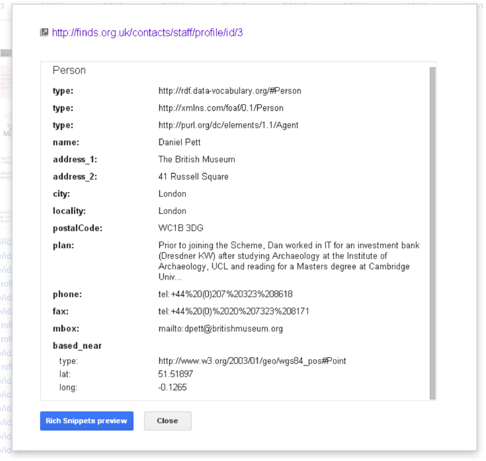
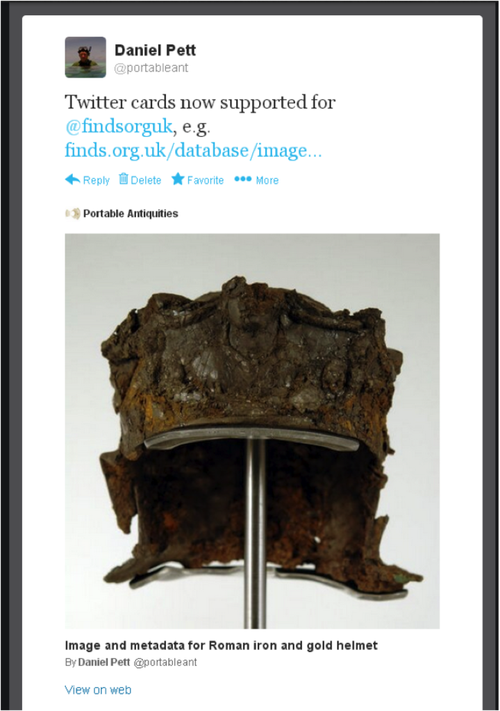
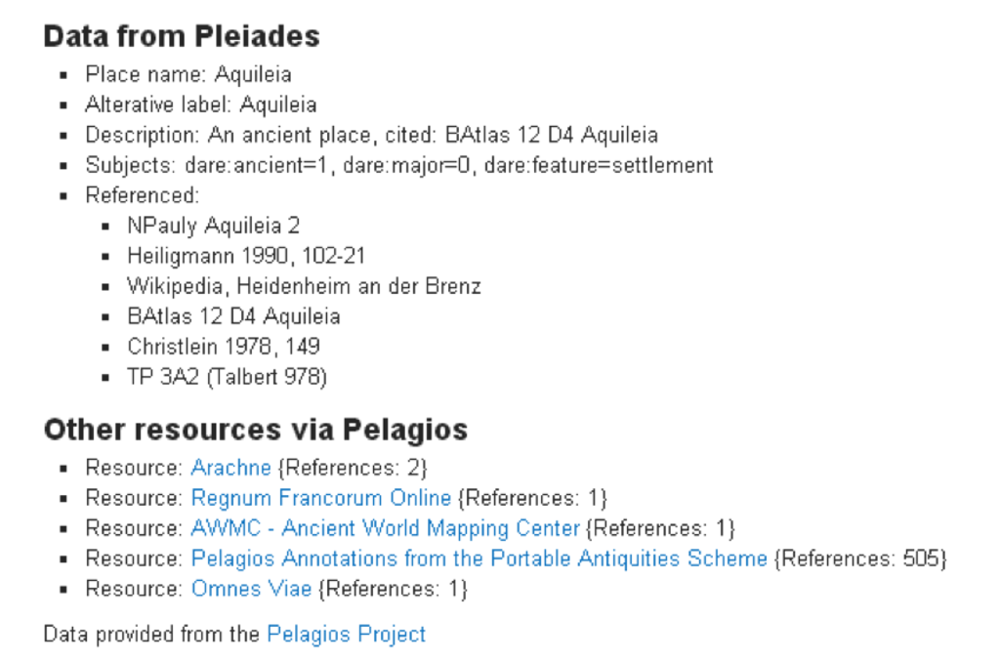

---
title: "Linking Portable Antiquities to a wider web"
section: papers
date: 2013-10-04
slug: /papers/linking-portable-antiquities-to-a-wider-web
keywords: antiquities,archaeology
citation: "Pett, D.E.J.(2014) Linking Portable Antiquities to a Wider Web, ISAW Papers 7.20 (2014)"
authors:
 - Daniel Pett (The British Museum)
featuredImg: ../images/papers/isaw/7337623544_f7261cd0e1_w.jpg
background: ../images/papers/isaw/7337615858_67c9254300_k.jpg
lat: 51.51897
lon: -0.1265
tags:
- digital transformation
- museums
- archaeology
- linked open data 
- lawdi
- antiquities
--- 

This text is released under a [CC0 license](http://creativecommons.org/publicdomain/zero/1.0/).

## Abstract

This paper will discuss the impact that the two LAWDI events had on the digital work and output of the United Kingdom's Portable Antiquities Scheme, based at the British Museum, London. It discusses the progress of the author'
s work in developing the Scheme's online presence towards Berners-Lee's 5 Stars of Linked data following the two iterations of the LAWDI programme in 2012 and 2013. This article also gives examples of Linked Data principles being utilised by the Portable Antiquities Scheme website.

_Subjects:_ [Humanities--Study and teaching](http://id.loc.gov/authorities/subjects/sh86001448)

_Keywords:_ [archaeology](http://en.wikipedia.org/wiki/Archaeology), [antiquities](http://en.wikipedia.org/wiki/Antiquities), [semantic web](http://en.wikipedia.org/wiki/Semantic_Web), [linked data](http://en.wikipedia.org/wiki/Linked_data), [classics](http://en.wikipedia.org/wiki/Classics), [numismatics](http://en.wikipedia.org/wiki/Numismatics), [portable antiquities scheme](http://en.wikipedia.org/wiki/Portable_Antiquities_Scheme)

The [Portable Antiquities Scheme](http://finds.org.uk) (hereafter the PAS) was one of the few projects to attend the LAWDI events, which did not truly fall under the Classical World umbrella that neatly encompassed many of the other attending projects. The PAS is a government funded project in the United Kingdom, which promotes the voluntary recording of archaeological objects found by members of the public in England and Wales and administers the Treasure Act process. These objects that are recorded on the [PAS database](http://finds.org.uk/database) range from the Prehistoric to Post-Medieval periods (as defined in the UK by English Heritage) with a large corpus of material that can be attributed to the Roman Empire, of which the majority are coins. Indeed, numismatic material provides the greatest opportunity for the Scheme to link to other resources (or URIs) through their regular attributes such as the mint (geography), era (time), issuer or moneyer (people), place of discovery (geography) and so on.

Since 2003 (Pett 2010a) these data have been placed online within a dynamic database that is updated in real-time, and over 900,000 objects have been recorded with images and extensive metadata (over 200 possible fields, many using controlled and agreed vocabularies) being collected for each. These metadata present an exciting and very practical opportunity for implementing linked data techniques, collaborating with many of the attending projects, and this paper will briefly touch on this. The majority of attending projects were beginning their adventure into the world of Linked and Open Data (LOD) and many could provide data that the PAS software could and can consume and use for enrichment of its own website (Pett 2010b, Gruber et al. 2012). In turn these linkages can be tied to external resources such as Virtual Identity Authorities Files (VIAF) or dbPedia or as Kansa (2013) showed in his excellent presentations, to projects such as the [Encyclopaedia of Life](http://eol.org).

## Pre-LAWDI: where did the PAS website stand?

The PAS software is written entirely by the paper's author (all source code available at [GitHub](https://github.com/findsorguk/beowulf)), and builds on the original content management system that was provided by Oxford ArchDigital before their liquidation in 2007 (Pett 2010a). (Like Kansa's superb OpenContext, choices of technology and implementation are very similar: PHP, Solr etc). (This software provides a platform for the 'real-time' capture and publication of artefacts discovered by the public within England and Wales, whilst pursuing their hobbies.) From this period onwards, the author began to explore best practices for web implementation and early on in the development of the site (Pett 2012); a decision was made to begin the journey towards what was to become Berners-Lee’s 5 stars of linked data (see Berners-Lee 2006 and Hausenblas 2010) with the implementation of cool URIs (W3C 2008) which attempted to describe the resource that the consumer would find; for example: [http://finds.org.uk/romancoins/personifications/named/as/Apollo](http://finds.org.uk/romancoins/personifications/named/as/Apollo) which leads to details of the page within the Roman coin guide describing the depiction of the personification of Apollo. Data driven pages within the site could be obtained in various representations - for example as JSON, XML, CSV or KML – but content negotiation was still lacking and is at the present time as the author has not managed to find time to implement this. The lack of finds.org.uk serving up data with content negotiation has been highlighted by Light (2011) and is something that does need resolving.

Within the site templates structured data has been used for example [microformats](http://microformats.org/) (these are now 7 years old as a concept) and [rdfa](http://www.w3.org/TR/xhtml-rdfa-primer/) (Herman et al, 2013) are used extensively. For example within HTML contact templates, FOAF standards were implemented (Brickley and Miller 2010). This can be shown in Google’s webmaster tools structured data section in figure 1 below:

Figure 1: An example of structured data from the author’s profile page as seen by Google’s webmaster tools.

## Post-LAWDI 2012

After the 2012 event at ISAW (Elliot et al. 2012), efforts were made to bring the PAS into the [Pelagios family](http://pelagios-project.blogspot.co.uk). This was quite a simple task to expedite with expert [advice](https://github.com/pelagios/pelagios-cookbook/wiki) available online (Barker, Isaksen and Simon 2012) and the PAS database already using Pleiades identifiers within its schema. A weekly compiled dump of the ever changing PAS data that had Pleiades IDs (Pett, 2012b) was produced and this was integrated into the Pelagios ecosystem (at present over 80,000 Roman coins records on the PAS database have attributions to Roman mints which have been aligned with Pleiades identifiers, leaving around 90,000 unattributed.) These data were used to great effect in Cayless’ data explorer visualisation that was unveiled to the world at large at LAWDI-2013 (Cayless 2013) with Rome being our highest attribution.

In the spirit of collaboration and as a mutual benefit, the PAS also hosted [a mirror tile store](http://finds.org.uk/imperium) of the maps that Johan Åhfeldt (2012) created and these are available for anyone to use, with the PAS picking up the associated bandwidth costs (Pett 2012d). Further integration with LAWDI resources included the use of the Pelagios widget, Nomisma and Pleiades identifiers and the ISAW [javascript library](http://isaw.nyu.edu/members/sebastian.heath-40nyu.edu/awld-js) (Rabinowitz & Heath 2012).

Attempts were also made to implement more structured data within HTML templates, for example the use of [Schema.org](http://schema.org) and Facebook’s [OpenGraph](https://developers.facebook.com/docs/opengraph/) metadata tags. A good example of structured data in action can be seen through the author’s implementation of Twitter cards (Pett 2012), a pretty simple process where meta-tags are added to the head section of an HTML document and this allows the Twitter user-interfaces to parse a concise preview of your content (figure 2 below demonstrates this for the Roman cavalry helmet found with an Iron Age hoard in Leicestershire – PAS record [PAS-984616](http://finds.org.uk/database/artefacts/record/id/509553) - (Leins & Hill 2012)).

Figure 2: An example of a Twitter card, produced via the parsing of metadata tags applied within mark-up on finds.org.uk templates.

Concerted efforts were also made to try and bring the authority lists used for recording coins to external authority lists, and to achieve this, the author used OpenRefine to reconcile terms against VIAF (see Page 2013 for details on how to do this) and dbPedia. Some of the results of this can be seen in Elliot’s "[About Roman Emperors](http://www.paregorios.org/resources/roman-emperors/)" project (2013) and also within the templates used in the PAS website numismatic guides and this process of enhancement is ongoing.

## Post LAWDI 2013 – production and consumption of linked data

Following the 2013 event at Drew University, the author began to embark on further development of the LOD capabilities of the PAS website (Pett 2013). A decision was made to integrate with resources provided by [English Heritage](http://www.english-heritage.org.uk), the [Ordnance Survey](http://data.ordnancesurvey.co.uk), [Nomisma](http://nomisma.org), [VIAF](http://viaf.org), [dbPedia](http://dbpedia.org) and the [British Museum](http://collection.britishmuseum.org) in a more regimented fashion throughout the records of objects held within the database.

### Production of linked data via the PAS website

RDF is now produced by using XSLT on XML returned from the SOLR indexes that drive the search engine that power PAS pages and this RDF would attempt to be modelled in the same manner as the [British Museum](http://www.britishmuseum.org)'s [representation](http://www.researchspace.org) of the [CIDOC-CRM](http://www.cidoc-crm.org/) model (also building on previous work conducted by the University of Vienna as part of the European funded BRICKS project (Nussbaumer and Haslhofer, 2007: 7–18)) but with links out to the resources described above. Through personal correspondence, and face to face meetings with the Research Space project team and via detailed consultation of their draft mapping document (Oldman et al 2013), an attempted modelling has been produced (yet to be documented). The author has changed/ignored some aspects and adopted the nested RDFXML (Klyne 2010) that has been used by the [Claros project](http://www.clarosnet.org) at Oxford University and also linked to external resources (something that the British Museum implementation does not do yet.)

Integration with the British Museum thesauri was reasonably complicated, but was managed through querying their development endpoint and exporting results as CSV. The resulting tables are now available on [GitHub](https://github.com/findsorguk/bmThesauri) and these were imported into our MySQL database for querying and joining with our existing thesauri. The same process was implemented on the AHRC funded [Seneschal](http://heritagedata.org/test/sparql.php) endpoint to obtain their URI structures, and these were also imported and linked to the PAS schema. These identifiers can then be compiled within the RDF that is ultimately produced from the PAS site, alongside the already integrated Nomisma and Pleiades identifiers. Linking to these mentioned resources provides a rich foundation on which to build either within the confines of the PAS website or on third party sites.

As the PAS database is updated in real-time, there are multiple changes daily to the dataset and our RDF is regenerated nightly through a scheduled cronjob calling a script that transforms the SOLR XML and saves it to our server ([http://finds.org.uk/rdf/](http://finds.org.uk/rdf) provides a list of available files as {date}.rdf or pelagios-{date}.rdf) and also to Amazon S3 for archiving purposes (15 days saved on an incremental basis.)

### Consumption of linked data within the PAS website

With the integration of external identifiers into the PAS database schema, the enrichment of resources can be much improved. Prior to LAWDI-2012, the author had integrated data from various resources, usually via the use of Applications Programming Interfaces (APIs), but sometimes via consumption of RDF data. This was achieved by the use of the ARC2 library (Nowak 2011), but this has now been superseded by using the EasyRDF PHP library (Humfrey 2012) and has led to a wider consumption of RDF throughout the site. It is now possible to extract more data for the enrichment of our issuer and ruler biographical pages, for example [Augustus](http://finds.org.uk/romancoins/emperors/emperor/id/1), where via the use of identifiers drawn from Nomisma, the British Museum and dbPedia an aggregated biographical page can be produced and presented with dynamic data drawn directly from the PAS database. This principle has also been applied to the coin guides for other periods of British history, with the same enriching effect. Extra information can be gleaned from the structured data returned from dbPedia, with information relating to parents, titles, battle commands and wives readily available. The return on investment and time spent tying these identifiers to our vocabulary and authority lists is therefore apparent! Other examples are also easy to find within the PAS website, for instance, by combining Pleiades and Nomisma identifiers, enriched pages relating to Roman mints can be produced, (for example, see [Rome](http://finds.org.uk/romancoins/mints/mint/id/180)) with images obtained from Flickr when they have been machine tagged appropriately (see Gillies 2012.) Data can also be consumed from the excellent Pelagios project, as shown below in figure 3:

Figure 3: Data from Pleiades and Pelagios, used to enrich the mint page for Aquileia, Italy. By integrating this data, the PAS enables further resource discovery and collaboration.

One caveat that the PAS website has shown to ingesting these data is the reliance on uptime of the other resources – dbPedia is frequently slow or down and this can have, and Pleiades has a period of instability which have significant impact on enriched resources.

## Where does the road lead now?

Following on from LAWDI 2012 and 2013, it is intended to develop the LOD capabilities of the PAS further. Work is presently underway to enable a SPARQL endpoint to a self-hosted triple store through a choice of software currently being evaluated: Apache Marmotta and Fuseki (which has been used to good effect by Gruber (2013)) which is hoped will allow PAS data to be used in more applications within the LAWDI family. Beyond this initial audience, there is also the possibility of feeding into the Mellon funded Research Space initiative and to provide data for other LOD projects.

It is also hoped that it will be possible to modify the Zend Framework based PAS system to allow for full content negotiation and ideally, removal of the ‘Share-Alike’ Creative Commons licence and replacement with a simple CC-BY version Work will also continue to increase the amount of structured data available via the xhtml+rdfa pages of the website and database and further resources to link to will be sought out and partnerships forged. With good fortune and some extra human resources in the offing, it is hoped that the PAS might reach the 5 stars level by quarter one of 2014. Funding has been forthcoming from the Arts and Humanites Research Council (AHRC) for two projects that will deal with the production and consumption of linked data - one [project](http://micropasts.org) (looking at crowd-sourcing, crowd-funding and 3D visualisation) with UCL (£318,000) and a visualisation project with Tracemedia (£5,000). The results of these will be published in print and online during 2014 and the first quarter of 2015.

## Bibliography

* Åhfeldt, J. (2012) _"A digital map of the Roman Empire"_ Available at: [http://pelagios-project.blogspot.co.uk/2012/09/a-digital-map-of-roman-empire.html](http://pelagios-project.blogspot.co.uk/2012/09/a-digital-map-of-roman-empire.html) (accessed 27th September 2013.)
* Barker, E., Isaksen, L. & Simon, R. (2012) _"Pelagios Cookbook Wiki"_ Available at: [https://github.com/pelagios/pelagios-cookbook/wiki](https://github.com/pelagios/pelagios-cookbook/wiki) (accessed 3rd October 2013.)
* Berners-Lee,T. (2006) _"Linked Data"_ Available at: [http://www.w3.org/DesignIssues/LinkedData.html](http://www.w3.org/DesignIssues/LinkedData.html) (accessed 19th September 2013.)
* Brickley, D. & Miller, L. (2010) _"FOAF Vocabulary Specification 0.98"_ Available at: [http://xmlns.com/foaf/spec/](http://xmlns.com/foaf/spec/) (accessed 3rd October 2013.)
* Cayless, H. (2013) _"Visualisation of places attributed to Rome"_ Available at: [http://isaw2.atlantides.org/lawdi/force-graph.html?s=http://nomisma.org/id/rome](http://isaw2.atlantides.org/lawdi/force-graph.html?s=http://nomisma.org/id/rome) (accessed 29th May 2013.)
* Elliot, T. (2013) _"About Roman Emperors"_ Available at: [http://www.paregorios.org/resources/roman-emperors/](http://www.paregorios.org/resources/roman-emperors/) (accessed 2nd October 2013.)
* Elliott, T., Heath, S., Muccigrosso, J. (2012) _"Report on the Linked Ancient World Data Institute"_ in _"Information Standards Quarterly, 2012 Spring/Summer, 24(2/3)" pp: 43\-45._ Available at: [http://dx.doi.org/10.3789/isqv24n2-3.2012.08](http://dx.doi.org/10.3789/isqv24n2-3.2012.08) (accessed 2nd October 2013)
* Gillies, S. (2012) _"Pleiades: a guest post"_ Available at: [http://code.flickr.net/2011/12/16/pleiades-a-guest-post/](http://code.flickr.net/2011/12/16/pleiades-a-guest-post/) (accessed 3rd October 2013.)
* Gruber, E. (2013) _"New and Improved Nomisma.org Released"_ Available at: [http://numishare.blogspot.co.uk/2013/07/new-and-improved-nomismaorg-released.html](http://numishare.blogspot.co.uk/2013/07/new-and-improved-nomismaorg-released.html) (acccesed 29th September 2013)
* Gruber, E., Heath, S., Meadows, A., Pett, D., Tolle, K. and Wigg-Wolf, D. (2012) _"Semantic Web Technologies Applied to Numismatic Collections"_ in _"CAA2012 Proceedings of the 40th Conference in Computer Applications and Quantitative Methods in Archaeology, Southampton, United Kingdom, 26-30 March 2012"_ Abstract available at: [CAA proceedings](https://www.ocs.soton.ac.uk/index.php/CAA/2012/paper/view/707)
* Hausenblas, M. (2010) _"5 Star Open Data."_ Available at: [http://5stardata.info/](http://5stardata.info/) (accessed 19th September 2013.)
* Herman, I., Adida, B., Sporny, M. and Birkbeck, M. (2013) _"RDFa 1.1 Primer - Second Edition Rich Structured Data Markup for Web Documents"_ Available at: [http://www.w3.org/TR/xhtml-rdfa-primer/](http://www.w3.org/TR/xhtml-rdfa-primer/) (accessed 3rd October 2013.)
* Humfrey, N. (2012) _"EasyRDF php library"_ Available at: [https://github.com/njh/easyrdf](https://github.com/njh/easyrdf) (accessed 27th September 2013.)
* Kansa, E. (2013) _"A publication approach to linked data in archaeology"_ Available at [Slideshare (accessed 20th September 2013](http://www.slideshare.net/ekansa/lawdi-open-context-publishing-linked-data-in-archaeology) (accessed 27th September 2013.)
* Klyne, G. (2010) _"CIDOC CRM RDF/XML"_ Available at: [http://www.clarosnet.org/wiki/index.php?title=CIDOC\_CRM\_RDF/XML](http://www.clarosnet.org/wiki/index.php?title=CIDOC_CRM_RDF/XML) (accessed 3rd October 2013.)
* Leins, I. & Hill, J.D. (2012) _"The Iron Age hoard from Hallaton"_ Available at: [http://finds.org.uk/database/artefacts/record/id/509553](http://finds.org.uk/database/artefacts/record/id/509553) (accessed 27th September 2013.)
* Light, R. (2011) _"Using the PAS REST framework"_ Available at [http://light.demon.co.uk/wordpress/?p=26](http://light.demon.co.uk/wordpress/?p=26) (accessed 27th September 2013.)
* Nowack, B. (2011) _"ARC RDF Classes for PHP"_ Available at [https://github.com/semsol/arc2](https://github.com/semsol/arc2) (accessed 27th September 2013.)
* Nussbaumer, P. & Haslhofer, B. (2007) _"Putting the CIDOC CRM into Practice - Experiences and Challenges Vienna"_ University of Vienna. Also available at: [http://eprints.cs.univie.ac.at/404/1/covered.pdf](http://eprints.cs.univie.ac.at/404/1/covered.pdf) (accessed 19th September 2013.)
* Oldman, D., Mahmud, J. and Alexiev, V. (2013) _"The Conceptual Reference Model Revealed: Quality contextual data for research and engagement: A British Museum case study"_ (Internal. Discussion document version 0.98 (Unpublished: the latest version is available on request from [Dominic Oldman](mailto:doldman@britishmuseum.org "Email Dominic"))).
* Page, R.D.M. (2013) _"Reconciling author names using Open Refine and VIAF"_ Available at: [http://iphylo.blogspot.co.uk/2013/04/reconciling-author-names-using-open.html](http://iphylo.blogspot.co.uk/2013/04/reconciling-author-names-using-open.html) (accessed 23rd September 2013.)
* Pett, D.E.J. (2010a) _"The Portable Antiquities Scheme’s Database: its development for research since 1998."_ In _"A Decade of Discovery: Proceedings of the Portable Antiquities Scheme Conference 2007"_, Worrell, S., Egan, G., Leahy, K., Naylor, J., & Lewis M. (eds.) pp 1\-18. London: David Brown Book Company. Available at: [Google Drive](https://docs.google.com/file/d/0B1zHuVdu5LYnYWUyMmQ0NTctOGI5Mi00NjY3LTg2MTQtNjdmMDFjNTdhNmRj/edit?usp=docslist_api&authkey=CKOk8tUE) (accessed 4th October 2013.)
* Pett, D.E.J. (2010b) _"Distributing the Wealth: Digital knowledge transfer for Numismatics."_ in _"The British Museum and the Future of Numismatics"_ edited by Cook, B. (pp 71-80) London: British Museum Press. Available at: [http://www.academia.edu/2259658/Distributing\_the\_wealth](http://www.academia.edu/2259658/Distributing_the_wealth) (accessed 27th September 2013.)
* Pett, D.E.J. (2012a) _"Linked Portable Antiquities Data for #LAWDI"_ Available at: [http://www.slideshare.net/dejp3/presentation-for-linked-ancient-world-data-institute](http://www.slideshare.net/dejp3/presentation-for-linked-ancient-world-data-institute) (accessed 23rd September 2013.)
* Pett, D.E.J. (2012b) _"The Portable Antiquities Scheme joins Pelagios"_ Available at: [http://pelagios-project.blogspot.co.uk/2012/10/the-portable-antiquities-scheme-joins.html](http://pelagios-project.blogspot.co.uk/2012/10/the-portable-antiquities-scheme-joins.html) (accessed 23rd September 2013.)
* Pett, D.E.J. (2012c) _"Implementing Twitter Cards with Zend Framework"_ Available at: [http://finds.org.uk/blogs/labs/2012/12/04/twittercard-zend-framework/](http://finds.org.uk/blogs/labs/2012/12/04/twittercard-zend-framework/) (accessed 23rd September 2013)
* Pett, D.E.J. (2012d) _"Using the Imperium map layer from the Scheme server for Google maps"_ Available at: [Finds Blogs - Using the Imperium Map layer](http://finds.org.uk/blogs/blog/2012/11/27/using-the-imperium-map-layer-from-the-scheme-server-for-google-maps/) (accessed 23rd September 2013.)
* Pett, D.E.J. (2013) _"#LAWDI: or how I learned to stop worrying and love linked data. (2012 – 2013)"_ Available at: [http://bit.ly/lawdiPett2013](http://bit.ly/lawdiPett2013) (accessed 23rd September 2013.)
* Rabinowitz, N. and Heath, S. (2012) _Ancient World Linked Data JS Lib (awld.js)_ Available at: [http://isaw.nyu.edu/members/sebastian.heath-40nyu.edu/awld-js](http://isaw.nyu.edu/members/sebastian.heath-40nyu.edu/awld-js) (accessed 29th September 2013)
* Sauermann, L. & Cyganiak, R. (eds.). (2008) _"Cool URIs for the Semantic Web."_ Available at: [http:// www.w3.org/TR/cooluris/](http://www.w3.org/TR/cooluris/) (accessed 25th June 2012.)

  
To the extent possible under law, [Daniel Pett](http://isaw.nyu.edu/) has waived all copyright and related or neighboring rights to Linking Portable Antiquities to a wider web. This work is published from: United Kingdom
