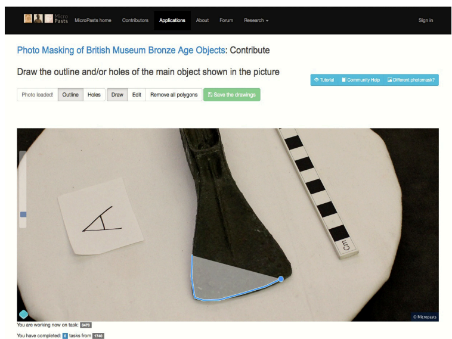

## Abstract

This paper offers a brief introduction to MicroPasts, a web-enabled crowd-sourcing and crowd-funding project whose overall goal is to promote the collection and use of high quality research data via institutional and community collaborations, both on- and off-line. In addition to introducing this initiative, the discussion below is a reflection of its lead author’s core contribution to the project and will dwell in more detail on one particular aspect of MicroPasts: its relevance to research and practice in public archaeology, cultural policy and heritage studies.

In the last few years, the potential of digital technologies for facilitating new, more collaborative and creative forms of public engagement with the human past has been an increasingly investigated subject (e.g. Bonacchi 2012; Richardson 2013). In parallel, a growing body of literature has addressed issues concerning open access and open data in archaeology (e.g. Kansa et al. 2012; Lake 2012), sometimes also reflecting upon the wider implications of adopting these relatively novel practices for society at large (e.g. Beale 2012; Bevan 2012). In addition, a number of postgraduate courses, workshops, conferences and articles have considered the roles of archaeological and heritage assets in generating economic development and well-being (e.g. Gould and Burtenshaw forthcoming; Burtenshaw and Bonacchi forthcoming).[^1]

These threads, often interwoven, have partly been a response to the funding opportunities available and, ultimately, also reflect efforts made at national policy level to support the sustainability of heritage organisations and a more proactive social role for research institutions in a time of economic crisis. The UK Arts and Humanities Research Council (AHRC), for example, has recently opened calls for pilot projects and reviews intending to explore fresh ways of understanding the value of arts and culture, or to collaborate with galleries, libraries, archives and museums to develop and critically evaluate public engagement agendas (e.g. the AHRC’s ‘Culture Value’ call and‘ Cultural Engagement Fund’). At the same time, bodies such as the Heritage Lottery Fund and the Arts Council have launched grant schemes aimed at enabling heritage, arts and cultural institutions to devise strategies for diversifying their financing schemes and remaining resilient in a climate of reduced public funding.[^2]

In this broader context, crowd-sourcing—collecting information, services, or funds in small amounts from large groups of people online—has gained attention among cultural heritage professionals (Dunn and Hedges 2012). Originally emerging in the commercial sector as a way to outsource labour globally (Howe 2006), crowd-sourcing is now used for not-for-profit purposes such as research, museum curation, and heritage management in collaboration with the public. In archaeology, crowd-sourcing has enabled activities like papyri transcription, imagery inspection for archaeological features, pooling wartime heritage, interrogating built architecture, and public recording of metal artefacts. Some projects have also adopted 'crowd-funding', seeking small individual donations to collectively support archaeological study, conservation, and communication.

Although increasingly popular, however, crowd-sourcing initiatives in archaeology have been primarily of a “contributory” nature (Simon 2010), inviting volunteers to offer their time, skills and experience to help with projects that had been designed entirely by research institutions. Furthermore, very little evaluative work has been conducted until now to investigate the motivations leading different people to engage with archaeological crowd-sourcing, the ways in which volunteers participate, the value of these exercises for contributors and the organisations involved, and their long-term sustainability, scalability and margins of applicability beyond anglophone countries. MicroPasts3 aims to address the two key concerns outlined above, by developing and evaluating a novel model that utilises web technologies and crowd-sourcing to support high quality data collection and public engagement with archaeology, history and heritage.

The project is conducted as a collaboration between the UCL Institute of Archaeology and the British Museum, with applicability beyond anglophone countries. MicroPasts[^3] aims to address the two key concerns outlined above, by developing and evaluating a novel model that utilises web technologies and crowd-sourcing to support high quality data collection and public engagement with archaeology, history and heritage. The project is conducted as a collaboration between the UCL Institute of Archaeology and the British Museum, with support high quality data collection and public engagement with archaeology, history and heritage. The project is conducted as a collaboration between the UCL Institute of Archaeology and the British Museum, with funding from the AHRC call for ‘Digital Transformations in Community Research Co-Production in the Arts and Humanities’.

This scheme was designed to facilitate research using original digital methods to create enduring resources for academics and communities, building on prior collaborative work by team members at the UCL Centre for Audio-Visual Study and Practice in Archaeology (CASPAR)[^4], which examines the interaction between archaeology and visual communication across digital media, broadcasting, and interpretation.

As part of the MicroPasts project, a website[^5] was created where communities that are already established offline (e.g. archaeological and historical societies, groups of metal detectorists, etc.) as well as more ubiquitous online ‘crowds’ can participate in one or more of three activities (Fig. 1). These activities consist of co-producing archaeological and historical open data via crowd-sourcing; designing new research agendas using co-produced data and a community forum; and crowd-funding some of these new collaborations that have been dreamt up collectively. The MicroPasts forum and crowd-sourcing platform were launched publicly on the 16th of April 2014, after six months dedicated to developing the core web components through shared coding practices and open source[^6]. 

The forum[^7] has been built using the Discourse discussion software, while the crowd-sourcing site[^8] relies on the PyBossa framework for CrowdCrafting, adapted thanks to a partnership with the Open Knowledge Foundation and the Citizen Cyberscience Centre. Finally, the crowd-funding platform is constructed from software developed by the Neighbor.ly and Catarse initiatives and will (at least initially) use PayPal to process payments. Although our aim is to encourage members of the public to first participate in crowd-sourcing and only subsequently in the design of new projects and in crowd-funding, we are nevertheless also enabling each of these activities to be undertaken independently from one another.

The crowd-sourcing site now hosts two distinct kinds of applications, which focus on British Prehistory and British Museum collections and entail, respectively, transcription and photo-masking tasks. By participating in transcription, volunteers can help digitise over 30,000 object cards that document Bronze Age metal artefacts found mostly in Britain from the nineteenth century onwards (Fig. 2). These cards are part of the National Bronze Implements Index (NBII), an archive that was first developed around 1914 and is now housed in the British Museum (Fig. 3). The NBII forms the first extensive catalogue of Bronze Age objects in Britain and Europe, and represents an untapped source of information about later prehistory.

The cards are organised in numbered drawers by object type (e.g. spearhead, axe, sword, etc.) and find-spot (generally, county, town, and/or museum/private collection). Via crowd-sourcing, MicroPasts users transcribe object cards online and geo-reference the sites of discovery recorded on them in order to facilitate further research into the history of NBII (for example, by gaining information on the full geographic and chronological scope of its collections), as well as advancing existing knowledge of curatorial practices in Britain over the last century. This newly digitised resource will be invaluable for the study and comparison of Bronze Age objects, enriching the extensive Portable Antiquities Scheme (PAS) database, which records a large proportion of the metal artefacts discovered in England and Wales from the 1990s to the present day. By combining these two databases, the MicroPasts project will complement the public facing nature of the PAS as well as form potentially one of the largest digital archives on prehistoric metal objects anywhere in the world.

The second type of crowd-sourcing application involves ‘photo-masking’, where volunteers outline artefacts in online photographs. Each artefact has a set of 50+ images taken from all angles, enabling Structure-from-Motion techniques to identify common features and build high quality 3D models (see James and Robson 2012; Green et al. 2014; Bevan et al. 2014). By masking the object in each photo, contributors help exclude backgrounds and improve model accuracy. Multiple contributors per image allow for quality checking, significantly enhancing the resulting 3D models (Fig. 5).

Fig. 4: Interface of the photo-masking application.

To complement this masking work, MicroPasts has developed a ‘Learning’ page at micropasts.org, offering resources and step-by-step notes on creating 3D models offline with various software. This page provides context for the photo-masking application and helps the public gain new digital skills. Community feedback is encouraged to enrich the ‘Learning’ page and platform, and to comment on the use of source or derived data produced via crowd-sourcing.[^9] This feedback offers insights into the lifecycle and public value of open archaeological and historical data. Future plans include supporting contributor-generated 3D models by enabling volunteers to upload their own image sets for artefact modelling, fostering crowd-sourcing activities between volunteer communities and academic institutions, and supporting micro-financed projects through the MicroPasts crowd-funding site.

[Fig. 5: A 3D model of a Bronze Age palstave, shown with both photographic texture and ‘ambient occlusion’ surface](../images/micropasts/figure6-micropast.png).

A final and important component with 
which the lead author is heavily involved 
is an evaluation of public participation via 
the MicroPasts project. In undertaking this 
research, we will examine the processes of 
online community development; contributors’ motivations and how these relate to 
their different cultural interests, socio-demographic characteristics, lifestyles and ways of 
contributing to the MicroPasts platforms; and 
the value of the model for volunteers, staff 
and partnering institutions. To investigate 
these aspects, we draw on both quantitative 
and qualitative approaches, combining more 
traditional methods (e.g. online surveys) with 
‘natively digital’ ones (Rogers 2013) consisting of the analysis of data relating to user 
behaviour, interests and attitudes extracted 
from the MicroPasts platforms and social 
media. This evaluative strategy entails dealing 
with very large quantities of information and, 
as such, it also aims to offer a valid contribution towards advancing web-based methodologies for research in public archaeology and 
cultural heritage studies that use big data.1[^10]

Web-based evaluative tools have been developed together with the engagement platforms so as to ensure that they do not disrupt people’s participation. So far, we have enabled a short survey that appears to users as a pop-out window after they have completed their first crowd-sourcing task. This form has been designed to collect selected information on the social networks via which contributors have heard of MicroPasts; these insights are then combined with Google Analytics data and membership data for a longitudinal assessment of the dynamics of community formation. A second follow-up survey pops up after the submission of the 25th task and allows an exploration of the motivations for, and value of, participation for different contributors, in association with their use of the MicroPasts sites. The threshold of 25 tasks was decided after assessing possible cut-off points in plots of contributor participation up to 23rd June 2014, across the four crowdsourcing applications (Fig. 6). The chart below shows a ranking of the 454 authenticated members of the crowd-sourcing website based on the number of tasks they completed, with the cut-off point at task 25 highlighted. Each ‘task’ on the y-axis might be the transcription of a single index card or the masking of a single photograph.

The rank on the x-axis is the position of a particular online contributor on the MicroPasts leaderboard (identified by their user login), with the first-ranked contributor having completed the most tasks on the site. Such ‘rank size’ plots (with logarithmic-axes) are similar to the ones used in landscape archaeology to understand settlement size hierarchies. In our case, this plot exhibits a ‘long-tailed’ distribution in which a handful of particularly active contributors are currently doing most of the work on the site, whilst many visitors are only trying out one or two tasks each (this being a typical experience amongst crowd-sourcing projects). The labels A9, B8 and B16 correspond to physical drawers of index cards in the hard copy archive that were put online as separate applications. A detailed discussion of the methodology and results of the evaluation of the initial phases of the MicroPasts project will be published in due course as the outputs of the research develop further.

## Acknowledgments

The MicroPasts project has been kindly granted initial funding by the UK Arts and Humanities Research Council. We are grateful to Roger Bland, Ian Carroll, Tim Causer, Nathalie Cohen, Stuart Dunn, Susie Green, Lorna Richardson, Mia Ridge, Stuart Robson, Peter Schauer, Melissa Terras, Lisa Westcott Wilkins and Brendon Wilkins, who have offered invaluable advice in the development phase of the project. Finally, we are thankful to the MicroPasts community of contributors for collaborating with us so far.

## Foot Notes

[^1]: As further examples, see also the Cultural Heritage and Development course at the UCL Institute of Archaeology (UCL IoA), and ‘The impact of cross-disciplinary conservation on social development’ conference, organised in 2014 by the UCL IoA Conservation and Development Research Network.
[^2]: See, for example, the 'Catalyst' grants that form part of a broader partnership initiative between the Heritage Lottery Fund, the Arts Council England and the Department for Culture, Media and Sport, or the 'Transition Funding' programme of the Heritage Lottery Fund.
[^3]: See also the [UCL webpage of the project](http://www.ucl.ac.uk/archaeology/research/directory/community-bevan)
[^4]: These activities are listed on the webpage of the [UCL Centre for Audio-Visual Study and Practice in Archaeology](http://www.ucl.ac.uk/archaeology/research/projects/caspar)
[^5]: See the [Micropasts website](https://micropasts.org)
[^6]: A variety of languages have been employed from Ruby on Rails to PHP and Python. MicroPasts software is stored in [repositories](https://github.com/MicroPasts)
[^7]: See the [MicroPasts forum](https://community.micropasts.org)
[^8]: See the MicroPasts [crowd-sourcing website](https://crowdsourced.micropasts.org)
[^9]: Our crowd-sourcing applications use digital source data (for example photographs, scanned documents) to allow contributors to complete research tasks such as the development of 3D models, photo-tagging and transcription. This source data will typically be available through a fully open CC0 licence or a CC BY licence, but in some cases might be placed under CC BY-NC or CC BY-ND licences when the institutions owning the archaeological or archival material have asked that commercial use is prohibited without further consultation. All the derived data, produced with the help of volunteers via crowd-sourcing, is licensed under an open CC0 or CC BY licence, depending on case-by-case agreements with our partners.
[^10] This specific topic is directly relevant to the remit of the UCL Centre for Audio-
Visual Study and Practice in Archaeology and the Archaeology and Communication Research Network

## References
Beale, N 2012 How community archaeology can make use of open data to achieve further its objectives. World Archaeology 44.4: 612–633. DOI: [10.1080/00438243.2012.743252](http://d.doi.org/10.1080/00438243.2012.743252)

Bevan, A 2012 Value, authority and the open society. Some implications for digital and
online archaeology, in C. Bonacchi (ed.) Archaeology and Digital Communication: Towards Strategies of Public Engagement: 1–14. London: Archetype

Bevan, A, Li, XJ, Martinón-Torres, M, Green, S, Xia, Y, Zhao, K, Zhao, Z, Ma, S, Cao, W and Rehren, T 2014. Computer vision, archaeological classification and China’s terracotta warriors. *Journal of Archaeological Science*. DOI: [http://d.doi.org/10.1016/j.jas.2014.05.014](http://d.doi.org/10.1016/j.jas.2014.05.014)

Bonacchi, C (ed.) 2012. Archaeology and Digital Communication. Towards Strategies of Public Engagement. London: Archetype Publications

Burtenshaw, P and Bonacchi, C (forthcoming). Conference review: The 17th ICOMOS General Assembly Scientific Symposium ‘Heritage, Driver of Development’. *Public Archaeology*.

Dunn, S and Hedges, M 2012. Crowd-sourcing Scoping Study. Engaging the Crowd with Humanities Research, Report for the UK Arts and Humanities Research Council Connected Communities Scheme. URL: [http://crowds.cerch.kcl.ac.uk/wp-content/uploads/2012/12/Crowdsourcing-connected-communities.pdf](http://crowds.cerch.kcl.ac.uk/wp-content/uploads/2012/12/Crowdsourcing-connected-communities.pdf)

Gould, P and Burthenshaw, P (forthcoming). Archaeology and Economic Development, Special Issues of *Public Archaeology* 13.1–4

Green, S, Bevan, A and Shapland, M 2014. A comparative assessment of structure from motion methods for archaeological research. *Journal of Archaeological Science* 46: 173–181. DOI: [http://dx.doi.org/10.1016/j.jas.2014.02.030](http://dx.doi.org/10.1016/j.jas.2014.02.030)

Howe, J 2006. The Rise of Crowdsourcing. *Wired* 14.06 (June). URL: [http://archive.wired.com/wired/archive/14.06/crowds.html](http://archive.wired.com/wired/archive/14.06/crowds.html)

James, M R and Robson, S 2012. Straightforward reconstruction of 3D surfaces and topography with a camera: Accuracy and geoscience application. *Journal of Geophysical Research* 117: F03017. DOI: [http://dx.doi.org/10.1029/2011JF002289](http://dx.doi.org/10.1029/2011JF002289)

Kansa, E, Kansa, S and Watrall, E (eds) 2012. Archaeology 2.0: New Approaches to Communication and Collaboration, Los Angeles: Cotsen Institute of Archaeology. URL: [http://www.escholarship.org/uc/item/1r6137tb](http://www.escholarship.org/uc/item/1r6137tb)

Lake, M 2012. Open archaeology. *World Archaeology* 44.4: 471–8. DOI: [http://dx.doi.org/10.1080/00438243.2012.748521](http://dx.doi.org/10.1080/00438243.2012.748521)

Richardson, L 2013. A Digital Public Archaeology?. *Papers from the Institute of Archaeology*, 23(1): 1–12. DOI: [http://dx.doi.org/10.5334/pia.431](http://dx.doi.org/10.5334/pia.431)

Rogers, R 2013. Digital Methods, Cambridge, Massachusetts: MIT Press

Simon, N 2010. The Participatory Museum (Museum 2.0). URL: [http://www.participatorymuseum.org/](http://www.participatorymuseum.org/)