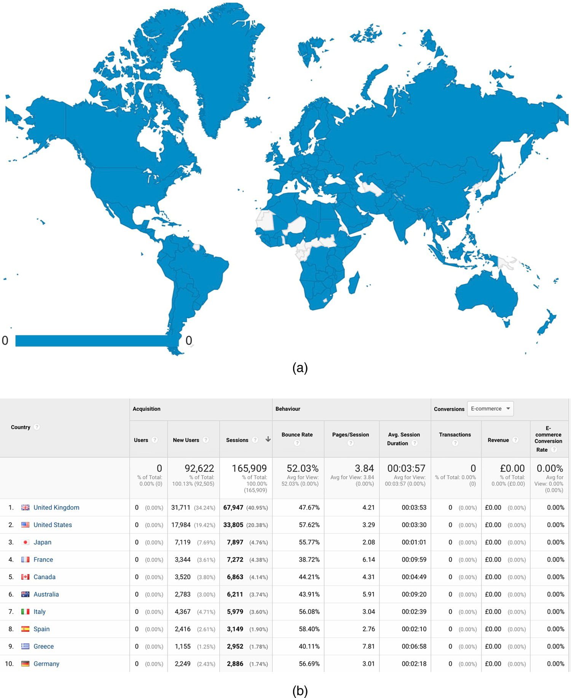
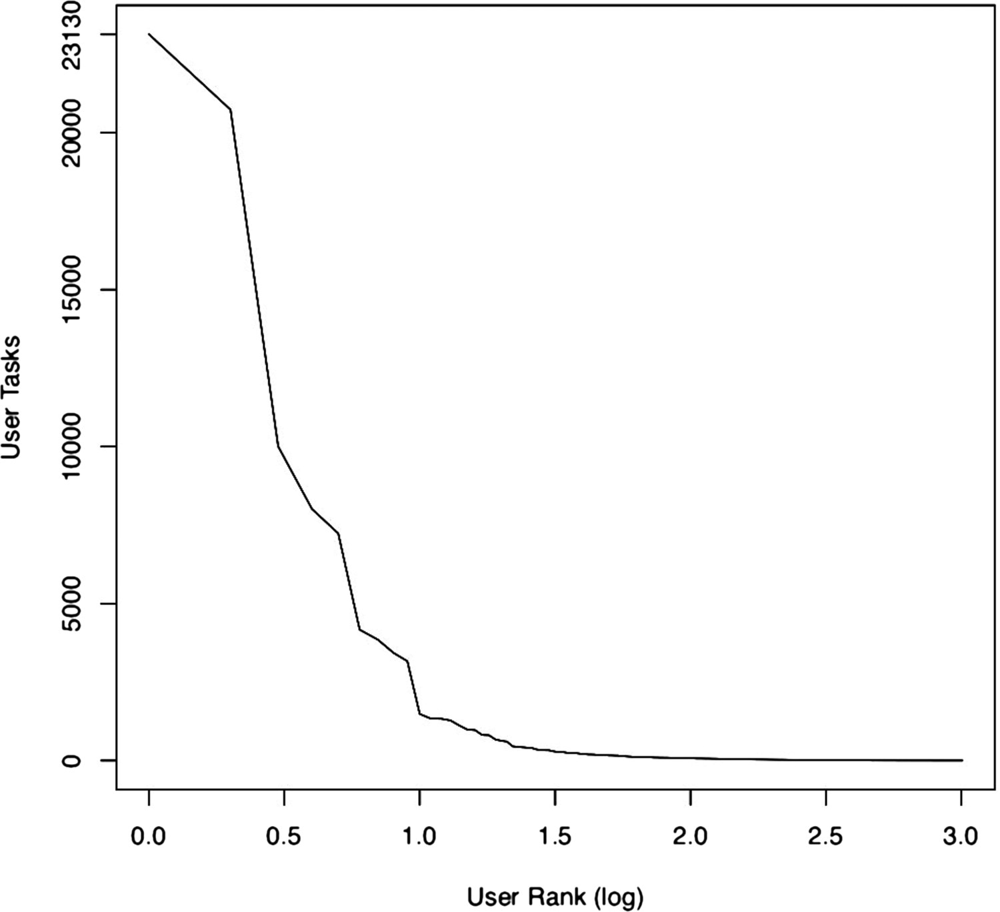

    <strong>Note:</strong> This paper was published in <a href="https://academic.oup.com/dsh/article/34/1/1/5052672">Digital Scholarship in the Humanities</a> in 2019. The final version of the paper is available at <a href="https://doi.org/10.1093/llc/fqy034">https://doi.org/10.1093/llc/fqy034</a>. This version is the pre-print and may differ from the final published version (which it does, as the images are in the right order and some typos are fixed).

## Abstract

This paper draws upon the experience of several years of running a multi-application crowdsourcing platform, as well as a longitudinal evaluation of participant profiles, motivations and behaviour, to argue that heritage crowdsourcing cannot straightforwardly be considered a democratising form of cultural participation. While we agree that crowdsourcing helps expand public engagement with state-funded activities at Galleries, Libraries, Archives, and Museums, we also note that, the involved public cohort is not radically different in socio-demographic make-up to the one that physically visits such institutions, being for example financially better-off with high levels of formal education. In shedding light on issues of participation and cultural citizenship, through a both theoretically and empirically rich discussion, this paper casts light on the current impact of heritage crowdsourcing, in terms of both its strengths and weaknesses. The study will also be useful for cultural heritage policy and practice, museum management and curatorship to potentially guide the choices and strategies of funders and organisations alike.

## 1. Introduction

### 1.1. Research problem

Studies of cultural participation in the UK today show that certain social demographics remain very detached from museums and galleries (Bennet et al. 2009). Given that such places have long been powerful but problematic symbols of western culture, ever since their first emergence during the Renaissance, it remains striking that both museums and galleries have, on the whole, failed to engage ethnic minorities and people in lower socio-economic groups (Sandell 2002). For example, despite policies to ensure free entrance to state-funded museums, variables such as high socio-economic background, a university degree and/or a professional occupation have, together with ethnicity, all remained good predictors of high levels of participation in cultural activities (Neelands et al. 2015). Similar trends have been noted in the United States, where the attendance of financially disadvantaged groups and minorities at public art museums has been declining, despite the fact that US society overall is increasingly multicultural and ethnically diverse (Blackwood and Purcell 2014). These UK and US findings are also consistent with results obtained by previous surveys worldwide (DiMaggio, Useem, and Brown 1979; Merriman 1989; National Endowment for the Arts 1997; Selwood 2002; La Regina 2009; Taylor 2016), with cultural factors proving stronger than structural ones in determining disengagement (Merriman 1989). Indeed, commentators have stressed that part of the problem of representation in cultural participation relates to the fact that what is being measured is typically footfall at state-funded venues (Stevenson, Balling, and Kann-Rasmussen 2017, 100–1). In contrast, some argue that, if policies were developed to better support and monitor everyday cultural activities (e.g., woodworking, DIY, gardening, etc.), these would directly benefit more people beyond well-off, white individuals with tertiary education. Furthermore, re-thinking the ways in which policies are designed, implemented and evaluated would help in actualising cultural democracy in a more convincing way (Taylor 2016; Hadley and Belfiore 2018).

Bennet et al. (2009) explain under-representation of certain groups at museums, galleries and stately homes as also linked to the fact that these are forms of active public participation, which studies of social capital have consistently shown to be less common amongst lower socio-economic groups (e.g., Hall 1999; Li, Savage, and Pickles 2003; Warde et al. 2003). In this article, we ask what happens when engagement with museum, gallery, and archive content and materials is instead conducted in the private space of the home or the office, thanks to the application of crowdsourcing. Does this make participation more diverse or does the important social problem of selective under-representation persist?

### 1.2. Research context: heritage crowdsourcing

Crowdsourcing was a term first coined by Jeff Howe in a seminal article for Wired magazine (Howe 2006) by combining the words ‘crowd’ and ‘outsourcing’ in order to refer to the commercial practice of distributing paid labour amongst individuals located in geographically disparate regions of the globe. Outside of the commercial world, however, the meaning and mission of this practice have changed to adapt to the remit of not-for-profit activities. In most cases, this has entailed not offering monetary rewards in exchange for the completion of crowdsourced tasks (Ridge 2013), with user motivations instead often being primarily intrinsic. For the purpose of this article, we will define heritage crowdsourcing as the creation, digitisation, enhancement, analysis and interpretation of cultural heritage objects (including data) and places by relatively large groups of people, through the completion of individually small tasks over the Internet.

In the last decade, crowdsourcing has been increasingly explored by higher education institutions, Galleries, Libraries, Museums and Archives (GLAMs) and heritage organisations (Dunn and Hedges 2012; Ridge 2013, 2014; Terras 2016). Some of these crowdsourcing undertakings have been set up by a specific institution as standalone endeavours or as a series of projects relating to the collections held by that institution. This is the case for several initiatives led by GLAMs such as the British Library, the New York Public Library, the National Library of Australia, or the Smithsonian Transcription Centre, and by a few single-purpose research endeavours such as Field Expedition: Mongolia and GlobalXplorer (Holley 2010; Lascarides and Vershbow 2014; Lin et al. 2014; Parilla and Ferriter 2016; Ridge 2018; Yates 2018). A second group of projects has instead been hosted by thematically focused or multi-topic crowdsourcing websites, as in the case of Zooniverse or MicroPasts (Lintott et al. 2008; Bevan et al. 2014). These platforms have created an array of crowdsourcing templates to perform tasks of different kinds, ranging from the transcription of archival documents to the public indexing of photographs and videos through social tagging. They have also become spaces that bring together different institutions, cultural heritage objects and task types. It is with this second category that our article is concerned, via the case study of MicroPasts (see 2.).

In the next section, we introduce MicroPasts, which is to our knowledge the first website hosting multiple types of heritage crowdsourcing, and we explain how this project has helped to create a distributed and primarily ‘private’ kind of cultural participation. MicroPasts placed a considerable, publicly-acknowledged emphasis on evaluating participant profiles, motivations and behaviour and a following section examines how the socio-demographic dimensions of MicroPasts participants compare to those of people who take part in state-funded heritage activities via physical visitation; it explores what the democratising power of heritage crowdsourcing could be, and how this method can help museums, galleries and other state-funded institutions to diversify participation.

## 2. Methodology

### 2.1. MicroPasts: a case study of heritage crowdsourcing

MicroPasts was established in 2013 by a team of researchers at the UCL Institute of Archaeology and the British Museum (with coordination also now provided by researchers at the University of Cambridge Fitzwilliam Museum and the University of Stirling), thanks to funding from the UK Arts and Humanities Research Council (Bevan et al. 2014; Bonacchi et al. 2014, 2015a, 2015b; Wexler et al. 2015). Its aim has been to leverage crowd- and other web-based methods to create and study collaborations between citizens inside and outside heritage organisations, in order to co-produce data and knowledge about the human past and its contemporary reception. The [MicroPasts crowdsourcing website](https://crowdsourced.micropasts.org) has been developed using Free and Open Source Software and particularly an existing citizen science framework known as Pybossa (Scifabric 2018), which supports sophisticated task scheduling, a registered user base and a wide variety of different applications. Sometimes building on existing Pybossa templates, sometimes creating new ones, MicroPasts has developed a series of modular applications each tuned to enable collective capture of a specific kind of open data (e.g., 3D models, transcriptions, photo tags), and this modularity enables easy adaptation to different archaeological and heritage collections. Task redundancy and a mix of automatic and expert quality assessment have been the main mechanisms used to ensure that the resulting crowdsourced data is of good research quality (Allahbakhsh et al. 2013; Daniel et al. 2018). This means that each crowdsourcing task (e.g., transcription, tagging, etc.) is completed by two or more participants, depending on the application template, and is subsequently consolidated by an experienced participant and/or a ‘traditional’ researcher. Raw, crowdsourced and verified data is released (immediately, as it is produced) via the website under a Creative Commons license (primarily as CC-BY) and the source code under a General Public License.

Until now, the majority of the crowdsourcing applications powered by MicroPasts consisted of transcription and 3D photo-masking, and, in the first two years, they focused especially on Bronze Age museum collections. During this initial phase, the project transcribed and georeferenced the National Bronze Age Index, an archive of about 30,000 cards documenting prehistoric metal artefacts found in Britain during the nineteenth and early twentieth century (Pett, Lombraña González, and Bevan 2014; Wexler et al. 2015; Figure 1). Participants online were also invited to help with drawing outlines of objects on sets of photos of those objects to mask out the background (Lombraña González, Pett, and Bevan 2014; Figure 2). This task was designed to facilitate and speed-up the 3D modelling of artefacts via photogrammetric approaches that otherwise proceeded offline (Bevan et al. 2014). Over time, MicroPasts has also enabled quite different applications often on a more one-off experimental basis, such as those for the public indexing of historical photographs, the testing of object description vocabularies via tagging (e.g., Keinan-Schoonbaert et al. 2014), content analysis through video-tagging or sound track transcription, while also adapting and using existing transcription templates for the digitisation of structured and unstructured textual data. This varied crowdsourcing landscape has been nurtured through collaborations with 20 other museums, archives, libraries, heritage groups and university-led research projects in the UK, US, Italy and Germany (Table 1).

    <table class="table table-striped table-bordered border-primary">
    <thead>
        <tr>
        <th>Country where the institution/project lead is based</th>
        <th>Organisations and projects</th>
        </tr>
    </thead>
    <tbody>
        <tr>
        <td>UK</td>
        <td>
            <ul>
            <li>Petrie Museum</li>
            <li>Ancient Identities in Modern Britain project</li>
            <li>Society of Antiquaries of London</li>
            <li>New Forest National Park Authority</li>
            <li>Portable Antiquities Scheme</li>
            <li>Egypt’s Exploration Society</li>
            <li>Postcard to Palmyra project</li>
            <li>Archaeology Data Service</li>
            <li>Sainsbury Institute for the Study of Japanese Arts and Cultures</li>
            <li>The Impact of Evolving Rice Systems from China to Southeast Asia</li>
            <li>Mary Rose Trust</li>
            <li>Palestine Exploration Fund</li>
            </ul>
        </td>
        </tr>
        <tr>
        <td>US</td>
        <td>
            <ul>
            <li>Montpellier Foundation</li>
            <li>Project Andvari</li>
            <li>American Numismatic Society</li>
            <li>Minnesota Historical Society</li>
            <li>Denver Museum of Nature and Science</li>
            </ul>
        </td>
        </tr>
        <tr>
        <td>Italy</td>
        <td>
            <ul>
            <li>Museo Egizio</li>
            <li>Museo Multimediale del Regno di Arborea</li>
            </ul>
        </td>
        </tr>
        <tr>
        <td>Germany</td>
        <td>
            <ul>
            <li>University of Munich</li>
            </ul>
        </td>
        </tr>
    </tbody>
    </table>

**Table 1. Institutions and projects collaborating with MicroPasts.**

Although MicroPasts started by enabling a strongly scaffolded and contributory kind of participation, where people were invited to complete rather mechanical crowdsourcing tasks (e.g., for transcription, geo-referencing, photo-masking and tagging, etc.), it thereafter evolved to encompass collaborative and co-creative levels of participation as well (Simon 2010). So far, MicroPasts has mainly enabled projects designed by museums, archives and teams of academic researchers, but, over the years, citizen collaborators have been encouraged to suggest ways of taking forward the MicroPasts project and platforms and of improving workflows and procedures. As a result, some of the volunteers also started to undertake new activities they had proposed and which required additional skills and deeper engagement at the interface between the generation and interpretation of cultural heritage data. In particular, a small group of eleven participants learnt the full online and offline pipeline to build 3D models, while half a dozen people (in some cases coinciding with the first group of 3D modellers) helped validate transcribed entries before these were finally approved by a researcher based in the relevant partner organisation. In this paper, however, we will examine only the contributory level of participation consisting in the submission of crowdsourcing tasks, given the small number of those involved in collaborative and co-creative efforts.

## 2.2. Evaluation and research methods

As heritage crowdsourcing initiatives have emerged, researchers have tried to better understand their users and the interests and values behind their participation. This body of research, primarily grounded in individual project evaluations, has, however, been conducted mainly via end-of-project surveys or cross-sectional formative investigations (Holley 2010; Causer and Wallace 2012; Causer and Terras 2014; Ridge 2014). To our knowledge, heritage crowdsourcing has never been evaluated longitudinally with a view to understanding participant profiles, motivations and behaviour, as well as the scope, potential and limitations of participant representation.

With the latter goals in mind, and adopting a longitudinal, mixed quantitative and qualitative approach, MicroPasts collected behavioural data from the records of completed tasks, as well as socio-demographic and attitudinal information from pop-up surveys that were coded to appear, respectively, after the submission of the 1st and of the 25th crowdsourcing task. The results from the short survey undertaken after the first task cover: (1) how the contributor found out about MicroPasts; and (2) whether he/she was working with archaeology or history as part of his/her main job (the main job done for living). The second survey, appearing after the submission of the 25th crowdsourcing task aimed to question more heavily-engaged participants who had been involved with MicroPasts far beyond a single, first encounter. The threshold of twenty-five was decided after evaluating the possible cut-off points in plots that displayed the ranking of participants based on their number of completed tasks, as recorded two months after the public launch of the crowdsourcing platform (see Bonacchi et al. 2014).[^1]

The results of this second survey cover: (1) the contributor’s reasons for participating in the specific crowdsourcing application to which the survey was linked, and (2) any other crowdsourcing applications the participant might have been involved in; (3) the highest level of formal education attained; (4–5) the participant’s occupation and, if in employment, job title; and (6) the country where the contributor was living. Obviously, the above choices about the number of surveys and the depth of their questioning reflect a balancing act in terms of asking yet more of people already volunteering their time online, and in particular we judged that it might be potentially off-putting and disruptive to inquire about ethnicity or income, and decided not to include questions on these measures.

Social survey literature (Bryman 2012) suggested to us that questioning participants while they were still connected to the platform, rather than at the end of the whole project, would increase the reliability of answers to questions about their interaction with the applications, the overall response rate, the response rate to open-ended questions and the richness of the responses to those questions. As previously mentioned, prior evaluations of heritage crowdsourcing based on social surveys were cross-sectional and, as such, allowed for gathering only relatively small numbers of responses. Over the period from 16 April 2014 to 27 April 2017, during which the evaluation took place, it was possible to collect 853 task-1 survey responses and 56 task-25 survey responses.

## 3. Results

### 3.1. Participant representation

MicroPasts’ outreach efforts were aimed at two main groups of people, consisting of communities of interest in the past that were already established offline (e.g., archaeological and historical societies in Britain, the metal detectorists working with the Portable Antiquities Scheme, existing British Museum audiences, students and academics at UCL and at other universities), and a wider and unknown online ‘crowd’ of geographically dispersed collaborators. The outreach campaign was undertaken through social media, blogs, online magazines and newspapers, as well as more targeted emails and few face-to-face presentations to selected groups. As already noted by other crowdsourcing projects, online publicity was more effective in attracting a higher number of contributors than any other kind of tailored communication (Causer and Wallace 2012).

As a result of this outreach, 1623 people registered with MicroPasts, but were not necessarily active on it, up until 30 April 2017, in addition to anonymous collaborators whose numbers we cannot estimate with complete accuracy, but are likely, based on IP addresses, to be considerably larger than the registered group. Visits to the MicroPasts website have been widespread internationally, but the number of those from the UK and US has been the highest (Figure 3). Only a minority of individuals had heard of MicroPasts directly from the founding institutions (the British Museum or the UCL Institute of Archaeology) and because they were already engaged with them; the majority instead came to know of MicroPasts by casually browsing the web and/or via online newspapers such as the Guardian, magazines such as British Archaeology and Discovery, heritage or technology blogs and news sites (e.g., hyperallergic.com, popsci.com, etc., Table 2). More engaged participants had attained relatively high levels of formal education, with almost all of them having either a university degree or a post-graduate degree (21 in each category, out of 49 respondents to this question in the task-25 survey). Furthermore, the large majority of more engaged contributors was either in employment or retired and these two groups together made up 88% of the total of task-25 survey respondents, with the remaining 21% being composed of students, unemployed or stay-at-home participants. These findings are in line with the results of cross-sectional evaluations of other heritage crowdsourcing projects (Causer and Wallace 2012; Eccles and Greg 2014).

| How they heard of MicroPasts | Count |
|:---|---:|
| Via British Museum people/websites/social media and/or Portable Antiquities Scheme | 166 |
| Via UCL people/websites/social media and/or Portable Antiquities Scheme | 49 |
| Via people/websites of another university (NOT University College London) | 39 |
| I was told by someone who does NOT belong to any of the categories listed above | 55 |
| Casually browsing the web | 115 |
| From an online newspaper/magazine | 145 |
| Via an archaeological/historical society | 45 |

**Table 2: How participants had heard of MicroPasts.**

Not only did a large part of contributors consist of professionals, but the latter held jobs that frequently were related in some way to the activities and the tasks proposed. Three quarters of respondents to the task-1 survey (72%) were not working with history or archaeology as part of their main job they did for living (Figure 4). However, based on the job titles mentioned by task-25 survey respondents, we know that many of the more engaged participants were active in fields that spanned administration, database management, accountancy, sales, transports, communication, publishing, IT, and sometimes the arts and humanities.

**Figure 4. MicroPasts participants’ relevance of their main job to the fields of archaeology or history. Break-down of task-1 survey respondents.**

### 3.2. The centrality of process and activity type

As of 30 April 2017, 1009 registered participants had been actively involved at contributory level on the MicroPasts crowdsourcing platform and a further group of anonymous users that we estimate (from IP address uniqueness) to be considerably higher than the number of registered ones. In line with the findings presented in other published literature, the distribution of this kind of participation exhibited a long tail, with a very small group of people submitting the vast majority of the tasks and a high number of more fleetingly involved participants (Figure 5, which confirms the trend already discussed in Bonacchi et al. 2014 and in Holley 2010; Oomen and Aroyo 2011; Corneli and Mikroyannidis 2012, 284; Dunn and Hedges 2012, 12; Causer and Terras 2014; Eccles and Greg 2014). 

The trend can be observed for participation in transcription and photo-masking applications without marked differences, as proved by the similarities in Gini coefficient for these two crowdsourcing task types (Figure 6). Gini coefficient and Lorenz curve are measures of inequality, frequently applied in the social sciences and especially in economics (e.g., Fidan 2016; Brown 2017); here we use the Gini coefficient, which is the ratio of the area that lies between the line of equality (45° line in Figure 4) and the Lorenz curve (the curve in Figure 4): a metric where 1 expresses maximum inequality and 0 minimum inequality.

The number of participants engaged in transcription and photo-masking, the two crowdsourcing application types that were deployed since the beginning of MicroPasts, are not significantly different (Table 3). However, participants mostly tended to engage with either one or the other kind of task, and only 18% of them engaged with both types of crowdsourcing activities (Table 4). This is particularly significant if we consider that, for the first two years of the project both transcription and 3D photo-masking tasks focused mostly on the same collections, consisting of Bronze Age metal artefacts housed at the British Museum and their object cards. The type of material that people engaged with, instead, had less of an impact on the choice of the applications to participate in (Table 5).

The insights provided by behavioural data regarding the centrality of activity type to the appeal of crowdsourcing are reinforced by the qualitative analysis of participants’ motivations. Responses to the task-25 survey were examined with the aim of identifying the smallest possible number of different motivational categories, of which eight stood out (Table 6). Certain very intrinsic kinds of motivation are prevalent, proving that process underlies several of the main reasons why people participate in heritage crowdsourcing. Enjoying the proposed activity, contributing to knowledge production, and ‘helping out’ are all process-focused motivations. By comparison, a desire to engage with a particular kind of heritage object or subject does not feature prominently, if at all. This result is interesting in that it corroborates findings from the previous section, regarding a possible link between activity types and contributors’ professions.[^2]

| How they heard of MicroPasts                                                       |   Count |
|:-----------------------------------------------------------------------------------|--------:|
| Via British Museum people/websites/social media and/or Portable Antiquities Scheme |     166 |
| Via UCL people/websites/social media and/or Portable Antiquities Scheme            |      49 |
| Via people/websites of another university (NOT University College London)          |      39 |
| I was told by someone who does NOT belong to any of the categories listed above    |      55 |
| Casually browsing the web                                                          |     115 |
| From an online newspaper/magazine                                                  |     145 |
| Via an archaeological/historical society                                           |      45 |

**Table 3. Participants engaged with each crowdsourcing task type.[^3]**

| Participants                               |   Count |     % |
|:-------------------------------------------|--------:|------:|
| Participants who did only one type of task |     795 | 79    |
| Participants who did 2 types of task       |     182 | 18    |
| Participants who did all 3 types of task   |       3 |  0.03 |

**Table 4. Participants engaged with one, two or all three types of crowdsourcing tasks.**

| Participants                                                             |   Count |   % |
|:-------------------------------------------------------------------------|--------:|----:|
| Participants engaged with text-based applications only                   |     415 |  41 |
| Participants engaged with visuals-based applications only                |     339 |  34 |
| Participants engaged with both text-based and visuals-based applications |     248 |  25 |

**Table 5. Participants engaged with text-based and/or visuals-based applications.**

| Motivational category | Examples |
|:---|:---|
| Learning about history and archaeology | An interesting way to learn a bit more about history & archaeology.[…] I am learning a little bit about archaeology in the process. |
| Giving back to / connecting with an institution | Assisting the British museum as a thank you for visiting out metal detecting club (Trowbridge)Volunteering in return for help/support received from the FLO for Birmingham and Staffs. |
| Interest and curiosity | A basic fascination with historycuriosityI am a Celtic Artist with a degree in Anthropology, and I find the work interesting. |
| Skill building or career development | Experience for a future career in Ancient History and Archaeology, as I am currently studying a part-time BA (Hons) degree in Classical Studies. I am also between modules at the moment, so I have the time to dedicate to this project. |
| Enjoyment | Find this fascinating, addicted and worthwhileFunI enjoy it. I am learning a little bit about archaeology in the process.It’s oddly relaxing |
| Helping out | Helping a project[…] I am happy to help with the projectsI just want to help. |
| Contributing to knowledge production | I have been interested in archaeology since I was a child. This is a chance for me to participate in increasing the availability of knowledge for scholars. I was also a fan of ‘Time Team’!To help contribute towards greater scientific knowledge[…] help out with the historical research |
| Identity and self-definition | Ancestors were English and Scottish (and American Indian). |

**Table 6. Motivational categories identified in the task-25 survey.**

## 4. Discussion

The analysis has demonstrated that crowdsourcing is often a highly process-focused activity. It is primarily the kind of activity – transcription, photo-masking or tagging and classification, for example – that affects what crowdsourcing applications people decide to engage with. Participants tend to choose a specific activity type consistently and there is thought-provoking evidence to suggest a link between a contributor’s profession and their preferred type of crowdsourcing. Conversely, a desire to connect with a certain institution or a personal interest in a particular collection or asset type (text, photo, video, sound) are less decisive in determining the kind of crowdsourcing people engage with. In contrast, in his survey-based study of museum visitation, Merriman (1989) showed that a specific or general interest in museum content was the most frequently mentioned motivation for people’s physical visitation of museums.

As a process-focused activity that is mostly undertaken on one’s own and often at home, we might expect heritage crowdsourcing to appeal to a cohort of participants with similar socio-demographics to individuals engaged in everyday cultural activities such as DIY or crafts. We could then imagine wider representation across the dimensions of education and occupation, but this is not the case. A possible reason is that, in crowdsourcing, social motivations expressed through volunteering or helping out behaviour are at the basis of the engagement, and these recur more amongst those who have higher income and formal education levels (Gil-Lacruz, Marcuello &, and Saz-Gil 2017 for a synthesis of studies on the positive correlation between income and education, and volunteerism). In fact, a study by Ponciano and Brasileiro characterises contributors at the peak of the long tail of participation in crowdsourcing as volunteers (those submitting the vast majority of the tasks, see section 3.1 above), and the long tail itself of the more fleetingly involved as engaged in ‘helping out’ behaviour (Ponciano and Brasileiro 2014). The first of these, volunteerism, characterises people ‘usually actively seeking out opportunities to help others’, whereas the second, ‘helping out behaviour’, is ‘sporadic participation in which the individual is faced with an unexpected request to help someone to do something’ (Ponciano and Brasileiro 2014, 248). Additionally, using a crowdsourcing web platform requires digital skills, adequate Internet access, software and hardware to participate, and these are also less widespread amongst the more economically vulnerable (Eynon 2009; Simon 2010).

In the light of this study and supporting reflections by others, heritage crowdsourcing cannot necessarily or always be defined as a democratising form of cultural engagement, but it can help GLAMs and heritage places to reach some of those with whom they have not already engaged. It can be of use, for instance, to initiate and sustain participation among people who have neither a general nor a strong interest in the human past, heritage objects or places, but who are very much interested in performing certain types of activities. Thus, more dedicated efforts to publicise heritage crowdsourcing amongst activity-focused groups of interest such as photographers, contributors to other crowdsourcing projects revolving around similar task types, digital DIY communities, 3D modellers etc. would be a promising means by which effectively to expand participation in museum collections and content beyond existing audiences, even though this may still be within a rather homogeneous, well-educated and well-off group of participants.

This ‘expansion’ would not be likely to be quantitatively large either, since active participants (those who do most of the tasks and/or register with named accounts, for example) in heritage crowdsourcing are not ‘crowds’ (see section 3.1., also Ridge 2013; Causer and Terras 2014). Furthermore most of them are involved only occasionally and lightly, leaving just a handful to complete most of the proposed tasks. These numbers could be slightly more significant for smaller organisations, also helping them to acquire visibility as a result of joining an existing, multi-project and multi-institution platform that displays stronger brands such as that of the British Museum. The choice to join an existing multi-project platform, rather than setting up a new standalone one, is strategic also because such platform offers more of the same types of applications, albeit focussing on different collections.

In conclusion, this research shows the potential of crowdsourcing as a method for participatory heritage creation, enhancing and interpretation that museums, galleries, archives and libraries can adopt to involve people whose primary interests do not necessarily relate to GLAMs collections or indeed themes, but are instead strongly linked to the activities that crowdsourcing projects enable. In doing so, the article is the first to focus the actual ‘civic’, albeit not always socially democratising, role of this web-based collaborative method: it can allow breaking the ‘fourth wall’ of existing audiences and include some of those who rarely interact with heritage via GLAM institutions. Our research thus highlights the utility and importance of embedding digitally-enabled cultural participation in museums. Proceeding in this direction will permit to create spaces that are more convincingly integrating private and public, state-funded and everyday forms of participation. Over time, this is likely to help construct systems of heritage curation whose principles, priorities and operations are widely shared and co-designed amongst the population.

### Ethics statement

This research received ethics clearance from the UCL Institute of Archaeology at pre-award phase. A statement informing participants that participation would be studied was included on the MicroPasts main website during the period of the evaluation. The completion of survey forms was optional and subject to participants’ consent.

### Acknowledgements

We are thankful to all those who have participated in the MicroPasts project so far, helping to create research data and knowledge online, as well as providing ideas and feedback. We are also indebted to the advisory group who offered expert opinions for MicroPasts during its funded period: Roger Bland, Tim Causer, Nathalie Cohen, Stuart Dunn, Susie Green, Daniel Lombraña González, Lorna Richardson, Mia Ridge, Stuart Robson, Peter Schauer, Melissa Terras, Lisa Westcott Wilkins and Brendon Wilkins. We are particularly grateful to Daniel Lombraña González and the whole of the [SciFabric team](https://scifabric.com/) for providing the Pybossa crowdsourcing framework that has supported much of MicroPasts operations.

Thank you to the UK Arts and Humanities Research Council, for funding MicroPasts through two subsequent grants (awards: AH/L007657/1 and AH/M00953X/1). Further thanks is certainly also due to the institutions where this project started (the UCL Institute of Archaeology and the British Museum) and additional ones that have welcomed it going forward (Fitzwilliam Museum, University of Cambridge and the University of Stirling). We are also immensely grateful to the 20 other institutions and groups who have been experimenting with crowdsourcing through MicroPasts over the years. This paper is the result of research about public archaeology and heritage led by the lead author, on a project set up by all of the team members who are also co-authors. We thank Marta Krzyzanska for updating some of the charts included in this paper.

## Disclosure statement

No potential conflict of interest was reported by the authors.

## Funding

This work was supported by the UK Arts and Humanities Research Council under [grant number AH/L007657/1 and AH/M00953X/1].

## Notes on contributors

* Dr Chiara Bonacchi is Lecturer in Heritage at the University of Stirling, UK.
* Professor Andrew Bevan is Professor of Spatial and Comparative Archaeology at the UCL Institute of Archaeology, UK.
* Dr Adi Keinan-Schoonbaert is Digital Curator for Asian and African Collections at the British Library, UK.
* Daniel Pett is Head of Digital and IT at the Fitzwilliam Museum, University of Cambridge, UK.
* Dr Jennifer Wexler is consultant in digital heritage and archaeology at the British Museum, UK.

## References

* Allahbakhsh, M., B. Benatallah, A. Ignjatovic, H. R. Motahari-Nezhad, E. Bertino, and S. Dustdar. 2013. "Quality Control in Crowdsourcing Systems: Issues and Directions." IEEE Internet Computing 17 (2): 76–81. Crossref. Web of Science.
* Bennet, T., M. Savage, E. Silva, A. Warde, M. Gayo-Cal, and D. Wright. 2009. Culture, Class Distinction. Abingdon and New York: Routledge. Crossref.
* Bevan, A., P. Daniel, B. Chiara, A. Keinan-Schoonbaert, D. Lombraña González, R. Sparks, J. Wexler, and N. Wilkin. 2014. "Citizen Archaeologists. Online Collaborative Research about the Human Past." Human Computation 1 (2): 185–199. Crossref.
* Blackwood, A., and D. Purcell. 2014. "Curating Inequality: The Link between Cultural Reproduction and Race in the Visual Arts." Sociological Inquiry 84 (2): 238–263. Crossref. Web of Science.
* Bonacchi, C., A. Bevan, D. Pett, and A. Keinan-Schoonbaert. 2015a. "Crowd* and Community-fuelled Archaeology. Early Results from the Micropasts Project." In CAA2014, 21st Century Archaeology. Concepts, Methods and Tools. Proceedings of the 42nd Annual Conference on Computer Applications and Quantitative Methods in Archaeology, Paris, edited by F. Giligny, F. Djindjian, L. Costa, P. Moscati, and S. Robert, 279–288. Oxford: Archaeopress.
* Bonacchi, C., A. Bevan, D. Pett, A. Keinan-Schoonbaert, R. Sparks, J. Wexler, and N. Wilkin. 2014. "Crowd-sourced Archaeological Research: The MicroPasts Project." Archaeology International 17: 61–68. Crossref.
* Bonacchi, C., D. Pett, A. Bevan, and A. Keinan-Schoonbaert. 2015b. "Experiments in Crowd-funding Community Archaeology." Journal of Community Archaeology & Heritage 2 (3): 184–198. Crossref.
* Brown, R. 2017. Inequality Crisis. Bristol: Policy Press. Crossref.
* Bryman, A. 2012. Social Research Methods. Oxford: Oxford University Press.
* Causer, T., and M. Terras. 2014. "‘Many Hands Make Light Work’: Transcribe Bentham and Crowdsourcing Manuscript Collections." In Crowdsourcing Our Cultural Heritage, edited by M. Ridge, 57–88. Farnham: Ashgate Publishing Limited.
* Causer, T., and V. Wallace. 2012. "Building A Volunteer Community: Results and Findings from Transcribe Bentham." DHQ: Digital Humanities Quarterly 6 (2). [Accessed August 23, 2018.](http://www.digitalhumanities.org/dhq/vol/6/2/000125/000125.html.)
* Corneli, J. and A. Mikroyannidis. 2012. "Crowdsourcing Education on the Web: A Role-based Analysis of Online Learning Communities." In Collaborative Learning 2.0: Open Educational Resources, edited by A. Okada, T. Connolly, P. J. Scott. IGI Global. Crossref.
* Daniel, F., P. Kucherbaev, C. Cappiello, B. Benatallah, and M. Allahbakhsh. 2018. "Quality Control in Crowdsourcing: A Survey of Quality Attributes, Assessment Techniques, and Assurance Actions." ACM Computing Surveys 51: 1–40. Crossref. Web of Science.
* DiMaggio, P., M. Useem, and, P. Brown. 1979. Audience Studies of the Performing Arts and Museums: A Critical Review. Washington, DC: National Endowment for the Arts, Research Division, Report 9. [Accessed August 23, 2018](https://www.arts.gov/publications/audience-studies-performing-arts-and-museums-critical-review)
* Dunn, S., and M. Hedges. 2012. Crowd-sourcing Scoping Study. Engaging the Crowd with Humanity Research. London: Centre for e-Research, Department of Digital Humanities, King’s College London. [Accessed September 17, 2017.](https://www.nottingham.ac.uk/digital-humanities-centre/documents/dunn-and-hedges-crowdsourcing.pdf)
* Eccles, K., and A. Greg. 2014. "Your Paintings Tagger: Crowdsourcing Descriptive Metadata for a National Virtual Collection." In Crowdsourcing our Cultural Heritage, edited by M. Ridge, 185–208. Farnham: Ashgate.
* Eynon, R. 2009. "Mapping the Digital Divide in Britain: Implications for Learning and Education." Learning, Media and Technology 34 (4): 277–290. Crossref. Web of Science.
* Fidan, H. 2016. "Measurement of the Intersectoral Digital Divide with the Gini Coefficients: Case Study Turkey and Lithuania." Engineering Economics 27 (4). Crossref.
* Gil-Lacruz, A. L., C. Marcuello &, and I. Saz-Gil. 2017. "Individual and Social Factors in Volunteering Participation Rates in Europe." Cross-Cultural Research 51 (5): 464–490. Crossref. Web of Science.
* Hadley, S., and E. Belfiore. 2018. "Cultural Democracy and Cultural Policy." Cultural Trends 27 (3): 218–223. Crossref. Web of Science.
* Hall, P. 1999. "Social Capital in Britain." British Journal of Political Science 29: 417–461. Crossref. Web of Science.
* Holley, R. 2010. "Crowdsourcing: How and Why Should Libraries Do It?" D-Lib Magazine 16 (3/4). Crossref.
* Howe, J. 2006. "The Rise of Crowdsourcing." Wired, November 16. [Accessed September 18, 2017](http://www.wired.com/2006/06/crowds/)
* Keinan-Schoonbaert, A., D. Pett, D. Lombraña González, and C. Bonacchi. 2014. "MicroPasts/MicroPasts-Horsfield: The George Horsfield Archive Crowdsourcing Code Base First Release (Version 1.0)." Zenodo. doi:Crossref.
* La Regina, A. 2009. L’archeologia e il suo pubblico. Firenze: Giunti.
* Lascarides, M., and B. Vershbow. 2014. "What’s on the Menu? Crowdsourcing at the New York Public Library." In Crowdsourcing Our Cultural Heritage, edited by M. Ridge, 113–1137. Farnham: Ashgate Publishing Limited.
* Li, Y., M. Savage, and A. Pickles. 2003. "Social Capital and Social Exclusion in England and Wales 1972–1999." The British Journal of Sociology 54 (4): 497–526. Crossref. PubMed. Web of Science.
* Lin, A. Y-M., A. Huynh, G. Lanckriet, L. Barrington, and M. D. Petraglia. 2014. "Crowdsourcing the Unknown: The Satellite Search for Genghis Khan." PLoS ONE 9 (12): e114046. Crossref. PubMed. Web of Science.
* Lintott, C. J., K. Schawinski, A. Slosar, K. Land, S. Bamford, D. Thomas, M. J. Raddick, et al. 2008. "Galaxy Zoo: Morphologies Derived from Visual Inspection of Galaxies from the Sloan Digital Sky Survey." Monthly Notices of the Royal Astronomical Society 389 (3): 1179–1189. Crossref. Web of Science.
* Lombraña González, D., D. Pett, and A. Bevan. 2014. "MicroPasts/photomasking: Source Code for Creation of Photomasking in Pybossa (Version 1.0)." Zenodo. Crossref.
* Merriman, N. 1989. "Museum Visiting as a Cultural Phenomenon." In The New Museology, edited by P. Vergo, 149–171. London: Reacktion Books.
* National Endowment for the Arts. 1997. Demographic Characteristics of Arts Attendance. Washington, DC: National Endowment for the Arts, Research Division, Report 71. [Accessed August 23, 2018](https://www.arts.gov/publications/demographic-characteristics-arts-attendance-2002)
* Neelands, J., E. Belfiore, C. Firth, N. Hart, L. Perrin, S. Brock, and J. Woddis. 2015. Enriching Britain: Culture, Creativity and Growth. Warwick: University of Warwick. [Accessed August 23, 2018](https://warwick.ac.uk/research/warwickcommission/futureculture/finalreport/warwick_commission_report_2015.pdf)
* Oomen, J., and L. Aroyo. 2011. Crowdsourcing in the Cultural Heritage Domain: Opportunities and Challenges, 138–149. New York, USA: AMC Press. Crossref.
* Parilla, L., and M. Ferriter. 2016. "Social Media and Crowdsourced Transcription of Historical Materials at the Smithsonian Institution: Methods for Strengthening Community Engagement and Its Tie to Transcription Output." The American Archivist 79 (2): 438–460. Crossref.
* Pett, D., D. Lombraña González, and A. Bevan. 2014. "MicroPasts/bronzeAgeIndex: Source Code for Transcription of the NBAI via Pybossa (Version 1.0)." Zenodo. Crossref.
* Ponciano, L., and F. Brasileiro. 2014. "Finding Volunteers’ Engagement Profiles in Human Computation for Citizen Science Projects." Human Computation 1 (2): 247–266. Crossref.
* Ridge, M. 2013. "From Tagging to Theorizing: Deepening Engagement with Cultural Heritage Through Crowdsourcing." Curator: The Museum Journal 56 (4): 435–450. Crossref. Web of Science.
* Ridge, M. 2014. "Crowdsourcing Our Cultural Heritage: Introduction." In Crowdsourcing Our Cultural Heritage, edited by M. Ridge, 1–16. Farnham: Ashgate Publishing Limited.
* Ridge, M. 2018. "Crowdsourcing at the British Library: Lessons Learnt and Future Directions." Conference paper, [Digital Humanities Congress. Accessed August 18, 2018](https://www.dhi.ac.uk/dhc/2018/paper/148.)
* Sandell, R. 2002. Museums, Society, Inequality. London and New York: Routledge.
* Scifabric. 2018. "Pybossa." Accessed August 28, 2018. [Pybossa repository](https://github.com/Scifabric/pybossa)
* Selwood, S. 2002. "Audiences for Contemporary Art: Assertion vs Evidence." In Contemporary Art and the Home, edited by C. Painter, 11–34. Oxford: Berg.
* Simon, N. 2010. The Participatory Museum. Santa Cruz, CA: Museum 2.0.
* Stevenson, D., G. Balling, and N. Kann-Rasmussen. 2017. "Cultural Participation in Europe: Shared Problem or Shared Problematisation?" International Journal of Cultural Policy 23 (1): 89–106. Crossref. Web of Science.
* Taylor, M. 2016. "Nonparticipation or Different Styles of Participation? Alternative Interpretations from Taking Part." Cultural Trends 25 (3): 169–181. Crossref. Web of Science.
* Terras, M. 2016. "Crowdsourcing in the Digital Humanities. " In A new Companion to Digital Humanities, edited by S. Schreibman, R. Siemens, and J. Unsworth, 420–439. Chichester: John Wiley & Sons.
* Warde, A., G. Tampubolon, B. Longhurst, K. Ray, M. Savage, and M. Tomlinson. 2003. "Trends in Social Capital: Membership of Associations in Great Britain, 1991–98." British Journal of Political Science 33: 515–525. Crossref. Web of Science.
* Wexler, J., A. Bevan, C. Bonacchi, A. Keinan-Schoonbaert, D. Pett, and N. Wilkin. 2015. "Collective Re-excavation and Lost Media from the Last Century of British Prehistoric Studies." Journal of Contemporary Archaeology 2 (1): 126–142. Crossref. Web of Science.
* Yates, D. 2018. "Crowdsourcing Antiquities Crime Fighting: A Review of GlobalXplorer." Advances in Archaeological Practice 6 (2): 173–178. Crossref. Web of Science.

## Foot Notes

[^1]: At the time when the decision was made, the median of crowdsourcing tasks submitted oscillated between two and five tasks across the applications available at the time (Bonacchi et al. 2015b).  
[^2]: In future and pending the availability of a sufficient number of responses to support the assessment of statistically significant relationships, it would also be helpful to investigate possible links between motivations for participating, on the one hand, and contributors’ occupation, profession and location on the other.
[^3]: It should be noted that, as underlined before, photo-masking and transcription are the crowdsourcing types of applications that were deployed more consistently and substantially since the public launch of the MicroPasts project.
