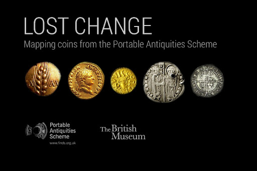
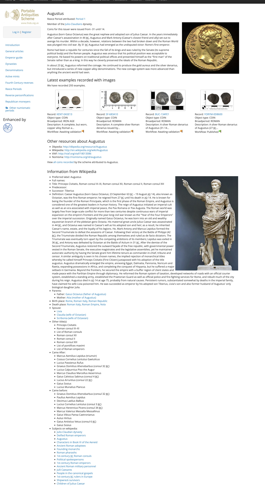
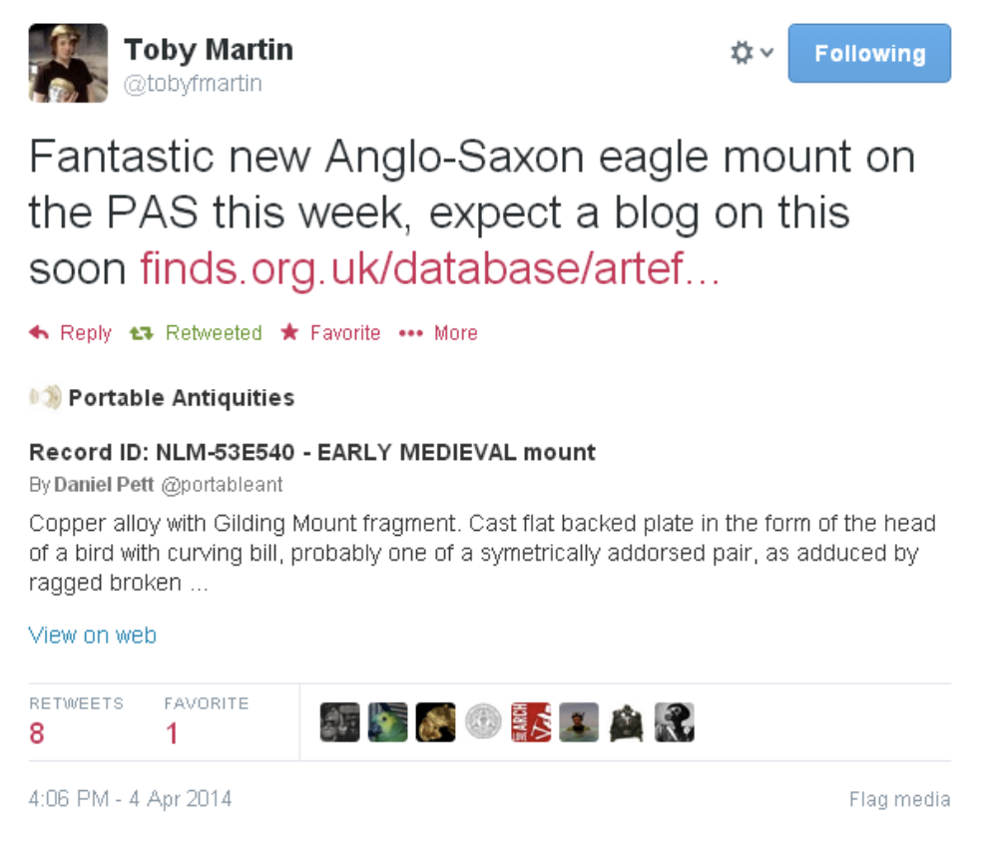

---
title: "Portable Antiquities on the Web"
section: papers
date: 2014-04-15
slug: /papers/portable-antiquities-on-the-web
keywords: 
  - portable antiquities
  - digital archaeology
  - web development
  - public engagement
  - social media
citation: "Pett, D.E.J. (2014) Portable Antiquities on the Web, in Digital Public Archaeology, pp. 45-62"
authors:
 - Daniel Pett (Portable Antiquities Scheme, British Museum)
featuredImg: ../images/papers/portable-antiquities/lost.jpg 
background: ../images/2014/04/1397496529473.jpg
geo_lat: 51.51897
geo_lon: -0.1265
tags:
- digital archaeology
- portable antiquities
- web development
- public engagement
- social media
- linked open data
--- 

This text is released under a [CC BY 4.0 license](http://creativecommons.org/licenses/by/4.0/).

## Abstract

This paper examines the development and impact of the Portable Antiquities Scheme's web presence over more than a decade of operation. The PAS website has evolved from a simple database interface to a sophisticated platform employing cutting-edge technologies including linked open data, visualization tools, and social media integration. With over half a million unique visitors annually, the site reaches an audience fifty times larger than its core contributor base, demonstrating the transformative potential of digital technologies for archaeological outreach and research.

_Subjects:_ [Digital archaeology](http://id.loc.gov/authorities/subjects/sh2009003919), [Public archaeology](http://id.loc.gov/authorities/subjects/sh2002009430), [Web development](http://id.loc.gov/authorities/subjects/sh96002202)

_Keywords:_ [portable antiquities](http://en.wikipedia.org/wiki/Portable_Antiquities_Scheme), [digital archaeology](http://en.wikipedia.org/wiki/Digital_archaeology), [web development](http://en.wikipedia.org/wiki/Web_development), [public engagement](http://en.wikipedia.org/wiki/Public_engagement), [social media](http://en.wikipedia.org/wiki/Social_media), [linked open data](http://en.wikipedia.org/wiki/Linked_data)

## Portable Antiquities on the Web

The PAS website has been online now for over a decade and has been delivering data dynamically to the public since 2003 via its database (Pett 2010). Since 2007, this dissemination platform has been developed entirely in-house and allows an agile deployment of a high-technology environment for people to research discoveries of 'portable antiquities'. This system has been recognised internationally as an exemplar for the recording of archaeological data and is now employing new techniques for enabling research; for example the production and consumption of linked open data (Gruber et al: 2013) to enrich numismatic records and through the visualisation of coin finds (Pett: 2014) as shown in figure 1.

The PAS website has seen substantial usage during the last decade, with the last couple of years seeing over ½ million unique visitors to all PAS web resources. This total, whilst in the greater picture, is a small detail, this figure is significant as the PAS' contributor base is estimated at around 10,000 metal detector users. Ergo, the PAS online presence is now reaching an audience 50 times its constituent base. The material that the PAS site disseminates is reaching a worldwide, mass audience and bringing best practice and freely available data to places that traditional means would not have reached.

## Innovation

The PAS strives to innovate within the archaeological sector; the database is consistently cited as the largest archaeological small finds database in existence (at the time of writing this section over 942,000 objects have been recorded). In early 2014, the PAS, in conjunction with University College London, will be releasing over 30,000 index cards that document the British Bronze Age index, via a crowd-sourcing platform developed using open source technology. The public will be invited to assist with the transcription of these cards and the resulting information will be integrated into the PAS database and British Museum Collection Online to create a single corpus of Bronze Age material that will enable large scale research to be co-produced.

The reach of PAS on the web has been further supplemented with dissemination of our data (licensed under a Creative Commons By-Attribution Share-Alike licence) into mass consumer platforms such as Wikipedia or the WikiCommons. Articles such as the Crosby Garrett helmet and the Frome hoard pages have been enhanced by information that can be traced directly back to the PAS.

The PAS site has developed large sections for the teaching of Numismatics to a non-specialist audience, and this area is proving to be an area with rich development potential. As a partner in the Nomisma project (with the American Numismatic Society and Deutsches Archäologisches Institut amongst others), the PAS site is now supplementing its coin guides with a wide array of resources (some multi-lingual), through the use of Linked Open Data (Pett 2014b). Many examples of this can be seen within the coin guide pages, for instance the page documenting the Emperor Augustus as shown in figure 2 below. Within this page, extra information has been integrated from dbPedia, for example enrichment has been provided by simple reuse of biographical details and dates, places and events all produced from a series of requests to external resources.

 

## Impact of Social Media

The PAS has actively developed a social media presence, maintaining identities on the mainstream platforms such as Flickr which was used to great effect for dissemination of the Staffordshire hoard images in 2009 (Pett 2008, Pitts 2009), Facebook and Twitter. Producing output for these media is relatively straightforward and a strategy has been implemented in line with the British Museum's general approach to the use of social media (Pett 2012.) Whilst follower numbers are relatively small, they are growing at a reasonable rate and reflect the limited time devoted to this facet of PAS engagement. 

Richardson's forthcoming PhD thesis (2014) examines the phenomenon of social media usage in the archaeological sector and demonstrated that it is having a relatively small impact upon the public's view of the discipline. However, the PAS is now receiving a reasonable volume of referrals via these platforms, and this will no doubt increase as people start to share more information in this way. An example of sharing PAS database links is given below in figure 3, with researcher Toby Martin sharing an exciting Anglo-Saxon find. However, critical analyses of public engagement methods using social media in archaeology are now forthcoming (for example see Richardson 2013 and 2014) as this new paradigm transitions towards ubiquity. 

Social media are not a panacea for archaeological organisations; they are an interface to their daily activity and need constant curation to maintain interest and presence. The PAS has tried to allow multi-vocality to be present amongst its audiences, for example through conversation on social media platforms, through allowing comments to be entered on finds records and through the unsuccessful implementation of a forum (sadly discontinued due to disruption and moderation burden.)

## The Future

The PAS web presence is constantly evolving; we try to stay on the edge of technological innovation and this drives our delivery of archaeological data to the public. A recently conducted survey that will inform a Heritage Lottery Fund bid has shown that many respondents requested a mobile device application to be constructed. This is one area which the PAS could develop in the future, but our data can also contribute to third party developed applications easily. The window of opportunity to the digital super highway that Schadla-Hall referred to back in 1996 is still there. We're ready and have been for a while.

## Conclusion

The evolution of the Portable Antiquities Scheme's web presence over the past decade demonstrates the transformative potential of digital technologies for archaeological practice and public engagement. From its origins as a simple database interface, the PAS website has become a sophisticated platform that not only serves its core community of metal detectorists but reaches a global audience of researchers, educators, and interested members of the public.

The integration of cutting-edge technologies such as linked open data, visualization tools, and social media platforms has enhanced both the accessibility and research potential of the archaeological record. The success of initiatives like the Lost Change application and the integration of multilingual resources through the Nomisma project illustrate how archaeological data can be enriched and made more discoverable through collaborative approaches to digital heritage.

As we look to the future, the challenge for the PAS and similar projects will be to maintain this innovative edge while ensuring the sustainability and long-term accessibility of the digital resources we create. The window of opportunity that Schadla-Hall identified in 1996 remains open, and the archaeological community must continue to embrace the possibilities that digital technologies offer for advancing both scholarship and public understanding of our shared heritage.

## Bibliography

* Gruber, E., Heath, S., Meadows, A., Pett, D., Tolle, K., and Wigg-Wolf, D. 2013. "Semantic Web Technologies Applied to Numismatic Collections" in Earl, G., Sly, T., Chrysanthi, A., Murrieta-Flores, P., Papadopoulos, C., Romanowska, I. and Wheatley, D. (2013) "Archaeology in the Digital Era. Papers from the 40th Annual Conference of Computer Applications and Quantitative Methods in Archaeology (CAA), Southampton, 26-29 March 2012" Amsterdam: Amsterdam University Press

* Pett, D.E.J. 2014a. "Lost Change: Mapping coins from the Portable Antiquities Scheme." Available at: http://blog.britishmuseum.org/2014/02/19/lost-change-mapping-coins-from-the-portable-antiquities-scheme/ (accessed 4th April 2014)

* Pett, D.E.J. 2012. "Use of Social Media within the British Museum and Museum Sector" in Bonacchi, C. (ed) (2012) "Archaeologists and Digital Communication: Towards Strategies of Public Engagement" London: Archetype

* Pett, D.E.J. 2010. "The Portable Antiquities Scheme's Database: its development for research since 1998." In "A Decade of Discovery: Proceedings of the Portable Antiquities Scheme Conference 2007", Worrell, S., Egan, G., Leahy, K., Naylor, J., & Lewis M. (eds.) pp 1-18. London: David Brown Book Company. Available at: https://docs.google.com/file/d/0B1zHuVdu5LYnYWUyMmQ0NTctOGI5Mi00NjY3LTg2MTQtNjdmMDFjNTdhNmRj/edit?usp=docslist_api&authkey=CKOk8tUE (accessed 4th October 2013.)

* Pett, D.E.J. 2014b. "Linking Portable Antiquities to a Wider Web." in Elliott, T., Heath, S., and Muccigrosso, J. (2014). "Current Practice in Linked Open Data for the Ancient World." New York: ISAW Papers, 7. Available at http://dlib.nyu.edu/awdl/isaw/isaw-papers/7

* Richardson, L. 2013. "A Digital Public Archaeology?" Papers from the Institute of Archaeology 23(1):10, DOI: http://dx.doi.org/10.5334/pia.431

* Richardson, L. 2014. "Public archaeology in a digital age" Unpublished PhD thesis.

* Schadla-Hall, T. (1996). What are we groping for? MDA Information, 2(4).

  
This work is licensed under a [Creative Commons Attribution 4.0 International License](http://creativecommons.org/licenses/by/4.0/).