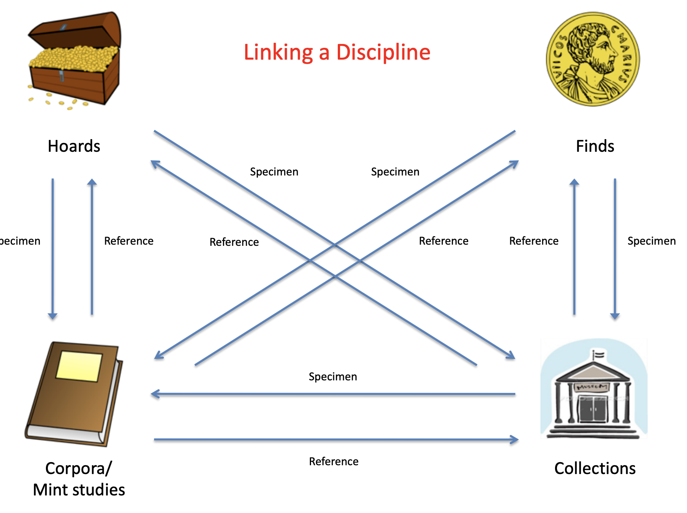
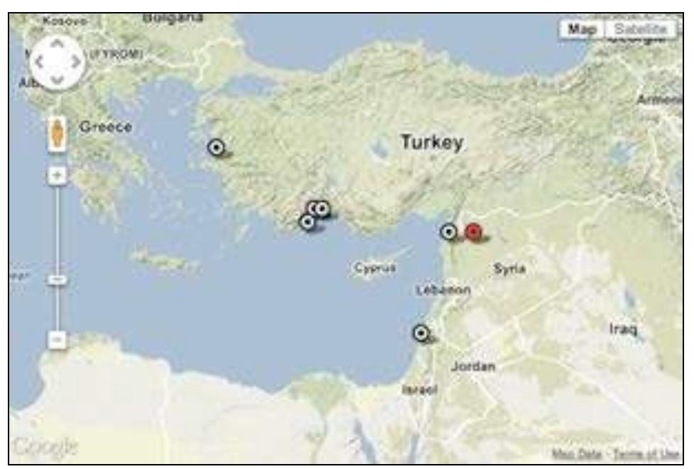
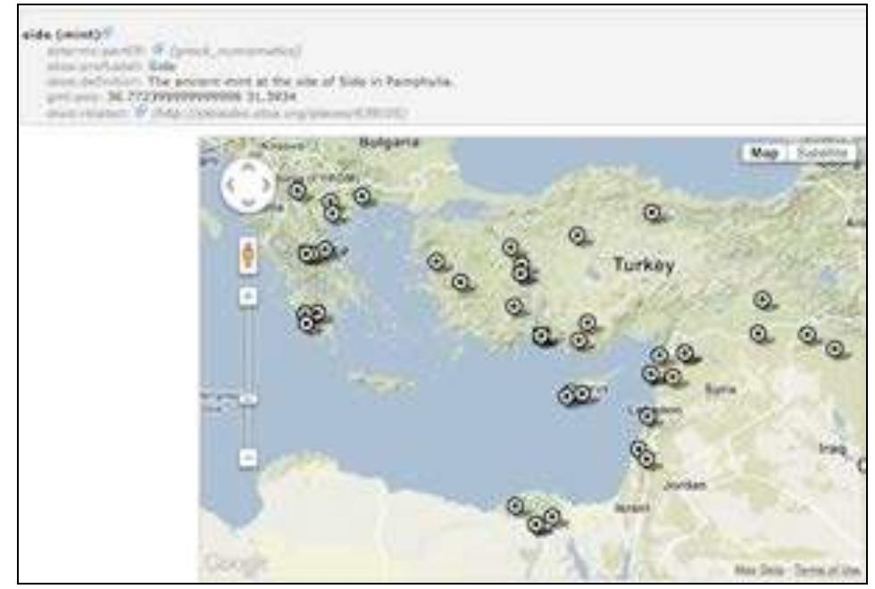
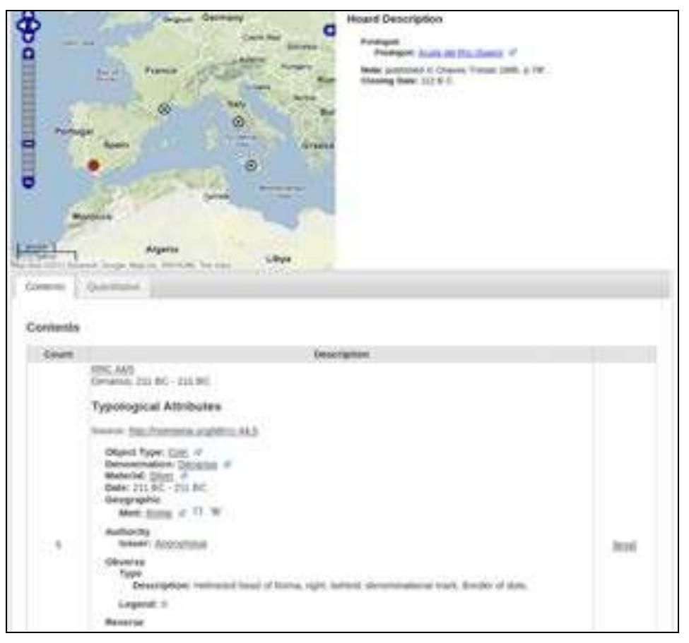
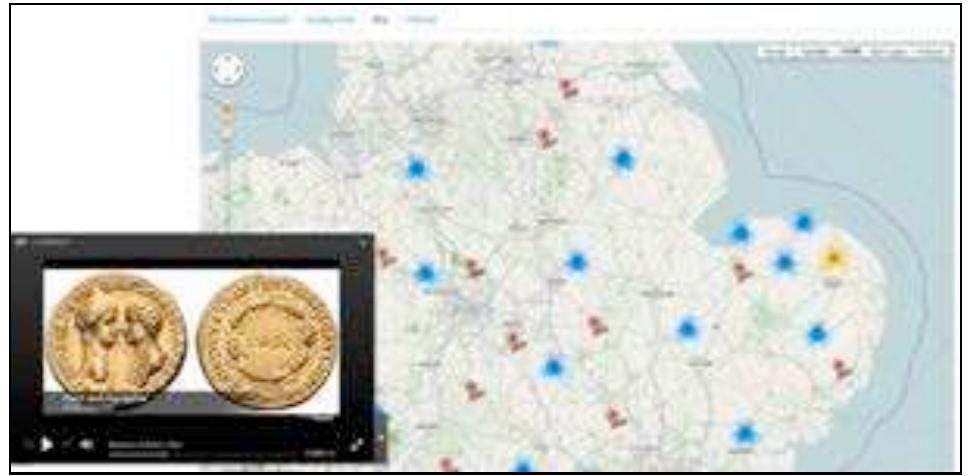

---
title: "Semantic Web Technologies Applied to Numismatic Collections"
section: papers
date: 2012-03-30
slug: /papers/semantic-web-technologies-applied-to-numismatic-collections
keywords: 
  - numismatics
  - semantic web
  - linked data
  - nomisma
citation: "Gruber, E., Heath, S., Meadows, A., Pett, D., Tolle, K., & Wigg-Wolf, D. (2012) Semantic Web Technologies Applied to Numismatic Collections, CAA2012 Proceedings of the 40th Conference in Computer Applications and Quantitative Methods in Archaeology, Southampton, United Kingdom, 26-30 March 2012"
authors:
 - Ethan Gruber (American Numismatic Society)
 - Sebastian Heath (New York University)
 - Andrew Meadows (American Numismatic Society)
 - Daniel Pett (Portable Antiquities Scheme, British Museum)
 - Karsten Tolle (University of Frankfurt)
 - David Wigg-Wolf (Römisch-Germanische Kommission)
featuredImg: ../images/papers/semantic-numsimatics/DSC_112.JPG
background: ../images/papers/semantic-numismatics/CSC_0156.JPG
lat: 50.9097
lon: -1.4044
tags:
- numismatics
- semantic web
- linked data
- nomisma
- digital humanities
- archaeology
--- 

This text is released under a [CC BY 4.0 license](http://creativecommons.org/licenses/by/4.0/).

## Abstract

This paper discusses Nomisma.org, a collaborative effort to define numismatic concepts within the linked open data environment. Nomisma.org, created in 2010, defines thousands of concepts, represented by XHTML+RDFa available at stable URIs. The paper also includes test cases for the integration of Nomisma.org URIs into the application architectures at three organisations: why the institutions chose to adopt these concepts and what can be gained by their integration.

_Subjects:_ [Numismatics](http://id.loc.gov/authorities/subjects/sh85093231), [Computer applications](http://id.loc.gov/authorities/subjects/sh85029494), [Archaeology--Data processing](http://id.loc.gov/authorities/subjects/sh85006508)

_Keywords:_ [numismatics](http://en.wikipedia.org/wiki/Numismatics), [semantic web](http://en.wikipedia.org/wiki/Semantic_Web), [linked data](http://en.wikipedia.org/wiki/Linked_data), [ontology](http://en.wikipedia.org/wiki/Ontology_(information_science)), [digital humanities](http://en.wikipedia.org/wiki/Digital_humanities), [archaeology](http://en.wikipedia.org/wiki/Archaeology)

## 1. Introduction: Why numismatics?

Numismatics and the projects undertaken by its practitioners provide a near perfect illustration of the potential for a Linked Data approach to transform, simplify and enhance workflows and outputs. The basic activities undertaken by numismatists may be broken down into four main types:

* Hoard Studies: Hoards are groups of coins buried together in antiquity, and offer the ability to assess relative chronologies of coins, as well as to analyse patterns of coins circulation.
* Individual finds: The finds of individual coins in controlled excavation can often be diagnostic for dating archaeological contexts. Coin finds, whether in controlled excavation or not, can also contribute to a broad analysis of economic activity across time and space
* Collection catalogues: The major public coin collections in the US and Europe alone contain more than a million specimens of ancient coinage, each of which must be described for collection management and educational purposes. Such coins often bear provenance information, which may link them back to a hoard or individual findspot.
* Type Corpora and studies: The basic work of defining coinage through the creation of taxonomies for different series of coinage provides a standard reference system for the cataloguing of coins in all contexts. The establishment of such taxonomies relies, however, on the assembly and description of vast data sets, from collections, hoards and individual finds.

Between these four ‘pillars’ of numismatics there exist a series of functional links that may straightforwardly be described within a Linked Data environment. (Figure 1) 



The ability to link and query large bodies of data holds out significant potential for the publishers of catalogues of material to simplify the task they face. But it also offers the possibility to collection managers and publishers to make their material more visible to the taxonomic projects that rely on the accumulation of data and which provide structure to the discipline. Furthermore, the application of Linked Data principles from numismatic material beyond the field of numismatics to other resources in the fields, for example, of geography, prosopography or iconography, allows the incorporation of numismatic material into far broader fields of inquiry.

## 2. Nomisma.org

Nomisma.org, hosted by the American Numismatic Society since 2010, is an effort to publish disciplinary-specific and stable http-based URIs for numismatic concepts so as to promote interoperability between numismatic collections and projects as well as links to and from other fields of study. 

While this paper shows that Nomisma.org is an “up and running” project, it does remain very much under development in terms of what it includes and what are the best approaches to ensure widespread adoption within the field of numismatics. That said, its current manifestation is deeply informed by the both the explicit principles and implied best practices of “Linked Data” (Berners-Lee 2006). 

In particular, Nomisma.org publishes semantically clear URIs, intends that those URIs are permanent, provides access to both human readable and automatically-parsable versions of each RDF resource, and also provides access to a single Creative Commons licensed download describing the entire vocabulary. To distill that sentence down to its essence, Nomisma.org promotes permanence for numismatic concepts and the availability of reusable data when the URIs for those concepts are dereferenced.

But with that slightly technical introduction set out, it is worth discussing why such a set of stable URIs is useful in the first place. As a discipline, numismatics has a long history during which it has developed a set of terms that have demonstrated their worth for describing coins and other related monetary items. For the purposes of this paper, a coin can be defined as any object - usually metal, small and round - struck by an official entity to a standard weight and appearance in order to facilitate payment in the context of economic transactions.

It is likely that all readers know what coins are and that their experiential definition is sufficient in this context. What may be surprising is that the same set of terms is useful in describing all coins from the 7th century BC onwards as produced by many historical and contemporary states and cultures around the world. In general, coins have an obverse and a reverse - “heads” and “tails” in common parlance. Accordingly, Nomisma.org defines the URIs ```http://nomisma.org/id/obverse``` and ```http://nomisma.org/id/reverse```. The writing on a coin is of particular interest and “legend” is the long standing term-of-art meaning all words, whether abbreviated or not, found on a coin so that ```http://nomism.org/id/legend``` allows that information to be clearly marked. More specialized terms include ‘axis’, which is the angular relationship between the obverse and reverse of a coin. Most modern coins have an axis of 6 because the reverse image is upside down in relation to the obverse portrait. The URI ```http://nomisma.org/id/axis``` can be used to capture this concept.

The terms introduced above are useful for describing coins, that is individual numismatic items. Nomisma.org also defines more abstract concepts that appear in the field. A hoard is a group of coins concealed together, often with the intention of later retrieval. Ideally, the findspot of a hoard is known, its date of deposit is determined by the date of the latest coin within it, and the origins of all its coins indicate a network of economic interaction. In order to express this set of concepts and relationships using http-based URIs, Nomisma first establishes the URI nm:hoard to indicate that a resource describes such a group of coins. ```http://nomisma.org/id/igch1546``` is the URI for a descriptions of a hoard itself, in this case as described in the standard reference work An Inventory of Greek Coin Hoards (IGCH) (Thompson et al. 1973). 

Within that hoard, each mint - here meaning the ancient city responsible for the coin’s production - is marked by a URI pointing to the description of that city. While further information is indicated, establishing the relationship between a hoard and the mints represented in it is sufficient both to make a map of the hoard, and also, for each mint, to make a map of those hoards containing its coins (Figures 2 & 3). 





Such mapping relies on knowing the latitude and longitude for each hoard as well as for each mint; information that Nomisma.org supplies for such resource types. Descriptions of the hoards in IGCH were among the first resources added to Nomisma.org and it is likely that the markup for this class of resource will be further developed in response to the work of the Coin Hoards of the Roman Republic project described below.

It is important that the format used to describe each resource is XHTML+RDFa 1.1. “RDFa” - or RDF in attributes - is a format for embedding RDF in xml based documents such as XHTML. (McCarren 2012) “RDF” in turn is the “Resource Description Format”, which has as its underlying data model tri-partite statements known as “triples”. A triple is formed by a subject, predicate and object. An example is:
 
```bash
nm:athens <http://www.w3.org/2003/01/geo/wgs84_pos#lat_long> “37.974722 23.7225”
```

While a full introduction to RDF is beyond the scope of this paper, some focus on the choice of RDFa is relevant. Nomisma.org adopted XHTML+RDFa as its base representation because it allows a single representation to be both human and machine readable. RDFa is a W3C endorsed standard with excellent tooling support. Accordingly, it is possible to confirm that the information Nomisma.org intends to record for each resource it defines is actually parsable by third parties. The same applies to the choice of XHTML. In the context of Nomisma.org, XHTML also stands as a W3C-supported standard with excellent support. Of course, the primary tool for accessing XHTML is the browser, which is essentially ubiquitous in today’s computing environment. Accordingly, it is likely that the combination of XHTML and RDFa will mean that Nomisma.org’s definitions of numismatic concepts are readily usable both now and far into the future.

```xml
 <?xml version="1.0" encoding="utf-8"?><rdf:RDF xmlns:rdf="http://www.w3.org/1999/02/22-rdf-syntax-ns#"
         xmlns:geo="http://www.w3.org/2003/01/geo/wgs84_pos#"
         xmlns:wordnet="http://ontologi.es/WordNet/class/"
         xmlns:nm="http://nomisma.org/id/"
         xmlns:crmdig="http://www.ics.forth.gr/isl/CRMdig/"
         xmlns:nmo="http://nomisma.org/ontology#"
         xmlns:org="http://www.w3.org/ns/org#"
         xmlns:osgeo="http://data.ordnancesurvey.co.uk/ontology/geometry/"
         xmlns:prov="http://www.w3.org/ns/prov#"
         xmlns:rdac="http://www.rdaregistry.info/Elements/c/"
         xmlns:bio="http://purl.org/vocab/bio/0.1/"
         xmlns:rdfs="http://www.w3.org/2000/01/rdf-schema#"
         xmlns:crm="http://www.cidoc-crm.org/cidoc-crm/"
         xmlns:skos="http://www.w3.org/2004/02/skos/core#"
         xmlns:dcterms="http://purl.org/dc/terms/"
         xmlns:un="http://www.owl-ontologies.com/Ontology1181490123.owl#"
         xmlns:foaf="http://xmlns.com/foaf/0.1/"
         xmlns:xsd="http://www.w3.org/2001/XMLSchema#">
   <foaf:Person rdf:about="http://nomisma.org/id/nero">
        <skos:definition xml:lang="en">Nero was Roman Emperor from 54 to 68, and the last in the Julio-Claudian dynasty. Nero was adopted by his great-uncle Claudius to become his heir and successor, and like him, became emperor with the consent of the praetorian guard.</skos:definition>
        <rdf:type rdf:resource="http://www.w3.org/2004/02/skos/core#Concept"/>
        <skos:prefLabel xml:lang="en">Nero</skos:prefLabel>
        <skos:exactMatch rdf:resource="http://dbpedia.org/resource/Nero"/>
        <skos:exactMatch rdf:resource="http://viaf.org/viaf/84036175"/>
        <skos:prefLabel xml:lang="de">Nero</skos:prefLabel>
        <skos:prefLabel xml:lang="fr">Néron</skos:prefLabel>
        <skos:prefLabel xml:lang="ro">Nero</skos:prefLabel>
        <skos:prefLabel xml:lang="ru">Нерон</skos:prefLabel>
        <skos:prefLabel xml:lang="nl">Nero</skos:prefLabel>
        <skos:prefLabel xml:lang="it">Nerone</skos:prefLabel>
        <skos:prefLabel xml:lang="el">Νέρων</skos:prefLabel>
        <skos:prefLabel xml:lang="uk">Нерон</skos:prefLabel>
        <skos:prefLabel xml:lang="ca">Neró</skos:prefLabel>
        <skos:prefLabel xml:lang="cs">Nero</skos:prefLabel>
        <skos:prefLabel xml:lang="zh">尼禄</skos:prefLabel>
        <skos:prefLabel xml:lang="vi">Nero</skos:prefLabel>
        <skos:prefLabel xml:lang="ja">ネロ</skos:prefLabel>
        <skos:prefLabel xml:lang="sv">Nero</skos:prefLabel>
        <skos:prefLabel xml:lang="es">Nerón</skos:prefLabel>
        <skos:prefLabel xml:lang="hu">Nero római császár</skos:prefLabel>
        <skos:prefLabel xml:lang="pt">Nero</skos:prefLabel>
        <skos:prefLabel xml:lang="fi">Nero</skos:prefLabel>
        <skos:prefLabel xml:lang="no">Nero</skos:prefLabel>
        <skos:prefLabel xml:lang="ko">네로</skos:prefLabel>
        <skos:prefLabel xml:lang="pl">Neron</skos:prefLabel>
        <dcterms:isPartOf rdf:resource="http://nomisma.org/id/roman_numismatics"/>
        <dcterms:isPartOf rdf:resource="http://nomisma.org/id/greek_numismatics"/>
        <dcterms:isPartOf rdf:resource="http://nomisma.org/id/roman_provincial_numismatics"/>
        <skos:prefLabel xml:lang="bg">Нерон</skos:prefLabel>
      
        <skos:prefLabel xml:lang="da">Nero</skos:prefLabel>
        <skos:prefLabel xml:lang="tr">Nero</skos:prefLabel>
        <skos:inScheme rdf:resource="http://nomisma.org/id/"/>
        <skos:changeNote rdf:resource="http://nomisma.org/id/nero#provenance"/>
        <skos:exactMatch rdf:resource="https://ikmk.smb.museum/ndp/person/1217"/>
        <bio:birth rdf:resource="http://nomisma.org/id/nero#birth"/>
        <bio:death rdf:resource="http://nomisma.org/id/nero#death"/>
        <org:memberOf rdf:resource="http://nomisma.org/id/julio-claudian_dynasty"/>
        <org:hasMembership rdf:resource="http://nomisma.org/id/nero#membership_e6acaf0a1cab55cfcd08b3a9b977ff29"/>
    </foaf:Person>
   
   <dcterms:ProvenanceStatement rdf:about="http://nomisma.org/id/nero#provenance">
        <foaf:topic rdf:resource="http://nomisma.org/id/nero"/>
        <prov:wasGeneratedBy>
            <prov:Activity>
                <rdf:type rdf:resource="http://www.w3.org/ns/prov#Create"/>
                <prov:atTime rdf:datatype="http://www.w3.org/2001/XMLSchema#dateTime">2012-10-28T21:43:36+00:00</prov:atTime>
                <prov:wasAssociatedWith rdf:resource="http://nomisma.org/editor/ameadows"/>
                <prov:wasAssociatedWith rdf:resource="http://nomisma.org/editor/sfsheath"/>
                <dcterms:description xml:lang="en">This is among the original Nomisma XHTML+RDFa fragments, most likely created between 2010-2012 by Sebastian Heath and/or Andy Meadows.</dcterms:description>
                <dcterms:type>manual</dcterms:type>
            </prov:Activity>
        </prov:wasGeneratedBy>
        <prov:activity>
            <prov:Activity>
                <rdf:type rdf:resource="http://www.w3.org/ns/prov#Modify"/>
                <prov:atTime rdf:datatype="http://www.w3.org/2001/XMLSchema#dateTime">2017-04-28T19:10:55+00:00</prov:atTime>
                <dcterms:type>manual</dcterms:type>
            </prov:Activity>
        </prov:activity>
        <prov:activity>
            <prov:Activity>
                <rdf:type rdf:resource="http://www.w3.org/ns/prov#Modify"/>
					           <prov:atTime rdf:datatype="http://www.w3.org/2001/XMLSchema#dateTime">2024-04-19T18:12:48.4Z</prov:atTime>
					           <prov:wasAssociatedWith rdf:resource="http://nomisma.org/editor/egruber"/>
					           <prov:used rdf:resource="https://docs.google.com/spreadsheets/d/1FR4b2FwhLr70McADQw76B3vCj7lMOoQISBJsgpDTTRU/pubhtml"/>
					           <dcterms:type>spreadsheet</dcterms:type>
				        </prov:Activity>
        </prov:activity>
    </dcterms:ProvenanceStatement>
    <bio:Birth rdf:about="http://nomisma.org/id/nero#birth">
        <dcterms:date rdf:datatype="http://www.w3.org/2001/XMLSchema#date">0037-12-15</dcterms:date>
    </bio:Birth>
    <bio:Death rdf:about="http://nomisma.org/id/nero#death">
        <dcterms:date rdf:datatype="http://www.w3.org/2001/XMLSchema#date">0068-06-09</dcterms:date>
    </bio:Death>
    <org:Membership rdf:about="http://nomisma.org/id/nero#membership_e6acaf0a1cab55cfcd08b3a9b977ff29">
        <foaf:topic rdf:resource="http://nomisma.org/id/nero"/>
        <org:role rdf:resource="http://nomisma.org/id/roman_emperor"/>
        <org:organization rdf:resource="http://nomisma.org/id/roman_empire"/>
        <nmo:hasStartDate rdf:datatype="http://www.w3.org/2001/XMLSchema#gYear">0054</nmo:hasStartDate>
        <nmo:hasEndDate rdf:datatype="http://www.w3.org/2001/XMLSchema#gYear">0068</nmo:hasEndDate>
    </org:Membership>
</rdf:RDF>
```
**Figure 4. Nomisma RDF.** 

As noted in the first paragraph of this section, Nomisma.org is in the early stages of establishing stable URIs for numismatic resources. Nonetheless, both within the context of Nomisma.org itself and by third-party initiative, patterns of usage for Nomisma.org URIs are emerging. Within Nomisma.org, the description of coins types, such as those based on the reference works Roman Republican Coinage (Crawford 1974) and Roman Imperial Coinage best demonstrate how URIs can be used in constructing descriptions of well-known coins. 

```http://nomisma.org/id/rrc-525.4a``` is a coin type within the RRC series. The RDF embedded in this resource is shown in figure 3. Note that where possible, the RDF refers to other Nomisma.org URIs. Furthermore, if one were to dereference the URI for the mint of this coin type, in this case nm:rome, one would find a further reference to the URI to the Wikipedia page for _“Ancient_Rome”_ and to the identifier of this site within the Pleiades Project. Pleiades is an NEH-funded project to assign identifier to places relevant to the study of ancient geography. By providing links from coin types to Pleiades IDs, Nomisma.org enables interoperability with projects that lie outside the scope of numismatics. The following sections of this paper demonstrate current third-party uses of Nomisma.org URIs.

## 3. Early Steps Toward Nomisma Integration

Nomisma.org is now two years old, but it has been gaining traction within the numismatic community over the previous six to eight months, beginning with a meeting held at the British Museum October 2011. In this meeting, the European Coin Find Network and Portable Antiquities Scheme committed to collaborating with the American Numismatic Society to associate their records with nomisma URIs as an early step to exposing their data to the wider linked data universe. This section of the paper details the processes undertaken by the three organizations to incorporate nomisma into their application architecture.

### 3.1 Current Work at the European Coin Find Network

In a joint project, Databases and Information Systems (DBIS) and the Römisch-Germanische Kommission (RGK) are investigating the logical integration of different European coin find databases using ontologies. The two main benefits of ontologies in our view are: 

a. problems are lifted to a content level and are not additionally hindered by technical issues, and   
b. ontologies provide the possibility of viewing data from a new perspective – the links between the artefacts can be visualized and are not hidden in flat tables.

In an earlier pilot project, InterFACE (Internet Portal: Finds of Ancient Coins in Europe), involving DBIS and the Mainz Academy, a meta-portal was set up containing an integration layer based on a global ontology to access three online databases in Frankfurt (NUMIDAT-WEB), Utrecht (NUMIS) and Vienna (dFMRÖ)[^1]. Queries were defined via a Web front-end. These queries were based on a global ontology and then translated to corresponding SQL statements for the different databases.

Mapping between the databases and the global ontology of the meta-portal’s integration layer was not done directly, but by means of a kind of mediator ontology – similar to the data model of the individual databases – which was first defined for each of the sources. This turned out to be a particularly efficient method.

In a next step the lessons learned are to be applied to a meta-portal for the European Coin Find Network (ECFN), again accessing databases of coin finds, but also incorporating aspects of nomisma.org. There are several levels and ways in which nomisma can be employed: in the individual source databases, in the integration layer of the meta-portal, or in the results.

Within the InterFACE project the relational databases being accessed had been designed with extremely different modelling principles – in one case all information was stored in one large table – while other databases had a high degree of normalization. These modelling principles also have an impact on the data quality of the individual databases. One large table which does not have the benefit of referential integrity can result in various entries for the same thing, e.g. by a typing or import error. The result might be conflicting entries for material such as: 

a. “silver”. 
b. “ar” – Latin argentum, abbreviated, or  
c. “silver” 

the result of a typing error. Introducing nomisma-IDs (the ID for silver is: ```http://nomisma.org/id/ar```) to the source databases automatically would solve this problem by providing external referential integrity.

However, our current main concern is that of mapping between different relational database sources. Besides the quality problem of the individual databases, there are also language problems, e.g. “silver” (English) vs “Silber” (German). Nomisma-IDs can act here as a lingua franca, since both point to the same ID. This can simplify the mapping and should facilitate the use of partially automatic mapping processes.

Finally, the results from the meta-portal can be enriched by using nomisma-IDs to include information drawn from nomisma or linked resources that was previously not included within the databases connected to the meta-portal. To stick to the example of silver; it would be possible to use the nomisma-ID in order to access the information that “Argentum” is an alternative label for silver, and “AR” is its abbreviation in nomisma.org. Beyond this we could learn that it is classified as a material.

An additional long term benefit would be that reasoners could scan all of this ontological information. Based on defined rules, they could then be used to search for potential errors revealed by objections, thus increasing data quality, or to find new deductions that had not been apparent before.

However, for the time being the focus will be on setting up a meta-portal for ECFN. Within this portal nomisma-IDs will be used for the internal ontology, and we will experiment with them to see how to simplify and optimize the process of mapping different databases, and how to support this with various tools. For example, DBIS developed a tool to this purpose, Integration with Ontologies (IwOnto)[^2]. IwOnto allows mapping a relational database to an existing ontology and to export database instances within the ontology. In this way IwOnto can be used to exchange data between databases to perform their physical integration. The resulting ontology containing the instances can also be used by Semantic Web tools such as reasoners, or to visualize data in a more sophisticated manner, e.g. using the Protegé plugin [Jambalaya](http://www.thechiselgroup.org/jambalaya).

### 3.2 Nomisma.org and the American Numismatic Society: Two Test Cases

Nomisma.org is the cornerstone for all current and future projects at the American Numismatic Society. The role of nomisma in the ANS project, Online Coinage of the Roman Empire (OCRE), was presented at CAA 2012 with the paper “Linking Roman Coins: Current Work at the American Numismatic Society.” OCRE was neither the first, nor will it be the last ANS project to assimilate nomisma concepts into its core architecture. This section of the paper will illustrate two test cases of the incorporation of nomisma URIs to facilitate interlinking. One project is Mantis, the ANS's [newest public collection interface](http://numismatics.org/search/); the other is a catalogue of Roman Republican Coin Hoards. Both of these projects are built on top of the Numishare framework, an open-source numismatic collection management system, which is discussed in greater detail in the aforementioned paper.

#### Mantis

The American Numismatic Society first endeavored to integrate nomisma URIs into Mantis in the beta-testing phase of the project prior to its official release in April, 2011. As of June 2012, only URIs for mints are attached to coins, which are primarily of Greek, Roman, and Byzantine origin. Linking coins to mints enables the ingestion of geographic coordinates provided by the nomisma RDF into Mantis' search index for mapping applications. Objects in Mantis will eventually link to nomisma for other numismatic concepts, but this process of integration is gradual and related directly to the curation and standardisation of data within the ANS's collection management database.

The digitisation of the ANS collection began [[insert brief history of DOS-Filemaker transition]]. Over this period, many curators and interns have made contributions to the database, although there was little adherence to controlled vocabulary or enforcement of quality control until very recently. Furthermore, encoding practices varied from department to department, which is to say, identical database fields may have held different semantic meanings to different departments within the Society. This can be best illustrated with the database's three geographic fields: mint, region, and locality. An American coin may use mint: Philadelphia, locality: Pennsylvania, region: United States. A Greek coin from Olynthus (mint), Macedon (region), Chalcidian League (locality). While the mint field typically captures the coin's city of origin across all departments, the use of region and locality differ. In ancient coins, regions are purely geographic, but the field is used to capture the name of the nation-state in more modern specimens. Locality is intended to be a hierarchical child of region. The Chalcidian League is an authority responsible for the production and distribution of coins, not a geographical identifier. Hence, the shortcomings of the current database framework are readily apparent.

To facilitate the linkages between the ANS collection and nomisma.org upon publication of the Filemaker data into Mantis, a “lookup table” was created in a Google Spreadsheet. This spreadsheet contains columns for mint, region, and locality from Filemaker and a reference to the nomisma URI for each particular combination of fields. This enables coins encoded with differing mint labels of “Antioch” and “Antiocheia” to be linked to ```http://nomisma.org/id/antiocheia_syria```. Similar lookup tables can be created to regularise other types of numismatic concepts in Mantis and will provide the capacity to migrate from Filemaker into a framework that supports more sophisticated controlled vocabulary integration at some point in the future. While Mantis supports querying by nomisma and Pleiades URIs for mints, the ultimate goal is to enable the ANS collection to be queried among other collections, regardless of language, by linking objects even more closely to nomisma, as well as other authority services such as Geonames.org and the Virtual International Authority File (VIAF.org). The Filemaker regularisation may require several years' effort, but the benefit is enormous to the broader numismatic community.

#### Roman Republican Coin Hoards

As discussed earlier in this paper, nomisma.org provides stable URIs for coin types from two Roman numismatic catalogues: Roman Republican Coinage (RRC) and and Roman Imperial Coinage (RIC). If we consider this coin type metadata delivered through nomisma to be canonical representations of the information conveyed electronically about the printed reference catalogue, then we may develop tools which leverage this metadata to create an interface that allows users to interact with it.

The American Numismatic Society is currently developing a prototype for delivering coin hoard data online, focusing primarily on those of the Roman Republican era, although these methodologies can be applied to hoards of other periods. Dr. Kris Lockyear, Lecturer at the Institute of Archaeology, UCL, London, provided a Microsoft Access database of Republican hoards, which was migrated into an XML-based schema designed to accommodate the many permutations for a hoard record. Variations in descriptive practice range from the numeric totals of very generalised typologies (e. g., authority or denomination) to totals by coin type, or even references to stable URIs of physical specimens available on the Internet (which may include coins in the ANS's own collection). In this particular project, a coin hoard record includes a list or nomisma URIs for Crawford's RRC identifiers—like ```http://nomisma.org/id/rrc-100.1a``` and totals associated with a particular findspot (a modern location identified by a Geonames URI). Numishare, the publication framework for serialising these XML records into HTML (as well as KML for mapping), extracts the metadata for each coin type from the RDF to create a comprehensive display of the record as well as for quantitative analysis (Figure 5).



The quantitative analysis feature of the project is fairly rudimentary at this stage of the prototype, but will grow in sophistication over time. Interpreting a combination of numeric counts per coin type and the number of distinct typological attributes (e.g., issuers, mints, or denominations) contained within the coin type metadata record, Numishare feeds an array of values into the Highcharts Javascript library to output bar graphs of selected queries. This straightforward method of visualization is very valuable to researchers. Such charts, which once required significant expenditure of time in the pre-digital age, can be now be generated nearly-instantaneously.


Like Mantis, the Roman Republican Coin Hoard online catalogue can be queried by nomisma URI, enabling cross-collection searching. Among the most important aspects of the project is the mechanism for referencing URIs and dynamic processing of data hosted and maintained by nomisma.org. The editors of the coin hoard metadata are not burdened with the long-term maintenance of the typological data in Roman Republican Coinage; hoard XML records contain scarcely more than findspot information and a list and count of coin types associated with the hoard, and therefore duplication of data and digital curation labor is minimized. This project is a successful proof-of-concept for other, larger coin hoard recording efforts.

### 3.3 The Portable Antiquities Scheme

The British Museum’s flagship Public Archaeology project, the Portable Antiquities Scheme (PAS), faces different challenges to many of the organisations that have committed to furthering the uptake of Nomisma. The [PAS database](http://finds.org.uk/database) and recording structure has been developed for the recording of all types of singular archaeological discoveries or ‘finds’ dating to over 300 years ago, encompassing objects that range from buckles and brooches of all periods to the most prolific discovery - numismatic material. The PAS also records coin hoards under the remit of the Treasure Act (1996), and with the numismatic material mentioned above this provides a foundation upon which standardisation can be applied. 

Numismatics provides over 37% of the total objects (approximately 796,000) recorded by PAS’s 60 members of staff and an army of volunteers (see table 1 for a breakdown). These data include figures for some coin hoards (such as the magnificent Frome Hoard (Booth et al 2011 & Bland et al 2010)), but no means all. A project seeking funding at the moment from the AHRC hopes to fully catalogue and record all Roman coin hoards found in the UK and this will have a significant impact on the quantity of coins available. 

| Broad period | Quantity |
| :--- | :--- |
| Iron Age | 42,664 |
| Roman | 191,186 |
| Early Medieval | 2,727 |
| Medieval | 33,712 |
| Post Medieval | 24,702 |
| Other | 1,083 |
| **Total** | **296,074** |

**Table 1. Quantities of coins recorded on the PAS database by period.**

Since 2006, the PAS database has implemented strictly controlled vocabularies for the recording and dissemination of information about coins; for example Reece periods, issuer and mint lists, reverse types and Republican moneyers. As detailed in the section relating to the ANS, the PAS also had a period of de-normalised data entry, which has led to expensive (time) exercises to cleanse and enhance old data. It is readily apparent, that many in the numismatic community share the same technical problems, and these have readily been reinvented as more digital projects come online. Ergo, aside from the commonality of problems, this standardised numismatic material provides partners within the Nomisma consortium a solid foundation. 

Since 2003 (Pett 2010:1), these data have been surfaced for reuse, via a variety of standardised interoperable methods (OAI-PMH - see Blackburn 2005 for early examples of numismatic OAI use, Z39.50, MIDAS XML and subsequently via json, kml, atom/rss and embedded rdfa) and it is now that the potential of ‘linked data’ is being explored and developed further. These data feed into several large scale Cultural Heritage projects, for example Europeana and Culture Grid, and also to the regional Historic Environment Record. 

At the time of writing, the database is being redeveloped to allow for successful integration of Nomisma concepts and URIs as discussed above in section 2, for example numismatic material provides access to information relating to people (minted for, minted by, depicting), place (place of issue, place depicted, place of discovery) and time (date issued, date found, date commemorating). All of these entities provide a rich tableau from which they can (or will be) linked to third party resources such as dbpedia, geonames or Pleiades producing enriched (machine readable) records. Detailed maps (see figure ?) with a variety of layers, showing place of discovery and place of manufacture can be produced and ancillary data (such as podcasts and video) can be introduced to point the researchers to view extra resources. The possibilities for enrichment are manifold and will increase as more people subscribe to this development of a community of practice.



Harnessing these third party tools has led to the development of numismatic resources with stable, permanent, cool URIs (see Sauermann & & Cyganiak 2008 for further discussion) which have provided an accessible entry point for learning about numismatic material. Figure 7 below, depicts the PAS entry for Nero, displaying data resources drawn from amongst others, Nomisma, dbPedia, VIAF and the PAS database itself (for example, the latest coin records.) An aspiration for these resources, would be the possibility for linking to external numismatic collections that held coins relating to Nero - for example, the British Museum now has an RDF triple store based around an extended CIDOC-CRM schema, which if linked to Nomisma or dbPedia ontologies, would allow for the retrieval of their and others’ data. 

As detailed above, the ANS as founding member, is committed to implementing the Nomisma concept, and so one could also retrieve their data based around the a simple ‘personal’ resource - ```http://nomisma.org/id/nero``` or a combination with a ‘geographical’ resource such as ```http://pleiades.stoa.org/places/423025``` (Rome) or geonames or Yahoo! WOEIDs. Harnessing these linked resources would enrich the research potential of a digital resource immeasurably and provide cross-walking between different institutional repositories and aid resource discovery. The PAS model for developing its numismatic resources has been heavily influenced by the collaborators on this paper; aspects such as statistical analysis of coins, emulating the MANTIS model, will be introduced, SOLR search has been constructed and emulation of Heath’s RDFa travails on Nomisma is underway. The URL ```https://finds.org.uk/romancoins/emperors/emperor/id/12``` illustrates a coin page for the Emperor Nero, with reference to and integration from resources such as dbPedia, VIAF, Nomisma, Wikipedia and the internal content management system.

#### Multilingual numismatics

A challenge that has hindered the PAS’s attempts to share its numismatic database, has been language based, and it is this issue that the advent of Nomisma might solve. Services such as dbpedia, already provide multi-lingual SPARQL endpoints for querying concepts and entities and this methodology is one that Nomisma can aspire towards. For example, pulling in multi-lingual content from dbPedia can be done via a query as shown below:

```sparql
PREFIX foaf: <http://xmlns.com/foaf/0.1/>
PREFIX dc: <http://purl.org/dc/elements/1.1/>
PREFIX dbpedia2: <http://dbpedia.org/property/>
PREFIX dbpedia: <http://dbpedia.org/>
PREFIX dbpedia-owl: <http://dbpedia.org/ontology/>
SELECT *

WHERE {
?emperor foaf:page <http://en.wikipedia.org/wiki/Nero> .
OPTIONAL {?emperor dbpedia-owl:abstract ?abstract} .
OPTIONAL {?emperor foaf:depiction ?depiction}.
OPTIONAL {?emperor dbpedia-owl:thumbnail ?thumb} .
OPTIONAL {?emperor dbpedia2:imgw ?imgw} .
?emperor foaf:page ?page .
}
```

This SPARQL query retrieves all results for Nero with data for an abstract, a picture, a thumbnail and the width of the thumbnail and the Wikipedia page, however, by appending this statement before the closing curly brace - ```FILTER langMatches( lang(?abstract), "en")``` - one can limit searches to just English content. Via these queries, information can be retrieved and linked to for a wide array of information; place of birth, successor, depictions, abstracts etc. Once this multilingual querying facility is implemented, one could create a Europe wide database where all contributors could and should be talking about the same numismatic concept, with no ambiguity or arguing.

## 4. Conclusions

Two meetings held in Frankfurt and Berlin in May 2012 attracted representatives from numerous European numismatic organisations. The databases associated withthese organisations are in English, German, French, Slovenian, Dutch, and Romanian. The general consensus among participants of these meetings is that Nomisma.org is a valuable resource for facilitating internationalisation and cross-collection querying. Each sees the shortcomings of their own data systems and is interested in collaborating to grow and improve Nomisma. At the present time, Nomisma RDF contains only English labels, but emphasis will be placed in the coming months and years to introduce labels in other languages, which will enable the goal of internationalisation to become a reality. Nomisma is a cornerstone in the advancement of the discipline of numismatics into the 21st century, and will be paramount in the evolution of thediscipline (with respect to both its study and publication) over the next ten to twenty years.

## References

- Adida, B., M. Birbeck, S. McCarron, and I. Herman. 2012. “RDFa Core 1.1: Syntax and processing rules for embedding RDF through attributes.” Accessed 25 June 2012. [http://www.w3.org/TR/2012/REC-rdfa-core-20120607/](http://www.w3.org/TR/2012/REC-rdfa-core-20120607/).
- Bland, R. F., T. S. Moorhead, and D. E. Pett. 2010. “Hoarding in ancient Britain.” Current Archaeology 248: 12-15.
- Booth, A., R. F. Bland, and T. S. Moorhead. 2011. “The Frome Hoard.” London: British Museum Press.
- Berners-Lee, T. 2006. “Linked Data.” Accessed 25 June 2012. [http://www.w3.org/DesignIssues/LinkedData.html](http://www.w3.org/DesignIssues/LinkedData.html).
- Cline, G., and J. Carroll. 2004. “Resource Description Framework (RDF): Concepts and Abstract Syntax.” Accessed 25 June 2012. [http://www.w3.org/TR/rdf-concepts/](http://www.w3.org/TR/rdf-concepts/).
- Crawford, M. H. 1974. Roman Republican coinage. London: Cambridge University Press.
- Pett, D. E. J. 2010a. “The Portable Antiquities Scheme’s Database: its development for research since 1998.” In A Decade of Discovery: Proceedings of the Portable Antiquities Scheme Conference 2007, edited by S. Worrell, G. Egan, J. Naylor, K. Leahy and M. Lewis, 1-18. London: David Brown Book Company.
- Pett, D. E. J. 2010b. “Distributing the Wealth: Digital knowledge transfer for Numismatics.” In The British Museum and the Future of Numismatics, edited by B. Cook, 71-80. London: British Museum Press.
- Sauermann, L., and R. Cyganiak (eds.). 2008. “Cool URIs for the Semantic Web.” Accessed 25 June 2012. [http://www.w3.org/TR/cooluris/](http://www.w3.org/TR/cooluris/).
- The Portable Antiquities Scheme. 2012. Accessed 25 June 2012. [http://finds.org.uk/](http://finds.org.uk/).
- Thompson, M., O. Mørkholm, C. M. Kraay, and S. P. Noe. 1973. “An Inventory of Greek Coin Hoards.” New York: American Numismatic Society.
- Tolle, K., and M. Bachmann. 2012. “IwOnto - SQL based Mapping from Relational Databases to Ontologies.” In 8th International Conference on Web Information Systems and Technologies (WEBIST), Portugal, edited by K. Krempels and J. Cordeiro, 430-433. SciTePress.

## Footnotes

[^1]: [Pleiades](http://pleiades.stoa.org)
[^2]: The power of Pleiades has already been outlined earlier in this chapter and has been referred to in other work by the authors (for instance see Pett 2011: 77). 
[^3]: [Nero on the PAS database](http://finds.org.uk/romancoins/emperors/emperor/id/12)
[^4]: [British Museum Collection](http://collection.britishmuseum.org)
[^5]: WOEID - Where on Earth ID, which can be concorded to a geonames identifier
