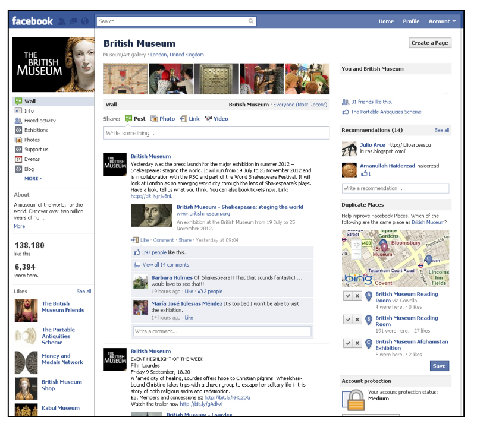
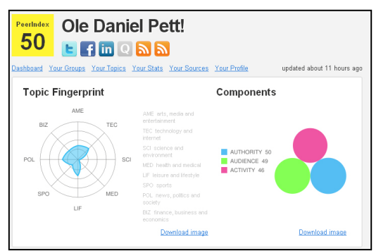
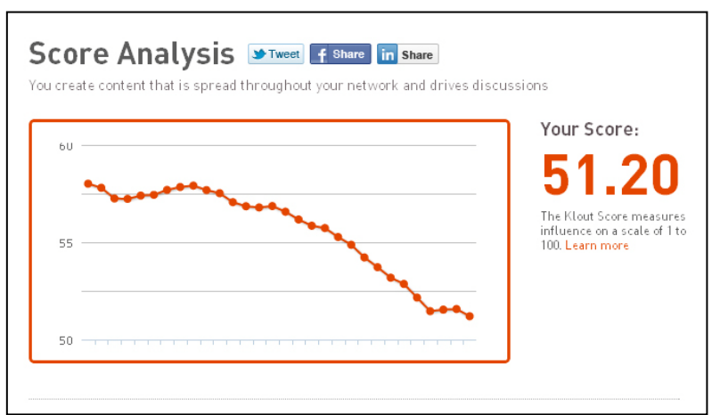
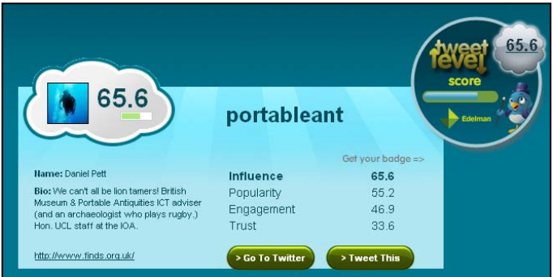
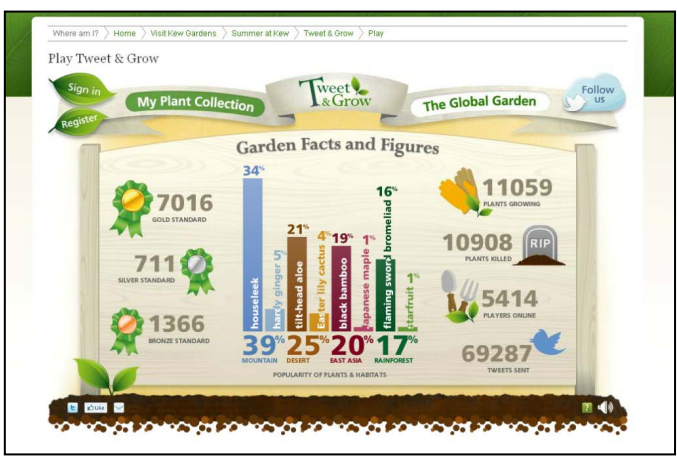

---
title: "Uses of social media within the British Museum and museum sector"
section: papers
date: 2012-01-01
slug: /papers/social-media-museums
keywords: social, media, museology, egyptology,archaeology
citation: "Pett, D.(2012) Uses of social media within the British Museum and museum sector"
authors:
- Daniel Pett (The British Museum)
featuredImg: ../images/papers/socmedia/4584406702_54022467d0_c.jpg
background: ../images/papers/socmedia/8178193199_e196a403d3_k.jpg
tags:
- digital transformation
- museums
- archaeology
- social-media
--- 

> Use social media to help deliver specific marketing, learning and participation goals – don't do
it for the sake of it. (Imagemakers 2011: 8)

Social media can be defined in many ways, but this paper will focus primarily upon platforms that allow community members to engage with each other by creating profiles and online content (see the oft cited Kaplan & Haenlein 2010 and Atkinson 2011) or ‘social capital’ (Ellison et al. 2007).

This paper will demonstrate how social media can be used and implemented within the museum sector for marketing (with specific reference to the authors’ institution for clarity), for a participatory multi-vocal dialogue, for creating a strong online brand and for creating a research presence. It will also consider their relative merits of pertinent case studies and suggest how others could emulate and innovate within the archaeological and museum sectors (and complementing the perspectives provided by many other contributions to this volume).

## 1. Social media: What is it?

The use of social media in the digital arena now permeates our life with many of us participating via a  variety of methods and devices (the mobile device now becoming especially ubiquitous and presenting its own particular challenges). Individuals and institutions thereby have taken on a wide variety of overlapping and/or conflicting identities on each. This dialogue mechanism allows for a multi-vocal engagement between institutions and consumers, via community engagement and democratised access to information.

These services can range from high profile platforms (for example Facebook and Twitter) to meet-up groups, forums and knowledge banks and online games which will be discussed below. Social media tools are just one of the many methods used within the ‘marketing mix’ to engage with museum, arts, cultural and archaeological audiences; but for the purposes of this paper, it will be the only medium discussed. Digital media now provide a way to interact and engage in dialogue with a new audience, for example a younger or worldwide audience could now be courted by a local museum, where previously this may have been beyond their means. It is a mechanism for broadcasting cultural propaganda, to influence target audiences and create new relationships. However these channels of communication are two-way and not just unidirectional broadcasting mechanisms (as many marketing tools are traditionally). 

Social media are ultimately about engagement, dialogue and the creation of social capital. They are extensions of the news generated in the traditional hard copy, allowing anyone to break stories, become a valued influence and create a wider network of interested people. Marketing via social media has thus expanded into a new realm: that of community-building and direct interaction and all of this can be achieved relatively cheaply and with low numbers of dedicated personnel services can range from high profile platforms (for example Facebook and Twitter) to meet-up groups, forums and knowledge banks and online games which will be discussed below. Social media tools are just one of the many methods used within the 'marketing mix' to engage with museum, arts, cultural and archaeological audiences; but for the purposes of this paper, it will be the only medium discussed. Digital media now provide a way to interact and engage in dialogue with a new audience,
for example a younger or worldwide audience could now be courted by a local museum, where previously this may have been beyond their means.

The recent publication of national reports on digital markets in various sectors of UK life demonstrates the importance of taking this market seriously. For example, the Arts Council England, MLA and Arts & Business (ACE et al. from here on) research document “Digital audiences: engagement with arts and culture online” (2010:4,18) suggests that 53% of the online population (currently 18 million fixed broadband lines exist at the end of 2010 (Ofcom 2011)) have used the Internet to engage with arts and culture in the past 12 months (with an increase to 62% for those in the 16 - 34 year old age bracket).

The report identifies five main online interaction categories:

1. Access
2. Learn
3. Experience
4. Share
5. Create.

These 5 factors indicate the importance of museums and cultural institutions being active on social media platforms and making them a key marketing channel. These factors also nicely align with the _'4 pillars of enterprise'_ that Rangaswami discusses (figure 1).

| ACE Report Criteria | Rangaswami's Pillars of Enterprise  |
|---------------------|-------------------------------------|
| Access              | Search                              |
| Experience          | Learn                               |
| Share               | Syndication / Conversation          |
| Create              | Fulfilment / Conversation           |

Figure 1: Synergy between Rangaswami's '4 pillars of enterprise' and the ACE criteria.

The report seeks to demonstrates that Internet users are creative and want to engage with the online resource that they are interacting with (however if the 90-9-1 (also known as ‘participation inequality’) rule is applied, then the potential creative audience is relatively small - circa 10%, the tip of the pyramid, see Nielsen 2006, Wallis 2010:27.) 

Another finding from the ACE et al. report is that: 

>“Those engaged in arts and culture online are also engaged on arts and culture offline. There is great potential for cross-promoting and cross-fertilising audiences” (Ibid: 17)

Therefore, this produces an opportunity for the conversion of online relationships into offline and on-site ones with the knock-on potential for income generation. This opportunity will be returned to below, but it is worth saying now that limitations within the cultural sector (physical resources, knowledge, personnel and time) can prevent full exploitation of the potential of these platforms and leads to out sourcing for implementation.

Institutions need to choose carefully which aspects of such digital media to which to devote their efforts if they are to achieve a positive return on their investment (however such a return is defined). Simplistically, institutions will migrate towards platforms with the largest audience share. However, is an institution’s engagement with social media simply pandering to a niche market? The Office for National Statistics (2011) states that there are 62.26 million people in the UK[^2], but are just 100,000 people interested in the British Museum’s social media output? Is the marketing output really not reaching the correct audience? Is the investment worthwhile? Are people interested in culture? Should you focus on the marketing practices, or more on executing social media tools effectively?

## 2. Platforms for engagement: choice abounds

In the last few years, an explosion of social media platforms has led to a huge array of options for anyone wishing to create an online persona, whether the latter is an ‘avatar’ (i.e. an incarnation of a person as they perceive themselves or wish to be perceived by others, for example someone’s Wii Mii3 avatar) - or as an accurate representation of the user and generate their own content. Social media is about creating references to self: or “Me media” as Cassidy (2006) styles it.

This projected persona can heavily influence the interactions and engagements that users have with one another and with various services (for example see Tringham and Morgan’s Second Life recreation of Çatalhöyük, Morgan 2009: 479-481 or DiMicco & Millen 2007’s work on identity projection and interaction via Facebook’s). Each social media platform attempts to produce a unique selling point (USP), whether this involves an emphasis on geographic (Location Based Service - LBS), visual (for example photo and video sharing), prose based (blogs) or micro update services. A limited selection of the wide range of platforms available for social media participation is displayed in figure 2.

Social media use has been prevalent for a long time within the archaeological and museum sectors. For example within the form of mailing lists and chat forums (UK examples are BRITARCH[^4] and the MCG[^5] hosted on JISCMAIL servers).

Social media and the Internet allow everyone to have a voice (Kilbitsch 2007) and an opinion on any subject that they choose. Breen (2010:36) states things as follows for archaeology, but the comments are also relevant for museums:

> “The web has opened up publishing to everyone, and that may yet save Irish archaeology from a dispiriting trend. The recent boom in archaeology and the development of many national monuments with...admission charges have made the public more aware..but also seem to give many people the impression that actually going out and studying their local antiquities is ...best left to the experts....It is a relief therefore to see that a number of enthusiasts have started websites where they post photographs and descriptions of monuments they have visited...”

Breen, in essence, has captured a more general trend of the web as it has moved from one-way didacticism towards engaged learning and a culture of dialogue, and sociability.

| Service Type                     | Examples                                                                                      |
| :------------------------------- | :------------------------------------------------------------------------------------------- |
| Micro updates                    | Twitter                                                                                      |
| Location based                   | Foursquare, Gowalla, Google Latitude, Facebook Places, Geocaching, Historypin                |
| Photo sharing                    | Flickr, Picasa                                                                               |
| Multipurpose/community sites     | Facebook, Google+, Ning, Buddypress, Orkut, Friends Reunited, MySpace, Lanyrd, Yammer, Naseeb, Muxlim, Muslimbook |
| Video sharing                    | YouTube, Vimeo                                                                               |
| Link shortening                  | Bitly, TinyURL, Goo.gl                                                                       |
| Mobile phone applications        | Tweet and Grow, Streetmuseum, Historypin                                                     |
| Social gaming                    | Xbox, Second Life, Civilization, World of Warcraft                                           |
| Video conferencing/communications| Skype                                                                                        |
| Discussion lists/fora            | JISCMail, phpBB, Vanilla                                                                     |
| Interactive glyphs/barcodes      | Quick Response (QR), Augmented Reality (AR)                                                  |
| Messaging services               | Yahoo!, Google, BlackBerry Messenger                                                         |
| Link sharing                     | Delicious, StumbleUpon, Digg, Reddit                                                         |
| Archiving tools                  | Storify[^7], Twapperkeeper, ThinkUp                                                          |
| Match making                     | Match, MySingleFriend                                                                        |
| Review                           | TripAdvisor, Yelp                                                                            |
| Monitoring tools                 | Klout, TweetLevel, PeerIndex                                                                 |
| Code repository software         | GitHub                                                                                       |
| Music                            | Spotify, Last.fm                                                                             |
| Sports                           | Adidas miCoach, Nike Running                                                                 |

Figure 2: A list of social media tools by type defined by the author (not comprehensive and sustainability of many of these is questionable.)

Bevan (in this volume) refers to Fiske’s (1991) models of social agency and suggests that many social media platforms deliberately espouse a logic of ‘community sharing’, and it is true that, for example, Twitter and Facebook invite their users to share ‘status updates’ (see Richardson, this volume). More generally, of the platforms available to marketing professionals, it is indeed those focused on engagement through content or in community sharing of content that are perhaps the most important for museums to consider, such as YouTube and Flickr, location-based interaction services such as Foursquare, Gowalla and Facebook check-ins and the most widely used platforms of Facebook and Twitter. 

The nascent Google+ platform has the potential to become Facebook’s main competitor, but given that other Google offerings such as Wave, TV and Buzz (see Bisson & Branscombe 2011) have seen little enthusiasm from the social media aware online demographic and were soon withdrawn from service, it is probably too early to predict how Google+ will fare. What is clear is that Darwinian principles (O’Brien 1996) apply to social media networks, with end users choosing the platform(s) that are fit for their purposes and augment their experiences elsewhere (Rangaswami 2008). 

The best platforms adapt and integrate well with the rest of the web ecosystem: for example the combination of Flickr’s interface with Twitter to allow users to share recent photo uploads, or Facebook’s growth to enable photographic content to be posted (Cassidy 2006). Klebe Treviño et al (2000:166) note:

> individuals are more likely to choose rich media (e.g. face-to-face meetings) and they are less likely to choose lean media (e.g. letters, fax) when message equivocality is high.

This statement could apply equally well to the Facebook age: the richer experience offered by online platforms that allow for text, images, sound and even video chat has now started to impact on social interactions offline. People now have a wide circle of online friends and this may in many cases eventually enable them to meet in the offline world. Likewise, social media allows for long distance friendships to be maintained, or in the case of institutions, they can sustain a relationship with people who may have been only briefly interested in a particular collection or have visited one time in their life but now have an opportunity to keep up with events.

Social media now percolates to all societal levels; it allows for conference participation via back channels (see Ross et al. 2011 for discussion about relative merits of this concept), it enables companies to “search for their brand on Facebook” or use Google voice search (see figure 3 for an example); it enables unverified information to enter into journalistic output, with articles based entirely around Twitter[^8] comment. Mainstream television programmes can now display a hash tag without any explanation due to the ubiquitous nature of social media. For example the recent “Arab Spring” revolt was reported worldwide with a heavy reliance on social media (for reporting and also for co-ordination and audio-visual capture of action (Howard 2011)), as were the August riots (Halliday 2011) in the United Kingdom; so much so, Government agencies mooted that social media usage should be restricted (Rainey 2011)

![Figure 3: One of Google's social web adverts at Piccadilly Circus[^9]](../images/papers/socmedia/figure3.png)

## 3. The Facebook phenomenon

Facebook has undoubtedly transformed the social media, with museums now sometimes even using it as a replacement for a separate online presence of their own. Reams of analysis can be found on the social media powerhouse that is Facebook, but simple quantitative results demonstrate how game changing this platform has been (the following data is from Ward 2011), For example, Facebook’s registered user base would equal the population of the world’s 3rd largest country (640 million users), the site receives 310 million visits daily and in an average 20 minute period in 2010, 5.9 million wall posts, 10.2 million comments were made and 2.7 million photos were posted. In contrast, if we consider other platforms for a moment, 49% of registered Twitter users never check their timeline (although Twitter claim to have 100 million active users10), Wikipedia article volume has grown by 21% from 2010 – 2011 and Flickr now hosts over 6 billion images, with 3500 new ones added each 
second (Ward 2011).

However, Facebook still has potential to grow further if developing nations expand their Internet capacity, relax online censorship and the platform proves useful to these communities. For example, the Muslim community has very successful social networking platforms that are already established, but perhaps do not have the foundations to prevent Facebook’s inexorable growth (El Dahshan 2011). 

Earlier in this paper, reference was made to the research document issued by the Arts Council et al. (2011) and specific emphasis is placed upon the value of Facebook to the arts community: “Social media - and in particular Facebook11 - has become a major tool for discovering as well as sharing information about arts and culture, second only to organic search through Google and other search engines.” (Ibid. 2010:6)

### 4. Why and how does the British Museum use social media?

The BM aims to be: “A museum of the world for the world” (British Museum 2008:3), and by utilising  social media tools and platforms, it can attempt to meet this mission statement. The BM is currently the United Kingdom’s most visited visitor attraction (Kennedy 2011) with 5.8 million visitors and a comparable number of online visits (5.866 million unique visitors to just the main website in the calendar year for 2010[^12]). This similarity in scale of online visits and physical footfall perhaps points to the intimate connection of these two activities, as discussed in a different context by Ellison et al. (2007). 

The centrepiece of the BM’s website is its collection[^13], with an emphasis on making it more accessible to the public, documenting its physical conservation and present the ongoing research conducted with it. A project to enable the dissemination of the Collection Online has now seen nearly 2 million objects being made available for public consumption worldwide; fulfilling the institutional remit outlined in an Act of Parliament in 1753 that states that the BM collection should be available to _“all curious and studious persons.”_[^14] 

Secondly, the BM wishes to use the online presence to increase revenue via the BM Company, through increased membership of the ‘Friends’ programme and by enhanced ticket sales to exhibitions. The BM’s emphasis on digital engagement is outlined in the same document as follows: 

> “By 2012, the Museum’s physical presence in London will be complemented by a globally accessible media resource, including multimedia products, digitised archives and broadcast programmes which will make the Museum’s world-class collections available to a global audience.” (Ibid: 12, 23) 

Over the past forty years, the increasing ease of international travel has meant not only that more visitors from abroad can come to London to use the collection, but that the collection can more easily travel to them, and be put to public use in new local contexts (touring exhibitions, loans, digital reconstructions). 

As a complement to this however, it has also become increasingly important to engage with an online audience that may not be able to physically visit with the Museum. Social media are just one of the tools used by the BM’s Marketing and Web teams to offer access to digital content, communicate ideas, encourage and facilitate discussion, and market to a world-wide online audience. It is an adjunct to the methods of public engagement already employed (family learning and educational activities, lectures, the Partnership UK programme, exhibitions) and is easy to integrate into existing public programming activities. Recent examples of the Marketing department’s use of social media include the Grayson Perry (see section 10 below) and Hajj exhibitions. For the Hajj exhibition, Web and Marketing have developed a campaign that reaches out to Muslim audiences and provides engaging and informative content for non-Muslims who want to know more about the pilgrimage to Mecca. The web presence for this exhibition allows those who have been on the Hajj to submit their experiences online15 in the form of text, pictures and video; once moderated, these are then displayed on the BM website and a selection may feature in the exhibition multimedia guide and possibly within the exhibition itself. 

### 5. Social media experimentation

#### A History of the World

Before analysing the BM's social media activities, it is worth considering some of the departmentalwork that feeds into the institution's persona and enlists a variety of crossover audiences. A multi department (and indeed multi-institutional) project that led to substantial user generated content (UGC) and was deemed to be highly successful[^16], is _'A History of the World'_ (AHOW). It was fronted on the radio by the BM Director, Neil MacGregor and backed by a team of curators who researched and synthesised the data. The Art Fund, when short listing the project for their 2011 award, commented that this was a:

> "Groundbreaking and enormously successful project exploring world history through the British Museum's unparalleled collection" (British Museum 2011: 51).

The online component of this project allowed people to download podcasts of the radio programme, of which over 19 million were realised (ibid: 35) and also to upload their own objects to the BBC developed series website. The final object in this project, sparked online suggestions for objects that represented life in 2010 (Cock 2011), prompting lively and sometimes heated debate. Five objects were nominated by the BM for the final object, with the Didier Drogba Chelsea Football Club shirt generating the most interest. The online collection of objects nominated by the project's 551 institutional participants and it was enhanced and complemented by over 4000 objects uploaded by the public (0.1% of the overall visits (Ibid.)), and these all had the facility for social interaction via commentary or sharing mechanisms.

During the judging for the Art Fund 2011 award, Michael Portillo commented:

> "Above all, we felt that this project, which showed a truly pioneering use of digital media, has led the way for museums tointeract with their audiences in new and different ways. Without changing the core of the British Museum's purpose, people have and are continuing to engage with objects in an innovative way as a consequence of this project." (Brown 2011)

The series also inspired third party developers to build related content, with the History Hack Day 2011 17 winner producing a mobile phone based application[^18]  that allowed the user to interact with the entire series in the space of around only 12 hours.

#### Wikipedia

The BM has also innovated through a project called Wikipedian-in-residence[^19] that was initiated in 2010 and hosted by the department of Learning, Volunteers and Audiences (LV&A) (Wyatt 2010, Cohen 2010, see also Thornton in this volume for further discussion of this platform and its potential for archaeological research). This partnership project invited Wikipedia and its immense user base to interact with the BM collection and staff, and produce a series of collaborative works including:

- An object challenge, to enhance one individual object page: the Hoxne Hoard[^20]
- A series of 5 prizes for the first featured articles to be written
- Collaborative working between curators and Wikipedians (this is ongoing, with the department of Prehistory and Europe and a series of Prehistoric pages being produced or enriched)
- A 'backstage pass' day, where the Wikipedia community could see the internal workings of the BM
- Departmental presentations

Since the conclusion of the project proper, this relationship has been maintained by many of the participants, with the department of Portable Antiquities and Treasure (PA&T) providing Creative Commons licensed images for the Wikimedia Commons and information for a variety of cases, for example the Frome[^21] and Staffordshire[^22] hoards. This project was described by one blogger as:

> "a model for institutions on how to deal with the Internet revolution. It's clever, it costs them nothing, it gains the institution respect and traction on the Internet… there is, in truth, no downside" (Pearse 2010).

Such a statement captures nicely the kind of social traction that the BM can gain from interacting with the Wikipedia community, as the cited articles show (e.g. Wyatt, Cohen) the project was well received around the world.

### 6. Internal social media use for an external audience

Another example of the heavy use of social media can be seen in the author's own department, Portable Antiquities & Treasure (PA&T), which has been engaging with such approaches since 2005 (see also Goskar in this volume for Wessex Archaeology's similar emphasis). The PA&T website[^23] is fully integrated with social media tools via the use of APIs[^24]; it retrieves content from a variety of sources—Flickr[^25], Yahoo!, Google Maps, etc. (Pett 2011b:76). The highest profile example so far of the role of social media in this department has been the launch of the Staffordshire Hoard website[^26] in September 2009, which used Flickr to solicit interaction and host a set of images that gained over 1.5 million views, several thousand comments, and 250,000 visitors in a period of 3 days (Pett 2010), solely via that platform.

Breen (2010:35) discusses the potential use of social networks for heritage-based dissemination:

> "Everyone is using social networking sites such as Facebook and Twitter. This is ideal for sites presenting archaeology to the public, as the magazine-like layout and the use of video can make the message clearer and more interesting…"

A specialised, digitally native department within the BM that is fully immersed in social media technology is the Samsung Digital Discovery Centre (SDDC), located in the Clore Educational Centre. The SDDC is a dedicated learning facility for young people, leveraging a variety of digital tools, platforms, and techniques to make archaeology and museum experiences engaging and accessible. Notable initiatives include producing video news bulletins about discoveries such as the Sutton Hoo ship burials, which are then uploaded to Vimeo to encourage commentary and dialogue among participants and their families. The department is also developing a video-conferencing project focused on best practices in public archaeological discovery (see Warry 2011), aiming to use social media tools to enhance children's learning experiences.

### 7. QR code and glyph based technology

Whilst not fully engaging in the use of QR and glyphs within the BM for innovative social media based  exercises (a concept that has been applied for different campaigns at museums around the world[^27]), several examples of their use can be found within the BM’s estate. For example, projects have made use of QR code technology for enabling access to enhanced resources, with this year’s outdoor  collaboration with Kew Gardens (the Australia Garden on the West lawn of the forecourt) containing  labels integrated with QR codes. 

These allow anyone equipped with the correct handset and software to interact with information online (see figure 4 for an example of one such label.) Secondly an exhibition on the Akan Dum[^28] held in room 3 in 2010[^29] had a QR code that linked to a mobile site,  which allowed people to access enhanced information and download an MP3 track of the drum being played[^30] from Spotify or iTunes. Whilst not promoting a two-way dialogue, these glyphs can be a doorway to social interaction: a Facebook check-in to a place facilitated by a code is one such use. 

Eden (2011) has also conducted experimental work on the QRpedia project within the BM galleries (see also the Derby Museums project), where codes could be placed on labels and scanning would take the consumer directly to the Wikipedia page (he specifically discusses the Rosetta Stone), and this could also be relevant for Museum web pages.

, which used to resolve to [the Australia Trail stop 1 page](http://www.britishmuseum.org/mobile/australia_trail/australia_stop_1.aspx) on the British Museum website. (Photo by author.) This follows best practice for using glyphs and mobile devices.](../images/papers/socmedia/figure4.png)

Prior to these implementations, QR codes[^31] have been utilised elsewhere within the BM. The PA&T website produces a glyph via Google Charts for each individual artefact recorded. However, many in the marketing (and indeed museum) industry believe that QR codes have had their day and
technology has moved on (for example towards Near Field Communication (NFC) or Augmented Reality (AR) - see Rossoff 2011). However they are seen in very varied locations, most often print based but sometimes in innovative locations (for example Betfair's use of QR code on the GB
volleyball team uniform (Eleftheriou-Smith 2011)). The SDDC has also experimented with the use of AR glyphs within exhibition spaces (Mannion, 2011a & 2011b) which has been documented by staff in a comprehensive video (appropriately shared on social media platform Vimeo.[^32])

### 8. The British Museum on Facebook

The BM's Facebook page (see figure 5) has been in operation since April 2009 and is used as a discursive interface for the Museum's activities. At the time of writing (September 5th 2011), the profile has attracted 137,776 likes and has had 6,178 check-ins. The information page provides clear links to the Museum's other social personas for other audiences (of which it has several, just as many individuals also project multiple distinct identities on the web; DiMicco & Millen 2007). All of the BM's activities online and via the creative departments are aided by the strong brand awareness and high visibility in the world's press (see Bonacchi, Furneaux and Pett for further discussion of the importance of brand in this volume.) This is of course something that many organisations can only aspire to, and the authors appreciate their privileged position. All of the above concepts are tied to specific benchmarks which help to determine whether the mediums chosen are worthwhile; for example on Facebook a target of 200,000 'likes'[^33] has already been reached, and for Twitter, the target of 100,000 _followers_[^34] should be realised by March 2012.

The BM has many areas of contention that can spark intense online debate; issues such as  repatriation[^35] of objects or human remains and therefore the institution’s Facebook presence offers a clear statement of expectation and rules of engagement for host and participants:

> This page is an open forum where anyone is welcome to contribute. Discussion is encouraged, but please be aware that any offensive, defamatory, obscene or harassing comments or personal attacks of any kind will be removed. Spamming, repeat submissions of the same (or very similar) contributions or content that is off-topic may also be removed.  

The marketing department of the BM is responsible for the social media output (in conjunction with the department of LV&A) and this platform is primarily used to broadcast information about the Museum and partner museums activities worldwide, information on scientific research, excavation discoveries and it elicits commentary and 'likes' via inviting people to interact and give examples of how certain events are celebrated in their part of the world. Quantitative analysis is conducted on the postings via the 'insights' facility; the mean 'likes' fo posts is around 147 and the most popular posts (usually Egypt related) receive over 85,000 views. Others that rank highly include simple facts about the museum, news pieces, behind-the-scenes video posts and links to blog posts. Asking direct questions to the BM fan base usually elicits substantial feedback.

The demographic breakdown of users for the page is relatively straightforward to obtain from the 'Insights' interface (unless people lie about date of birth and gender, which some do because of privacy concerns; Ellison et al. 2007) and produces some interesting figures:

- The largest proportion of fans are from the United Kingdom.
- The city with the most fans is Madrid, Spain.
- English is by far the most spoken language among users.
- 35% of the audience on this platform are between the ages of 25–44, indicating strong potential for family interaction within this age bracket.

## 9. The British Museum on Twitter

The BM has been active on this platform since January 2009. It currently has 62,604 followers but it only follows 439 users, suggesting a low level of interaction or reciprocity, an aspect which is discussed further below. The BM account has gathered new followers at a rate of circa 10% per month and has seen peaks in interest around certain news updates. The frequency of Twitter status updates (see Richardson in this volume for the mechanics of this process, and also for the appropriate use of hash tags) varies between 1 - 2 times per day and is carefully managed (unless a specific campaign requires more organised question and answer techniques)[^37].

Social media campaigns are planned to fit in with current events and future exhibitions, notable recent examples include (figures obtained from an install of yourTwapperKeeper[^38]):

- Main hashtag: #britishmuseum which is used for broadcasting information about the museum (854 tweets since 04/11; however tweets mentioning the phrase britishmuseum number 1724 in same period.)
- Stunt bear - #stuntbear: a competition[^39] run around the Grayson Perry exhibition, which solicited entries for 3 teddy bears to stand in for the artist's own teddy bear (Alan Measles) on the back of his motorbike. (60 tweets since 09/11) This competition attracted 300 entries and over 2000 votes for the 12 bears that were shortlisted.
- Craftdebate - #craftdebate: another social media campaign based around the Grayson Perry exhibition. This featured a live Twitter debate with the artist responding to people's comments and opinions on how art and craft can be seen within the digital age.
- Afghanistan exhibition (#afghanistanBM) - broadcasting information on the Afghanistan exhibition and seeing how other people have interacted on developed an empathy with the objects/content. (503 tweets since 04/11)
- Australia garden (#australiaBM) - broadcasting information about the garden and related events. (261 tweets since 04/11)

The BM has several accounts that actively broadcast: the main identity, the BM Company for the shop to promote products and also one for the book club; the Portable Antiquities Scheme also interacts under the [@findsorguk](https://x.com/findsorguk) account (and some of their staff also have regional accounts).

### 10. The British Museum and video

The BM has a dedicated and specialised broadcast unit, staffed by an ex BBC producer a broadcast assistant and a team of experienced freelance professionals. All of this is in line with MacGregor’s statement (also referenced in Bonacchi et al.) that: 

> “The future has to be, without question, the museum as a publisher and broadcaster.” (Higgins 2009, MacGregor & Serota 2009) 

In particular, the BM has begun to focus on broadcasting via narrowcasting on the web[^40] and larger broadcasts on mainstream TV, which have been negotiated via the unit. The BM's presence on YouTube was re-launched in August 2010 (British Museum 2011: 37) with a strategic plan to upload new high quality (sometimes high definition) content 2-3 times per month. Many of these videos are thematic (e.g. a brief history of time telling[^41]) or exhibition based (e.g. an Afghanistan exhibition teaser video).

The BM's Marketing department and the Web team strategically plan when video will be released and cross-publicise it via the various social media platforms that they maintain. Salient examples are discussed in this volume within Bonacchi et al (2011), with analysis of viewing figures of the videos on the video sharing social media platforms.

### 11.  The British Museum blogs

The BM's web team have maintained a blog[^42] since April 2010 and PA&T has curated a variety of dedicated self hosted blogs[^43] since August 2005. Both have used the ubiquitous Wordpress open source blogging platform. The blogs run by British Museum staff discuss and document the diversity of BM activities; posts are carefully selected by the web team (this platform, unlike the other social media utilised is not maintained by the marketing team). Recent topics include updates on the Chisledon Cauldrons, discussion of the discoveries at Amara West (Egypt), news and install information for the _"Treasures of Heaven"_ and _"The Tomb of the Unknown Craftsman"_ exhibitions and information about the Future Curators programme and the participants' experience. In line with blogs around the world (Arthur 2009), commentary is relatively small compared to the 'participatory' nature of the other platforms that the BM runs. Consumers of BM social media can now comment on their own terms without moderation on other platforms: for example by sharing links via Facebook (on their own profile, or commenting on the related Facebook status update by the BM) or Twitter with comment attached.

### 12. Strategies for engagement

As with all professional activity, the development of a clear strategy is imperative. As the saying goes: fail to plan, plan to fail. When attempting to engage an audience via social media for institutional gain it pays to follow a set agenda. The kinds of questions that might be addressed are:

- What do we, as an institution, want to achieve by engaging our public/professional or funding audience? What resources will be needed?
- Does the knowledge or skill set exist within the institution or can it be learnt?
- Does a third party need to be engaged or new staff member recruited?
- Are you going to develop bespoke applications or use existing platforms, and if the latter which platforms?
- Can we link our use of various platforms together to produce a holistic social media offering?
- Does the institution actually allow social media to be used internally? Does it have a social media policy (for example see Civil Service 2009a, Simon 2008, BBC undated)
- What are the institutional benchmarks?
- What are we going to say and what are we going to participate in? How frequently will the platforms be updated?
- Will each platform be its own individual silo? Or will the approach be holistic, with cross platform pollination?
- Is failure an option and if not, why not? Social media are experimental by nature and failure is likely. Orgel’s second rule (evolution is cleverer than you are), should also be applied. Software developers cannot predict how their platform will develop.
- What are the guidelines for creating a dialogue? What is acceptable?
- Have you staked the claim to your identity - for example used your institution name on social media e.g. facebook.com/britishmuseum, twitter.com/britishmuseum or taken ownership of your venue on Foursquare? 
- What copyright stance are you going to assume for your social media output? A Creative Commons licence without a non-commercial clause will allow more take up and reuse but does not suit all.
- Has your legal adviser or team checked “Terms and Conditions” or your policies? Are they enforceable? When one puts something online, control is lost.
- Are you able to deal with privacy of your users?
- How does your institution feel about the embedded advertising prevalent on many mainstream platforms, can you leverage it to your advantage?
- Will an archive of content be maintained?
- When do you decide to “turn off” or “retire” a social media channel?

Strategy documents for museums and archaeological institutions and organisations are few and far between; probably due to the youthfulness of the medium and the fact that good strategy has yet to be defined! A few reasonable pieces published specifically for museums do exist (for example Stewart 2010, Smithsonian 2009) and more generally, social media policy draws inspiration from Sir Gus O'Donnell's exhortations (pride, passion, pace and professionalism: Civil Service 2009b) to the civil service to:

a. Be credible: Be accurate, fair, thorough and transparent.
b. Be consistent: Encourage constructive criticism and deliberation. Be cordial, honest and professional at all times.
c. Be responsive: When you gain insight, share it where appropriate.
d. Be integrated: Wherever possible, align online participation with other offline communications.
e.Be a civil servant: Remember that you are an ambassador for your organisation. Wherever possible, disclose your position as a representative of your department or agency.

This is sage advice for all professional engagement online, but in reality it is impossible to actually control social media output by institutional employees and general encouragement to behave with common sense is a much better tactic to adopt than outright regulation.

## 13. Problems with social media

Institutional use of social media is fraught with potential problems. While there have been many successful social media projects, it is important to also outline some of the remaining issues which include:

- Copyright
- Terms of service changes - for example Twitter
- Privacy concerns
- Exposure of young participants to audiences
- Flash-point subjects
- Bullying and anti-social behaviour, dealing with trolls and vexatious bloggers
- Lack of expertise in implementing the right social media solution for a particular situation
- Local authority/ council/ institution blocking of social media (Gibbins 2011). For example PA&T employees are routinely blocked from using Flickr (pers. comm. Basford 2011 & Darch 2010).
- Maintenance of an archive can be tricky or impossible (see archiving section below)
- Choice of software for interactions can be detrimental to the experience
- Management of poly/single identity can be time consuming if working on a highly interactive topic
- How do you mitigate for staff absence, is the duty devolved elsewhere?
- Institutional buy-in
- Encouraging participation versus lurking (the 90% of Nielsen's 2006 model)

The problems outlined above, are mostly self explanatory and further discussion is outside the scope 
of this paper.

### 14.  Measuring impact and effectiveness

As with all activities, the perceived worth of the engagement will decide whether or not it has longevity, Measuring social media output, and indeed input, is now possible via a variety of methods,with 'key performance indicators' (KPI) being a frequently used term (Fishkin 2011).

#### a. Analysis

Simple things can be measured on most well-known platforms. For example, URLs that you share should be shortened (for example, when using QR codes or disseminating via Twitter or Facebook) and tracked via the shortener’s (e.g. Bitly) interface. Raw figures can be assessed and patterns established, benchmarks can be compared with peers and resources can be better aligned towards projects that work. 

Techniques such as sentiment analysis or natural language processing can be applied to determine how people interact with the social media platform; if a platform looks like it isn’t performing, then maybe your audience aren’t there, the outcomes aren’t positive and you should scale down interaction! Analysis can be as simple as a graph or detailed nodal analysis using sophisticated techniques in software like Gephi[^44]; but without raw data, it is hard to achieve. One example, which is discussed further within Richardson’s paper, is the change in terms and conditions of Twitter’s export api (Watters 2011), where you now have to source data from a third party at considerable cost.

Figure 6 below, gives some idea of what you might want to measure for 5 key social media platforms.

| Platform   | Attachment or Affiliation | Engagement & Metrics                                                                                  |
|:-----------|:-------------------------|:------------------------------------------------------------------------------------------------------|
| Facebook   | Fans                     | Click rate to links Volume of comments Shares Likes Traffic to site Post views         |
| Twitter    | Followers                | Retweets (RT) Mentions (@) Direct replies (starting with @) Institution/brand/URL mentions Traffic to site Direct retweets using built-in Twitter functions |
| Flickr     | Contacts                  | Comments Gallery additions Embeds Traffic to site Views                                   |
| YouTube    | Subscribers               | Views Embeds Shares Comments Traffic to site                                              |
| Google Plus| Circles (followers)       | Number of circles Mentions (+name) Shares Institution/brand/URL mentions +1 Traffic to site |

Figure 6: Measuring social media impact and engagement

Below, a couple of site metrics for the author’s Twitter identity are shown. Both measures demonstrate how a fallow period of use has affected the social ‘score’ that was being maintained; see figure 8, where the graph shows a downwards trend whilst the author was on leave and didn’t use the platform. 

Figure 7 shows how the Twitter user’s profile of tweets can be categorised into distinct topics of conversation. Figure 12 shows the fact that the author’s social ‘clout’ online declined when he was on leave and did not use the platform, while figure 9 shows a so-called Tweetlevel index. There are inherent problems with these different influence measuring tools, to do, for example, with the speed at which the data is refreshed, the degree to which people block access to the third party programmes because of privacy concerns, and the lack of openness of the algorithm involved

Bevan (this volume), discusses the concept of 'value' and 'authority' and how it can be applied to the museum and archaeological sectors. When people interact with the social media personas of the museum world, are they trying to develop ties with the institution, to assert authority over their peers by having comments replied to as definitive? Do people choose their social relationships carefully to maintain a 'cultured' or 'informed' online presence so that people believe that they are influential? Is reciprocity of interaction carefully gauged in order to make the most impact? For example, does a large national museum respond to all tweets on a subject or just ones that have perceived social standing - e.g. a world famous broadcaster? Institutions can also take steps to reconfirm their authority authenticity and voice within the social media arena in a variety of ways: for example Twitter provides a verification seal for accounts.

#### b. Impact?

The measurement of impact and influence has been developed via specialised software, via the creation of social indices that analyse networks and try to determine user's spheres of influence, their audience numbers and their trust levels. These tools are now being used for academics and museum practitioners to establish whether their engagement is worthwhile. 

Effective monitoring of social media output is vital; without being able to prove the benefit of the
medium as a means of engagement, awkward questions arise such as the following:

- Why should a board of trustees or a senior management team allow time to be wasted onthese platforms?
- Has the chosen social media output made an impact on the desired audience - has it changed their opinion? Taught them something new? Brought them in as new membership?

A recent project to determine how best to measure impact and effectiveness, was presented at the 2011 Museums and the Web conference (Finnis et al. 2011a), Philadelphia. This project, led by the Culture24 organisation and 17 partners (with seed money backing from the partners, Department for Culture, Media and Sport (DCMS), Arts Council England and Heritage Lottery Fund) aimed to create an in depth study of social media and web usage across the sector in various countries. Results of this project were published in September 2011 with a conference to explain the findings. The methodology is available. 

The methodology behind this project was relatively simple, and reasonably effective. The project used sector wide Google Analytics data from the institutional website, with all  partners harvesting the same metrics (including mobile device usage) from their reports and collating 
these via project management software. One of the key aims of this project was to: _“Move beyond measuring numbers and begin to measure quality/value of engagement/meaning: not just usage but interaction”_ (Ibid 2011)

The web metrics were backed with quantitative data from social platforms (see figure 10 above) and institutional surveys to determine similarities between investment in time, people and technologies employed. The eventual outcome of this project has provided an authoritative, common sense based methodology for assessing museum sector web metrics and social engagement (see Finnis et al. 2011b)

### 15. Further Examples of the use of Social Media in the Museums Sector

The previous section reflected on social media use within the British Museum. However the usage of these platforms and tools within the museums sector is richer than simply those tried so far at the BM, with a wide spectrum of applications and uses in evidence. There are myriad opportunities for innovative and original applications to be produced. However, there are very few really successful projects that have penetrated into the online community. The numbers of participants are usually relatively small compared to the figures for Internet usage cited previously. This final section there offers a brief discussion of a selection of the applications, creative integrations and campaigns out there at present, and it attempts to demonstrate how social media and museums are entwined. 

#### a. Location based: Street Museum

Museums and archaeological organisations are now realising the potential for location based services; collections contain objects, pictures and artefacts that can be identified with time and place; something that the public can easily assimilate with. The advent of cheaper GPS chips within mobile smart phones is now enabling social media applications to work outside the confines of desk top computers (Kaplan & Haenlein 2010:57) and: _"Allow us to expand our influence to other things, people, and places"_ Bell (2011)

Earlier in this volume, Jeater discusses the Streetmuseum[^45] mobile smart phone AR application developed by Brothers and Sisters for the Museum of London (MOL), which now has two distinct themes - Londinium or Roman London and the original release (see also Pett 2011a:119 - 120, 2011c and Museum of London: 2011). 

The former is currently only available on the iOS operating system (iPhone), whilst the latter is available on Android and iOS, therefore capturing a wider audience. The Apple iOS system is more aspirational, the operating system is locked to one piece of expensive hardware and hence limits the social demographic able to acquire the application and feel part of the community. However, this application was expensive to produce and could have perhaps saved a physical job from being lost in the recent job cuts that MOL announced. The HLF commissioned a rather lightweight report by Imagemakers (2011:48) which states: “The app has generated an estimated £750,000 worth of PR for the museum and driven an estimated three-fold increase in footfall.”

Ergo, this is probably deemed to be a successful project and has recouped the costs.

#### b. Location based: Historypin

The Google sponsored partnership project with We Are What We Do, the History pin project has actively sought collaboration from Museums, Libraries and Archives[^46] (MLAs) in much the same way as the Flickr Commons programme. This website collates images via crowd sourcing with meta data for geographical location and time, attaching stories and anecdotes and it builds a photographic archive via place in a very simple model. The platform is now live on the two main mobile operating systems iOS and Android.

One museum that has consistently engaged in early adoption of new technology, Brooklyn Museum of Art (see Bernstein 2011), decided to post a series of photographs[^47] from their collection from unknown locations and then they invited people to geo-locate them.

#### c. Location based: Foursquare

The American museum community has been the market leader when it comes to interaction via the LBS platform Foursquare. The Metropolitan Museum of Art (MET) has worked in partnership with the social platform to develop badges for check-in rewards, as has Brooklyn Museum of Art. These 
rewards, which come in a variety of forms (for example if you are Mayor - most frequent visitor, check in special etc) are achieved after 'following' the institution on the Foursquare platform, and then checking in and thereby declaring your presence. 

The platform's API also allows for innovative reuse of data from their check-in log; for example, Brooklyn built a Foursquare community page[^48]. Examples of museum-based rewards that are currently on offer in New York include:

- **Metropolitan Museum of Art (check-in special):**  
    Receive a complimentary reusable tote bag with your merchandise purchase of $20 or more at The Met Store, main shop only.

- **Brooklyn Museum of Art (Mayor special):**  
    "If you're our mayor on First Saturday, show the Membership desk and we'll honor you with your very own 1st fans Membership for one year."

- **Museum of Sex (check-in special):**  
    The Museum of Sex is now serving alcohol! Celebrate our liquor license with $2 off any drink—aphrodisiac cocktails, wine and champagne. Head down to our subterranean OralFix Bar. CODE: FSFIX01

- **Queens Museum of Art (loyalty special):**  
    Thanks for being such a loyal fan of the Queens Museum of Art! To show our appreciation, we're giving you a FREE QMA t-shirt! To redeem, present this message to the Gift Shop.

#### d. Social network: 1st Fans

Brooklyn Museum has leveraged the social networking of Twitter to produce an exclusive subscription based club (a tax deductable $20 per annum to participate). This initiative is labelled 1st Fans[^49] and provides the opportunity to participate in certain more exclusive museum activities (events, free luggage storage, queue jumping; for further discussion, see Simon 2009). While the efforts of Brooklyn's team has sometimes been discussed online in less than complimentary ways (McManus 2011), the museum sector as a whole has recognised their online efforts as effective, pioneering and innovative. Brooklyn has a wide array of social media outposts in its engagement portfolio and has found it hard to maintain a full profile on all of them.

#### e. Social network/ mobile gaming: Tweet & Grow

Kew Gardens has developed an application that can be played on the web or via iOS or Android devices. This application is labelled “Tweet and Grow”[^50] and revolves around gaming and decision making, with discount codes built into the process. The application has a multi-faceted role; it is an educational and marketing tool within one silo, whilst also leveraging the power of social networks to get users to return, perhaps purchase items from the shop, interact and play the game. It provides a series of 'virtual' or in-game rewards as your plant is nurtured and grows, as well as a set of 'real' rewards. Figure 10 below shows some baseline statistics for game play interaction.

Some of the gaming being done around the Museum sector allows for reconstruction of past lives and archaeologists' and museologists' interpretation of how they believe the past might have looked. Joyce & Tringham (2007:348) comment on reconstruction:

> “engage with the process of how I have reached my interpretations and how and why other archaeologists have reached theirs, with the ultimate aim of them creating their own plausible interpretations as narratives or scenarios.”

Hence, when creating a reconstruction of the past with which an audience is meant to engage, detail and the ability to tell a story can colour others' interpretations. When it comes to gaming, perhaps this is key and the authority that the institution can provide is vital.

> “engage with the process of how I have reached my interpretations and how and why other archaeologists have reached theirs, with the ultimate aim of them creating their own plausible interpretations as narratives or scenarios.”

Hence, when creating a reconstruction of the past with which an audience is meant to engage, detail and the ability to tell a story can colour others' interpretations. When it comes to gaming, perhaps this is key and the authority that the institution can provide is vital.

## 16. Conclusion

This paper opened with a quotation that attempted to dictate why and how one should be using social media. The discussion that followed hopefully has gone some way towards explaining more about the exact process by which an institution leverage such tools. The adoption and adaption of social media is now an important agenda throughout the sector. When executed correctly, the results are extremely beneficial to a museum or archaeological institution's engagement with a wider audience. Social media can provide a platform for broadcasting propaganda, but need not cost a fortune, as the platforms that provide the greatest possibilities for audience interaction are typically also those that are free. Some institutions have adopted a pay wall model for accessing digital media (e.g. the Brooklyn Museum of Art) or have developed a digital club based around exclusivity (like the misguided Time Team Digital experiment, which broadcasts to Twitter via Facebook and interacts poorly.) Experimentation is vital to establish what works and what does not. Failure is an option.

Many institutions are still exploring the correct level of licensing, with very few adopting an open access model. There are several innovators that should be seen as exemplars, and provide inspiration for others to emulate, for example the aforementioned Brooklyn Museum, the Tate and Indianapolis Museum of Art; but not every museum can follow the same approach. 

Regardless of the exact details, a successful social media strand to museum life demands a clear strategy, commitment, resources and personnel, directorate buy-in, marketing nous, a unique selling point (such as a particular collection) and a fan base to cultivate.

Questions remain about exactly what audience museums are gathering via social media. Are the people who follow or interact with museums online not already the ones who are well aware of these institutions' worth in society? Are such institutions thereby just further excluding part of their audience? There are clearly still issues here to unravel, but social media is about conversation. Make the conversation a good one and engagement will follow.

## Acknowledgments

The author would like to thank Ian Richardson, Lena Zimmer, Ruth Levis, Katharine Kelland, and Matthew Cock (British Museum), and the peer reviewers Tyler Bell (Factual Inc.), Chiara Bonacchi, and Andy Bevan (University College London) for their comments on this article.

## Bibliography

Arrington, M. 2011. "Amazingly, MySpace's Decline Is Accelerating" [online] 23 March. Available at:  
[http://techcrunch.com/2011/03/23/amazingly-myspaces-decline-is-accelerating/](http://techcrunch.com/2011/03/23/amazingly-myspaces-decline-is-accelerating/) (accessed 26 July 2011)

Arthur, C. 2009. "The long tail of blogging is dying" [online] Available at:  
[http://www.guardian.co.uk/technology/2009/jun/24/charles-arthur-blogging-twitter](http://www.guardian.co.uk/technology/2009/jun/24/charles-arthur-blogging-twitter) (accessed September 6 2011)

Arts Council England, Museums Libraries and Archives Council, and Arts and Business, 2010. Digital Audiences: Engagement with Arts and Culture Online [online] Available at:  
[http://www.artscouncil.org.uk/media/uploads/doc/Digital_audiences_final.pdf](http://www.artscouncil.org.uk/media/uploads/doc/Digital_audiences_final.pdf) (accessed 8 June 2011)

Atkinson, R. 2011. "Developing a social media strategy in Museum practice" [online] Available at:  
[http://www.museumsassociation.org/museum-practice/social-media](http://www.museumsassociation.org/museum-practice/social-media)

Bell, T.W. 2011. "Smartphones and spheres of influence." [online] Available at:  
[http://radar.oreilly.com/2011/07/smartphones-spheres-of-influence.html](http://radar.oreilly.com/2011/07/smartphones-spheres-of-influence.html) (accessed July 27 2011)

Bonacchi C. (ed.), 2012. "Archaeologists and the Digital. Towards Strategies of Engagement." London: Archetype Publications

Bonacchi, C., Furneaux, C & Pett, D. 2012 "Public engagement through online TV channels: A way forward for the audiovisual communication of archaeology" in Bonacchi C. (ed.), 2012. "Archaeologists and the Digital. Towards Strategies of Engagement." London: Archetype Publications

Breen, T.C. 2010 "Irish archaeology on the Internet - Fifteen years on" in "Archaeology Ireland" Volume 24 Number 3, pp 35 - 36 Ireland: Wordwell Ltd Available at:  
[http://www.jstor.org/stable/20749108](http://www.jstor.org/stable/20749108) (accessed September 2 2011)

British Museum 2008 "Strategy to 2012" Available at:  
[http://www.britishmuseum.org/pdf/Strategy%20to%202012%20web%20version.pdf](http://www.britishmuseum.org/pdf/Strategy%20to%202012%20web%20version.pdf) (accessed on September 5 2011)

British Museum 2011 "2010 - 2011 Review" [online] Available at:  
[http://www.britishmuseum.org/pdf/annualreview1011.pdf](http://www.britishmuseum.org/pdf/annualreview1011.pdf) (accessed on September 5 2011)

Brown, M. 2011 "British Museum wins Art Fund prize" [online] Available at:  
[http://www.guardian.co.uk/culture/2011/jun/15/british-museum-wins-arts-fund-prize](http://www.guardian.co.uk/culture/2011/jun/15/british-museum-wins-arts-fund-prize) (accessed on September 5 2011)

Cassidy J, 2006 "Me media" [online] Available at:  
[http://www.newyorker.com/archive/2006/05/15/060515fa_fact_cassidy](http://www.newyorker.com/archive/2006/05/15/060515fa_fact_cassidy) (accessed on September 6 2011)

Civil Service, 2009a "Principles for participation online" [online] Available at:  
[http://www.civilservice.gov.uk/about/resources/participation-online.aspx](http://www.civilservice.gov.uk/about/resources/participation-online.aspx) (accessed on September 1 2011)

Civil Service, 2009b "Sir Gus' vision: The Four P's" [online] Available at:  
[http://www.civilservice.gov.uk/about/values/vision.aspx](http://www.civilservice.gov.uk/about/values/vision.aspx) (accessed September 6 2011)

Cock, M., 2011 "On Air, Online and Onsite: The British Museum and BBC's "A History of the World"" [online] Available at:  
[http://conference.archimuse.com/mw2011/papers/on_air_online_and_onsite_the_british_museum_an](http://conference.archimuse.com/mw2011/papers/on_air_online_and_onsite_the_british_museum_an) (Accessed September 26 2011)

Cohen, N. 2010 "Venerable British Museum Enlists in the Wikipedia Revolution" [online] Available at:  
[http://www.nytimes.com/2010/06/05/arts/design/05wiki.html](http://www.nytimes.com/2010/06/05/arts/design/05wiki.html) Accessed 5 September 2011

DiMicco, JM & Millen DR 2007 "Identity Management: Multiple Presentations of Self in Facebook"

Eden, T. (2011) "Introducing QRpedia" [online] Available at:  
[http://shkspr.mobi/blog/index.php/2011/04/introducing-qrpedia/](http://shkspr.mobi/blog/index.php/2011/04/introducing-qrpedia/) (accessed September 7 2011)

El Dahshan, M 2011 "Facebook has little to fear from Muslim social networking sites" [online] Available at:  
[http://www.guardian.co.uk/commentisfree/belief/2011/may/31/muslim-social-networking](http://www.guardian.co.uk/commentisfree/belief/2011/may/31/muslim-social-networking) (accessed September 7 2011)

Eleftheriou-Smith, L. 2011, "Betfair puts QR codes on beach volleyball bum" [online] Available at:  
[http://www.marketingmagazine.co.uk/news/1084029/Betfair-puts-QR-codes-beach-volleyball-bums/](http://www.marketingmagazine.co.uk/news/1084029/Betfair-puts-QR-codes-beach-volleyball-bums/) (accessed September 6 2011)

Ellison, N. B., Steinfield, C., & Lampe, C. 2007 "The benefits of Facebook "friends:" Social capital and college students' use of online social network sites." Journal of Computer-Mediated Communication, 12(4), article 1. [online] Available at:  
[http://jcmc.indiana.edu/vol12/issue4/ellison.html](http://jcmc.indiana.edu/vol12/issue4/ellison.html) (accessed September 2 2011)

Finnis, J., Chan, S. and Clements, R. 2011a. "How to Evaluate Online Success? A New Piece of Action Research." In: Trant, J. & Bearman, D. (eds.) 2011 "Museums and the Web 2011: Proceedings" Toronto: Archives & Museum Informatics [online] Available at:  
[http://conference.archimuse.com/mw2011/papers/how_to_evaluate_online_success_a_new_piece_of_](http://conference.archimuse.com/mw2011/papers/how_to_evaluate_online_success_a_new_piece_of_) (accessed 9 June 2011)

Finnis, J., Chan, S. & Clements, R. 2011b. "Let's get real: How to evaluate online success" Brighton: Culture24

Fiske, A. P. 1991. "Structures of Social Life: The Four Elementary Forms of Human Relations." New York: The Free Press.

Fishkin, R. 2011 "Tracking the KPIs of Social Media" [online]  
[http://www.seomoz.org/blog/tracking-the-roi-of-social-media](http://www.seomoz.org/blog/tracking-the-roi-of-social-media) (accessed September 8 2011)

Gardner, A. 2012 "Strategy Games and Engagement Strategies" in Bonacchi C. (ed.), 2012. "Archaeologists and the Digital. Towards Strategies of Engagement." London: Archetype Publications

Garrahan M., 2009. The rise and fall of MySpace [online] 4 December. Available at:  
[http://www.ft.com/cms/s/2/fd9ffd9c-dee5-11de-adff-00144feab49a.html#axzz1TK1iZYYR](http://www.ft.com/cms/s/2/fd9ffd9c-dee5-11de-adff-00144feab49a.html#axzz1TK1iZYYR) (accessed July 26 2011)

Ghey, E. 2011 "Collections online at the British Museum" in Cook, B. (ed.) 2011 "The British Museum and the future of UK numismatics" pp. 68-70 London: British Museum Press

Gibbins, W. 2011 "Local authorities should realise the potential in social media" [online] Available at:   [http://www.guardian.co.uk/guardian-professional/2011/mar/03/engagement-hr](http://www.guardian.co.uk/guardian-professional/2011/mar/03/engagement-hr) (accessed on September 6 2011)

Goskar, T 2012 "Wessex archaeology and the web" in Bonacchi C. (ed.), 2012. "Archaeologists and the Digital. Towards Strategies of Engagement." London: Archetype Publications

Halliday J, 2011 "London riots: how Blackberry Messenger played a key role" [online] Available at:   [http://www.guardian.co.uk/media/2011/aug/08/london-riots-facebook-twitter-blackberry](http://www.guardian.co.uk/media/2011/aug/08/london-riots-facebook-twitter-blackberry) (accessed on September 5 2011)

Higgins C., 2009. "Museums' future lies on the internet, say Serota and MacGregor" [online] July 8. Available at:  [http://www.guardian.co.uk/artanddesign/2009/jul/08/museums-future-lies-online](http://www.guardian.co.uk/artanddesign/2009/jul/08/museums-future-lies-online) (accessed 25 July 2011)

Howard, P.N. 2011 "Digital media and the Arab Spring" [online] Available at:  
[http://blogs.reuters.com/great-debate/2011/02/16/digital-media-and-the-arab-spring/](http://blogs.reuters.com/great-debate/2011/02/16/digital-media-and-the-arab-spring/) (accessed on September 5 2011)

Imagemakers 2011 "Digital Participation and Learning: 22 Case Studies" [online] Available at:  
[http://www.hlf.org.uk/aboutus/howwework/Documents/Digital_report_Sept2011.pdf](http://www.hlf.org.uk/aboutus/howwework/Documents/Digital_report_Sept2011.pdf) (accessed September 8 2011)

Jeater, M & Lee, V. 2012 "Smartphones and site interpretation: the Museum of London's Streetmuseum™ applications" in Bonacchi C. (ed.), 2012. Archaeologists and the Digital. Towards Strategies of Engagement. London: Archetype Publications

Joyce, R.A & Tringham, R.E. 2007 "Feminist Adventures in Hypertext" in "Journal of Archaeological Method and Theory" Volume 14. Number 3 pp 328 - 358 London: Springer [online] Available at:  
[http://www.jstor.org/stable/25702347](http://www.jstor.org/stable/25702347) (accessed September 2 2011) DOI 10.1007/s10816-007-9036-2

Kaplan, A.M. & Haenlein, M. (2010). "Users of the world, unite! The challenges and opportunities of Social Media". Business Horizons 53 (1): 59–68. [online] Available at:  
[http://www.sciencedirect.com/science/article/pii/S0007681309001232](http://www.sciencedirect.com/science/article/pii/S0007681309001232) (accessed on September 5 2011)

Kennedy, M. 2011 "British Museum remains UK's top attraction for fourth year running" [online] Available at:  
[http://www.guardian.co.uk/culture/2011/jun/28/british-museum-top-attraction](http://www.guardian.co.uk/culture/2011/jun/28/british-museum-top-attraction) (accessed September 7 2011)

Klebe Treviño, L, Webster J & Stein E.W. 2000 "Making Connections: Complementary Influences on Communication Media Choices Attitudes and Use" in "Organization Science" Volume 11 Number 2. pp. 163 - 182 IFORMS Available at:  
[http://www.jstor.org/stable/2640282](http://www.jstor.org/stable/2640282) (accessed September 2 2011)

MacGregor, N. and Serota, N., 2009. "The Museum of the 21st Century" [online] 7 July. Available at:  
[http://www2.lse.ac.uk/PublicEvents/events/2009/20090311t1917z001.aspx](http://www2.lse.ac.uk/PublicEvents/events/2009/20090311t1917z001.aspx) (accessed 25 July 2011)

Mannion, S. 2011a "AR adventures at the British Museum" [online] Available at:  
[http://www.slideshare.net/s.mannion/ar-adventures-at-the-british-museum](http://www.slideshare.net/s.mannion/ar-adventures-at-the-british-museum) (accessed September 6 2011)

Mannion, S. 2011b "Research on tablets for learning" [online] Available at:  
[http://wiki.museummobile.info/archives/91923](http://wiki.museummobile.info/archives/91923) (accessed September 7 2011)

MacManus, R. 2011 "Social media case study: Brooklyn Museum" [online] Available at:  
[http://www.readwriteweb.com/archives/social_media_case_study_brooklyn_museum.php](http://www.readwriteweb.com/archives/social_media_case_study_brooklyn_museum.php) (accessed September 6 2011)

Morgan, C. 2009 "(Re)Building Çatalhöyük: Changing Virtual Reality in Archaeology" in Archaeology Volume 5, issue 3. [online] Available at:  
[http://dx.doi.org/10.1007/s11759-009-9113-0](http://dx.doi.org/10.1007/s11759-009-9113-0) (accessed September 3 2011) DOI: 10.1007/s11759-009-9113-0

Museum of London. 2011. "Museum of London Apps" [online] [accessed 8 June 2011]. Available at:  
[http://www.museumoflondon.org.uk/Explore-online/Apps/](http://www.museumoflondon.org.uk/Explore-online/Apps/) (accessed September 6 2011)

Museums etc 2010 "Twitter for museums" Milton Keynes: Museums Etc.

Nielsen J 2006 "Participation Inequality: Encouraging More Users to Contribute" [online] Available at:  
[http://www.useit.com/alertbox/participation_inequality.html](http://www.useit.com/alertbox/participation_inequality.html) (accessed September 6 2011)

Office for National Statistics (ONS) 2011 "Population Estimates for UK, England and Wales, Scotland and Northern Ireland, Mid-2010 Population Estimates" [online] Available at:  
[http://www.ons.gov.uk/ons/publications/re-reference-tables.html?edition=tcm%3A77-231847](http://www.ons.gov.uk/ons/publications/re-reference-tables.html?edition=tcm%3A77-231847) (accessed September 6 2011)

Office of Communication (Ofcom), 2011. "Facts & Figures" [online]. Available at:  
[http://media.ofcom.org.uk/facts/](http://media.ofcom.org.uk/facts/) (accessed on 15 April 2011)

Pearse, R. 2010 "Wikipedia and the British Museum" [online] Available at:  
[http://www.roger-pearse.com/weblog/?p=4451](http://www.roger-pearse.com/weblog/?p=4451) (accessed 5 September 2011)

Pett, D.E.J. 2010 "Meeting public interest in the hoard" in British Archaeology Number 110 pp 51

Pett, D.E.J. 2011a "A review article" in "Public Archaeology" Volume 10, Number 2, pp 119 - 127 DOI 10.1179/175355311X1308661712664

Pett, D.E.J. 2011b "Distributing the wealth" in "The British Museum and the future of numismatics" in Cook, B. (ed.) 2011 "The British Museum and the future of UK numismatics" pp. 71 - 80 London: British Museum Press

Pett 2011c - "#ACRNCASPAR Workshop on Archaeologists & the Digital: Towards Strategies of Engagement" [online] Available at:  
[http://www.7pillarsofwisdom.co.uk/acrncaspar-workshop-on-archaeologists-the-digital-towards-strategies-of-engagement/](http://www.7pillarsofwisdom.co.uk/acrncaspar-workshop-on-archaeologists-the-digital-towards-strategies-of-engagement/) (accessed September 6 2011)

Prudames, D. 2011 "A History of the World wins Art Fund Prize for the British Museum" [online] Available at:  
[http://www.bbc.co.uk/blogs/ahistoryoftheworld/2011/06/winning-the-art-fund-prize.shtml](http://www.bbc.co.uk/blogs/ahistoryoftheworld/2011/06/winning-the-art-fund-prize.shtml) (accessed September 5 2011)

Rainey, J. 2011 "Social media crackdown? It'd be more than unsociable" [online] Available at:  
[http://www.latimes.com/entertainment/news/la-et-onthemedia-20110817,0,632518.column](http://www.latimes.com/entertainment/news/la-et-onthemedia-20110817,0,632518.column) (accessed on September 6 2011)

Rangaswami, J.P., 2008 "Why I still use Facebook, and other musings on social networks" [online] Available at:  
[http://confusedofcalcutta.com/2008/01/18/why-i-still-use-facebook-and-other-musings-on-social-networks/](http://confusedofcalcutta.com/2008/01/18/why-i-still-use-facebook-and-other-musings-on-social-networks/) (accessed September 6 2011)

Richardson, L. 2011. "My research" [online] Available at:  
[http://digipubarch.org/myresearch/](http://digipubarch.org/myresearch/) (accessed 8 June 2011)

Richardson, L. 2012. "Twitter and archaeology" in Bonacchi C. (ed.), 2012. "Archaeologists and the Digital. Towards Strategies of Engagement." London: Archetype Publications

Ross,C., Terras, M., Warwick, C., & Welsh, A. (2011) "Enabled backchannel: conference Twitter use by digital humanists", Journal of Documentation, Vol. 67 Iss: 2, pp.214 - 237. DOI: 10.1108/00220411111109449

Rossoff, M., 2011 "Google kills off those little squares you scan with your phone" [online] Available at:  
[http://www.businessinsider.com/those-little-square-codes-you-scan-with-your-phone-are-dead-2011-3](http://www.businessinsider.com/those-little-square-codes-you-scan-with-your-phone-are-dead-2011-3) Accessed September 6 2011

Simon, N. 2008 "How (and why) to develop a social media handbook" [online] Available at:  
[http://museumtwo.blogspot.com/2008/10/how-and-why-to-develop-social-media.html](http://museumtwo.blogspot.com/2008/10/how-and-why-to-develop-social-media.html) (accessed September 7 2011)

Simon, N. 2009 "1stfans: An Audience-Specific Membership Program at the Brooklyn Museum" [online] Available at:  
[http://museumtwo.blogspot.com/2009/02/1stfans-audience-specific-membership.html](http://museumtwo.blogspot.com/2009/02/1stfans-audience-specific-membership.html) (accessed September 6 2011)

Smithsonian Institution. 2009 "Smithsonian Web and New Media Strategy" [online] Available at:  
[http://smithsonian-webstrategy.wikispaces.com/Strategy+--+Table+of+Contents](http://smithsonian-webstrategy.wikispaces.com/Strategy+--+Table+of+Contents) (accessed September 8 2011)

Thornton, A. 2011 "Wikipedia and blogs: new fields for archaeological research?" in Bonacchi C. (ed.), 2011. Archaeologists and the Digital. Towards Strategies of Engagement. London: Archetype Publications

Wallis, C. 2010 "Who uses twitter" in Museums Etc, 2010 "Twitter for museums" pp22-31Milton Keynes: Museums Etc.

Ward, W.J. 2011 "How Quickly Has Social Media Grown And How Large Is The Global Impact? #infographic" [online] Available at:  
[http://www.dr4ward.com/dr4ward/2011/09/how-quickly-has-social-media-grown-infographic.html](http://www.dr4ward.com/dr4ward/2011/09/how-quickly-has-social-media-grown-infographic.html) (accessed September 4 2011)

Warry, E. 2011 "Classroom CSI: developing a video conferencing model for investigating British Archaeology in Schools." Unpublished Master's thesis.

Watters, A. 2011 "How recent changes to Twitter's terms of service might hurt academic research" [online] Available at:  
[http://www.readwriteweb.com/archives/how_recent_changes_to_twitters_terms_of_service_mi.php](http://www.readwriteweb.com/archives/how_recent_changes_to_twitters_terms_of_service_mi.php) (accessed 1 June 2011)

Wyatt, L. 2010 "The British Museum and me" [online] Available at:  
[http://www.wittylama.com/2010/03/the-british-museum-and-me/](http://www.wittylama.com/2010/03/the-british-museum-and-me/) (accessed 7 June 2011)

## Footnotes 

[^1]: See [Four Pillars of Enterprise Application Architecture](http://confusedofcalcutta.com/category/four-pillars-of-enterprise-application-architecture/) (accessed September 6, 2011).
[^2]: Population figures were obtained from the [ONS Mid-2010 Population Estimates](http://www.ons.gov.uk/ons/rel/pop-estimate/population-estimates-for-uk--england-and-wales--scotland-and-northern-ireland/mid-2010-population-estimates/rft---mid-2010-population-estimates.zip) (accessed September 6, 2011).
[^3]: For more details on the concept of Nintendo Wii Mii avatars, see the [Wikipedia article on Mii](http://en.wikipedia.org/wiki/Mii) (accessed September 27, 2011).
[^4]: [British Archaeology mailing list](https://www.jiscmail.ac.uk/cgi-bin/webadmin?A0=britarch)
[^5]: [Museums Computer Group mailing list](https://www.jiscmail.ac.uk/cgi-bin/webadmin?A0=mcg)
[^6]: Friends Reunited and MySpace's troubles are well documented as they have declined (see Garrahan 2009, Arrington 2011).
[^7]: The CASPAR workshop back channel was documented via [Storify](http://storify.com/jessogden/acrncaspar)
[^8]: Twitter launched publicly in August 2006 and is still searching for viable monetisation strategies to survive; it is limited in its scope for advertising when compared to Google or Facebook.
[^9]: Image by Annie Mole, Creative Commons licensed. [View on Flickr](http://www.flickr.com/photos/anniemole/5573997732/sizes/z/in/photostream/) (accessed September 7, 2011).
[^10]: [Twitter Blog: One Hundred Million Voices](http://blog.twitter.com/2011/09/one-hundred-million-voices.html). Author's emphasis in bold.
[^11]: Author's emphasis in bold
[^12]: The British Museum has a web presence, with around 10 constituent parts that get returned overall annually. Online visit figure obtained from Google Analytics September 11 2011.
[^13]: 20 % of the BM website visits are for use of the collection online section (Ghey 2011: 68)  
[^14]: In the BM strategy document, page 3, this has been expanded to: A space 'not only for the learned and
curious' but also 'for the benefit of the general public' – a centre of research and inquiry at all levels.
[^15]: [Hajj Stories](http://www.britishmuseum.org/whats_on/exhibitions/hajj/hajj_stories.aspx) (accessed October 3 2011)
[^16]: Winner of the 2011 Art Fund Prize for Museums (Brown 2011, Prudames 2011)
[^17]: [History Hack Day](http://historyhackday.org/)
[^18]: [HOTW Mobile](http://hotw.cgb.im/mobile)
[^19]: [Category Wikipedia:GLAM/BM](http://en.wikipedia.org/wiki/Wikipedia:GLAM/BM) (accessed September 27, 2011)
[^20]: [Hoxne hoard](http://en.wikipedia.org/wiki/Hoxne_hoard) – view the edit history, with particular reference to June's edits
[^21]: [Frome Hoard](http://en.wikipedia.org/wiki/Frome_Hoard)
[^22]: [Staffordshire hoard](http://en.wikipedia.org/wiki/Staffordshire_hoard)
[^23]: [Portable Antiquities Scheme](https://finds.org.uk)
[^24]: API – Application Programming Interface: a method for interacting with software
[^25]: Flickr is one of the few social media sites that charges for access (where primary focus is not music). Many social web platforms subject users to unobtrusive advertising to maintain a revenue stream. Museums can of course use the advertising to promote themselves: Facebook and Google ads for example.
[^26]: Originally published at [staffordshirehoard.org.uk](http://www.staffordshirehoard.org.uk) and now at [finds.org.uk/staffshoard](http://finds.org.uk/staffshoard) as the Staffordshire Hoard partnership replaced the old site with a magazine style format.
[^27]: For information on mobile based projects worldwide see [wiki.museummobile.info](http://wiki.museummobile.info/) (accessed September 9 2011)
[^28]: [A history of the world](http://www.bbc.co.uk/ahistoryoftheworld/objects/iTEvLsbQRxilYjAO5TZ3mA) (accessed September 9 2011)
[^29]: [Akan Drum exhibit](http://www.britishmuseum.org/whats_on/archive_exhibitions/akan_drum.aspx) (accessed September 9 2011)
[^30]: [Akan Drum playlist](http://www.britishmuseum.org/whats_on/all_current_exhibitions/akan_drum/akan_drum_playlist.aspx) (accessed September 9 2011)
[^31]: They do produce an intended (narrow) audience, cost and use limitation: those without access to the correct hardware and software are excluded from interacting with them and overseas visitors can incur high costs for roaming bandwidth usage (let alone language specific delivery.) Not everyone knows how these codes can be utilised.
[^32]: [Vimeo page](https://vimeo.com/25782400) (accessed September 20 2011)
[^33]: A "like" is a user interaction, where one shows appreciation for a web page, an object or event
[^34]: A "follower" on Twitter is basically a subscriber to a list of comments, much like deciding to listen to a radio station. One can turn off at will.
[^37]: For example Twitter campaigns for #askacurator or #craftdebate
[^38]: Software available at: [yourTwapperKeeper](http://your.twapperkeeper.com/) (accessed September 20 2011)
[^39]: [Grayson Perry competition](http://www.britishmuseum.org/whats_on/exhibitions/grayson_perry/competition.aspx) (accessed September 20 2011)
[^40]: See Bonacchi et al in this volume
[^41]: [Young Explorers](http://www.britishmuseum.org/explore/young_explorers/discover/videos/brief_history_of_time_telling.aspx) (accessed September 20 2011)
[^42]: [British Museum Blog](http://blog.britishmuseum.org) (accessed September 2 2011)
[^43]: [Portable Antiquities Scheme Blogs](http://finds.org.uk/blogs) (accessed September 1 2011)
[^45]: [Museum of London App](http://www.museumoflondon.org.uk/Resources/app/you-are-here-app/index)(accessed September 1 2011)
[^46]: [History Pin Partners](http://www.historypin.com/community-partners-lams/) (accessed September 20 2011)
[^47]: [History Pin Brooklyn Museum](http://www.historypin.com/profile/view/Brooklyn%20Museum) (accessed September 20 2011)
[^48]: [Brooklyn Museum foursquare](http://www.brooklynmuseum.org/community/foursquare/) (accessed September 20 2011)
[^49]: [Brooklyn Museum 1st Fans](http://www.brooklynmuseum.org/support/1stfans) (accessed September 20 2011)
[^50]: [Tweet and Grow](http://www.kew.org/visit-kew-gardens/summer/tweet-and-grow/index.htm) (accessed September 8 2011)es have 