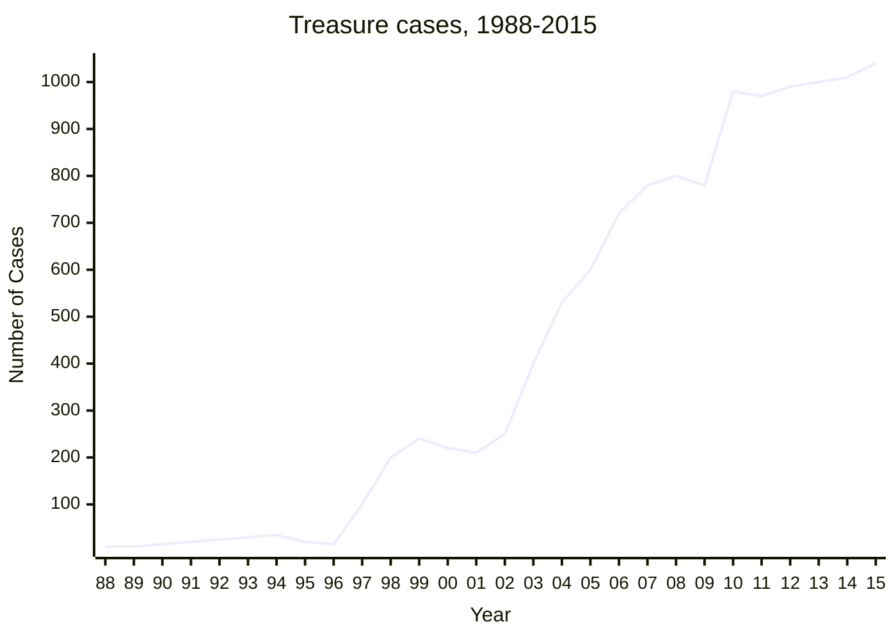
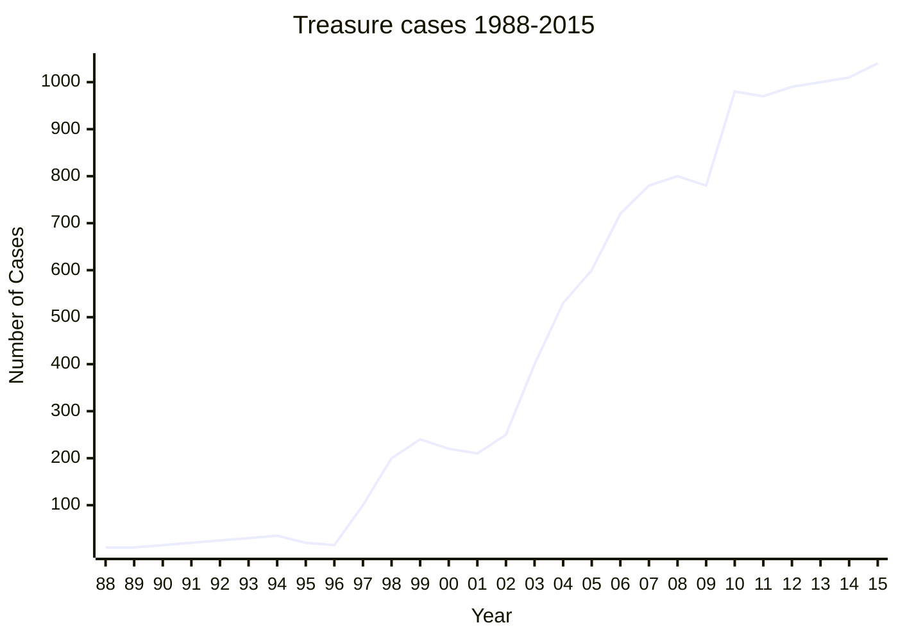

## Introduction
This chapter describes the solution adopted in England and Wales to the universal problem of how to deal with objects of archaeological, historical, or cultural importance found in the soil by members of the public (portable antiquities): the Treasure Act 1996 and the Portable Antiquities Scheme. All countries have legal frameworks and other systems intended to protect such objects found by members of the public in their territory either by chance or as a result of deliberate searching. While these approaches vary widely, in most countries there is a legal requirement to report all objects of archaeological importance and normally the state claims ownership of them; there are mechanisms for paying rewards to the finders (although these usually fall short of the full market value) and there is usually protection for archaeological sites and controls over the use of metal detectors (Bland 1998). England and Wales have adopted a different approach to this problem, in the Treasure Act and Portable Antiquities Scheme.

## Background: Treasure Trove
Until 1996 England and Wales very unusually had no legislation governing portable antiquities. The old feudal right to Treasure Trove (under which the king claimed all finds of gold or silver that had been deliberately buried in the ground) had been adapted as an antiquities law in 1886 when the government started paying finders rewards for finds of Treasure Trove that museums wished to acquire, but this was just an administrative act and no law setting out a sensible definition of Treasure Trove was ever passed; instead the definition was based on case law going back to the seventeenth century and beyond (Hill 1936). So only finds made of gold and silver that had been deliberately buried qualified as Treasure Trove. In practice most Treasure Trove cases were coin hoards, but not all hoards were covered, as small groups that could have been lost did not qualify, nor did hoards of bronze or base metal coins (Bland 1996; Palmer 1993). Archaeologists pressed for reform throughout the twentieth century but could never agree on what form that reform should take (Bland 2005a, 2005b). The availability of cheap metal detectors in the 1970s suddenly lent a new urgency to the need to reform the law, as the number of objects being found suddenly rocketed, but, with a few exceptions, museums and archaeologists failed to respond adequately. A part of the archaeological establishment responded by trying to introduce controls on metal detecting – the STOP (Stop Taking Our Past) campaign – but this failed to gain political support and simply led to a climate of distrust between archaeologists and detector users (Bland 2008). In 1979 the Ancient Monuments and Archaeological Areas Act included a provision that banned metal detecting on Scheduled Monuments (of which there are some 20,000) without the written permission of English Heritage but, this apart, it is completely legal to use a metal detector with the permission of the owner of the land in England and Wales. This is in contrast to most European countries, where a licence is needed to search for archaeological objects (Bland 1998). In a few parts of England far-seeing archaeologists, notably in the East Anglian counties of Norfolk and Suffolk, pioneered a system of liaison with detector users (Addyman 2001; Green and Gregory 1978).

## Treasure Act
Thanks to the efforts of Lord Perth and others, the UK Parliament finally passed the Treasure Act in 1996 (it came into effect the following year) and this provided a significant, but incremental change (Bland 2008). The Act came into effect in 1997 and applies only to objects found since September 1997 (DCMS 2008). It has effect in England, Wales and Northern Ireland but not Scotland, which has a completely separate legal framework governing finds: in Scotland there is, in effect, a legal requirement to report all finds (Campbell 2013; Saville 2000). Under the Treasure Act the following finds are Treasure, provided they were found after 24 September 1997: 1. objects other than coins at least 300 years old with a minimum precious metal content of 10 per cent 2. all groups of coins from the same find at least 300 years old (if the coins have a precious metal content of less than 10 per cent then the hoard must consist of at least ten coins) and 3. objects found in association with Treasure. Objects belonging to their original owner or his heirs are excluded, as are unworked natural objects (such as fossils) and wreck. The Act also contained a provision that allows for regular reviews, following which the definition can be extended. The first review in 2003 led to adding hoards of prehistoric base-metal objects to the categories of Treasure. A second review is now overdue.

## Rewards and valuations

Although some Treasure cases are found during the course of archaeological investigations, the great majority (95 per cent) are found by amateur metal-detector users, of whom there are believed to be about 10,000 (Robbins 2014: 13–4). Any object that a museum wishes to acquire is valued by a committee of independent experts, the Treasure Valuation Committee, and their remit is to determine the full market value of the object in question; the current chairman is Professor Lord Renfrew of Kaimsthorn, an eminent archaeologist and member of the House of Lords. The reward is normally divided equally between the finder and landowner. The Committee is advised by a panel of valuers drawn from the trade, and interested parties can commission their own valuations which the committee will consider. The reward can be reduced or not paid at all if there is evidence of wrongdoing on the part of the finder or the landowner. Once a valuation has been agreed, museums have up to four months to raise money. Archaeologists are not eligible for rewards. Not all finds reported as Treasure are acquired by museums and indeed about 60 per cent of all cases are now disclaimed and returned to the finders, who are free to dispose of them as they wish.

**Figure 1: Finds reported as Treasure Trove (1988–97) and Treasure (since 1997)** 

## Impact of the Treasure Act
The impact of the Act has been dramatic: before 1997, an average of twenty-six finds a year were Treasure Trove and offered to museums to acquire; in 2015, 1038 cases were reported as Treasure, 95 per cent of these found by amateur metal-detector users (see Figure 8.1). Since most of the finds that were Treasure Trove before 1997 were coin hoards, it might have been thought that the Act would only have a limited impact on the number of hoards being reported, but in fact the average number of coin hoards since 1997 is sixty-seven a year (half of these are Roman hoards), more than twice the twenty-six a year logged in the ten years before the change in the law. Since that figure of twenty-six a year included hoards of bronze coins and small groups of coins that were not Treasure Trove, this increase must reflect a greater willingness by metal-detector users to report their finds.

---
## Case study 1: The Staffordshire hoard: archaeology captures the public imagination

When metal-detecting on farmland in central Staffordshire in July 2009, Terry Herbert discovered a series of early medieval gold and garnet artefacts. He carefully boxed these up and then contacted his local finds liaison officer of the Portable Antiquities Scheme, Duncan Slarke, who drove to Mr Herbert’s house to see the items. Mr Slarke was astounded at their number and quality, and immediately contacted colleagues at the British Museum and the Staffordshire Historic Environment Record. Mr Slarke also contacted the Coroner and reported the find as potential Treasure. Archaeologists from Staffordshire County Council investigated the site of the find, and a team from Birmingham University undertook a limited excavation, assisted by Mr Herbert. They recovered hundreds of further artefacts revealing the vast scale of what would come to be called the Staffordshire Hoard.

Dr Kevin Leahy, National Finds Advisor for the Portable Antiquities Scheme, and his wife, Diane Leahy, undertook the immense task of cataloguing the finds made by Mr Herbert and the archaeologists. Over 1500 items and fragments of items were initially identified, including intricately filigreed sword pommels, sword hilts, crosses, a helmet cheek piece and other helmet fragments, and a large gold strip inscribed in Latin with a quotation from the Bible – ‘rise up, O Lord, and may thy enemies be scattered and those who hate thee be driven from thy face’. It was the largest collection of Anglo-Saxon gold material ever found.

From the start, there was immense interest among the academics who knew about the find, as well as concern that news of the discovery would break before archaeologists had the opportunity to recover all of the items from the dispersed hoard. Workers on the site were careful not to reveal the true nature of their investigation to curious onlookers. When the work was complete and Dr Leahy had finished his report on the finds for the coroner, the inquest was scheduled for 24 September 2009. On this date, when the coroner declared the hoard to be ‘Treasure’, Birmingham Museums and the Potteries Museum & Art Gallery in Stoke-on-Trent, who hoped to jointly acquire the hoard, issued a press release with the British Museum, announcing the discovery. Daniel Pett of the Portable Antiquities Scheme and Kate Kelland from the British Museum (Pett 2010) built a unique website about the hoard, which received more than 175,000 page views within five days of going online; it linked to a Flickr website of photos taken by Birmingham Museums which saw 500,000 views over the same period. The find was extensively covered in the British and overseas media, and the hoard captured public interest, with references to the discovery appearing in cartoons and television adverts. There was even a local beer variety that was named ‘The Hoard’ and featured a photograph of the star artefacts on its label.

A quickly arranged display in Birmingham Museum and Art Gallery found members of the public eager to view the major pieces in the hoard. As the valuation for the reward payment requires the items to be assessed ‘in the condition in which they were found’, the artefacts had the dull patina of the fresh earth from which they had come. Despite this, people queued for more than three hours and in the rain for a chance to see the hoard. After two weeks the artefacts were transported to London for eventual valuation by the Treasure Valuation Committee. In the meantime, a selection of the finds were also put in specially sourced cases and installed in the prominent location of the Central Saloon at the British Museum.

Sensing the popular interest in the spectacular discovery, several media companies put forward plans for a television programme. The cultural institutions were in the advantageous position of being able to ask the companies to tender for the short-term exclusive rights to access to the hoard, and a team from the British Museum, Birmingham Museums and the Potteries Museum & Art Gallery chose National Geographic as the preferred partner. In due course this was to lead to a television documentary broadcast on Channel 4 and a cover article in National Geographic Magazine, in addition to an access fee which would assist in conservation costs of the hoard.

As part of the valuation process, several different experts in the antiquities trade provided reports on the hoard's value. The Treasure Valuation Committee then met to consider these and after a day-long meeting, recommended a value of £3,285,000 for the items. In order to acquire the hoard, Birmingham Museums and the Potteries Museum & Art Gallery had to raise this money, which would form the reward paid to the finder and landowner. The Art Fund led a national fundraising campaign to support the hoard's acquisition and gave £300,000, with the National Heritage Memorial Fund contributing £1,285,000. Many politicians gave their support to the campaign to ‘save the Staffordshire Hoard’, with Baron Corbett of Castle Vale hosting a fundraising event in the House of Lords. The Potteries Museum & Art Gallery and Birmingham Museums ‘loaned’ some of the star items for temporary shows to encourage local donations. In all, a staggering number of organisations and private individuals contributed to the campaign, and in May 2010 the target had been reached and the Staffordshire Hoard was acquired by the Midlands museums.

This was only the beginning of the public's widespread fascination. Whilst conservators started cleaning up the thousands of items and making discoveries about how many of the mystery items would have looked and been used, academics were already using the hoard in their works. Indeed, before the find had even been valued, a symposium had been organised at the British Museum which drew experts from around the world and across disciplines to discuss the implications of the hoard's discovery. Most subsequently published their work at www.finds.org.uk/staffshoardsymposium. On the popular front, more appearances were made in nationally broadcast television programmes, from BBC’s Digging for Britain to ITV’s Britain’s Secret Treasures.

The acquisition of the Staffordshire Hoard fuelled the development of bespoke displays in both Birmingham and Stoke-on-Trent. The hoard went on tour to several venues in Britain and was the subject of a special exhibition at the National Geographic Museum in Washington, DC in 2011/12. Elements of the hoard continue to tour various locations, and it retains its own website (www.staffordshire-hoard.org.uk), which includes information on how the hoard can be used in education. Continuing research, conservation and development are actively managed by the acquiring museums. This has led to further investigations on the site of the discovery, and in 2012 a survey assisted by volunteer metal-detector users and organised by Archaeology Warwickshire uncovered an additional ninety items belonging to the original hoard, news which again made the front page of many national newspapers.

The Staffordshire Hoard has proven so popular and become so well known that it has become symbolic of the material culture of early medieval Britain. Like the famous burial at Sutton Hoo, the Staffordshire Hoard has gone beyond specialist interest in archaeology and appeals to a wide and diverse audience, both in Britain and beyond.
--- 

## Portable Antiquities Scheme

Of course Treasure finds are only part of the picture: the great majority of archaeological objects found do not qualify as Treasure, but the information they provide can be just as important for our understanding of the past (DNH 1996). The Portable Antiquities Scheme (PAS) was established in parallel with the Treasure Act to encourage amateur finders to report – voluntarily – all the coins and other archaeological objects that they find. This works through a network of thirty- eight locally based finds liaison officers, who between them cover the whole of England and Wales. Their main remit is to record finds offered for recording; they also have very important responsibilities for archaeological out- reach and disseminating good practice to metal-detector users (for examples see British Museum 2014: 8–12). They have to cope with all types of archaeological finds and so are supported by five specialists, national finds advisers. All the finds are recorded onto an online database ([https://finds.org.uk](https://finds.org.uk)), which is now the largest resource of its kind in the world and which, as of September 2016, contains details of more than 1.2 million objects reported by over 14,000 metal detector users and others. 

These finds are returned to their finders after recording. It is a priority to record find spots as accurately as possible, so 90 per cent of all finds are recorded to an area 100m square. When finds are recorded in this way, and the data is integrated with other archaeological finds together with the local archaeological records, the information has huge potential for revealing new sites. Brindle has shown that in ten years the data recorded by PAS had increased the number of Roman sites from two counties (Warwickshire and Worcestershire) by 30 per cent (Brindle 2014). Most archaeology in Britain takes place in advance of building development and, as sites brought to light by detector finds are mostly rural, most of them are unlikely to have been discovered through the normal archaeological process. Ninety per cent of all finds recorded by PAS come from cultivated land where the archaeological contexts have already been disturbed by the plough: when metal detecting is carried out properly on such land, with all finds being carefully recorded, it can be seen as a form of rescue archaeology. Perhaps the biggest problem for PAS is its own success: it perpetually struggles to record all the finds that it can. 

Although 82,975 finds were added to the database in 2015 (see Figure 8.2), there will never be enough staff to record all the finds they would like to, and so in March 2010 a new facility was added to the database to allow amateurs to record their own finds, under supervision, and at the time of writing over 270 individuals had recorded over 40,000 finds. Persuading the individuals who make finds to take responsibility for ensuring that they are recorded must underlie the scheme’s future direction, as the flow of new discoveries shows no signs of diminishing. 

**Figure 2: Finds recorded by the Portable Antiquities Scheme, 1998–2015**

It has sometimes been said as a criticism of PAS that it has not stopped illegal metal detecting in England and Wales, but this is for the simple fact that it was not intended to. This is an enduring problem and PAS staff are working closely with English Heritage’s Heritage Crime Initiative, which is run by a police inspector on secondment. This has had considerable success in targeting illegal detector users, known as ‘nighthawks’. However, it is important to put nighthawking in perspective: a survey commissioned by English Heritage in 2008 found that on two measures (the numbers of scheduled sites attacked by illegal detector users and the number of archaeological units that reported nighthawking incidences on their excavations), the number of cases has declined since 1995, when a previous survey was carried out (Dobinson and Denison 1995; Oxford Archaeology 2009). 

Another way of tackling the problem of illegal metal detecting is to make it harder for the thieves to sell their finds. At present, it is too easy for the ‘nighthawks’ to sell their finds to dealers who are happy to purchase such objects without checking that the vendors are acting legally, with the agreement of the landowners. Many items of potential Treasure are openly offered for sale, especially on the eBay website. In October 2006 PAS signed a memorandum of understanding with eBay whereby eBay will take such items down from its website when notified by PAS and the police; PAS has been monitoring eBay as time allows since then. For the first time, eBay has published comprehensive guidance on buying and selling antiquities on its website, while PAS has also developed its own guidance. In addition, PAS has followed up several hundred cases of potential Treasure offered for sale on eBay. Although there have not yet been any criminal prosecutions as a result of this monitoring of eBay, there have been a number of cases where vendors have voluntarily agreed to report the finds they were selling as Treasure. However, monitoring eBay on a daily basis, which is what is needed, is a time-consuming process. More resources are needed in order to pursue this work; arguably these should come from eBay and similar sites which profit from the sale of antiquities. 

It might have been expected that the government’s accession to the 1970 UNESCO Convention in 2002 and the Dealing in Cultural Objects (Offences) Act, which came into force on 30 December 2003, would suppress the market in finds illegally recovered from the UK but no prosecutions have been brought under this Act, nor have any been brought under the Treasure Act.

---

## Case study 2: Research using the Portable Antiquities Scheme data 

With over 1.1 million archaeological finds recorded on the [PAS database](https://finds.org.uk) and many more being added every day, its potential as a research tool is increasingly powerful. This was highlighted at PAS’s tenth anniversary conference – ‘A Decade of Discovery’ – in 2007, which provided a platform for twenty scholars to discuss their work using PAS data (Worrell et al. 2010). The PAS website is continually updated (Pett 2010) with details of those using the scheme’s data, with access provided via a tiered model allowing for various roles to consume these data. Upon registration, users are given limited access to the information collated; find-spot data is reserved for those who have higher-level access (which is granted upon application and receipt of references). At the time of writing, 433 researchers have full access to find-spot data, whilst a further 292 have finds liaison officer access. These data have been used in over 450 research projects, including seventeen pieces of large-scale research and ninety-three PhDs. Over 7000 people have registered as users, and if they are associated with personal details recorded by PAS staff, they are able to interrogate the database for their own discoveries. 

Useful insights into the value of PAS data for researchers have recently been provided by a research project by Katherine Robbins (2013), funded by the Leverhulme Trust, which seeks to understand the factors that underlie the data generated by the scheme. This project builds upon her PhD research (Robbins 2012), which analysed data gathered by PAS in Hampshire, the Isle of Wight and Northamptonshire. The new research uses statistical techniques within a geographic information system to analyse the spatial distribution of the data and various classes of finds and compare it with other datasets such as relevant Historic Environment Records. Of particular value are the analyses that explain the wide variations in the frequency of finds recorded across England and Wales: is this an archaeological reality or due to other factors, such as the attitude of detectorists towards finds recording or where they search? It is hoped that this research will offer a baseline for all researchers using PAS data, enabling the rapidly growing PAS database to be exploited to the full: it has been noted that PAS data is currently not being used to its full potential because there has been little detailed research on the nature of the data, and some archaeologists may not use it for this reason. 

There are a number of examples of research benefiting from this approach, including a body of PhDs using PAS data. In recent years the Arts and Humanities Research Council (AHRC) has funded several Collaborative Doctoral Awards (CDAs) with the British Museum/ PAS as a co-partner. These have covered a range of periods from the Iron Age to Anglo-Norman England. Rob Webley’s research on portable metalwork in Late Saxon and Anglo-Norman England is particularly notable, not least since most analysis using PAS data has explored artefacts of earlier periods. 

The Norman Conquest of England (1066) brought huge social and political change in England, most visible in the elite architecture of the period immediately after it, particularly castle and church building, but also in manuscript art and stone sculpture, for example. Webley’s research will explore whether or not these shifts can be seen in the portable material culture of the time. As noted already, the PAS database provides an unprecedentedly large dataset with which to study different regional responses to a ‘national’ socio-political event of the magnitude of the Norman Conquest. While it is generally thought that there are few portable metal artefacts dateable to the eleventh and twelfth centuries, this project aims to critically re- examine the dating of such objects over the wider period between AD 900 and AD 1250. This work builds on the scholarship of others who have studied (in isolation) particular artefact types, such as stirrup-strap mounts (Williams 1997) and strap-ends (Thomas 2001). Now that a better profiling of relevant non-ferrous dress accessories, equestrian equipment and weaponry has been achieved, interesting questions can be asked of the cultural effects (or relative lack) of the Norman Conquest, and by extension of perceived turning points in history. The findings will be promoted widely to achieve a better understanding of Anglo-Norman metalwork within both academic and public realms. Further, they hope to inform a wider debate on how metalwork fits into the wider phenomenon of the Norman Conquest, and to what extent it was mostly an event affecting the elite rather than everyday people. 

An increasingly number of people are considering PAS material in approaches to medieval and post-medieval metalwork (e.g. Lewis 2012), and this is to be welcomed, thus demonstrating the important contribution metal-detected finds (if responsibly recovered and properly recorded) can make to the archaeology and history of Britain.

---

Proposed amendments to the Treasure Act In 2009 Parliament passed a number of significant amendments to the Treasure Act in the Coroners and Justice Act:

1. Establishing the post of Coroner for Treasure, who would deal with all Treasure cases from across England and Wales (at present many coroners give Treasure cases low priority and delays of a year or more in their holding an inquest on a find are not uncommon).
2. Extending the obligation to report Treasure: currently there is only an obligation for ‘finders’ of Treasure to report such finds. This amendment would require that anyone who ‘acquires property in an object’ that he ‘believes or has reasonable grounds for believing … is treasure’ report it. This would help frustrate the illicit trade in Treasure finds.
3. In conjunction with this there would be a ‘reverse presumption’ that an object was found on/after 24 September 1997 unless there is evidence otherwise: currently some finders state that an object was found before the Act, and therefore it is declared not Treasure Trove (under the old common law). This amendment would tighten up this loophole in the legislation. Coroners declare objects Treasure (or not) on the balance of probability.
4. Extending the time limit for prosecutions for non-reporting: this would increase the statute of limitation (currently six months) up to three years, so that police have more time to pursue a prosecution of failure to report Treasure. Prosecution cases have failed because time has run out – even before a coroner has declared a find to be Treasure.
5. Allowing the secretary of state to designate officers to whom Treasure can be reported: the Act states that Treasure should be reported to the coroner in the district in which it was found, but it is normal practice (since it is convenient for finders) for finders to report (and hand over) Treasure to their local finds liaison officer (at their local metal-detecting club), and this amendment would normalise that practice.
6. Obligation to hand over treasure: currently finders only have a legal obligation to report Treasure, not hand it over. This amendment will ensure that the obligations of finders (who are intransigent) are clear.
    
All of the amendments would help the Act work better, and the second and third ones would make it much harder for dealers to sell unreported Treasure finds. Unfortunately, the coalition government did not implement these amendments (there is a cost, albeit a low one, to establishing the post of Coroner for Treasure). In addition, a second review of the Act is overdue: on its agenda will be the possibility of extending the Act, and single finds of Roman and Anglo-Saxon gold coins, as well as Roman base-metal hoards, have been discussed as possible candidates for adding to the definition of Treasure. It remains to be seen whether the Act will be extended in this way.

---

## Case study 3: Portable Antiquities on the web 

The PAS website has been online now for over a decade and has been delivering data dynamically to the public since 2003 via its database (Pett 2010). Since 2007, this dissemination platform has been developed entirely in-house and allows an agile deployment of a high- technology environment for people to research discoveries of portable antiquities. This system has been recognised internationally as an exemplar for the recording of archaeological data and is now employing new techniques for enabling research: for example, the production and consumption of linked open data (Gruber et al. 2013) to enrich numismatic records and through the visualisation of coin finds (Pett 2014). The PAS website has seen substantial usage since 2007, with over half a million unique visitors to all PAS web resources over several years. 

This total, whilst a small detail in the greater picture, is particularly significant as PAS’s contributor base is estimated at around 8000–10,000 metal-detector users (Bland 2013). Therefore, the PAS online presence is now reaching an audience 50 times its constituent base. The material that the PAS site disseminates is reaching a world- wide mass audience and bringing best practice and freely available data to places that traditional means would not have reached. PAS strives to innovate within the archaeological sector; the database is consistently cited as the largest archaeological small-finds database in existence (at the time of writing, and commented on above, over one million objects have been recorded). The reach of PAS on the web has been further supplemented with dissemination of the data (licensed under a Creative Commons By-Attribution Share-Alike licence) into mass consumer platforms such as Wikipedia. The PAS site has developed large sections for the teaching of numismatics to a non-specialist audience, and this is proving to be an area with rich development potential. As a partner in the Nomisma project (with the American Numismatic Society and Deutsches Archäologisches Institut, amongst others), the PAS site is now supplementing its coin guides with a wide array of resources (some multi-lingual), through the use of Linked Open Data (Pett 2014). 

PAS has actively developed a social media presence, maintaining identities on mainstream platforms such as Flickr (which was used to great effect for dissemination of the Staffordshire Hoard images in 2009), Facebook and Twitter. Producing output for these media is relatively straightforward, and a strategy has been implemented in line with the British Museum’s general approach to the use of social media (Pett 2012). Whilst follower numbers are relatively small, they are growing at a reasonable rate and reflect the limited time devoted to this facet of PAS engagement. However, PAS is now receiving a reasonable volume of referrals via these platforms, and this will no doubt increase as people start to share more information in this way. PAS's web presence is constantly evolving; it tries to stay on the edge of technological innovation and this drives its delivery of archaeological data to the public. 

A recently conducted survey that will inform a Heritage Lottery Fund bid has shown that many respondents requested a mobile device application to be constructed. This is one area which PAS could develop in the future, but the data can also easily contribute to third-party developed applications. The window of opportunity to the digital super highway that Schadla-Hall (1996) referred to in the late 1990s is still there. He posed the question: ‘how ready is our collections information for the information super highway? I suspect the answer is that a lot of it is not ready for the mud track or even the occasionally trodden grassy path!’ PAS is ready and has been for a while.

## Conclusion

Although the Act could be improved and the PAS could benefit from more funding, it has had a major impact. The finds recorded by the
scheme are available at the PAS website for all to see (case study 8.3). This is a major tool for research (case study 8.2). The Treasure Act and PAS may be a particularly English response to the situation that exists in this country, but they are undoubtedly transforming our understanding of the past of England and Wales.

## References

These can be found in the [original document.](https://www.jstor.org/stable/j.ctt1vxm8r7.18?seq=27)