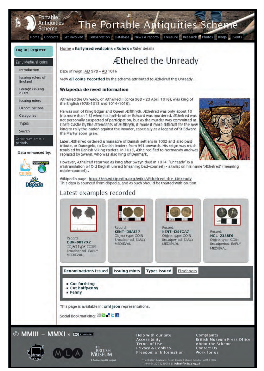

---
title: "Distributing the Wealth: Digital Knowledge Transfer for Numismatics"
section: papers
date: 2010-03-20
slug: /papers/distributing-the-wealth
keywords: 
  - numismatics
  - archaeology
  - coins
  - museology
citation: "DEJ Pett (2010) Distributing the Wealth: Digital knowledge transfer for Numismatics in Cook, B. (ed) The British Museum and the future of Numismatics, 71-80"
authors:
  - Daniel Pett (The British Museum)
featuredImg: ../images/papers/wealth/4771892790_484bc02279_w.jpg
background: ../images/papers/wealth/4771254827_0194bb005a_k.jpg
tags:
  - museums
  - archaeology
  - digital humanities
  - heritage
  - numismatics
--- 

In the last decade, significant progress has been made in making collections of numismatic data—specifically focused on individual records of stray coin finds, rather than hoards or banknotes—available online for study by both academic and lay communities. The following section aims to demonstrate how these resources can be leveraged to increase the visibility and accessibility of numismatic knowledge. This discussion does not cover 202the world of commercial dealerships or individual collectors' online presence, which primarily serve as sources for current valuation information. Instead, it expands upon the paper presented at the Department of Coins and Medals’ 150th anniversary conference.

## Institutional repositories of numismatic material  

The worldwide web offers instant access to a vast range of information from sources of varying authority. Filtering out poor-quality resources can be challenging; however, the numismatic field is comparatively well served. The logical nature of numismatic objects and their accessibility have enabled the development of numerous academic resources. While some projects have stagnated due to funding limitations, others continue to expand and introduce innovative models for discovery. Many resources are now integrated into broader site content to enhance learning experiences—for example, the British Museum’s child-friendly materials that introduce the concept of money.[^1]

This paper focuses intentionally on academic models for digital numismatic resources, rather than lay or commercial platforms—though there are excellent examples created by individuals and organisations, such as the Wildwinds site.[^2] The diversity and scale of digital resources available make a comprehensive review impractical; however, a brief quantitative overview of several key academic repositories highlights the vast number of coins accessible for research and study online. Table 1 illustrates the holdings of these repositories, showing that more than a million coins are available for examination from anywhere with internet access. Each repository employs its own methods for dissemination and data recording, which presents challenges in standardisation—an issue discussed further below.

The repositories listed in Table 1 offer extensive numismatic data, yet their interface designs vary considerably. Despite these differences, the core data structure remains consistent: details of the obverse and reverse sides of coins, issuer and mint information, and—where available—images. Collectively, these repositories provide access to over 1.3 million coins online, supporting both academic and public research. A key challenge for these collections is increasing visibility and ensuring that potential users can easily discover and access these valuable resources.

## Examples from Portable Antiquities numismatic data

To further illustrate the online dissemination of numismatic data, this section highlights the Portable Antiquities Scheme’s (PAS) database. Operating since 1997, the PAS database serves as the primary resource for information on all objects recorded by the Scheme, including both Treasure and non-Treasure finds. Its numismatic dataset is extensive, encompassing coins from the Iron Age through to relatively rare Byzantine examples, which are increasingly being documented. The database’s breadth and accessibility make it an invaluable tool for researchers, collectors, and the wider public interested in the study of coins and their archaeological context.

Table 2 illustrates the distribution of coins by period and quantity, as recorded by Scheme staff and members of the public. As of 28 February 2011, numismatic material represents 37.6% of all objects documented (excluding coin hoards). This significant proportion likely reflects the inherent characteristics of coins: small metal items that are easily lost and frequently discovered by metal detectorists.

This table highlights how the Scheme’s data complements the Early Medieval Coin Corpus at the Fitzwilliam Museum, Cambridge. Since the author’s rebuild of the website in March 2010, it now incorporates key datasets from Oxford University’s Celtic Coin Index and Cardiff University’s Iron Age and Roman Coins of Wales (IARCW). Integrating these resources creates a more robust platform for applied numismatists to explore numismatic material across England and Wales, alongside non-numismatic finds. As noted by Leins and Kelleher in their conference paper, this approach enables a more holistic, national analysis of rural coin loss—capabilities not available on any other UK content delivery platform.

| Repository                                 | Number of coins |
|--------------------------------------------|----------------:|
| Celtic Coin Index (CCI)                    |         37,925  |
| Roman Provincial Coinage (RPC)             |         46,725  |
| Iron Age & Roman coins of Wales (IARCW)    |         52,812  |
| Numidat[^3]                                    |         20,000  |
| American Numismatic Society (ANS)[^4]         |        533,528  |
| Portable Antiquities Scheme (PAS)[^5]          |        165,911  |
| Early Medieval Coin Corpus (EMC)[^6]           |         10,697  |
| British Museum Collections Online          |        529,254  |
| **Total available**                        |    **1,296,852**|

**Table 1: A comparative sample of academic databases of numismatic data, coins only**

| Broad period                | Quantity   | Percentage of total |
|-----------------------------|-----------:|--------------------:|
| Iron Age[^7]                    |   42,2177  |             16.50%  |
| Roman[^8]                       |  163,6578  |             63.98%  |
| Early Medieval              |     2,242  |              0.88%  |
| Medieval                    |    27,075  |             10.59%  |
| Post Medieval               |    19,864  |              7.77%  |
| Greek and Roman Provincial  |      168   |              0.07%  |
| Byzantine                   |       94   |              0.04%  |
| **Total**                   |  255,784   |           **100%**  |

**Table 2: The volume of coins by broad period recorded by the Portable Antiquities Scheme**

It is straightforward to demonstrate the reach of the Scheme’s recording efforts, as illustrated by a GIS plot of all coins recorded, categorized by period (see Plate 2). Even without detailed statistical analysis, a broad overview reveals certain biases within the data: notable clusters appear around Finds Liaison Officer bases, and patterns are influenced by topography (such as mountains, fens, and roads), land access restrictions (for example, the south-west shows fewer records due to the extent of Duchy of Cornwall land where detecting is prohibited), and geological features. These biases are currently being investigated in detail by Katherine Robbins through an AHRC-funded collaborative PhD between Southampton University and the British Museum, with results anticipated in the near future.

The data recorded daily by the Scheme is rapidly enhancing our numismatic knowledge of England and Wales. Since Daubney’s publications in the British Numismatic Journal[^10] and Current Archaeology[^11], two previously unrecorded Venetian Doges—Andrea Dandolo (WMID-249932) and Francesco Foscari (WMID-9A8817)[^12]—have been documented in Britain. Moorhead’s research on Byzantine coin discoveries argues that evidence from the Scheme’s records suggests some coins may have been lost in antiquity, not solely through modern activity.[^13] Bland and Loriot relied heavily on the database to document single gold Roman coin finds, demonstrating that the majority of such coins recorded in England and Wales since 1998 are attributable to the Scheme’s system.[^14] 

Table 3 shows that of the 109 single gold coins found since 1998, 76 were recorded by the PAS, EMC, or as Treasure, while only 33 originated from other sources such as auctions, dealers’ lists, or online detecting forums.

In February 2010, the Scheme recorded a rare Roman denarius struck by the governor Vindex during his rebellion against Nero in AD 68 (WAW-4497B5)[^15]. In the same year, several rare coins of the usurping emperor Carausius were acquired by the British Museum[^16], following a generous donation from a finder inspired by a detecting magazine article. Unique discoveries continue to be added to the Scheme’s database regularly, far too numerous to list in detail here.

Other numismatic research that has recently been completed includes Philippa Walton’s AHRC-funded collaborative PhD, “Rethinking Roman Britain: an applied numismatic analysis of the Roman coin data recorded by the PAS,”[^17] which came to the following conclusions:

- The overwhelming majority of Republican coins were 1st-century military losses.
- Claudian copies in England and Wales originated from military use but continued to circulate among the wider population into the 2nd century AD.
- The precise location of the ‘C’ mint during the reigns of Carausius and Allectus remains unknown; coinage circulates too rapidly and widely for mint marks to reliably indicate mint locations.
- The contraction of coin use throughout the 4th century can be charted, providing evidence for economic decline in Roman Britain.
- Cluster analysis of numismatic data has enabled the identification of 30 new archaeological sites using coin evidence alone.

Recent years have seen a rapid increase in numismatic research utilizing the Scheme’s database. In addition to Walton’s PhD, two earlier presenters, Leins and Kelleher, are pursuing AHRC-funded PhDs focused on Iron Age and medieval coins (1066–1544) respectively. The Scheme’s research log lists another 27 projects in progress or nearing completion, each with a substantial numismatic component.[^18]

A notable completed AHRC-funded project that leveraged Scheme and EMC data is the ‘Viking and Anglo-Saxon Landscape and Economy’ (VASLE) at York University, which integrated coin finds with other artefact classes.[^19] One of the most rewarding outcomes of the Scheme’s engagement with young people and communities is the increased uptake of archaeological degrees and the choice to base undergraduate dissertations on numismatic data. For example, Dominic Coyne, who participated in the British Museum’s Young Graduates for Museums and Galleries training programme (run by the Department of Coins and Medals),[^20] is now studying at Durham University, focusing his thesis on coin finds of the House of Constantine (AD 306–64) in east Yorkshire and their implications for the economic history of the period.

To enable these research projects to be as comprehensive as possible, the database must capture a rich array of data. It goes beyond traditional numismatic or collections databases by gathering a wide variety of additional information. Every numismatic record produced by the Scheme—whether entered by professionals or the public—is tailored to the coin's period, with relevant fields displayed as needed. For example, the Reece period is shown for Roman coins but not for medieval coins, and a Celtic Coin Index number appears only on Iron Age records. Each record also includes geo-spatial data, allowing coins to be mapped horizontally and, using satellite data, to obtain digital elevation. Plate 3 demonstrates a verified coin record that meets the rigorous standards set by the author, Sam Moorhead (National Finds Adviser for Roman and Iron Age coins), and John Naylor (National Finds Adviser for medieval coins).

| Year | PAS etc | Other sources |
| :--- | :------ | :------------ |
| 1998 | 7       | 2             |
| 1999 | 3       | 2             |
| 2000 | 5       | 1             |
| 2001 | 7       | 0             |
| 2002 | 2       | 2             |
| 2003 | 6       | 1             |
| 2004 | 7       | 3             |
| 2005 | 8       | 5             |
| 2006 | 9       | 7             |
| 2007 | 12      | 5             |
| 2008 | 5       | 3             |
| 2009 | 6       | 1             |

**Table 3 Proportion of single finds of gold coins reported to the PAS, the EMC or as Treasure, compared with those identified from other sources** 

Every image uploaded to the Scheme’s database is now available in a high-resolution zoom-and-pan interface. This uses the Zoomify technology, enhanced with a custom script developed specifically for this project—similar to the implementation at the National Gallery. These high-resolution images enable detailed examination; for example, Plate 4 displays an aureus of Tiberius from Suffolk (SF-9E7B96).[^21]

## Numismatic guides – a learning aid

The Scheme’s website serves as a valuable learning resource for a new generation of numismatists—including curious amateurs, field finders, and university students without formal numismatic training. Extensive training is provided by Moorhead and Naylor to archaeologists, with 41 full-time staff, numerous volunteers, and curatorial staff across several museums benefiting from this expertise. However, it is the reach of the web that has enabled the Scheme to make its greatest impact on numismatic knowledge dissemination.

In early 2005, Ian Leins and the author developed an online guide for identifying Roman coins, which quickly gained popularity and rose to the top of Google search results, significantly increasing traffic to the Scheme’s website. Building on this success, similar guides were created for other numismatic periods in England and Wales. To ensure authority and discoverability, the structure of the Roman guide was replicated, and subsequent guides were used to inform dropdowns for controlled terminology during data entry.

These guides, sourced from authoritative numismatic references such as North and Roman Imperial Coinage, provide:

- Reece periods (Roman coins only)
- Categories
- Moneyers
- Issuing authorities
- Issuing mints
- Types
- Reverse types

In turn, each of these entities is expanded to include scope notes, biographical details sourced from Wikipedia (via dbPedia—see below), maps of find spots, portraits of issuers, the latest examples recorded by the Scheme, and, if available, high-resolution obverse images. A simple data model allows for correct choices to be made by either the person entering data into the system or the person attempting to retrieve data from the system.

These simple links between entities (for example Roman coins) allow one to choose a denomination, then an issuer and all the subsequent characteristics associated. Figure 1 demonstrates one of the simple data models and a flow chart of choices when entering or searching for a Roman coin.

Other aspects of these guides include:

- articles on numismatic issues for the relevant period;
- translations of common inscriptions;
- links to recently recorded examples and the high resolution images that accompany each record.

The availability of these guides has also resulted in users discovering the Scheme’s database unintentionally. For example, internet searches for "Nero" often direct individuals to the Scheme’s website, where they encounter examples of his coins presented alongside biographical information. This initial visit frequently leads users to explore the database further, seeking additional details about Nero’s coinage and their find locations.

### Figure 1 Structured numismatic dropdown model

## Leverage social media for gains

The PAS actively promotes numismatics across multiple social media platforms to broaden the reach of numismatic information. These channels include Twitter, Scheme blogs, Facebook for sharing textual updates, and Flickr for distributing images. Notably, during the public launch of the Staffordshire Hoard in September 2009, PAS images received over 1,000,000 views in just three days.[^22] The Scheme’s Flickr collections feature images of the Hackney gold double-eagle hoard, Roman Emperors and their wives as depicted on coins, and the Frome Hoard discovered in April 2010. By publishing images on Flickr under a Creative Commons licence, PAS encourages re-use, with images appearing on blogs and news sites. Flickr also serves as a press repository for high-resolution images, reducing reliance on traditional picture agencies.

Other heritage organisations have adopted similar approaches, such as the ‘Commons’ initiative for images with no known copyright restrictions. Wessex Archaeology shares excavation and finds data, while English Heritage posts images to Flickr and retrieves them using metadata tags for display on property pages.[^23] Some platforms, like the British Museum’s image bank, even link to purchasing options for high-resolution versions.

PAS regularly shares updates about rare coin finds via Twitter[^24], and posts text and image links on its Facebook page wall.[^25] Numismatic material can be flagged in the database as ‘finds of note’, searchable through standard interfaces, with data feeds available for subscribers to receive alerts about new or significant discoveries. The PAS website also allows public comments and suggestions for record amendments, fostering two-way engagement and encouraging interaction between the public, numismatic data, and specialists.

Earlier in this paper, Wikipedia was discussed as a means to enrich content. The Scheme has further leveraged this opportunity through the innovative Wikipedian-in-Residence project hosted by the British Museum.[^26] In July 2010, Somerset County Council and the Scheme announced the discovery of the Frome Hoard (150kg of radiates from AD 253–90). While it did not generate the same impact as the Staffordshire Hoard, it attracted significant public interest and serves as a model for best practice in detectorist and archaeological collaboration.[^27] During the announcement, the Scheme shared news, facts, and images with Wikipedians, resulting in a Wikipedia entry (primarily by Andrew West – Babelstone) on the day of launch. By releasing much of the Scheme’s social media-friendly content under a Creative Commons Attribution licence, images and text have reached new and wider audiences. For example, in the launch month, the Wikipedia entry for the Frome Hoard received 10,721 views,[^28] surpassing the monthly figure for the flagship Hoxne Hoard entry in the same period.[^29]

This approach to content seeding has been repeated for other discoveries, with the Crosby Garrett helmet being a notable example.[^30] The Scheme has made images available under the appropriate licence, enabling Wikipedia entries to include more comprehensive and accurate information. The Scheme’s contributions are cited prominently on the Crosby Garrett page, and a substantial amount of material has been added to the Wikimedia Commons archive.[^31]

The Scheme is not alone in its social media engagement. Other notable organisations include the American Numismatic Society (via Facebook and Twitter), and the British Museum and BBC, which featured numismatic material in the acclaimed radio series "A History of the World in 100 Objects." Several objects chosen for the series were numismatic and formed the basis of podcasts, as highlighted by Orna-Ornstein at this conference.[^32]

## Standardisation

Elsewhere in this paper, the logical nature of numismatics was cited. This inherent logicality makes it relatively straightforward to impose standards on numismatic recording. Efforts to standardise data sharing have been ongoing for many years, notably through an AHRC-funded workshop in London in 2007, which produced the Numismatic Database Standard (NUDS). The primary aim of NUDS is to capture the distinct properties of numismatic material—especially obverse and reverse characteristics. It is anticipated that this protocol will be revisited and revised in the coming years. The XML standard generated by NUDS can be adapted to OAI-PMH metadata, simplifying the creation of coin portals. The use of OAI in numismatics has a long history; for example, Blackburn documented how the Fitzwilliam Museum used it to syndicate their coin resources.

A need for authoritative sources of numismatic information, along the lines of the geoNames project could be the answer to many problems in numismatic database design.[^37]

## Distributing the Wealth

If each denomination could be assigned a stable entity, with all variant forms (in different languages) linked to this entity, it would enable seamless navigation between disparate resources. Sebastian Heath and colleagues at the American Numismatic Society (ANS) in New York have been developing models and coding concepts to achieve this goal through their Nomisma project.[^38] In parallel with the Scheme’s website, the integration of geographical data from the Barrington Atlas of the Classical World (via Pleiades) has enabled resources to cite authoritative entities, enriching numismatic data and supporting interoperability across platforms.

For example, both sites reference Rome using the same authoritative URL: [http://pleiades.stoa.org/places/423025](http://pleiades.stoa.org/places/423025). This ensures that both websites are referring to the same geographic entity. Extending this approach, if a similar service existed for coin denominations or issuers, all numismatic databases could reference a shared endpoint-linking all aliases to a single entity. This would allow disparate resources to consistently refer to the same numismatic entity, reducing confusion when denominations have different names in various countries by always referencing the authoritative source.

## Touching upon linked numismatic data

Earlier in this paper, the concept of linked data was introduced without the reader being apprised of the fact. The coin guides that the Scheme operates make tentative steps towards the consumption of linked data originating from Wikipedia. By using Wikipedia as a form of CMS, the Scheme has saved many hours rewriting biographical abstracts for issuers and been able to retrieve factual information from a variety of sources. This has been implemented by simply utilising the same name as used in the 'page slug' on Wikipedia, and then querying a web service called dbPedia (a database extract of the contents of Wikipedia). This returns an XML response that can be parsed and redisplayed on the Scheme’s biographical pages and therefore enriches the user experience. Plate 5 provides the example of an end result for Æthelred the Unready.

## Building your own collection of data

This explosion in data visibility, and the ubiquitous idea of easy access, brings with it a few problems for many numismatists. Many are just interested in one period of coinage and would like to query multiple datasets through one interface. This is an issue that surfaces regularly in the Museum sector, with Europeana and Culture Grid being examples of multiple repositories being searchable via a unified interface. This has been met with varying degrees of enthusiasm, but it should be seen as a step in the right direction. There are indeed ways for individuals to create their own archives.  

The advent of Open Source technology has led to an explosion of ‘Content Management Systems’ (CMS), freely available and customisable on the internet. It is now possible for institutions and individuals (researchers or collectors) to create their own repository of coin data, using the same toolset that is the underpinning of Europeana – the Open Archives Initiative. Prior to producing this paper, the author created an example application using Omeka, a CMS produced by the Centre for History and New Media at George Mason University.[^39] 

This powerful software has been created to allow ‘scholars, museums, libraries, archives, and enthusiasts’ to share their collections easily via a free and open source software package (FOSS) and achieve high-quality results. The author installed this software on the Portable Antiquities Scheme server and by using a plug-in for harvesting OAI data feeds, data from the Portable Antiquities Scheme, the Celtic Coin Index and the Hunterian Museum were integrated in a matter of hours. The software has much potential for the numismatic community, with the ability to customise user interfaces easily and also the facility to upload data from omnipresent numismatic spreadsheets.

| Guide                | Google | Bing | Yahoo |
|----------------------|--------|------|-------|
| Iron Age coins       | 741    | -    | -     |
| Roman coins          | 1      | 1    | 3     |
| Early medieval coins | 2      | 2    | -     |
| Medieval coins       | 1      | 1    | -     |
| Post Medieval coins  | 1      | -    | -     |
| Byzantine coins      | 1      | -    | -     |

**Table 4 Position of the coin guides on Google.co.uk as at 25/2/2011**

| Search Phrase                | Page Views | Time Spent                |
|------------------------------|------------|---------------------------|
| Enthroned Durham coin spia   | 519        | 3 hours 26 mins 52 secs   |
| Types of Roman denarii coin  | 350        | 53 mins 49 secs           |
| All bronze Roman coins       | 342        | 31 mins 37 secs           |
| Probus emperor coins         | 249        | 2 hours 35 mins 12 secs   |
| Index of Roman coins         | 227        | 1 hour 4 mins             |
| Iron age coins Lincolnshire  | 186        | 2 hours 26 mins           |
| Site: finds.org.uk           | 192        | 1 hour 15 mins            |
| Early medieval coin guide    | —          | —                         |

**Table 5 Long length visits for numismatic material on the [PAS website](https://finds.org.uk)**

## Measuring impact

Any resource is only truly successful if it is actively used. Advances in internet technology now allow for detailed measurement of user interaction with digital content. Free monitoring tools, such as Google Analytics or log file analysis, enable tracking of user volumes, time spent on resources, and referral sources.

The effectiveness of the Scheme’s coin guides in search engine visibility can be assessed by performing simple searches for phrases like “period + coins” on various engines, as shown in Table 4. These high rankings have been achieved without paid advertising, relying instead on semantic markup, well-structured URLs, and attention to meta-tags—plus the submission of XML sitemaps for Google. In contrast, museum-based numismatic resources are generally less visible on the first page of search results.

Analysis of search engine traffic reveals that 45.07% of visitors arrive via Google, 0.69% via Bing, and 0.25% via Yahoo. With Google holding 62.6% of the search market, efforts have focused on optimizing for this platform.

Since the database’s re-launch in March 2010, 9.09% of browsed content relates to numismatic material, with the Roman coin guide’s list of emperors being the most popular section. This numismatic content tends to engage users, encouraging them to remain within the information silo for extended periods.

Table 5 highlights the longest visits by individuals who arrived at the Scheme’s website after entering specific search phrases. Notably, one visitor viewed 519 pages during a session lasting over three hours. This raises the question: did the visitor find the information they sought, or were they engaged by the depth of available content? Ideally, both outcomes are true. It is important to note, however, that interpreting web metrics can be challenging and is beyond the scope of this paper. With robust analytical tools, it is possible to assess whether resources are being effectively utilized or overlooked due to limited search engine visibility.

## Conclusion

The preceding discussion has highlighted the extensive range of academic numismatic resources now accessible online. While it is inevitable that some valuable resources may have been overlooked, the breadth and depth of available material is impressive.

Numismatic knowledge on the internet is arguably more advanced than that for many other categories of archaeological objects. The logical structure inherent in numismatic data supports the development of strict standards for data entry, retrieval, and ontology design, which in turn enables the creation of effective learning tools.

Continued progress in this field depends on sustained project development, ongoing funding, and a commitment to improving the quality and accessibility of numismatic resources. Looking ahead, there is a clear need to further develop digital standards for numismatic data—especially for sharing information about coin hoards—and to revive and promote the Numismatic Database Standard (NUDS) for broader adoption. These efforts will help ensure that high-quality numismatic learning remains prominent and accessible worldwide.

## Abbreviations  

| Term                                 | Abbreviation  | Description              |
|--------------------------------------|---------------|--------------------------|
| Arts and Humanities Research Council | AHRC         | UK funding body supporting arts and humanities research           |
| American Numismatic Society          | ANS          | US-based numismatic research society|
| Celtic Coin Index                    | CCI          | Database of Celtic coin finds |
| Content Management System            | CMS          | Software for managing digital content |
| Early Medieval Coin Corpus           | EMC          | Database of early medieval coin finds |
| Free and Open Source Software        | FOSS         | Software distributed with source code and free usage rights |
| Iron Age and Roman Coins of Wales    | IARCW        | Database of Iron Age and Roman coins found in Wales |
| Numismatic Database Standard         | NUDS         | Standard for recording numismatic data |
| Museums, Libraries and Archives Council | MLA          | UK body supporting museums, libraries, and archives |
| Open Archives Initiative             | OAI          | Protocols for sharing digital resources |
| Open Archives Initiative Protocol for Metadata Harvesting | OAI-PMH      | Protocol for harvesting metadata from digital repositories |
| Portable Antiquities Scheme          | PAS          | UK project recording archaeological finds |
| Roman Provincial Coinage             | RPC          | Database of Roman provincial coins |
| Viking and Anglo-Saxon Landscape and Economy  | VASLE        | Research project integrating coin and artefact finds |
| Extensible Markup Language           | XML          | Standard for encoding documents in a machine-readable format |

## Notes

[^1]: [British Museum Young Explorers - Brief History of Money (404)](http://www.britishmuseum.org/explore/young_explorers/discover/videos/a_brief_history_of_money.aspx)  
[^2]: [Wildwinds Coin Website](http://www.wildwinds.com/)  
[^3]: The Numidat database only has 200 records in the online version. Offline, 20,000 are available (pers. comm. David Wigg-Wolf, February 2011)  
[^4]: This figure is from a pers. comm. Sebastian Heath, February 2011   
[^5]: PAS incorporates the CCI and IARCW data, this figure is excluding the totals for these resources  
[^6]: The figure for the EMC data is for single coin finds (pers. comm. John Naylor, February 2011).    
[^7]: This figure includes the imported date from the Oxford university Celtic Coin Index, 37,925 coins.    
[^8]: This figure includes the imported data from Cardiff university’sIron Age and Roman coins of Wales project, 52,666 coins  
[^9]: The majority of the data the Scheme collects is rural, but some of the incorporated data (IARWC and CCI) comes from urban excavation.
[^10]: Daubney 2009  
[^11]: Daubney 2010  
[^12]: For Dandolo, see [WMID-249932](http://www.finds.org.uk/database/artefacts/record/id/262227) and for Foscari see [WMID-9A8817](http://www.finds.org.uk/database/artefacts/record/id/425736)  
[^13]: Moorhead 2010  
[^14]: Bland & Loriot 2010, 31, fig. 22, reproduced above  
[^15]: [WAW-4497B5](http://www.finds.org.uk/database/artefacts/record/id/428960)  
[^16]: See Leins and Kelleher in this volume  
[^17]: A book of Walton’s PhD research is to be published late 2011  
[^18]: [List of research projects on PAS](http://finds.org.uk/research/projects)
[^19]: Naylor & Richards 2007.
[^20]: [Young Grads programme - British Museum](http://www.britishmuseum.org/learning/schools_and_teachers/young_graduates.aspx)  
[^21]: [SF-9E7B96](http://www.finds.org.uk/database/artefacts/record/id/148551)
[^22]: Pett 2009.
[^23]: For example, see [Bolsover Castle](https://www.english-heritage.org.uk/visit/places/bolsover-castle/)  
[^24]: [a Faustina I denarius](http://twitter.com/#!/portableant/status/40192330879213568)  
[^25]: [Civil War denarius of Vindex](http://www.facebook.com/PortableAntiquitiesScheme/posts/101644986582084)  
[^26]: [The British Museum and Me](http://www.wittylama.com/2010/03/the-british-museum-and-me/)  
[^27]: Bland, Booth & Moorhead 2010.  
[^28]: [Wikipedia Frome Hoard statistics](http://stats.grok.se/en/201007/Frome_Hoard)  
[^29]: [Wikipedia stats for Hoxne](http://stats.grok.se/en/201007/Hoxne_Hoard)  
[^30]: [Wikipedia Crosby Garrett Helmet talk](http://en.wikipedia.org/wiki/Talk:Crosby_Garrett_Helmet) – refer to section under picture.  
[^31]: [Wikicommons PAS images](http://commons.wikimedia.org/wiki/Category:Portable_Antiquities_Scheme)  
[^32]: A History of the World in 100 objects: [Episode 25 gold coin of Croesus](https://open.spotify.com/episode/78PYDT1hvDbi2YaO9lfcVr?si=NdUUtROEQUOa-IXG6Oj3UQ); [Episode 31 coin of Lysimachus with head of Alexander](https://open.spotify.com/episode/4IX2jUptWvREYvH5Fqd0vT?si=rTc8vZPdR3CcNpFhSUivlA); [Episode 42 gold coin of Kumaragupta I](https://open.spotify.com/episode/3fEkQG6jQupN2RqOlCgJpE?si=UViNKYsHRr6HyVzYMeK1yg); [Episode 46 gold coins of Abd al-](https://open.spotify.com/episode/23fdVo61B19wGyxVq0WhWZ?si=tuZBG8SnT7y8nhZdX-C4vg); [Episode 56 Vale of York hoard](https://open.spotify.com/episode/3C34xppJO0KfXgnn6VKujy?si=sAHqqNUBRGKvgvf8QDKEgg); [Episode 80 pieces of Eight](https://open.spotify.com/episode/6mA0ojJgXAZ9UJOxxdzpYP?si=PlO02NH9QRaHBF3Da0uXqA); [Episode 95 Suffragette defaced penny](https://open.spotify.com/episode/2D22PRwFjugGymvbVuM70L?si=hbdGK8KySFygl5Xd4MmL4Q)    
[^33]: Heath 2010.  
[^34]: Pers. comm. Heath, February 2011  
[^35]: OAI-PMH: Open Archives Initiative develops protocols for disseminating disparate resources efficiently. It is a model used by MLA sponsored Culture Grid and the European Union funded project Europeana.  
[^36]: Blackburn 2005.  
[^37]: [http://www.geonames.org/](http://www.geonames.org/)  
[^38]: [http://nomisma.org/](http://nomisma.org/)  
[^39]: http://7pillarsofwisdom.co.uk/omeka - now obsolete  
[^40]: The Celtic Coin Index is also run from the Scheme’s domain, and ranks higher.  
[^41]: Following Google’s search index reorganisation, these figures might change. [For more information on the changes](http://googleblog.blogspot.com/2011/02/finding-more-high-quality-sites-in.html)  
[^42]: Shiels 2010  
[^43]: Chan 2008  