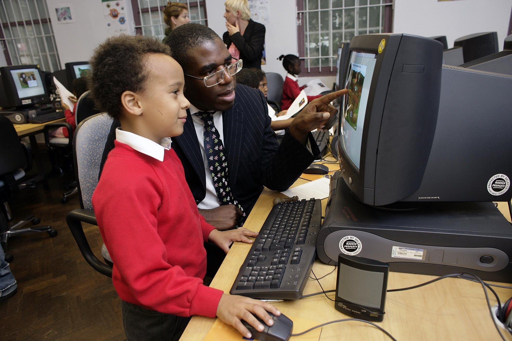

>  The sun is setting on the village of West Mucking. Around you, animal noises mingle with voices. Hens are clucking, pigs are snuffling, and further away you can hear sheep bleating. The villagers are finishing their work for the day; they call to each other as they pass you, coming back from the fields or woodland, carrying their tools. You can smell the smoke from hearths in the houses, and also the piles of rubbish! From one of the houses comes laughter... Use mock archaeological methods to uncover the village.

In 2005, the Portable Antiquities Scheme had £20,000 to spend on the creation of a digital tool for primary school children
in England and Wales. We collaborated with the British Museum's New Media Unit to create a Flash-based interactive 
resource for children aged 7-11. The project was called PASt explorers and was designed to help children learn about the Anglo-Saxons 
and the objects they left behind. The project was funded by the Heritage Lottery Fund, Museums Libraries and Archives Council, and the Department for Culture, Media and Sport and was launched by 
the then Minister for Culture, David Lammy, in 2005.

## The project

The website (pastexplorers.org.uk - now defunct) was constructed in Textpattern (awful table based and image map layout - I 
knew very little about web dev back then - it shows if you look at the Wayback Machine...) 
The majority of these were created by Cei Paynton, who was the Education Officer for the Scheme. We never published anything on 
this project, and tracking down traces of it are pretty difficult.

## What did we have on the site?

1. Pack your bag activity
2. West Mucking Anglo-Saxon Village
3. Lesson plans
4. Contact details 

## The flash interactives

The major outputs of this project are now rendered pretty useless to anyone since the demise of flash; the three videos below were 
grabbed as screen recordings from the original flash files using the [Ruffle player](https://ruffle.rs) (written in Rust programming language.)
. 

    

        <h3 class="text-black-50 text-center">First part - explore the village of West Mucking</h3>
        

            <video controls src="/saxon.mp4"></video>
        

    

    

        <h3 class="text-black-50 text-center">Second part - explore for objects</h3>
        

            <video controls src="/detecting.mp4"></video>
        

    

## Launch event

The launch event for this project was held in Coram's Fields, Bloomsbury and was attended by the then minister for Culture, 
David Lammy. We had sandpit discovery object activities, in classroom learning and show and tell sections. 
I don't think it was quite what he expected it to be...

