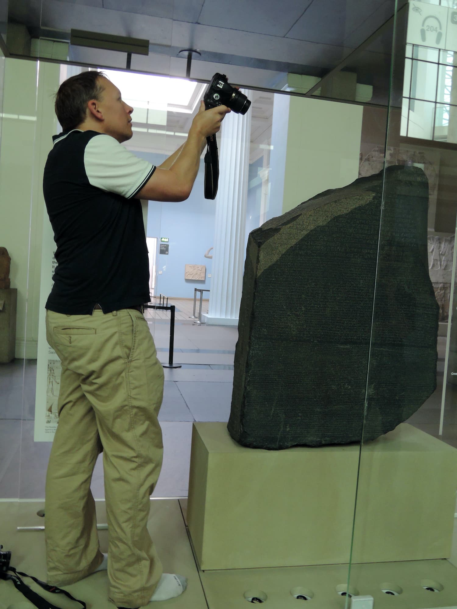
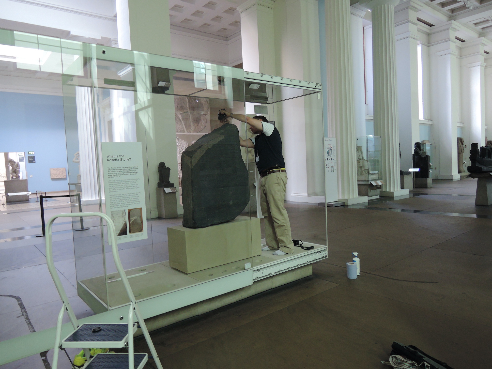

The British Museum is one of the world’s leading museums, with collections of over 8 million objects. The Museum’s collections hold 
masses of 3-dimensional amazing pieces of sculpture, pottery, and other artefacts ripe for 3D imaging. 

In 2013, JD Hill invited Graeme Earl and his students to give a seminar to the BM's research community 
about the use of RTI and 3D imaging to document museum collections. Later in that year, we were awarded a large 
grant from the AHRC to develop the MicroPasts project, which as one of its aims, was to develop a 3D imaging workflow 
at scale for structure from motion 3D model creation. These two events, and the good fortune to find 
out that Tom Flynn in the web team at the BM was also interested in 3D imaging, led to a collaboration and the
British Museum's adventure into 3D imaging began. 

    <iframe title="Granite head of Amenemhat III" frameborder="0" allowfullscreen mozallowfullscreen="true" webkitallowfullscreen="true" allow="autoplay; fullscreen; xr-spatial-tracking" xr-spatial-tracking execution-while-out-of-viewport execution-while-not-rendered web-share src="https://sketchfab.com/models/64d0b7662b59417986e9d693624de97a/embed?camera=0&ui_infos=0&ui_watermark_link=0&ui_watermark=0&ui_theme=dark"> </iframe> 

   
Tom experimented with various lightweight applications for 3D imaging and produced the first models (see the model of Amenemhat III above) on 
Sketchfab from them, whilst at the same time we were releasing models created by the power of citizen science 
on the MicroPasts website using our own home brewed 3d viewer and SketchFab. In 2015, with the arrival of 
Chris Michaels to the BM, we were moved to the new Digital and Publishing team and our 3D work continued there at 
pace. 

    <iframe src="https://sketchfab.com/playlists/embed?collection=bb3cff6dfa4f40a588794dd02a29e12f&autostart=0"
    title="Annotated Models"
    allowfullscreen
    mozallowfullscreen="true"
    webkitallowfullscreen="true"
    allow="autoplay; fullscreen; xr-spatial-tracking"
    xr-spatial-tracking
    execution-while-out-of-viewport
    execution-while-not-rendered
    web-share
    ></iframe>

As part of the MicroPasts project, we have been working with the BM's curatorial teams to create 3D models of Bronze Age metal work
and to help them create models of key pieces. However, we also took it upon ourselves to create 3D models of
key pieces on display in the Museum's galleries. 

To do this, we wandered the halls and galleries before opening, at lunch time and after hours to capture extensive collections of images to process. The routes taken 
through the museum can be plotted by the objects scanned - the route to the canteen, the route to meetings. These 
led through the Classical and Egyptian galleries, and you can see large amounts of models on the SketchFab feed for galleries 
4, 22, 70, 33, and 40. 

As our skills became known we were asked to create models for research projects (eg the Jericho Skull) and for 
blogposts at short notice (eg the Rosetta/Rashid stone). We were fortunate to get to scan objects like
the Lewis Chessmen, the Basse Yutz vases, Egyptian cartonnage and coffins and many more amazing pieces. Some of the pieces we scanned 
were used for digital repatriation projects, a few such as Horus and the Egyptian house were used on BM handling desks. 

All of us are proud we made the British Museum's profile into the most followed museum on Sketchfab (even if
institutional support was lukewarm). Anyone can get their cultural institution into 3d, all you need is a digital 
camera and inexpensive software from Agisoft or Reality Capture.

<blockquote class="twitter-tweet">
.<a href="https://twitter.com/DEJPett?ref_src=twsrc%5Etfw">@DEJPett</a> <a href="https://twitter.com/JWexlerBM?ref_src=twsrc%5Etfw">@JWexlerBM</a> British Museum is now most followed museum on <a href="https://twitter.com/Sketchfab?ref_src=twsrc%5Etfw">@Sketchfab</a> :D <a href="https://t.co/AL8et6Eba3">https://t.co/AL8et6Eba3</a> <a href="https://t.co/xqdGLhu08C">pic.twitter.com/xqdGLhu08C</a>
&mdash; Thomas Flynn (@nebulousflynn) <a href="https://twitter.com/nebulousflynn/status/931092163366146048?ref_src=twsrc%5Etfw">November 16, 2017</a></blockquote> 