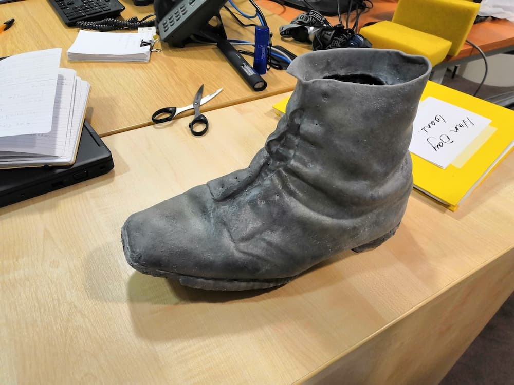
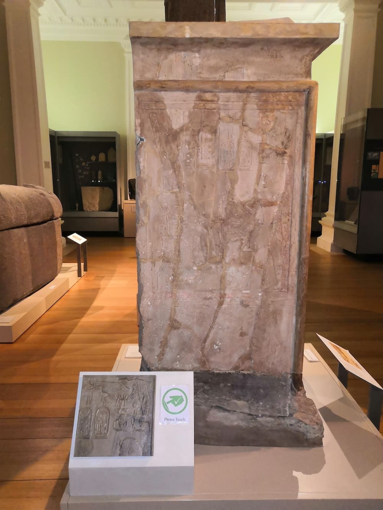
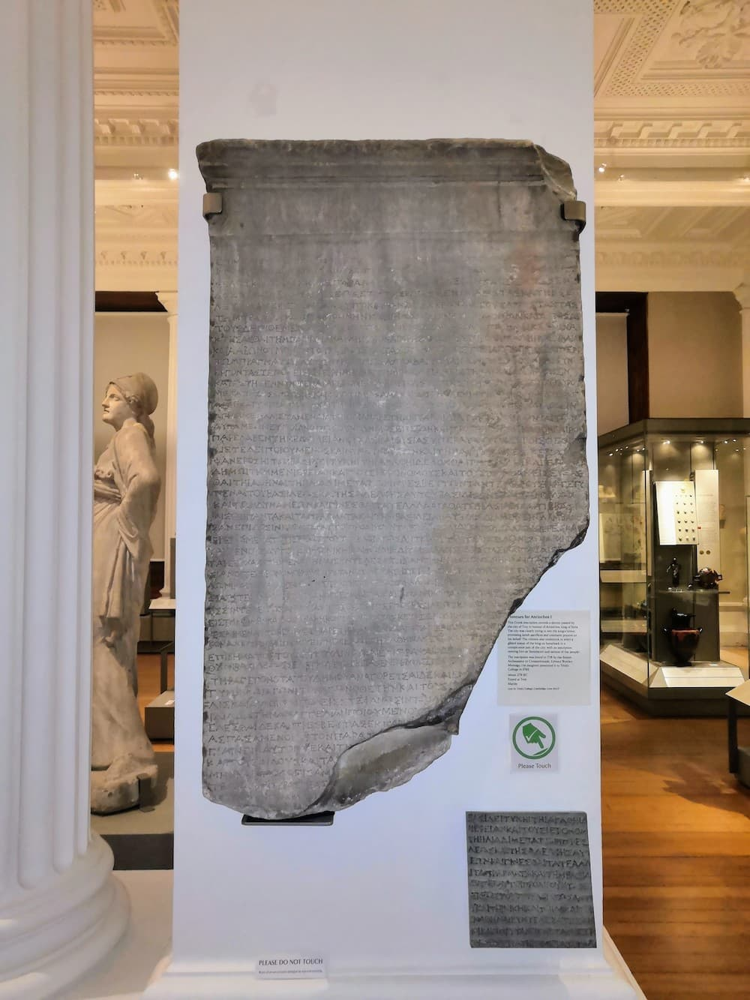

This research project looked at the effectiveness of different touching deterrent methods used for the collections on 
open display at The Fitzwilliam Museum. It is understood within the conservation sector that touching can have a 
detrimental effect on materials and accelerate deterioration. 

## What was this research about? 

There is a lively and active discussion in the conservation and museum sector about what can be done to offer increased 
access to collections while not compromising conservation principles. There is much anecdotal evidence of which methods 
are more effective than others. Further insight can be gained by looking at the frequency of touching, the type of visitor, 
the gallery environment, whether some types of collection are touched more than others (e.g. furniture, sculpture, 
religious) and the variety of deterrent methods already in use.

Understanding the efficacy of deterrence methods would allow for a more informed approach to displaying objects. Through 
this research, we hope to improve protection for the collections from wear & tear caused by touching, whilst maintaining 
curatorial integrity, visitor enjoyment and education.

Helena Rodwell, Assistant Conservator (Collections Care) will be facilitating this project in order to gather knowledge 
from staff and volunteers, as well as obtain quantifiable data through observation in the galleries and engaging with 
visitors on the topic.

## What did we do?

With funding from Cambridge University Industry Pump Priming Fund we aimed to work towards several interventions within 
the Fitzwilliam Museum and its associated museological practise to aid with deterring the frequency with which museum visitors
decided to touch museum objects. The project's funding was accessed via Dr Jo Vine as our research facilitator was 
the eligible PI for the grant, with Helena and myself delivering the research.

1. Organise a [series of 4 public workshops](/projects/pump-priming) to teach 3d model making skills
2. Purchase 100 Agisoft Photoscan/metashapeEducational licenses for the public workshops and internal Cambridge staff
3. Create a series of 3D prints for installation in the Fitzwilliam Museum antiquities galleries and the Museum of Cambridge 
4. Evaluate the use of these pieces in the galleries and the effectiveness of the deterrents (research conducted by Rafie Cecilia)

The research and practical interventions listed above produced some useful results, which are outlined in the [Do Not Touch Evaluation Report](/doNotTouchRafie.pdf) 
and we managed to hold meaningful workshops to teach 3d modelling skills to the public and museum staff. 

## Physical interventions

As part of the planned work, we wanted to create tactile 3D prints of objects in the Fitzwilliam Museum's collection to
place close to objects, and then to observe people's interactions with these pieces. The 3 pieces we made are shown below (via collaboration with Thinksee3d). Two 
were placed in the Fitz and one in the Museum of Cambridge. Installing the two Fitzwilliam Museum pieces was an internal struggle; signposting and 
labelling is one of the museum's weakest facets (IMHO) and the wayfinding experience was substandard. 

### The Giant's Boot, Museum of Cambridge 

ThinkSee3d produced a 3D printed version of the Giant's Boot, which was made in a soft pliable material - silicone rubber - 
which Steve Dey said was extremely challenging to produce.

    <iframe title="The Giant's Boot - Museum of Cambridge"  allowfullscreen mozallowfullscreen="true" webkitallowfullscreen="true" allow="autoplay; fullscreen; xr-spatial-tracking" xr-spatial-tracking execution-while-out-of-viewport execution-while-not-rendered web-share src="https://sketchfab.com/models/aa6ca7746b6d4e9cb02804f9a9d929ea/embed"> </iframe>

### Section of Egyptian shrine built by King Thutmosis III

ThinkSee3D produced a gypsum segment of the shrine, which was mounted on a plinth next to the object. 

    <iframe title="Egyptian shrine built by King Thutmosis III"  allowfullscreen mozallowfullscreen="true" webkitallowfullscreen="true" allow="autoplay; fullscreen; xr-spatial-tracking" xr-spatial-tracking execution-while-out-of-viewport execution-while-not-rendered web-share src="https://sketchfab.com/models/c1cb479061e54e41bfdfcbf6b1c32a69/embed"> </iframe>

###  Section from the Honours for Antiochus

ThinkSee3D produced a 3D printed version of the Honours for Antiochus, made from gypsum. 

    <iframe title="Honours for Antiochus"  allowfullscreen mozallowfullscreen="true" webkitallowfullscreen="true" allow="autoplay; fullscreen; xr-spatial-tracking" xr-spatial-tracking execution-while-out-of-viewport execution-while-not-rendered web-share src="https://sketchfab.com/models/5704545fad3c46a7a58f11e18c342834/embed"> </iframe>

