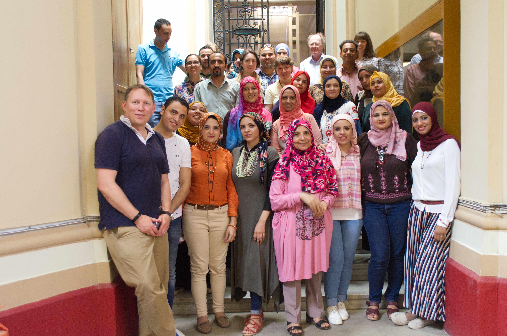

The Egyptian Coffins Project is a collaboration between the Fitzwilliam Museum, Cambridge, and the Egyptian Museum, Cairo and I was fortunate to be invited to join the team for this project. 

## Background 

Since 2014, the Fitzwilliam Museum has been conducting cutting-edge interdisciplinary research (led by Helen Strudwick and Julie Dawson) into its collection of more than 200 ancient Egyptian coffins and coffin fragments. Bringing together a team of Egyptologists, conservators, a pigment analyst, an expert in historical painting techniques, an ancient woodworking specialist and a consultant radiologist, alongside the application of advanced imaging techniques such as Computed Tomography (CT) scanning and X-radiography, we have been able to gain unprecedented insights into the coffins’ construction, creation of the decorative programme and, so far as possible, the history of the coffins and their owners.

### Teaching digital skills

As part of my collaboration on this project, I taught the team how to generate a Jekyll website that runs off Github pages (zero cost, low maintenance) allowing them to have autonomy as humanities researchers over their toolkit. 

This online resource presents the complete results of this research as it unfolds, commencing with the coffins of the 25th Dynasty ‘water pourer on the west of Thebes’, Pakepu, and the 21st Dynasty coffin set of Nespawershefyt. This includes full transliterations and translations of the hieroglyphic text, descriptions of the iconography, raw and interpreted results of the scientific analysis, including pigment analysis and wood identification, results of advanced imaging techniques such as CT scans, X-radiography and scanning electron microscopy, and some historical and social commentary on the significance of our findings in the context of ancient Egyptian attitudes to funerary beliefs, the economy and death and the afterlife. The website also contains some special behind-the-scenes footage and insight into what it is like working both internationally and collaboratively.

    <iframe src="https://player.vimeo.com/video/307004713?h=30f9a0c370&color=ffffff&title=0&byline=0&portrait=0" style="position:absolute;top:0;left:0;width:100%;height:100%;" frameborder="0" allow="autoplay; fullscreen; picture-in-picture" allowfullscreen></iframe>

### AHRC collaboration 

As part of the AHRC funded [CEEF3D fellowships](https://creative-economy.fitzmuseum.cam.ac.uk), Dr Melanie Pitkin commissioned a derived 3D model of Nespawershefyt's wooden coffin, produced by Steve Dey of [ThinkSee3D](https://thinksee3d.com), from DICOM CT data (generated by Tom Turmezei at Addenbrookes Hospital). This became part of the knowledge transfer process for teaching our Egyptian colleagues forgotten techniques. 

 <iframe title="CT scan of Nespawershefyt's inner coffin"  allowfullscreen mozallowfullscreen="true" webkitallowfullscreen="true" allow="autoplay; fullscreen; xr-spatial-tracking" xr-spatial-tracking execution-while-out-of-viewport execution-while-not-rendered web-share src="https://sketchfab.com/models/812d114fc2bb466daa003bfd8adc077d/embed"> </iframe>

### Cairo - GCRF
In 2019, the team worked in Cairo to deliver training sessions for our Egyptian Museum colleagues on wood working techniques, 3d scanning, interpretation and conservation skills. A very effective knowledge transfer process, with new friendships being created and research collaborations for the future thrashed out. 

