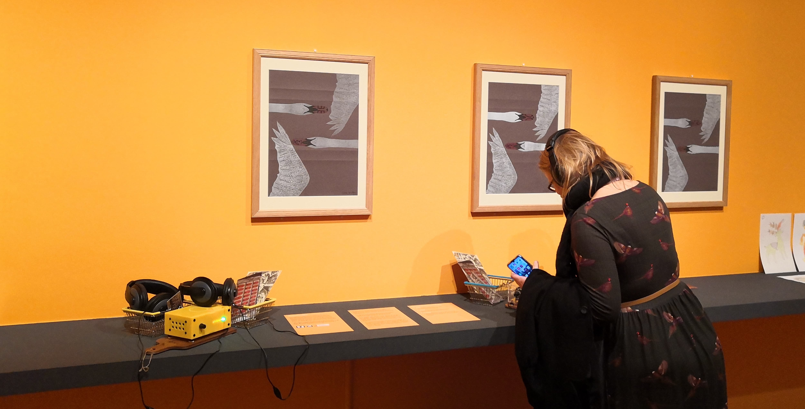

The Feast and Fast exhibition presented one of my first digital challenges and interesting problems
with the Museum's digital content. The exhibition was a collaboration between the Fitzwilliam Museum, a
private collector and the University's History department. Unfortunately, the exhibition bled into the start of the pandemic 
and therefore closed early and the creative zone museum in a box project was pulled early (as was the Ways of Seeing project.)

## What was the exhibition about?

Feast & Fast: The Art of Food in Europe, 1500-1800 is the latest interdisciplinary research-led collaboration between Victoria Avery and Melissa Calaresu of Cambridge University, together with the internationally renowned food historian, Ivan Day.

> The exhibition celebrates the production, preparation, and presentation of food, its consumption or rejection, its ideologies and identities. Feast & Fast considers extremes of eating alongside everyday experiences and demonstrates how contemporary concerns about our relationship with food are not a modern phenomenon. ‘Eating right’ in early modern Europe was as treacherous and complex an issue as making these food choices now.

> Nearly 300 objects tell the compelling and complex, local and global, story of food in Cambridge, Britain, and Europe between 1500 and 1800. Many have been unseen in the Museum’s reserves for decades, and Feast & Fast provides the opportunity to research, recontextualise, and return them to the public domain, a number of which have been especially conserved for the exhibition.

## What was the challenge?

This project was challenging for a variety of reasons:

1. Late delivery of content that was required to be turned into a digital exhibition
2. Content supplied in a word document with variable structures, there would be original poetry, 2 films, stories and full labels
3. Images supplied in formats that needed reworking to be used in the website and be cleared for use for IPR
4. The Drupal website structure was not really suitable for the exhibition content in the format required
5. The output was possibly going to be part of the Research Excellence Framework (REF) submission and therefore needed to be archive ready and citable.

To deal with the above, I decided that we would use Jekyll to build the website. This would allow us to use Markdown to write the content and use YAML to structure the content. This would allow us to use the same content to build the website, server for free via subdomained GitHub pages, deposit with Zenodo and provide a DOI for the REF submission that the history department would make.  

## Museum in a Box in the Creative Zone

To coincide with the exhibition, the curators had envisaged a _creative zone_ in the final room of the exhibition space; a bright yellow box room with 
tables and chairs, activities for children, the films on rotation and a space for an original digital intervention. The exhibition 
period overlapped with my 4 postdocs' time working on the CEEF3D project and Dr Abi Glen's project with Museum in a Box (MiAB) was to feature in this project. 
She developed a box specifically for this room, which we loaded onto 3 MiAB devices, which we installed on a long floating shelf on the right side of the room as you looked at the exit. The audio files 
that were loaded onto the box are found below this text. 

I bought all the accessories for the installation (never got the expenses for these...) and each box was affixed to a wooden chopping board, which 
was affixed to the floating shelf. The trigger pieces for each MiAB were placed in a small metal shopping basket (to represent the food element) and placed next to the box. Instruction on how to use the MiAB
were typed onto posters glued to the bench (Pop, Pick, Place - was the phrasing we used), and each box had two sets of enclosed over the ear headphones (placed in another basket) so that people could listen in peace.
On the wall above the boxes were 3 printed commissioned pieces from Cambridge Art Makers, of original wrapping paper from the subscription box work that Glen conducted.

The major problem we had with this installation, was not that of losing triggers or breaking devices, but the headphones coming loose and the devices sometimes needing to be restarted. Our 
Front of House colleagues were sometimes reluctant to help with this, and we regularly walked through to check on them.

**The devices were removed from service just before the pandemic closed the museum due to the high level of touch required.** 